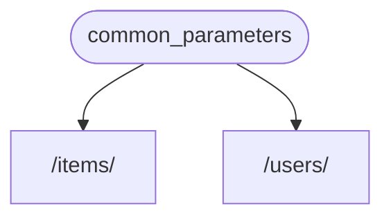
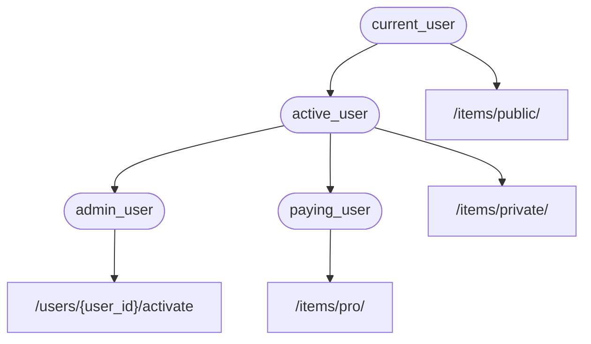
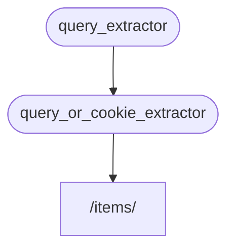
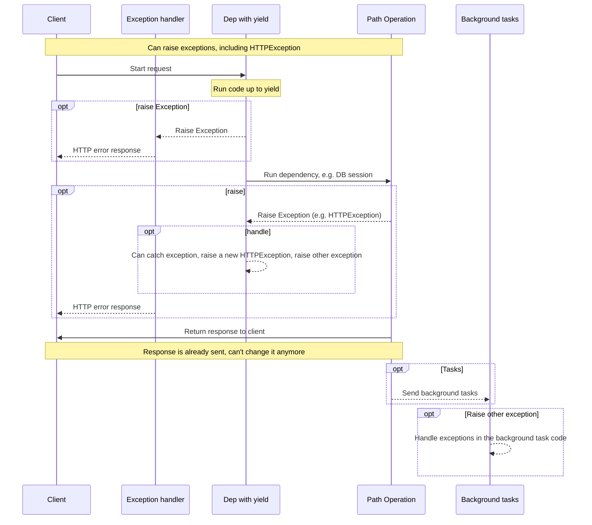
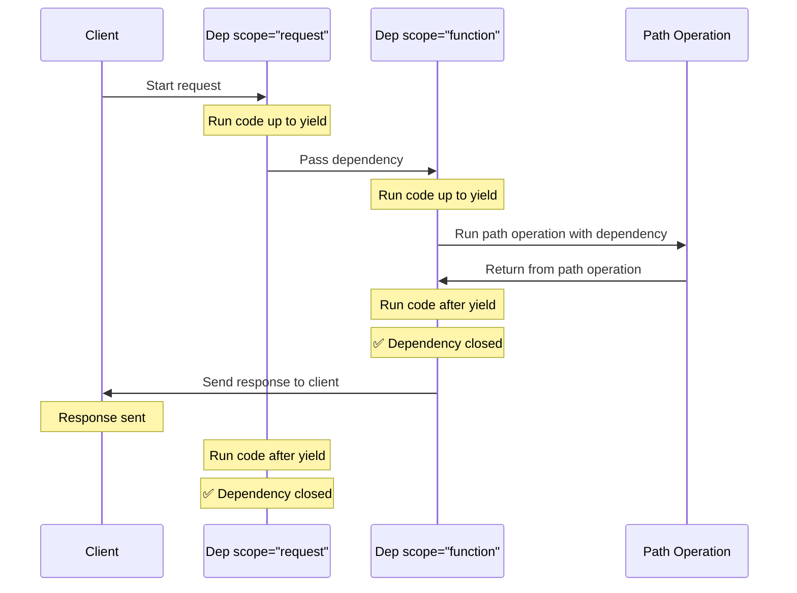
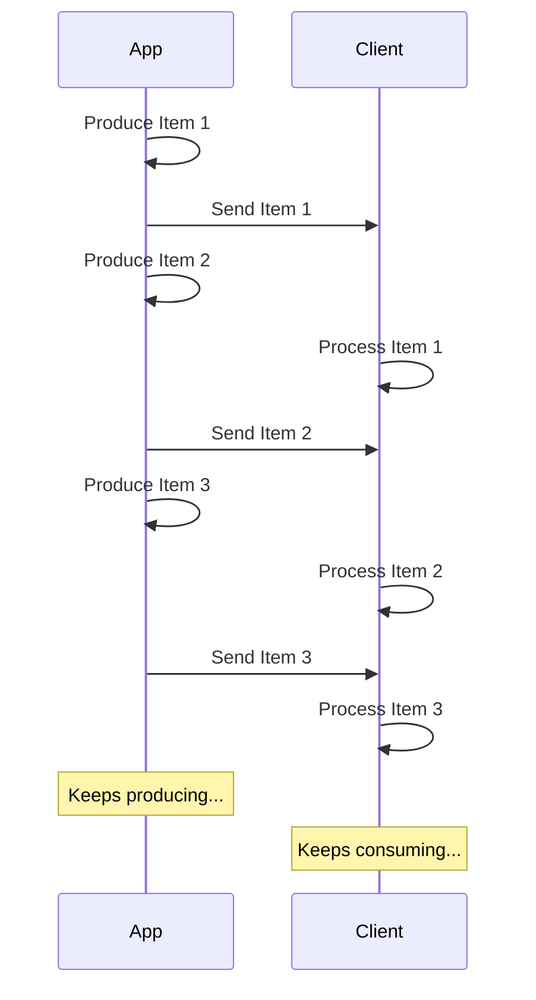

## 依赖项

**FastAPI** 提供了简单直观但功能强大的**依赖注入**系统。

它被设计得非常易用，能让任何开发者都能轻松把其他组件与 **FastAPI** 集成。

### 什么是「依赖注入」

在编程中，**「依赖注入」**指的是，你的代码（本文中为*路径操作函数*）声明其运行所需并要使用的东西：“依赖”。

然后，由该系统（本文中为 **FastAPI**）负责执行所有必要的逻辑，为你的代码提供这些所需的依赖（“注入”依赖）。

当你需要以下内容时，这非常有用：

* 共享业务逻辑（同一段代码逻辑反复复用）
* 共享数据库连接
* 实施安全、认证、角色权限等要求
* 以及更多其他内容...

同时尽量减少代码重复。

### 第一步

先来看一个非常简单的例子。它现在简单到几乎没什么用。

但这样我们就可以专注于**依赖注入**系统是如何工作的。

#### 创建依赖项，或“dependable”

首先关注依赖项。

它只是一个函数，且可以接收与*路径操作函数*相同的所有参数：

```python
from typing import Annotated

from fastapi import Depends, FastAPI

app = FastAPI()

async def common_parameters(q: str | None = None, skip: int = 0, limit: int = 100):
    return {"q": q, "skip": skip, "limit": limit}

@app.get("/items/")
async def read_items(commons: Annotated[dict, Depends(common_parameters)]):
    return commons

@app.get("/users/")
async def read_users(commons: Annotated[dict, Depends(common_parameters)]):
    return commons
```

大功告成。

**2 行**。

它的形式和结构与所有*路径操作函数*相同。

你可以把它当作没有“装饰器”（没有 `@app.get("/some-path")`）的*路径操作函数*。

而且它可以返回任何你想要的内容。

本例中的依赖项预期接收：

* 类型为 `str` 的可选查询参数 `q`
* 类型为 `int` 的可选查询参数 `skip`，默认值 `0`
* 类型为 `int` 的可选查询参数 `limit`，默认值 `100`

然后它只需返回一个包含这些值的 `dict`。

> **注意**
>
> FastAPI 在 0.95.0 版本中新增了对 `Annotated` 的支持（并开始推荐使用）。
>
> 如果你的版本较旧，尝试使用 `Annotated` 会报错。
>
> 在使用 `Annotated` 之前，请确保[升级 FastAPI 版本](https://fastapi.tiangolo.com/../../deployment/versions/)#upgrading-the-fastapi-versions到至少 0.95.1。
>

#### 导入 `Depends`

```python
from typing import Annotated

from fastapi import Depends, FastAPI

app = FastAPI()

async def common_parameters(q: str | None = None, skip: int = 0, limit: int = 100):
    return {"q": q, "skip": skip, "limit": limit}

@app.get("/items/")
async def read_items(commons: Annotated[dict, Depends(common_parameters)]):
    return commons

@app.get("/users/")
async def read_users(commons: Annotated[dict, Depends(common_parameters)]):
    return commons
```

#### 在“dependant”中声明依赖项

与在*路径操作函数*的参数中使用 `Body`、`Query` 等相同，给参数使用 `Depends` 来声明一个新的依赖项：

```python
from typing import Annotated

from fastapi import Depends, FastAPI

app = FastAPI()

async def common_parameters(q: str | None = None, skip: int = 0, limit: int = 100):
    return {"q": q, "skip": skip, "limit": limit}

@app.get("/items/")
async def read_items(commons: Annotated[dict, Depends(common_parameters)]):
    return commons

@app.get("/users/")
async def read_users(commons: Annotated[dict, Depends(common_parameters)]):
    return commons
```

虽然你在函数参数中使用 `Depends` 的方式与 `Body`、`Query` 等相同，但 `Depends` 的工作方式略有不同。

这里只能给 `Depends` 传入一个参数。

这个参数必须是类似函数的可调用对象。

你不需要直接调用它（不要在末尾加括号），只需将其作为参数传给 `Depends()`。

该函数接收的参数与*路径操作函数*的参数相同。

> **提示**
>
> 后文《类作为依赖项》一节会介绍除了函数之外，还有哪些“东西”可以用作依赖项。
>

接收到新的请求时，**FastAPI** 会负责：

* 用正确的参数调用你的依赖项（“dependable”）函数
* 获取函数返回的结果
* 将该结果赋值给你的*路径操作函数*中的参数



这样，你只需编写一次共享代码，**FastAPI** 会在你的*路径操作*中为你调用它。

> **提示**
>
> 注意，无需创建专门的类并传给 **FastAPI** 去“注册”之类的操作。
>
> 只要把它传给 `Depends`，**FastAPI** 就知道该怎么做了。
>

### 共享 `Annotated` 依赖项

在上面的示例中，你会发现这里有一点点**代码重复**。

当你需要使用 `common_parameters()` 这个依赖时，你必须写出完整的带类型注解和 `Depends()` 的参数：

```Python
commons: Annotated[dict, Depends(common_parameters)]
```

但因为我们使用了 `Annotated`，可以把这个 `Annotated` 的值存到一个变量里，在多个地方复用：

```python
from typing import Annotated

from fastapi import Depends, FastAPI

app = FastAPI()

async def common_parameters(q: str | None = None, skip: int = 0, limit: int = 100):
    return {"q": q, "skip": skip, "limit": limit}

CommonsDep = Annotated[dict, Depends(common_parameters)]

@app.get("/items/")
async def read_items(commons: CommonsDep):
    return commons

@app.get("/users/")
async def read_users(commons: CommonsDep):
    return commons
```

> **提示**
>
> 这只是标准的 Python，叫做“类型别名”，并不是 **FastAPI** 特有的。
>
> 但因为 **FastAPI** 基于 Python 标准（包括 `Annotated`），你就可以在代码里使用这个技巧。😎
>

这些依赖会照常工作，而**最棒的是**，**类型信息会被保留**，这意味着你的编辑器依然能提供**自动补全**、**行内报错**等。同样适用于 `mypy` 等其他工具。

当你在**大型代码库**中，在**很多*路径操作***里反复使用**相同的依赖**时，这会特别有用。

### 要不要使用 `async`？

由于依赖项也会由 **FastAPI** 调用（与*路径操作函数*相同），因此定义函数时同样的规则也适用。

你可以使用 `async def` 或普通的 `def`。

你可以在普通的 `def` *路径操作函数*中声明 `async def` 的依赖项；也可以在异步的 `async def` *路径操作函数*中声明普通的 `def` 依赖项，等等。

都没关系，**FastAPI** 知道该怎么处理。

> **注意**
>
> 如果不了解异步，请参阅文档中关于 `async` 和 `await` 的章节：[异步：*“着急了？”*](https://fastapi.tiangolo.com/../../async/)#in-a-hurry。
>

### 与 OpenAPI 集成

依赖项及子依赖项中声明的所有请求、验证和需求都会集成到同一个 OpenAPI 模式中。

因此，交互式文档中也会包含这些依赖项的所有信息：

### 簡单用法

观察一下就会发现，只要*路径*和*操作*匹配，就会使用声明的*路径操作函数*。随后，**FastAPI** 会用正确的参数调用该函数，并从请求中提取数据。

事实上，所有（或大多数）Web 框架的工作方式都是这样的。

你从不会直接调用这些函数。它们由你的框架（此处为 **FastAPI**）调用。

通过依赖注入系统，你还可以告诉 **FastAPI**，你的*路径操作函数*还“依赖”某些应在*路径操作函数*之前执行的内容，**FastAPI** 会负责执行它并“注入”结果。

“依赖注入”的其他常见术语包括：

* 资源（resources）
* 提供方（providers）
* 服务（services）
* 可注入（injectables）
* 组件（components）

### **FastAPI** 插件

可以使用**依赖注入**系统构建集成和“插件”。但实际上，根本**不需要创建“插件”**，因为通过依赖项可以声明无限多的集成与交互，使其可用于*路径操作函数*。

依赖项可以用非常简单直观的方式创建，你只需导入所需的 Python 包，用*字面意义上的*几行代码就能把它们与你的 API 函数集成起来。

在接下来的章节中，你会看到关于关系型数据库、NoSQL 数据库、安全等方面的示例。

### **FastAPI** 兼容性

依赖注入系统的简洁让 **FastAPI** 能与以下内容兼容：

* 各类关系型数据库
* NoSQL 数据库
* 外部包
* 外部 API
* 认证与授权系统
* API 使用监控系统
* 响应数据注入系统
* 等等...

### 简单而强大

虽然**层级式依赖注入系统**的定义与使用非常简单，但它依然非常强大。

你可以定义依赖其他依赖项的依赖项。

最终会构建出一个依赖项的层级树，**依赖注入**系统会处理所有这些依赖（及其子依赖），并在每一步提供（注入）相应的结果。

例如，假设你有 4 个 API 路径操作（*端点*）：

* `/items/public/`
* `/items/private/`
* `/users/{user_id}/activate`
* `/items/pro/`

你可以仅通过依赖项及其子依赖项为它们添加不同的权限要求：



### 与 **OpenAPI** 集成

在声明需求的同时，所有这些依赖项也会为你的*路径操作*添加参数、验证等内容。

**FastAPI** 会负责把这些全部添加到 OpenAPI 模式中，以便它们显示在交互式文档系统里。

## 类作为依赖项

在深入探究 **依赖注入** 系统之前，让我们升级之前的例子。

### 来自前一个例子的`dict`

在前面的例子中, 我们从依赖项 ("可依赖对象") 中返回了一个 `dict`:

```python
from typing import Annotated

from fastapi import Depends, FastAPI

app = FastAPI()

async def common_parameters(q: str | None = None, skip: int = 0, limit: int = 100):
    return {"q": q, "skip": skip, "limit": limit}

@app.get("/items/")
async def read_items(commons: Annotated[dict, Depends(common_parameters)]):
    return commons

@app.get("/users/")
async def read_users(commons: Annotated[dict, Depends(common_parameters)]):
    return commons
```

但是后面我们在路径操作函数的参数 `commons` 中得到了一个 `dict`。

我们知道编辑器不能为 `dict` 提供很多支持(比如补全)，因为编辑器不知道 `dict` 的键和值类型。

对此，我们可以做的更好...

### 什么构成了依赖项

到目前为止，你看到的依赖项都被声明为函数。

但这并不是声明依赖项的唯一方法(尽管它可能是更常见的方法)。

关键因素是依赖项应该是 "可调用对象"。

Python 中的 "**可调用对象**" 是指任何 Python 可以像函数一样 "调用" 的对象。

所以，如果你有一个对象 `something` (可能*不是*一个函数)，你可以 "调用" 它(执行它)，就像：

```Python
something()
```

或者

```Python
something(some_argument, some_keyword_argument="foo")
```

这就是 "可调用对象"。

### 类作为依赖项

你可能会注意到，要创建一个 Python 类的实例，你可以使用相同的语法。

举个例子:

```Python
class Cat:
    def __init__(self, name: str):
        self.name = name

fluffy = Cat(name="Mr Fluffy")
```

在这个例子中, `fluffy` 是一个 `Cat` 类的实例。

为了创建 `fluffy`，你调用了 `Cat` 。

所以，Python 类也是 **可调用对象**。

因此，在 **FastAPI** 中，你可以使用一个 Python 类作为一个依赖项。

实际上 FastAPI 检查的是它是一个 "可调用对象"（函数，类或其他任何类型）以及定义的参数。

如果你在 **FastAPI** 中传递一个 "可调用对象" 作为依赖项，它将分析该 "可调用对象" 的参数，并以处理路径操作函数的参数的方式来处理它们。包括子依赖项。

这也适用于完全没有参数的可调用对象。这与不带参数的路径操作函数一样。

所以，我们可以将上面的依赖项 "可依赖对象" `common_parameters` 更改为类 `CommonQueryParams`:

```python
from typing import Annotated

from fastapi import Depends, FastAPI

app = FastAPI()

fake_items_db = [{"item_name": "Foo"}, {"item_name": "Bar"}, {"item_name": "Baz"}]

class CommonQueryParams:
    def __init__(self, q: str | None = None, skip: int = 0, limit: int = 100):
        self.q = q
        self.skip = skip
        self.limit = limit

@app.get("/items/")
async def read_items(commons: Annotated[CommonQueryParams, Depends(CommonQueryParams)]):
    response = {}
    if commons.q:
        response.update({"q": commons.q})
    items = fake_items_db[commons.skip : commons.skip + commons.limit]
    response.update({"items": items})
    return response
```

注意用于创建类实例的 `__init__` 方法：

```python
from typing import Annotated

from fastapi import Depends, FastAPI

app = FastAPI()

fake_items_db = [{"item_name": "Foo"}, {"item_name": "Bar"}, {"item_name": "Baz"}]

class CommonQueryParams:
    def __init__(self, q: str | None = None, skip: int = 0, limit: int = 100):
        self.q = q
        self.skip = skip
        self.limit = limit

@app.get("/items/")
async def read_items(commons: Annotated[CommonQueryParams, Depends(CommonQueryParams)]):
    response = {}
    if commons.q:
        response.update({"q": commons.q})
    items = fake_items_db[commons.skip : commons.skip + commons.limit]
    response.update({"items": items})
    return response
```

...它与我们以前的 `common_parameters` 具有相同的参数：

```python
from typing import Annotated

from fastapi import Depends, FastAPI

app = FastAPI()

async def common_parameters(q: str | None = None, skip: int = 0, limit: int = 100):
    return {"q": q, "skip": skip, "limit": limit}

@app.get("/items/")
async def read_items(commons: Annotated[dict, Depends(common_parameters)]):
    return commons

@app.get("/users/")
async def read_users(commons: Annotated[dict, Depends(common_parameters)]):
    return commons
```

这些参数就是 **FastAPI** 用来 "处理" 依赖项的。

在两个例子下，都有：

* 一个可选的 `q` 查询参数，是 `str` 类型。
* 一个 `skip` 查询参数，是 `int` 类型，默认值为 `0`。
* 一个 `limit` 查询参数，是 `int` 类型，默认值为 `100`。

在两个例子下，数据都将被转换、验证、在 OpenAPI schema 上文档化，等等。

### 使用它

现在，你可以使用这个类来声明你的依赖项了。

```python
from typing import Annotated

from fastapi import Depends, FastAPI

app = FastAPI()

fake_items_db = [{"item_name": "Foo"}, {"item_name": "Bar"}, {"item_name": "Baz"}]

class CommonQueryParams:
    def __init__(self, q: str | None = None, skip: int = 0, limit: int = 100):
        self.q = q
        self.skip = skip
        self.limit = limit

@app.get("/items/")
async def read_items(commons: Annotated[CommonQueryParams, Depends(CommonQueryParams)]):
    response = {}
    if commons.q:
        response.update({"q": commons.q})
    items = fake_items_db[commons.skip : commons.skip + commons.limit]
    response.update({"items": items})
    return response
```

**FastAPI** 调用 `CommonQueryParams` 类。这将创建该类的一个 "实例"，该实例将作为参数 `commons` 被传递给你的函数。

### 类型注解 vs `Depends`

注意，我们在上面的代码中编写了两次`CommonQueryParams`：

//// tab | Python 3.10+

```Python
commons: Annotated[CommonQueryParams, Depends(CommonQueryParams)]
```

////

//// tab | Python 3.10+ 未使用 Annotated

> **提示**
>
> 尽可能使用 `Annotated` 版本。
>

```Python
commons: CommonQueryParams = Depends(CommonQueryParams)
```

////

最后的 `CommonQueryParams`:

```Python
... Depends(CommonQueryParams)
```

...实际上是 **FastAPI** 用来知道依赖项是什么的。

FastAPI 将从依赖项中提取声明的参数，这才是 FastAPI 实际调用的。

---

在本例中，第一个 `CommonQueryParams` ：

//// tab | Python 3.10+

```Python
commons: Annotated[CommonQueryParams, ...
```

////

//// tab | Python 3.10+ 未使用 Annotated

> **提示**
>
> 尽可能使用 `Annotated` 版本。
>

```Python
commons: CommonQueryParams ...
```

////

...对于 **FastAPI** 没有任何特殊的意义。FastAPI 不会使用它进行数据转换、验证等 (因为对于这，它使用 `Depends(CommonQueryParams)`)。

你实际上可以只这样编写:

//// tab | Python 3.10+

```Python
commons: Annotated[Any, Depends(CommonQueryParams)]
```

////

//// tab | Python 3.10+ 未使用 Annotated

> **提示**
>
> 尽可能使用 `Annotated` 版本。
>

```Python
commons = Depends(CommonQueryParams)
```

////

..就像:

```python
from typing import Annotated, Any

from fastapi import Depends, FastAPI

app = FastAPI()

fake_items_db = [{"item_name": "Foo"}, {"item_name": "Bar"}, {"item_name": "Baz"}]

class CommonQueryParams:
    def __init__(self, q: str | None = None, skip: int = 0, limit: int = 100):
        self.q = q
        self.skip = skip
        self.limit = limit

@app.get("/items/")
async def read_items(commons: Annotated[Any, Depends(CommonQueryParams)]):
    response = {}
    if commons.q:
        response.update({"q": commons.q})
    items = fake_items_db[commons.skip : commons.skip + commons.limit]
    response.update({"items": items})
    return response
```

但是声明类型是被鼓励的，因为那样你的编辑器就会知道将传递什么作为参数 `commons` ，然后它可以帮助你完成代码，类型检查，等等：

### 快捷方式

但是你可以看到，我们在这里有一些代码重复了，编写了`CommonQueryParams`两次：

//// tab | Python 3.10+

```Python
commons: Annotated[CommonQueryParams, Depends(CommonQueryParams)]
```

////

//// tab | Python 3.10+ 未使用 Annotated

> **提示**
>
> 尽可能使用 `Annotated` 版本。
>

```Python
commons: CommonQueryParams = Depends(CommonQueryParams)
```

////

**FastAPI** 为这些情况提供了一个快捷方式，在这些情况下，依赖项 *明确地* 是一个类，**FastAPI** 将 "调用" 它来创建类本身的一个实例。

对于这些特定的情况，你可以按如下操作：

不是写成这样：

//// tab | Python 3.10+

```Python
commons: Annotated[CommonQueryParams, Depends(CommonQueryParams)]
```

////

//// tab | Python 3.10+ 未使用 Annotated

> **提示**
>
> 尽可能使用 `Annotated` 版本。
>

```Python
commons: CommonQueryParams = Depends(CommonQueryParams)
```

////

...而是这样写:

//// tab | Python 3.10+

```Python
commons: Annotated[CommonQueryParams, Depends()]
```

////

//// tab | Python 3.10+ 未使用 Annotated

> **提示**
>
> 尽可能使用 `Annotated` 版本。
>

```Python
commons: CommonQueryParams = Depends()
```

////

你声明依赖项作为参数的类型，并使用 `Depends()` 作为该函数的参数的 "默认" 值(在 `=` 之后)，而在 `Depends()` 中没有任何参数，而不是在 `Depends(CommonQueryParams)` 中*再次*编写完整的类。

同样的例子看起来像这样：

```python
from typing import Annotated

from fastapi import Depends, FastAPI

app = FastAPI()

fake_items_db = [{"item_name": "Foo"}, {"item_name": "Bar"}, {"item_name": "Baz"}]

class CommonQueryParams:
    def __init__(self, q: str | None = None, skip: int = 0, limit: int = 100):
        self.q = q
        self.skip = skip
        self.limit = limit

@app.get("/items/")
async def read_items(commons: Annotated[CommonQueryParams, Depends()]):
    response = {}
    if commons.q:
        response.update({"q": commons.q})
    items = fake_items_db[commons.skip : commons.skip + commons.limit]
    response.update({"items": items})
    return response
```

... **FastAPI** 会知道怎么处理。

> **提示**
>
> 如果这看起来更加混乱而不是更加有帮助，那么请忽略它，你不*需要*它。
>
> 这只是一个快捷方式。因为 **FastAPI** 关心的是帮助你减少代码重复。
>

## 子依赖项

FastAPI 支持创建含**子依赖项**的依赖项。

并且，可以按需声明任意**深度**的子依赖项嵌套层级。

**FastAPI** 负责处理解析不同深度的子依赖项。

### 第一层依赖项 “dependable”

你可以创建一个第一层依赖项（“dependable”），如下：

```python
from typing import Annotated

from fastapi import Cookie, Depends, FastAPI

app = FastAPI()

def query_extractor(q: str | None = None):
    return q

def query_or_cookie_extractor(
    q: Annotated[str, Depends(query_extractor)],
    last_query: Annotated[str | None, Cookie()] = None,
):
    if not q:
        return last_query
    return q

@app.get("/items/")
async def read_query(
    query_or_default: Annotated[str, Depends(query_or_cookie_extractor)],
):
    return {"q_or_cookie": query_or_default}
```

这段代码声明了类型为 `str` 的可选查询参数 `q`，然后返回这个查询参数。

这个函数很简单（不过也没什么用），但却有助于让我们专注于了解子依赖项的工作方式。

### 第二层依赖项，“dependable”和“dependant”

接下来，创建另一个依赖项函数（一个“dependable”），并同时为它自身再声明一个依赖项（因此它同时也是一个“dependant”）：

```python
from typing import Annotated

from fastapi import Cookie, Depends, FastAPI

app = FastAPI()

def query_extractor(q: str | None = None):
    return q

def query_or_cookie_extractor(
    q: Annotated[str, Depends(query_extractor)],
    last_query: Annotated[str | None, Cookie()] = None,
):
    if not q:
        return last_query
    return q

@app.get("/items/")
async def read_query(
    query_or_default: Annotated[str, Depends(query_or_cookie_extractor)],
):
    return {"q_or_cookie": query_or_default}
```

这里重点说明一下声明的参数：

* 尽管该函数自身是依赖项（“dependable”），但还声明了另一个依赖项（它“依赖”于其他对象）
    * 该函数依赖 `query_extractor`, 并把 `query_extractor` 的返回值赋给参数 `q`
* 同时，该函数还声明了类型是 `str` 的可选 cookie（`last_query`）
    * 用户未提供查询参数 `q` 时，则使用上次使用后保存在 cookie 中的查询

### 使用依赖项

接下来，就可以使用依赖项：

```python
from typing import Annotated

from fastapi import Cookie, Depends, FastAPI

app = FastAPI()

def query_extractor(q: str | None = None):
    return q

def query_or_cookie_extractor(
    q: Annotated[str, Depends(query_extractor)],
    last_query: Annotated[str | None, Cookie()] = None,
):
    if not q:
        return last_query
    return q

@app.get("/items/")
async def read_query(
    query_or_default: Annotated[str, Depends(query_or_cookie_extractor)],
):
    return {"q_or_cookie": query_or_default}
```

> **注意**
>
> 注意，这里在*路径操作函数*中只声明了一个依赖项，即 `query_or_cookie_extractor` 。
>
> 但 **FastAPI** 必须先处理 `query_extractor`，以便在调用 `query_or_cookie_extractor` 时使用 `query_extractor` 返回的结果。
>



### 多次使用同一个依赖项

如果在同一个*路径操作* 多次声明了同一个依赖项，例如，多个依赖项共用一个子依赖项，**FastAPI** 在处理同一请求时，只调用一次该子依赖项。

FastAPI 不会为同一个请求多次调用同一个依赖项，而是把依赖项的返回值进行「缓存」，并把它传递给同一请求中所有需要使用该返回值的「依赖项」。

在高级使用场景中，如果不想使用「缓存」值，而是为需要在同一请求的每一步操作（多次）中都实际调用依赖项，可以把 `Depends` 的参数 `use_cache` 的值设置为 `False`:

//// tab | Python 3.10+

```Python hl_lines="1"
async def needy_dependency(fresh_value: Annotated[str, Depends(get_value, use_cache=False)]):
    return {"fresh_value": fresh_value}
```

////

//// tab | Python 3.10+ 非 Annotated

> **提示**
>
> 尽可能优先使用 `Annotated` 版本。
>

```Python hl_lines="1"
async def needy_dependency(fresh_value: str = Depends(get_value, use_cache=False)):
    return {"fresh_value": fresh_value}
```

////

### 小结

千万别被本章里这些花里胡哨的词藻吓倒了，其实**依赖注入**系统非常简单。

依赖注入无非是与*路径操作函数*一样的函数罢了。

但它依然非常强大，能够声明任意嵌套深度的「图」或树状的依赖结构。

> **提示**
>
> 这些简单的例子现在看上去虽然没有什么实用价值，
>
> 但在**安全**一章中，您会了解到这些例子的用途，
>
> 以及这些例子所能节省的代码量。
>

## 全局依赖项

有时，我们要为整个应用添加依赖项。

通过与[将 `dependencies` 添加到*路径操作装饰器*](https://fastapi.tiangolo.com/dependencies-in-path-operation-decorators/) 类似的方式，可以把依赖项添加至整个 `FastAPI` 应用。

这样一来，就可以为所有*路径操作*应用该依赖项：

```python
from typing import Annotated

from fastapi import Depends, FastAPI, Header, HTTPException

async def verify_token(x_token: Annotated[str, Header()]):
    if x_token != "fake-super-secret-token":
        raise HTTPException(status_code=400, detail="X-Token header invalid")

async def verify_key(x_key: Annotated[str, Header()]):
    if x_key != "fake-super-secret-key":
        raise HTTPException(status_code=400, detail="X-Key header invalid")
    return x_key

app = FastAPI(dependencies=[Depends(verify_token), Depends(verify_key)])

@app.get("/items/")
async def read_items():
    return [{"item": "Portal Gun"}, {"item": "Plumbus"}]

@app.get("/users/")
async def read_users():
    return [{"username": "Rick"}, {"username": "Morty"}]
```

[将 `dependencies` 添加到*路径操作装饰器*](https://fastapi.tiangolo.com/dependencies-in-path-operation-decorators/) 一章的思路均适用于全局依赖项， 在本例中，这些依赖项可以用于应用中的所有*路径操作*。

### 为一组路径操作定义依赖项

稍后，[大型应用 - 多文件](https://fastapi.tiangolo.com/../../tutorial/bigger-applications/)一章中会介绍如何使用多个文件创建大型应用程序，在这一章中，你将了解到如何为一组*路径操作*声明单个 `dependencies` 参数。

## 使用 yield 的依赖项

FastAPI 支持那些在完成后执行一些额外步骤的依赖项。

为此，使用 `yield` 而不是 `return`，并把这些额外步骤（代码）写在后面。

> **提示**
>
> 确保在每个依赖里只使用一次 `yield`。
>

> **技术细节**
>
> 任何可以与以下装饰器一起使用的函数：
>
> * [`@contextlib.contextmanager`](https://docs.python.org/3/library/contextlib.html#contextlib.contextmanager) 或
> * [`@contextlib.asynccontextmanager`](https://docs.python.org/3/library/contextlib.html#contextlib.asynccontextmanager)
>
> 都可以作为 **FastAPI** 的依赖项。
>
> 实际上，FastAPI 在内部就是用的这两个装饰器。
>

### 使用 `yield` 的数据库依赖项

例如，你可以用这种方式创建一个数据库会话，并在完成后将其关闭。

在创建响应之前，只会执行 `yield` 语句及其之前的代码：

```python
import anyio
from fastapi import FastAPI
from fastapi.responses import StreamingResponse

app = FastAPI()

async def fake_video_streamer():
    for i in range(10):
        yield b"some fake video bytes"
        await anyio.sleep(0)

@app.get("/")
async def main():
    return StreamingResponse(fake_video_streamer())
```

`yield` 产生的值会注入到 *路径操作* 和其他依赖项中：

```python
import anyio
from fastapi import FastAPI
from fastapi.responses import StreamingResponse

app = FastAPI()

async def fake_video_streamer():
    for i in range(10):
        yield b"some fake video bytes"
        await anyio.sleep(0)

@app.get("/")
async def main():
    return StreamingResponse(fake_video_streamer())
```

`yield` 语句后面的代码会在响应之后执行：

```python
import anyio
from fastapi import FastAPI
from fastapi.responses import StreamingResponse

app = FastAPI()

async def fake_video_streamer():
    for i in range(10):
        yield b"some fake video bytes"
        await anyio.sleep(0)

@app.get("/")
async def main():
    return StreamingResponse(fake_video_streamer())
```

> **提示**
>
> 你可以使用 `async` 或普通函数。
>
> **FastAPI** 会像处理普通依赖一样对它们进行正确处理。
>

### 同时使用 `yield` 和 `try` 的依赖项

如果你在带有 `yield` 的依赖中使用了 `try` 代码块，那么当使用该依赖时抛出的任何异常你都会收到。

例如，如果在中间的某处代码中（在另一个依赖或在某个 *路径操作* 中）发生了数据库事务“回滚”或产生了其他异常，你会在你的依赖中收到这个异常。

因此，你可以在该依赖中用 `except SomeException` 来捕获这个特定异常。

同样地，你可以使用 `finally` 来确保退出步骤一定会被执行，无论是否发生异常。

```python
import anyio
from fastapi import FastAPI
from fastapi.responses import StreamingResponse

app = FastAPI()

async def fake_video_streamer():
    for i in range(10):
        yield b"some fake video bytes"
        await anyio.sleep(0)

@app.get("/")
async def main():
    return StreamingResponse(fake_video_streamer())
```

### 使用 `yield` 的子依赖项

你可以声明任意大小和形状的子依赖及其“树”，其中任意一个或全部都可以使用 `yield`。

**FastAPI** 会确保每个带有 `yield` 的依赖中的“退出代码”按正确的顺序运行。

例如，`dependency_c` 可以依赖 `dependency_b`，而 `dependency_b` 则依赖 `dependency_a`：

```python
from typing import Annotated

from fastapi import Depends

async def dependency_a():
    dep_a = generate_dep_a()
    try:
        yield dep_a
    finally:
        dep_a.close()

async def dependency_b(dep_a: Annotated[DepA, Depends(dependency_a)]):
    dep_b = generate_dep_b()
    try:
        yield dep_b
    finally:
        dep_b.close(dep_a)

async def dependency_c(dep_b: Annotated[DepB, Depends(dependency_b)]):
    dep_c = generate_dep_c()
    try:
        yield dep_c
    finally:
        dep_c.close(dep_b)
```

并且它们都可以使用 `yield`。

在这种情况下，`dependency_c` 在执行其退出代码时需要 `dependency_b`（此处命名为 `dep_b`）的值仍然可用。

而 `dependency_b` 又需要 `dependency_a`（此处命名为 `dep_a`）的值在其退出代码中可用。

```python
from typing import Annotated

from fastapi import Depends

async def dependency_a():
    dep_a = generate_dep_a()
    try:
        yield dep_a
    finally:
        dep_a.close()

async def dependency_b(dep_a: Annotated[DepA, Depends(dependency_a)]):
    dep_b = generate_dep_b()
    try:
        yield dep_b
    finally:
        dep_b.close(dep_a)

async def dependency_c(dep_b: Annotated[DepB, Depends(dependency_b)]):
    dep_c = generate_dep_c()
    try:
        yield dep_c
    finally:
        dep_c.close(dep_b)
```

同样地，你可以将一些依赖用 `yield`，另一些用 `return`，并让其中一些依赖依赖于另一些。

你也可以有一个依赖需要多个带有 `yield` 的依赖，等等。

你可以拥有任何你想要的依赖组合。

**FastAPI** 将确保一切都按正确的顺序运行。

> **技术细节**
>
> 这要归功于 Python 的[上下文管理器](https://docs.python.org/3/library/contextlib.html)。
>
> **FastAPI** 在内部使用它们来实现这一点。
>

### 同时使用 `yield` 和 `HTTPException` 的依赖项

你已经看到可以在带有 `yield` 的依赖中使用 `try` 块尝试执行一些代码，然后在 `finally` 之后运行一些退出代码。

你也可以使用 `except` 来捕获引发的异常并对其进行处理。

例如，你可以抛出一个不同的异常，如 `HTTPException`。

> **提示**
>
> 这是一种相对高级的技巧，在大多数情况下你并不需要使用它，因为你可以在应用的其他代码中（例如在 *路径操作函数* 里）抛出异常（包括 `HTTPException`）。
>
> 但是如果你需要，它就在这里。🤓
>

```python
from typing import Annotated

from fastapi import Depends, FastAPI, HTTPException

app = FastAPI()

data = {
    "plumbus": {"description": "Freshly pickled plumbus", "owner": "Morty"},
    "portal-gun": {"description": "Gun to create portals", "owner": "Rick"},
}

class OwnerError(Exception):
    pass

def get_username():
    try:
        yield "Rick"
    except OwnerError as e:
        raise HTTPException(status_code=400, detail=f"Owner error: {e}")

@app.get("/items/{item_id}")
def get_item(item_id: str, username: Annotated[str, Depends(get_username)]):
    if item_id not in data:
        raise HTTPException(status_code=404, detail="Item not found")
    item = data[item_id]
    if item["owner"] != username:
        raise OwnerError(username)
    return item
```

如果你想捕获异常并基于它创建一个自定义响应，请创建一个[自定义异常处理器](https://fastapi.tiangolo.com/../handling-errors/)#install-custom-exception-handlers。

### 同时使用 `yield` 和 `except` 的依赖项

如果你在带有 `yield` 的依赖中使用 `except` 捕获了一个异常，并且你没有再次抛出它（或抛出一个新异常），FastAPI 将无法察觉发生过异常，就像普通的 Python 代码那样：

```python
from typing import Annotated

from fastapi import Depends, FastAPI, HTTPException

app = FastAPI()

class InternalError(Exception):
    pass

def get_username():
    try:
        yield "Rick"
    except InternalError:
        print("Oops, we didn't raise again, Britney 😱")

@app.get("/items/{item_id}")
def get_item(item_id: str, username: Annotated[str, Depends(get_username)]):
    if item_id == "portal-gun":
        raise InternalError(
            f"The portal gun is too dangerous to be owned by {username}"
        )
    if item_id != "plumbus":
        raise HTTPException(
            status_code=404, detail="Item not found, there's only a plumbus here"
        )
    return item_id
```

在这种情况下，客户端会像预期那样看到一个 *HTTP 500 Internal Server Error* 响应，因为我们没有抛出 `HTTPException` 或类似异常，但服务器将**没有任何日志**或其他关于错误是什么的提示。😱

#### 在带有 `yield` 和 `except` 的依赖中务必 `raise`

如果你在带有 `yield` 的依赖中捕获到了一个异常，除非你抛出另一个 `HTTPException` 或类似异常，**否则你应该重新抛出原始异常**。

你可以使用 `raise` 重新抛出同一个异常：

```python
from typing import Annotated

from fastapi import Depends, FastAPI, HTTPException

app = FastAPI()

class InternalError(Exception):
    pass

def get_username():
    try:
        yield "Rick"
    except InternalError:
        print("We don't swallow the internal error here, we raise again 😎")
        raise

@app.get("/items/{item_id}")
def get_item(item_id: str, username: Annotated[str, Depends(get_username)]):
    if item_id == "portal-gun":
        raise InternalError(
            f"The portal gun is too dangerous to be owned by {username}"
        )
    if item_id != "plumbus":
        raise HTTPException(
            status_code=404, detail="Item not found, there's only a plumbus here"
        )
    return item_id
```

现在客户端仍会得到同样的 *HTTP 500 Internal Server Error* 响应，但服务器日志中会有我们自定义的 `InternalError`。😎

### 使用 `yield` 的依赖项的执行

执行顺序大致如下图所示。时间轴从上到下，每一列都代表交互或执行代码的一部分。



> **注意**
>
> 只会向客户端发送**一次响应**。它可能是某个错误响应，或者是来自 *路径操作* 的响应。
>
> 在其中一个响应发送之后，就不能再发送其他响应了。
>

> **提示**
>
> 如果你在 *路径操作函数* 的代码中引发任何异常，它都会被传递给带有 `yield` 的依赖项，包括 `HTTPException`。在大多数情况下，你会希望在带有 `yield` 的依赖中重新抛出相同的异常或一个新的异常，以确保它被正确处理。
>

### 提前退出与 `scope`

通常，带有 `yield` 的依赖的退出代码会在响应发送给客户端**之后**执行。

但如果你知道在从 *路径操作函数* 返回之后不再需要使用该依赖，你可以使用 `Depends(scope="function")` 告诉 FastAPI：应当在 *路径操作函数* 返回后、但在**响应发送之前**关闭该依赖。

```python
from typing import Annotated

from fastapi import Depends, FastAPI

app = FastAPI()

def get_username():
    try:
        yield "Rick"
    finally:
        print("Cleanup up before response is sent")

@app.get("/users/me")
def get_user_me(username: Annotated[str, Depends(get_username, scope="function")]):
    return username
```

`Depends()` 接收一个 `scope` 参数，可为：

* `"function"`：在处理请求的 *路径操作函数* 之前启动依赖，在 *路径操作函数* 结束后结束依赖，但在响应发送给客户端**之前**。因此，依赖函数将围绕这个*路径操作函数*执行。
* `"request"`：在处理请求的 *路径操作函数* 之前启动依赖（与使用 `"function"` 时类似），但在响应发送给客户端**之后**结束。因此，依赖函数将围绕这个**请求**与响应周期执行。

如果未指定且依赖包含 `yield`，则默认 `scope` 为 `"request"`。

#### 子依赖的 `scope`

当你声明一个 `scope="request"`（默认）的依赖时，任何子依赖也需要有 `"request"` 的 `scope`。

但一个 `scope` 为 `"function"` 的依赖可以有 `scope` 为 `"function"` 和 `"request"` 的子依赖。

这是因为任何依赖都需要能够在子依赖之前运行其退出代码，因为它的退出代码中可能还需要使用这些子依赖。



### 包含 `yield`、`HTTPException`、`except` 和后台任务的依赖项

带有 `yield` 的依赖项随着时间演进以涵盖不同的用例并修复了一些问题。

如果你想了解在不同 FastAPI 版本中发生了哪些变化，可以在进阶指南中阅读更多：[高级依赖项 —— 包含 `yield`、`HTTPException`、`except` 和后台任务的依赖项](https://fastapi.tiangolo.com/../../advanced/advanced-dependencies/)#dependencies-with-yield-httpexception-except-and-background-tasks。

### 上下文管理器

#### 什么是“上下文管理器”

“上下文管理器”是你可以在 `with` 语句中使用的任意 Python 对象。

例如，[你可以用 `with` 来读取文件](https://docs.python.org/3/tutorial/inputoutput.html#reading-and-writing-files)：

```Python
with open("./somefile.txt") as f:
    contents = f.read()
    print(contents)
```

在底层，`open("./somefile.txt")` 会创建一个“上下文管理器”对象。

当 `with` 代码块结束时，它会确保文件被关闭，即使期间发生了异常。

当你用 `yield` 创建一个依赖时，**FastAPI** 会在内部为它创建一个上下文管理器，并与其他相关工具结合使用。

#### 在带有 `yield` 的依赖中使用上下文管理器

> **警告**
>
> 这算是一个“高级”概念。
>
> 如果你刚开始使用 **FastAPI**，现在可以先跳过。
>

在 Python 中，你可以通过[创建一个带有 `__enter__()` 和 `__exit__()` 方法的类](https://docs.python.org/3/reference/datamodel.html#context-managers)来创建上下文管理器。

你也可以在 **FastAPI** 的带有 `yield` 的依赖中通过在依赖函数内部使用
`with` 或 `async with` 语句来使用它们：

```python
from fastapi import FastAPI
from fastapi.responses import HTMLResponse

app = FastAPI(default_response_class=HTMLResponse)

@app.get("/items/")
async def read_items():
    return "<h1>Items</h1><p>This is a list of items.</p>"
```

> **提示**
>
> 另一种创建上下文管理器的方式是：
>
> * [`@contextlib.contextmanager`](https://docs.python.org/3/library/contextlib.html#contextlib.contextmanager) 或
> * [`@contextlib.asynccontextmanager`](https://docs.python.org/3/library/contextlib.html#contextlib.asynccontextmanager)
>
> 用它们去装饰一个只包含单个 `yield` 的函数。
>
> 这正是 **FastAPI** 在内部处理带有 `yield` 的依赖时所使用的方式。
>
> 但你不需要（也不应该）为 FastAPI 的依赖去使用这些装饰器。FastAPI 会在内部为你处理好。
>

## 高级中间件

用户指南介绍了如何为应用添加[自定义中间件](https://fastapi.tiangolo.com/../tutorial/middleware/)。

以及如何[使用 `CORSMiddleware` 处理 CORS](https://fastapi.tiangolo.com/../tutorial/cors/)。

本章学习如何使用其它中间件。

### 添加 ASGI 中间件

因为 **FastAPI** 基于 Starlette，且执行 ASGI 规范，所以可以使用任意 ASGI 中间件。

中间件不必是专为 FastAPI 或 Starlette 定制的，只要遵循 ASGI 规范即可。

总之，ASGI 中间件是类，并把 ASGI 应用作为第一个参数。

因此，有些第三方 ASGI 中间件的文档推荐以如下方式使用中间件：

```Python
from unicorn import UnicornMiddleware

app = SomeASGIApp()

new_app = UnicornMiddleware(app, some_config="rainbow")
```

但 FastAPI（实际上是 Starlette）提供了一种更简单的方式，能让内部中间件在处理服务器错误的同时，还能让自定义异常处理器正常运作。

为此，要使用 `app.add_middleware()` （与 CORS 中的示例一样）。

```Python
from fastapi import FastAPI
from unicorn import UnicornMiddleware

app = FastAPI()

app.add_middleware(UnicornMiddleware, some_config="rainbow")
```

`app.add_middleware()` 的第一个参数是中间件的类，其它参数则是要传递给中间件的参数。

### 集成中间件

**FastAPI** 为常见用例提供了一些中间件，下面介绍怎么使用这些中间件。

> **技术细节**
>
> 以下几个示例中也可以使用 `from starlette.middleware.something import SomethingMiddleware`。
>
> **FastAPI** 在 `fastapi.middleware` 中提供的中间件只是为了方便开发者使用，但绝大多数可用的中间件都直接继承自 Starlette。
>

### `HTTPSRedirectMiddleware`

强制所有传入请求必须是 `https` 或 `wss`。

任何传向 `http` 或 `ws` 的请求都会被重定向至安全方案。

```python
from fastapi import FastAPI
from fastapi.middleware.httpsredirect import HTTPSRedirectMiddleware

app = FastAPI()

app.add_middleware(HTTPSRedirectMiddleware)

@app.get("/")
async def main():
    return {"message": "Hello World"}
```

### `TrustedHostMiddleware`

强制所有传入请求都必须正确设置 `Host` 请求头，以防 HTTP 主机头攻击。

```python
from fastapi import FastAPI
from fastapi.middleware.trustedhost import TrustedHostMiddleware

app = FastAPI()

app.add_middleware(
    TrustedHostMiddleware, allowed_hosts=["example.com", "*.example.com"]
)

@app.get("/")
async def main():
    return {"message": "Hello World"}
```

支持以下参数：

* `allowed_hosts` - 允许的域名（主机名）列表。`*.example.com` 等通配符域名可以匹配子域名。若要允许任意主机名，可使用 `allowed_hosts=["*"]` 或省略此中间件。
* `www_redirect` - 若设置为 `True`，对允许主机的非 www 版本的请求将被重定向到其 www 版本。默认为 `True`。

如果传入的请求没有通过验证，则发送 `400` 响应。

### `GZipMiddleware`

处理 `Accept-Encoding` 请求头中包含 `"gzip"` 请求的 GZip 响应。

中间件会处理标准响应与流响应。

```python
from fastapi import FastAPI
from fastapi.middleware.gzip import GZipMiddleware

app = FastAPI()

app.add_middleware(GZipMiddleware, minimum_size=1000, compresslevel=5)

@app.get("/")
async def main():
    return "somebigcontent"
```

支持以下参数：

* `minimum_size` - 小于该最小字节数的响应不使用 GZip。默认值是 `500`。
* `compresslevel` - GZip 压缩使用的级别，为 1 到 9 的整数。默认为 `9`。值越低压缩越快但文件更大，值越高压缩越慢但文件更小。

### 其它中间件

还有许多其它 ASGI 中间件。

例如：

* [Uvicorn 的 `ProxyHeadersMiddleware`](https://github.com/Kludex/uvicorn/blob/main/uvicorn/middleware/proxy_headers.py)
* [MessagePack](https://github.com/florimondmanca/msgpack-asgi)

其它可用中间件详见 [Starlette 的中间件文档](https://starlette.dev/middleware/) 及 [ASGI Awesome 列表](https://github.com/florimondmanca/awesome-asgi)。

## 自定义响应 - HTML、流、文件等

默认情况下，**FastAPI** 会返回 JSON 响应。

你可以像在 [直接返回响应](https://fastapi.tiangolo.com/response-directly/) 中那样，直接返回 `Response` 来重载它。

但如果你直接返回一个 `Response`（或其任意子类，比如 `JSONResponse`），返回的数据不会自动转换（即使你声明了 `response_model`），也不会自动生成文档（例如，在生成的 OpenAPI 中，HTTP 头 `Content-Type` 里的特定「媒体类型」不会被包含）。

你还可以在 *路径操作装饰器* 中通过 `response_class` 参数声明要使用的 `Response`（例如任意 `Response` 子类）。

你从 *路径操作函数* 中返回的内容将被放在该 `Response` 中。

> **注意**
>
> 如果你使用不带有媒体类型的响应类，FastAPI 会认为你的响应没有任何内容，所以不会在生成的 OpenAPI 文档中记录响应格式。
>

### JSON 响应

默认情况下 FastAPI 返回 JSON 响应。

如果你声明了一个[响应模型](https://fastapi.tiangolo.com/../tutorial/response-model/)，FastAPI 会使用 Pydantic 将数据序列化为 JSON。

如果你没有声明响应模型，FastAPI 会使用 [JSON 兼容编码器](https://fastapi.tiangolo.com/../tutorial/encoder/) 中解释的 `jsonable_encoder`，并把结果放进一个 `JSONResponse`。

如果你在 `response_class` 中声明了一个 JSON 媒体类型（`application/json`）的类（比如 `JSONResponse`），你返回的数据会使用你在 *路径操作装饰器* 中声明的任意 Pydantic `response_model` 自动转换（和过滤）。但数据不会由 Pydantic 序列化为 JSON 字节；而是先用 `jsonable_encoder` 转换后传给 `JSONResponse`，由它使用 Python 标准 JSON 库序列化为字节。

#### JSON 性能

简而言之，如果你想要获得最大性能，请使用[响应模型](https://fastapi.tiangolo.com/../tutorial/response-model/)，并且不要在 *路径操作装饰器* 中声明 `response_class`。

```python
from fastapi import FastAPI
from pydantic import BaseModel

app = FastAPI()

class Item(BaseModel):
    name: str
    description: str | None = None
    price: float
    tax: float | None = None
    tags: list[str] = []

@app.post("/items/")
async def create_item(item: Item) -> Item:
    return item

@app.get("/items/")
async def read_items() -> list[Item]:
    return [
        Item(name="Portal Gun", price=42.0),
        Item(name="Plumbus", price=32.0),
    ]
```

### HTML 响应

使用 `HTMLResponse` 来从 **FastAPI** 中直接返回一个 HTML 响应。

* 导入 `HTMLResponse`。
* 将 `HTMLResponse` 作为你的 *路径操作* 的 `response_class` 参数传入。

```python
from fastapi import FastAPI
from fastapi.middleware.trustedhost import TrustedHostMiddleware

app = FastAPI()

app.add_middleware(
    TrustedHostMiddleware, allowed_hosts=["example.com", "*.example.com"]
)

@app.get("/")
async def main():
    return {"message": "Hello World"}
```

> **注意**
>
> 参数 `response_class` 也会用来定义响应的「媒体类型」。
>
> 在这个例子中，HTTP 头的 `Content-Type` 会被设置成 `text/html`。
>
> 并且在 OpenAPI 文档中也会这样记录。
>

#### 返回一个 `Response`

正如你在 [直接返回响应](https://fastapi.tiangolo.com/response-directly/) 中了解到的，你也可以通过直接返回响应在 *路径操作* 中直接重载响应。

和上面一样的例子，返回一个 `HTMLResponse` 看起来可能是这样：

```python
from fastapi import FastAPI
from fastapi.middleware.gzip import GZipMiddleware

app = FastAPI()

app.add_middleware(GZipMiddleware, minimum_size=1000, compresslevel=5)

@app.get("/")
async def main():
    return "somebigcontent"
```

> **警告**
>
> *路径操作函数* 直接返回的 `Response` 不会被 OpenAPI 的文档记录（比如，`Content-Type` 不会被文档记录），并且在自动化交互文档中也是不可见的。
>

> **注意**
>
> 当然，实际的 `Content-Type` 头、状态码等等，将来自于你返回的 `Response` 对象。
>

#### 在 OpenAPI 中文档化并重载 `Response`

如果你想要在函数内重载响应，但是同时在 OpenAPI 中文档化「媒体类型」，你可以使用 `response_class` 参数并返回一个 `Response` 对象。

接着 `response_class` 参数只会被用来文档化 OpenAPI 的 *路径操作*，你的 `Response` 用来返回响应。

##### 直接返回 `HTMLResponse`

比如像这样：

```python
from fastapi import FastAPI
from fastapi.responses import HTMLResponse

app = FastAPI()

def generate_html_response():
    html_content = """
    <html>
        <head>
            <title>Some HTML in here</title>
        </head>
        <body>
            <h1>Look ma! HTML!</h1>
        </body>
    </html>
    """
    return HTMLResponse(content=html_content, status_code=200)

@app.get("/items/", response_class=HTMLResponse)
async def read_items():
    return generate_html_response()
```

在这个例子中，函数 `generate_html_response()` 已经生成并返回 `Response` 对象而不是在 `str` 中返回 HTML。

通过返回函数 `generate_html_response()` 的调用结果，你已经返回一个重载 **FastAPI** 默认行为的 `Response` 对象。

但如果你在 `response_class` 中也传入了 `HTMLResponse`，**FastAPI** 会知道如何在 OpenAPI 和交互式文档中使用 `text/html` 将其文档化为 HTML：

### 可用响应

这里有一些可用的响应。

要记得你可以使用 `Response` 来返回任何其他东西，甚至创建一个自定义的子类。

> **技术细节**
>
> 你也可以使用 `from starlette.responses import HTMLResponse`。
>
> **FastAPI** 提供了同 `fastapi.responses` 相同的 `starlette.responses` 只是为了方便开发者。但大多数可用的响应都直接来自 Starlette。
>

#### `Response`

其他全部的响应都继承自主类 `Response`。

你可以直接返回它。

`Response` 类接受如下参数：

* `content` - 一个 `str` 或者 `bytes`。
* `status_code` - 一个 `int` 类型的 HTTP 状态码。
* `headers` - 一个由字符串组成的 `dict`。
* `media_type` - 一个给出媒体类型的 `str`，比如 `"text/html"`。

FastAPI（实际上是 Starlette）将自动包含 Content-Length 的头。它还将包含一个基于 `media_type` 的 Content-Type 头，并为文本类型附加一个字符集。

```python
from fastapi import FastAPI
from fastapi.middleware.trustedhost import TrustedHostMiddleware

app = FastAPI()

app.add_middleware(
    TrustedHostMiddleware, allowed_hosts=["example.com", "*.example.com"]
)

@app.get("/")
async def main():
    return {"message": "Hello World"}
```

#### `HTMLResponse`

如上文所述，接受文本或字节并返回 HTML 响应。

#### `PlainTextResponse`

接受文本或字节并返回纯文本响应。

```python
from fastapi import FastAPI
from fastapi.responses import PlainTextResponse

app = FastAPI()

@app.get("/", response_class=PlainTextResponse)
async def main():
    return "Hello World"
```

#### `JSONResponse`

接受数据并返回一个 `application/json` 编码的响应。

如上文所述，这是 **FastAPI** 中使用的默认响应。

> **技术细节**
>
> 但如果你声明了响应模型或返回类型，将直接使用它来把数据序列化为 JSON，并直接返回一个具备正确 JSON 媒体类型的响应，而不会使用 `JSONResponse` 类。
>
> 这是获得最佳性能的理想方式。
>

#### `RedirectResponse`

返回 HTTP 重定向。默认情况下使用 307 状态码（临时重定向）。

你可以直接返回一个 `RedirectResponse`：

```python
from fastapi import FastAPI
from fastapi.responses import RedirectResponse

app = FastAPI()

@app.get("/typer")
async def redirect_typer():
    return RedirectResponse("https://typer.tiangolo.com")
```

---

或者你可以把它用于 `response_class` 参数：

```python
from fastapi import FastAPI
from fastapi.responses import RedirectResponse

app = FastAPI()

@app.get("/fastapi", response_class=RedirectResponse)
async def redirect_fastapi():
    return "https://fastapi.tiangolo.com"
```

如果你这么做，那么你可以在 *路径操作* 函数中直接返回 URL。

在这种情况下，将使用 `RedirectResponse` 的默认 `status_code`，即 `307`。

---

你也可以将 `status_code` 参数和 `response_class` 参数结合使用：

```python
from fastapi import FastAPI
from fastapi.responses import RedirectResponse

app = FastAPI()

@app.get("/pydantic", response_class=RedirectResponse, status_code=302)
async def redirect_pydantic():
    return "https://docs.pydantic.dev/"
```

#### `StreamingResponse`

采用异步生成器或普通生成器/迭代器（带有 `yield` 的函数），然后流式传输响应主体。

```python
import anyio
from fastapi import FastAPI
from fastapi.responses import StreamingResponse

app = FastAPI()

async def fake_video_streamer():
    for i in range(10):
        yield b"some fake video bytes"
        await anyio.sleep(0)

@app.get("/")
async def main():
    return StreamingResponse(fake_video_streamer())
```

> **技术细节**
>
> 一个 `async` 任务只有在到达 `await` 时才能被取消。如果没有 `await`，生成器（带有 `yield` 的函数）无法被正确取消，即使已请求取消也可能继续运行。
>
> 由于这个小示例不需要任何 `await` 语句，我们添加 `await anyio.sleep(0)`，给事件循环一个处理取消的机会。
>
> 对于大型或无限流，这一点更为重要。
>

> **提示**
>
> 与其直接返回 `StreamingResponse`，更推荐遵循 [流式数据](https://fastapi.tiangolo.com/./stream-data/) 的写法，它更方便并在幕后为你处理取消。
>
> 如果你在流式传输 JSON Lines，请参阅教程：[流式传输 JSON Lines](https://fastapi.tiangolo.com/../tutorial/stream-json-lines/)。
>

#### `FileResponse`

异步传输文件作为响应。

与其他响应类型相比，接受不同的参数集进行实例化：

* `path` - 要流式传输的文件的文件路径。
* `headers` - 任何自定义响应头，传入字典类型。
* `media_type` - 给出媒体类型的字符串。如果未设置，则文件名或路径将用于推断媒体类型。
* `filename` - 如果给出，它将包含在响应的 `Content-Disposition` 中。

文件响应将包含适当的 `Content-Length`、`Last-Modified` 和 `ETag` 响应头。

```python
from fastapi import FastAPI
from fastapi.responses import FileResponse

some_file_path = "large-video-file.mp4"
app = FastAPI()

@app.get("/")
async def main():
    return FileResponse(some_file_path)
```

你也可以使用 `response_class` 参数：

```python
from fastapi import FastAPI
from fastapi.responses import FileResponse

some_file_path = "large-video-file.mp4"
app = FastAPI()

@app.get("/", response_class=FileResponse)
async def main():
    return some_file_path
```

在这种情况下，你可以在 *路径操作* 函数中直接返回文件路径。

### 自定义响应类

你可以创建你自己的自定义响应类，继承自 `Response` 并使用它。

例如，假设你想用一些设置来使用 [`orjson`](https://github.com/ijl/orjson)。

假设你想让它返回带缩进、格式化的 JSON，因此你想使用 orjson 选项 `orjson.OPT_INDENT_2`。

你可以创建一个 `CustomORJSONResponse`。你需要做的主要事情是实现一个 `Response.render(content)` 方法，并返回 `bytes`：

```python
from typing import Any

import orjson
from fastapi import FastAPI, Response

app = FastAPI()

class CustomORJSONResponse(Response):
    media_type = "application/json"

    def render(self, content: Any) -> bytes:
        assert orjson is not None, "orjson must be installed"
        return orjson.dumps(content, option=orjson.OPT_INDENT_2)

@app.get("/", response_class=CustomORJSONResponse)
async def main():
    return {"message": "Hello World"}
```

现在，不再是返回：

```json
{"message": "Hello World"}
```

...这个响应将返回：

```json
{
  "message": "Hello World"
}
```

当然，你很可能会找到比格式化 JSON 更好的方式来利用这一点。😉

#### `orjson` 或响应模型

如果你追求的是性能，使用[响应模型](https://fastapi.tiangolo.com/../tutorial/response-model/) 往往比返回 `orjson` 响应更好。

使用响应模型时，FastAPI 会使用 Pydantic 直接把数据序列化为 JSON，不需要诸如通过 `jsonable_encoder` 转换这样的中间步骤（其他情况下会发生）。

并且在底层，Pydantic 使用与 `orjson` 相同的 Rust 机制来序列化 JSON，所以使用响应模型你已经可以获得最佳性能。

### 默认响应类

在创建 **FastAPI** 类实例或 `APIRouter` 时，你可以指定默认要使用的响应类。

用于定义它的参数是 `default_response_class`。

在下面的示例中，**FastAPI** 会在所有 *路径操作* 中默认使用 `HTMLResponse`，而不是 JSON。

```python
from fastapi import FastAPI
from fastapi.responses import HTMLResponse

app = FastAPI(default_response_class=HTMLResponse)

@app.get("/items/")
async def read_items():
    return "<h1>Items</h1><p>This is a list of items.</p>"
```

> **提示**
>
> 你仍然可以像之前一样在 *路径操作* 中重载 `response_class`。
>

### 额外文档

你还可以使用 `responses` 在 OpenAPI 中声明媒体类型和许多其他详细信息：[OpenAPI 中的额外响应](https://fastapi.tiangolo.com/additional-responses/)。

## 流式数据

如果你要流式传输可以结构化为 JSON 的数据，你应该[流式传输 JSON Lines](https://fastapi.tiangolo.com/../tutorial/stream-json-lines/)。

但如果你想**流式传输纯二进制数据**或字符串，可以按下面的方法操作。

> **注意**
>
> 自 FastAPI 0.134.0 起新增。
>

### 使用场景

如果你想流式传输纯字符串，例如直接来自某个 **AI LLM** 服务的输出，可以使用它。

你也可以用它来流式传输**大型二进制文件**，在读取的同时按块发送，无需一次性把所有内容读入内存。

你还可以用这种方式流式传输**视频**或**音频**，甚至可以在处理的同时生成并发送。

### 使用 `yield` 的 `StreamingResponse`

如果你在*路径操作函数*中声明 `response_class=StreamingResponse`，你就可以使用 `yield` 依次发送每个数据块。

```python
from fastapi import FastAPI
from fastapi.middleware.httpsredirect import HTTPSRedirectMiddleware

app = FastAPI()

app.add_middleware(HTTPSRedirectMiddleware)

@app.get("/")
async def main():
    return {"message": "Hello World"}
```

FastAPI 会将每个数据块原样交给 `StreamingResponse`，不会尝试将其转换为 JSON 或做类似处理。

#### 非 async 的*路径操作函数*

你也可以使用常规的 `def` 函数（不带 `async`），并以相同方式使用 `yield`。

```python
from fastapi import FastAPI
from fastapi.middleware.httpsredirect import HTTPSRedirectMiddleware

app = FastAPI()

app.add_middleware(HTTPSRedirectMiddleware)

@app.get("/")
async def main():
    return {"message": "Hello World"}
```

#### 无需注解

你其实不需要为流式二进制数据声明返回类型注解。

由于 FastAPI 不会使用 Pydantic 将数据转换为 JSON，也不会以任何方式序列化，在这种情况下，类型注解只供你的编辑器和工具使用，FastAPI 不会使用它。

```python
from fastapi import FastAPI
from fastapi.middleware.httpsredirect import HTTPSRedirectMiddleware

app = FastAPI()

app.add_middleware(HTTPSRedirectMiddleware)

@app.get("/")
async def main():
    return {"message": "Hello World"}
```

这也意味着，使用 `StreamingResponse` 时，你拥有按需精确生成与编码字节数据的**自由**，同时也承担相应的**责任**，它与类型注解无关。🤓

#### 流式传输字节

主要的用例之一是流式传输 `bytes` 而不是字符串，这当然可以做到。

```python
from fastapi import FastAPI
from fastapi.middleware.httpsredirect import HTTPSRedirectMiddleware

app = FastAPI()

app.add_middleware(HTTPSRedirectMiddleware)

@app.get("/")
async def main():
    return {"message": "Hello World"}
```

### 自定义 `PNGStreamingResponse`

在上面的示例中，虽然按字节流式传输了数据，但响应没有 `Content-Type` 头，因此客户端不知道接收到的数据类型。

你可以创建 `StreamingResponse` 的自定义子类，将 `Content-Type` 头设置为你要流式传输的数据类型。

例如，你可以创建一个 `PNGStreamingResponse`，通过 `media_type` 属性把 `Content-Type` 头设置为 `image/png`：

```python
from fastapi import FastAPI
from fastapi.middleware.trustedhost import TrustedHostMiddleware

app = FastAPI()

app.add_middleware(
    TrustedHostMiddleware, allowed_hosts=["example.com", "*.example.com"]
)

@app.get("/")
async def main():
    return {"message": "Hello World"}
```

然后你可以在*路径操作函数*中通过 `response_class=PNGStreamingResponse` 使用这个新类：

```python
from fastapi import FastAPI
from fastapi.middleware.trustedhost import TrustedHostMiddleware

app = FastAPI()

app.add_middleware(
    TrustedHostMiddleware, allowed_hosts=["example.com", "*.example.com"]
)

@app.get("/")
async def main():
    return {"message": "Hello World"}
```

#### 模拟文件

在这个示例中，我们用 `io.BytesIO` 模拟了一个文件，它是只驻留在内存中的类文件对象，但提供相同的接口。

例如，我们可以像对文件那样迭代它来消费其内容。

```python
from fastapi import FastAPI
from fastapi.middleware.trustedhost import TrustedHostMiddleware

app = FastAPI()

app.add_middleware(
    TrustedHostMiddleware, allowed_hosts=["example.com", "*.example.com"]
)

@app.get("/")
async def main():
    return {"message": "Hello World"}
```

> **技术细节**
>
> 另外两个变量 `image_base64` 和 `binary_image` 表示一张图像，先用 Base64 编码，再转换为 bytes，最后传给 `io.BytesIO`。
>
> 只是为了让它们能和示例放在同一个文件里，便于你直接复制运行。🥚
>

通过使用 `with` 代码块，我们确保在生成器函数（带有 `yield` 的函数）完成后关闭这个类文件对象。也就是在发送完响应之后。

在这个特定示例中这并不那么重要，因为它是一个内存中的假文件（使用 `io.BytesIO`），但对于真实文件，确保在完成相关工作后关闭文件是很重要的。

#### 文件与异步

大多数情况下，类文件对象默认与 async 和 await 不兼容。

例如，它们没有 `await file.read()`，也不支持 `async for chunk in file`。

而且很多情况下，读取它们是一个阻塞操作（可能会阻塞事件循环），因为数据来自磁盘或网络。

> **注意**
>
> 上面的示例其实是个例外，因为 `io.BytesIO` 对象已经在内存中，所以读取它不会阻塞。
>
> 但在许多情况下，读取文件或类文件对象会发生阻塞。
>

为避免阻塞事件循环，你可以简单地把*路径操作函数*声明为常规的 `def`（而不是 `async def`），这样 FastAPI 会在一个线程池工作线程上运行它，从而避免阻塞主事件循环。

```python
from fastapi import FastAPI
from fastapi.middleware.trustedhost import TrustedHostMiddleware

app = FastAPI()

app.add_middleware(
    TrustedHostMiddleware, allowed_hosts=["example.com", "*.example.com"]
)

@app.get("/")
async def main():
    return {"message": "Hello World"}
```

> **提示**
>
> 如果你需要在异步函数里调用阻塞代码，或在阻塞函数里调用异步函数，可以使用 [Asyncer](https://asyncer.tiangolo.com)，它是 FastAPI 的姐妹库。
>

#### `yield from`

当你在迭代某个对象（例如类文件对象），并为每个条目执行 `yield` 时，你也可以使用 `yield from` 直接产出每个条目，从而省去 `for` 循环。

这并不是 FastAPI 特有的功能，只是 Python 的语法，但这是一个值得知道的小技巧。😎

```python
from fastapi import FastAPI
from fastapi.middleware.trustedhost import TrustedHostMiddleware

app = FastAPI()

app.add_middleware(
    TrustedHostMiddleware, allowed_hosts=["example.com", "*.example.com"]
)

@app.get("/")
async def main():
    return {"message": "Hello World"}
```

## 流式传输 JSON Lines

当你想以“流”的方式发送一系列数据时，可以使用 JSON Lines。

> **注意**
>
> 新增于 FastAPI 0.134.0。
>

### 什么是流

“流式传输”数据意味着你的应用会在整段数据全部准备好之前，就开始把每个数据项发送给客户端。

也就是说，它会先发送第一个数据项，客户端会接收并开始处理它，而此时你的应用可能还在生成下一个数据项。



它甚至可以是一个无限流，你可以一直持续发送数据。

### JSON Lines

在这些场景中，常见的做法是发送 “JSON Lines”，这是一种每行发送一个 JSON 对象的格式。

响应的内容类型是 `application/jsonl`（而不是 `application/json`），响应体类似这样：

```json
{"name": "Plumbus", "description": "A multi-purpose household device."}
{"name": "Portal Gun", "description": "A portal opening device."}
{"name": "Meeseeks Box", "description": "A box that summons a Meeseeks."}
```

它与 JSON 数组（相当于 Python 的 list）非常相似，但不是用 `[]` 包裹、并在各项之间使用 `,` 分隔，而是每行一个 JSON 对象，彼此以换行符分隔。

> **注意**
>
> 关键在于你的应用可以逐行生成数据，而客户端在消费前面的行。
>

> **技术细节**
>
> 由于每个 JSON 对象将以换行分隔，它们的内容中不能包含字面量换行符，但可以包含转义换行符（`\n`），这属于 JSON 标准的一部分。
>
> 不过通常你无需操心，这些都会自动完成，继续阅读即可。🤓
>

### 使用场景

你可以用它来从 AI LLM 服务、日志或遥测中流式传输数据，或其他可以用 JSON 项目来结构化的数据。

> **提示**
>
> 如果你想流式传输二进制数据，例如视频或音频，请查看进阶指南：[流式传输数据](https://fastapi.tiangolo.com/../advanced/stream-data/)。
>

### 使用 FastAPI 流式传输 JSON Lines

要在 FastAPI 中流式传输 JSON Lines，可以在路径操作函数中不用 `return`，而是用 `yield` 逐个产生每个数据项。

```python
from fastapi import FastAPI
from fastapi.middleware.httpsredirect import HTTPSRedirectMiddleware

app = FastAPI()

app.add_middleware(HTTPSRedirectMiddleware)

@app.get("/")
async def main():
    return {"message": "Hello World"}
```

如果你要返回的每个 JSON 项是类型 `Item`（一个 Pydantic 模型），并且这是一个异步函数，你可以将返回类型声明为 `AsyncIterable[Item]`：

```python
from fastapi import FastAPI
from fastapi.middleware.httpsredirect import HTTPSRedirectMiddleware

app = FastAPI()

app.add_middleware(HTTPSRedirectMiddleware)

@app.get("/")
async def main():
    return {"message": "Hello World"}
```

如果你声明了返回类型，FastAPI 会用它来验证数据、在 OpenAPI 中生成文档、进行过滤，并使用 Pydantic 进行序列化。

> **提示**
>
> 由于 Pydantic 会在 Rust 侧进行序列化，如果你声明了返回类型，将获得更高的性能。
>

#### 非异步的*路径操作函数*

你也可以使用常规的 `def` 函数（不带 `async`），并以同样的方式使用 `yield`。

FastAPI 会确保其正确运行，不会阻塞事件循环。

因为这个函数不是异步的，合适的返回类型是 `Iterable[Item]`：

```python
from fastapi import FastAPI
from fastapi.middleware.httpsredirect import HTTPSRedirectMiddleware

app = FastAPI()

app.add_middleware(HTTPSRedirectMiddleware)

@app.get("/")
async def main():
    return {"message": "Hello World"}
```

#### 无返回类型

你也可以省略返回类型。此时 FastAPI 会使用 [`jsonable_encoder`](https://fastapi.tiangolo.com/./encoder/) 将数据转换为可序列化为 JSON 的形式，然后以 JSON Lines 发送。

```python
from fastapi import FastAPI
from fastapi.middleware.httpsredirect import HTTPSRedirectMiddleware

app = FastAPI()

app.add_middleware(HTTPSRedirectMiddleware)

@app.get("/")
async def main():
    return {"message": "Hello World"}
```

### 服务器发送事件（SSE）

FastAPI 还对 Server-Sent Events（SSE）提供一等支持，它们与此非常相似，但有一些额外细节。官方另有一页专门讲 SSE：[服务器发送事件（SSE）](https://fastapi.tiangolo.com/server-sent-events/)，把上游 token 流式转发的完整实战见《用 FastAPI 封装 LLM 服务》。
---

> **来源**：本文由 FastAPI 官方中文文档（MIT 许可证，作者 Sebastián Ramírez / tiangolo，社区中文翻译）以下页面完整编译而成：[依赖项](https://fastapi.tiangolo.com/zh/tutorial/dependencies/)、[类作为依赖项](https://fastapi.tiangolo.com/zh/tutorial/dependencies/classes-as-dependencies/)、[子依赖项](https://fastapi.tiangolo.com/zh/tutorial/dependencies/sub-dependencies/)、[全局依赖项](https://fastapi.tiangolo.com/zh/tutorial/dependencies/global-dependencies/)、[使用 yield 的依赖项](https://fastapi.tiangolo.com/zh/tutorial/dependencies/dependencies-with-yield/)、[高级中间件](https://fastapi.tiangolo.com/zh/advanced/middleware/)、[自定义响应 - HTML、流、文件等](https://fastapi.tiangolo.com/zh/advanced/custom-response/)、[流式数据](https://fastapi.tiangolo.com/zh/advanced/stream-data/)、[流式传输 JSON Lines](https://fastapi.tiangolo.com/zh/tutorial/stream-json-lines/)。示例代码取自官方仓库 `docs_src/` 对应文件。抓取于 2026-09-13。

---

> 编者注：① 原文档另有《在路径操作装饰器的依赖项》一节（当前版文档中该独立页面已并入主文档），要点：`@app.get("/items/", dependencies=[Depends(verify_token), Depends(verify_key)])` 可以在不影响返回值的情况下，对一组路径操作统一附加依赖（如鉴权）。② API Key 鉴权可直接使用 `fastapi.security.APIKeyHeader`/`APIKeyQuery`，配合 `Depends` 使用。③ 关于 SSE（Server-Sent Events）：把 `StreamingResponse` 的 `media_type` 设为 `"text/event-stream"`，按 `data: ...\n\n` 帧格式产出文本即可；LLM 应用中常见的做法是流式转发上游 token 并以 `data: [DONE]\n\n` 结束。官方更推荐用教程中的"流式数据/JSON Lines"写法处理取消逻辑。
