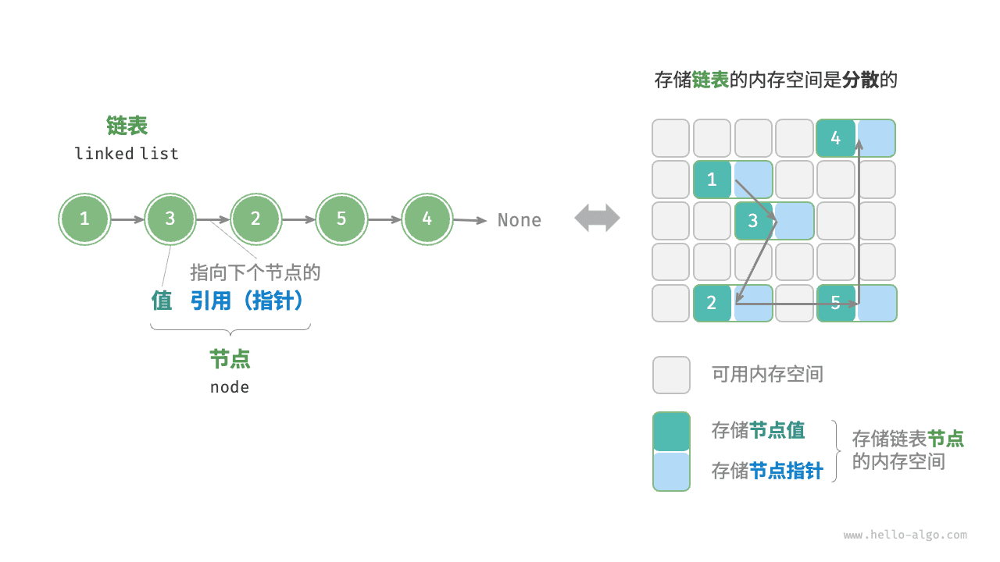
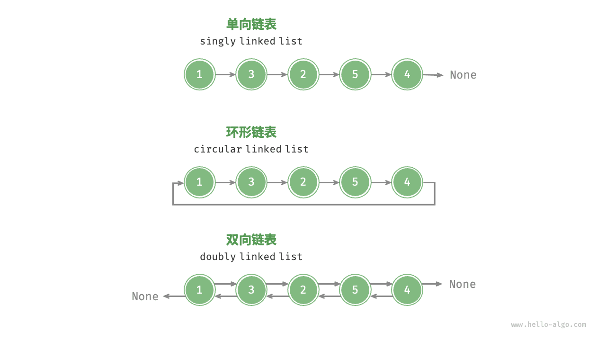

内存空间是所有程序的公共资源，在一个复杂的系统运行环境下，空闲的内存空间可能散落在内存各处。我们知道，存储数组的内存空间必须是连续的，而当数组非常大时，内存可能无法提供如此大的连续空间。此时链表的灵活性优势就体现出来了。

<u>链表（linked list）</u>是一种线性数据结构，其中的每个元素都是一个节点对象，各个节点通过“引用”相连接。引用记录了下一个节点的内存地址，通过它可以从当前节点访问到下一个节点。

链表的设计使得各个节点可以分散存储在内存各处，它们的内存地址无须连续。



观察上图，链表的组成单位是<u>节点（node）</u>对象。每个节点都包含两项数据：节点的“值”和指向下一节点的“引用”。

- 链表的首个节点被称为“头节点”，最后一个节点被称为“尾节点”。
- 尾节点指向的是“空”，它在 Java、C++ 和 Python 中分别被记为 `null`、`nullptr` 和 `None` 。
- 在 C、C++、Go 和 Rust 等支持指针的语言中，上述“引用”应被替换为“指针”。

如以下代码所示，链表节点 `ListNode` 除了包含值，还需额外保存一个引用（指针）。因此在相同数据量下，**链表比数组占用更多的内存空间**。


```python title=""
class ListNode:
    """链表节点类"""
    def __init__(self, val: int):
        self.val: int = val               # 节点值
        self.next: ListNode | None = None # 指向下一节点的引用
```

## 链表常用操作

### 初始化链表

建立链表分为两步，第一步是初始化各个节点对象，第二步是构建节点之间的引用关系。初始化完成后，我们就可以从链表的头节点出发，通过引用指向 `next` 依次访问所有节点。


```python title="linked_list.py"
# 初始化链表 1 -> 3 -> 2 -> 5 -> 4
# 初始化各个节点
n0 = ListNode(1)
n1 = ListNode(3)
n2 = ListNode(2)
n3 = ListNode(5)
n4 = ListNode(4)
# 构建节点之间的引用
n0.next = n1
n1.next = n2
n2.next = n3
n3.next = n4
```

**▶ [可视化运行](https://pythontutor.com/render.html#code=class%20ListNode%3A%0A%20%20%20%20%22%22%22%E9%93%BE%E8%A1%A8%E8%8A%82%E7%82%B9%E7%B1%BB%22%22%22%0A%20%20%20%20def%20__init__%28self,%20val%3A%20int%29%3A%0A%20%20%20%20%20%20%20%20self.val%3A%20int%20%3D%20val%20%20%23%20%E8%8A%82%E7%82%B9%E5%80%BC%0A%20%20%20%20%20%20%20%20self.next%3A%20ListNode%20%7C%20None%20%3D%20None%20%20%23%20%E5%90%8E%E7%BB%A7%E8%8A%82%E7%82%B9%E5%BC%95%E7%94%A8%0A%0A%22%22%22Driver%20Code%22%22%22%0Aif%20__name__%20%3D%3D%20%22__main__%22%3A%0A%20%20%20%20%23%20%E5%88%9D%E5%A7%8B%E5%8C%96%E9%93%BE%E8%A1%A8%201%20-%3E%203%20-%3E%202%20-%3E%205%20-%3E%204%0A%20%20%20%20%23%20%E5%88%9D%E5%A7%8B%E5%8C%96%E5%90%84%E4%B8%AA%E8%8A%82%E7%82%B9%0A%20%20%20%20n0%20%3D%20ListNode%281%29%0A%20%20%20%20n1%20%3D%20ListNode%283%29%0A%20%20%20%20n2%20%3D%20ListNode%282%29%0A%20%20%20%20n3%20%3D%20ListNode%285%29%0A%20%20%20%20n4%20%3D%20ListNode%284%29%0A%20%20%20%20%23%20%E6%9E%84%E5%BB%BA%E8%8A%82%E7%82%B9%E4%B9%8B%E9%97%B4%E7%9A%84%E5%BC%95%E7%94%A8%0A%20%20%20%20n0.next%20%3D%20n1%0A%20%20%20%20n1.next%20%3D%20n2%0A%20%20%20%20n2.next%20%3D%20n3%0A%20%20%20%20n3.next%20%3D%20n4&cumulative=false&curInstr=3&heapPrimitives=nevernest&mode=display&origin=opt-frontend.js&py=311&rawInputLstJSON=%5B%5D&textReferences=false)**（网页可交互演示本节代码）

数组整体是一个变量，比如数组 `nums` 包含元素 `nums[0]` 和 `nums[1]` 等，而链表是由多个独立的节点对象组成的。**我们通常将头节点当作链表的代称**，比如以上代码中的链表可记作链表 `n0` 。

### 插入节点

在链表中插入节点非常容易。如下图所示，假设我们想在相邻的两个节点 `n0` 和 `n1` 之间插入一个新节点 `P` ，**则只需改变两个节点引用（指针）即可**，时间复杂度为 O(1) 。

相比之下，在数组中插入元素的时间复杂度为 O(n) ，在大数据量下的效率较低。


```python
def insert(n0: ListNode, P: ListNode):
    """在链表的节点 n0 之后插入节点 P"""
    n1 = n0.next
    P.next = n1
    n0.next = P
```


### 删除节点

如下图所示，在链表中删除节点也非常方便，**只需改变一个节点的引用（指针）即可**。

请注意，尽管在删除操作完成后节点 `P` 仍然指向 `n1` ，但实际上遍历此链表已经无法访问到 `P` ，这意味着 `P` 已经不再属于该链表了。


```python
def remove(n0: ListNode):
    """删除链表的节点 n0 之后的首个节点"""
    if not n0.next:
        return
    # n0 -> P -> n1
    P = n0.next
    n1 = P.next
    n0.next = n1
```


### 访问节点

**在链表中访问节点的效率较低**。如上一节所述，我们可以在 O(1) 时间下访问数组中的任意元素。链表则不然，程序需要从头节点出发，逐个向后遍历，直至找到目标节点。也就是说，访问链表的第 i 个节点需要循环 i - 1 轮，时间复杂度为 O(n) 。

```python
def access(head: ListNode, index: int) -> ListNode | None:
    """访问链表中索引为 index 的节点"""
    for _ in range(index):
        if not head:
            return None
        head = head.next
    return head
```


### 查找节点

遍历链表，查找其中值为 `target` 的节点，输出该节点在链表中的索引。此过程也属于线性查找。代码如下所示：

```python
def find(head: ListNode, target: int) -> int:
    """在链表中查找值为 target 的首个节点"""
    index = 0
    while head:
        if head.val == target:
            return index
        head = head.next
        index += 1
    return -1
```


## 数组 vs. 链表

下表总结了数组和链表的各项特点并对比了操作效率。由于它们采用两种相反的存储策略，因此各种性质和操作效率也呈现对立的特点。

**表：&nbsp; 数组与链表的效率对比**

|          | 数组                           | 链表           |
| -------- | ------------------------------ | -------------- |
| 存储方式 | 连续内存空间                   | 分散内存空间   |
| 容量扩展 | 长度不可变                     | 可灵活扩展     |
| 内存效率 | 元素占用内存少、但可能浪费空间 | 元素占用内存多 |
| 访问元素 | O(1)                         | O(n)         |
| 添加元素 | O(n)                         | O(1)         |
| 删除元素 | O(n)                         | O(1)         |

## 常见链表类型

如下图所示，常见的链表类型包括三种。

- **单向链表**：即前面介绍的普通链表。单向链表的节点包含值和指向下一节点的引用两项数据。我们将首个节点称为头节点，将最后一个节点称为尾节点，尾节点指向空 `None` 。
- **环形链表**：如果我们令单向链表的尾节点指向头节点（首尾相接），则得到一个环形链表。在环形链表中，任意节点都可以视作头节点。
- **双向链表**：与单向链表相比，双向链表记录了两个方向的引用。双向链表的节点定义同时包含指向后继节点（下一个节点）和前驱节点（上一个节点）的引用（指针）。相较于单向链表，双向链表更具灵活性，可以朝两个方向遍历链表，但相应地也需要占用更多的内存空间。


```python title=""
class ListNode:
    """双向链表节点类"""
    def __init__(self, val: int):
        self.val: int = val                # 节点值
        self.next: ListNode | None = None  # 指向后继节点的引用
        self.prev: ListNode | None = None  # 指向前驱节点的引用
```



## 链表典型应用

单向链表通常用于实现栈、队列、哈希表和图等数据结构。

- **栈与队列**：当插入和删除操作都在链表的一端进行时，它表现的特性为先进后出，对应栈；当插入操作在链表的一端进行，删除操作在链表的另一端进行，它表现的特性为先进先出，对应队列。
- **哈希表**：链式地址是解决哈希冲突的主流方案之一，在该方案中，所有冲突的元素都会被放到一个链表中。
- **图**：邻接表是表示图的一种常用方式，其中图的每个顶点都与一个链表相关联，链表中的每个元素都代表与该顶点相连的其他顶点。

双向链表常用于需要快速查找前一个和后一个元素的场景。

- **高级数据结构**：比如在红黑树、B 树中，我们需要访问节点的父节点，这可以通过在节点中保存一个指向父节点的引用来实现，类似于双向链表。
- **浏览器历史**：在网页浏览器中，当用户点击前进或后退按钮时，浏览器需要知道用户访问过的前一个和后一个网页。双向链表的特性使得这种操作变得简单。
- **LRU 算法**：在缓存淘汰（LRU）算法中，我们需要快速找到最近最少使用的数据，以及支持快速添加和删除节点。这时候使用双向链表就非常合适。

环形链表常用于需要周期性操作的场景，比如操作系统的资源调度。

- **时间片轮转调度算法**：在操作系统中，时间片轮转调度算法是一种常见的 CPU 调度算法，它需要对一组进程进行循环。每个进程被赋予一个时间片，当时间片用完时，CPU 将切换到下一个进程。这种循环操作可以通过环形链表来实现。
- **数据缓冲区**：在某些数据缓冲区的实现中，也可能会使用环形链表。比如在音频、视频播放器中，数据流可能会被分成多个缓冲块并放入一个环形链表，以便实现无缝播放。

## 可运行的单链表实现

前面各节是按“操作”拆开讲的片段，本节给一个**完整可跑的链表类**：它是《栈》《队列》《LRU 缓存》里手写实现的公共底座，也是理解“为什么所有链表代码都要一个假头”的最好例子。

设计要点只有两条：**用一个不存业务数据的哨兵头节点 `dummy` 承接所有前驱操作**，以及**任何插入都写成“先接后面、再断前面”**。

```python
class ListNode:
    """链表节点"""

    def __init__(self, val: int = 0, next: "ListNode | None" = None):
        self.val = val
        self.next = next


class SinglyLinkedList:
    """带头节点（dummy head）的单链表：所有插入删除都不用特判头节点"""

    def __init__(self):
        self._dummy = ListNode(0)        # 哨兵节点：让「第 0 个位置」也有前驱
        self._size = 0

    def __len__(self) -> int:
        return self._size

    def get(self, index: int) -> int:
        """按下标取值，越界抛 IndexError —— 这是链表的软肋：O(n)"""
        if not 0 <= index < self._size:
            raise IndexError("下标越界")
        cur = self._dummy.next
        for _ in range(index):
            cur = cur.next
        return cur.val

    def add_at(self, index: int, val: int) -> None:
        if not 0 <= index <= self._size:
            raise IndexError("下标越界")
        prev = self._dummy
        for _ in range(index):           # 定位到目标位置的前驱
            prev = prev.next
        self._insert_after(prev, val)

    def add_first(self, val: int) -> None:
        self._insert_after(self._dummy, val)

    def add_last(self, val: int) -> None:
        cur = self._dummy
        while cur.next:                  # 没有尾指针就要走完全程：O(n)
            cur = cur.next
        self._insert_after(cur, val)

    def remove_at(self, index: int) -> int:
        if not 0 <= index < self._size:
            raise IndexError("下标越界")
        prev = self._dummy
        for _ in range(index):
            prev = prev.next
        dropped = prev.next
        prev.next = dropped.next         # 跳过被删节点，它随即成为垃圾
        self._size -= 1
        return dropped.val

    def _insert_after(self, prev: "ListNode", val: int) -> None:
        """核心：先接后面（新节点指向后继）、再断前面（前驱指向新节点）"""
        node = ListNode(val, prev.next)
        prev.next = node
        self._size += 1

    def to_list(self) -> list[int]:
        """转成列表方便打印与断言"""
        out, cur = [], self._dummy.next
        while cur:
            out.append(cur.val)
            cur = cur.next
        return out


if __name__ == "__main__":
    lst = SinglyLinkedList()
    for v in (1, 3, 5, 7):
        lst.add_last(v)
    lst.add_at(2, 4)
    print(lst.to_list(), len(lst), lst.get(0))     # [1, 3, 4, 5, 7] 5 1
    print(lst.remove_at(1), lst.to_list())         # 3 [1, 4, 5, 7]
```

## 链表五件套：反转、中点、环、归并、倒数第 k

这五个操作构成了链表问题的“原子”，LRU、归并排序、跳表、`OrderedDict` 的内部逻辑都由它们拼出。

```python
def reverse(head: "ListNode | None") -> "ListNode | None":
    """迭代反转：三指针推进。先存后继再断链，顺序不能换"""
    pre, cur = None, head
    while cur:
        nxt = cur.next                  # 1. 存下后继
        cur.next = pre                  # 2. 反转当前指针
        pre, cur = cur, nxt             # 3. 双双前移
    return pre                          # pre 即新头


def reverse_recursive(head: "ListNode | None") -> "ListNode | None":
    """递归反转：把后面反好，再把自己挂到尾部。深度 = 长度，长链会爆栈"""
    if head is None or head.next is None:
        return head
    new_head = reverse_recursive(head.next)
    head.next.next = head               # 后继的 next 反指回来
    head.next = None                    # 自己变成新的尾
    return new_head


def middle(head: "ListNode | None") -> "ListNode | None":
    """快慢指针：快走两步、慢走一步。快到头时慢恰在中点"""
    slow = fast = head
    while fast and fast.next:
        slow, fast = slow.next, fast.next.next
    return slow
```

判断环与找环入口用的是同一对快慢指针（Floyd 判圈）。**入口位置那段推导值得亲手验一遍**：设头到入口距离为 a ，入口到相遇点为 b ，环长为 c ，则快指针走了 `a + b + k·c` 、慢指针走了 `a + b` ，又快是慢的两倍，得 `a + b = m·c` ，于是 **a 与“相遇点再走若干整圈到入口”的距离同余** ：把一个指针放回头部、两个指针都每次走一步，下一次相遇点就是入口。

```python
def has_cycle(head: "ListNode | None") -> bool:
    slow = fast = head
    while fast and fast.next:
        slow, fast = slow.next, fast.next.next
        if slow is fast:                # 相遇即有环（步长差 1，必在环内相遇）
            return True
    return False


def cycle_entry(head: "ListNode | None") -> "ListNode | None":
    """返回环入口节点，无环返回 None"""
    slow = fast = head
    while fast and fast.next:
        slow, fast = slow.next, fast.next.next
        if slow is fast:
            p = head
            while p is not slow:        # 同速前进，再次相遇处即入口
                p, slow = p.next, slow.next
            return p
    return None
```

“归并两个有序链表”是《排序算法》里归并排序的合并步，“删倒数第 k 个”是快慢指针的第二次用途：

```python
def merge_sorted(a: "ListNode | None", b: "ListNode | None") -> "ListNode | None":
    """归并两个升序链表；取等号保证稳定（相等时先取 a 的）"""
    dummy = tail = ListNode(0)
    while a and b:
        if a.val <= b.val:
            tail.next, a = a, a.next
        else:
            tail.next, b = b, b.next
        tail = tail.next
    tail.next = a or b                  # 剩余部分整段接上，无须逐节点搬
    return dummy.next


def remove_nth_from_end(head: "ListNode | None", n: int) -> "ListNode | None":
    """一趟扫描删倒数第 n 个：快指针先走 n + 1 步，再同速前进"""
    dummy = ListNode(0, head)           # 删头节点也要有前驱，于是又需要哨兵
    fast = slow = dummy
    for _ in range(n + 1):
        fast = fast.next
    while fast:
        fast, slow = fast.next, slow.next
    slow.next = slow.next.next
    return dummy.next
```

## 复杂度推导

- **访问 / 查找 O(n)** ：下标随机访问必须从头逐节点走，这是链表的定义性代价。
- **插入 / 删除本身 O(1) ，但“定位到位置”O(n)** 。上表“添加元素 O(1)”的准确说法是：**已知前驱指针时**修改引用的成本。业务代码里几乎总是“先找再改”，所以端到端仍是 O(n) 。只有“删掉当前指向的节点”“在头节点后插入”这类**位置已知**的场景才是真 O(1) 。
- **空间 O(n)** ，且每个节点额外存一个引用：CPython 里一个只装 `int` 的 `ListNode` 实例约 56 字节（`__dict__` 开销），加上小整数对象本身，**存 100 万个整数，数组约 8 MB ，链表可以接近 60 MB** ——“链表省空间”只在频繁插入删除、且元素本身是大对象时才成立。
- **快慢指针类算法都是 O(n) 时间、O(1) 空间** ：中点、判环、找入口、倒数第 k，代价是“一趟或两趟扫描”，优势是不开额外集合。
- **反转是 O(n) 时间、O(1) 空间**（迭代版）；递归版空间 O(n) 调用栈，长链表上会 `RecursionError` 。

## 常见坑

1. **忘了“先接后断”** 。`prev.next = node` 写在 `node.next = prev.next` 之前，会把后半条链直接丢掉，且**不报任何错** ——最难查的一类 bug 。
2. **没有哨兵头** 。删除头节点、在下标 0 插入都要单独写分支；用一个 `dummy` 节点能把分支数砍一半。
3. **`while cur:` 与 `while cur.next:` 用混** 。前者是“遍历节点”，后者是“停在待操作节点的前驱”。循环条件取决于你要停在哪。
4. **断链后还继续用旧引用** 。删除节点后 `dropped.next` 仍指向后继，若你把它当作“还在表里”就会写出双倍处理。
5. **反转后头节点变了** 。`reverse(head)` 的返回值才是新头，很多人改完仍用原来的 `head` 变量，得到只有一个节点的“链表”。
6. **快指针判空顺序** 。必须写 `while fast and fast.next` ：`fast.next` 在 `fast is None` 时求值会抛 `AttributeError` ，而 Python 的 `and` 短路正好保证安全。
7. **把链表的“O(1) 插入”当成银弹** 。真实机器上，数组的连续内存意味着 CPU 预取友好，**十万级数据下 Python 的 `list.insert(0, x)` 常常比链表实现还快**（`list` 是 C 实现，节点对象要过一遍解释器）。要“两端都快 + 随机访问”请用 `collections.deque` ，见《Python 算法工具箱》。
8. **共享节点造成“一条链两个头”** 。`a.next = b.next` 这种赋值如果跨链表使用（例如做拼接），会让两条链的尾段合并，删除时互相影响。要么深拷贝节点，要么显式维护 `prev/next` 双向引用。
9. **Python 里没有真正的指针** 。所谓“引用”是对象引用，`head = head.next` 只改变局部变量的指向，不会影响调用方看到的头节点——想改头节点必须**返回值**或用哨兵节点，这一层理解清楚能避开上面一半的坑。

## 工程应用：为什么缓存淘汰要用双向链表

链表作为基础结构在业务代码里少见，但它常常藏在别人肚子里：

- **LRU / LFU 缓存**：`collections.OrderedDict` 与 Redis 的 `lru` 近似淘汰策略，内部都是“哈希表 + 双向链表”——哈希给出 O(1) 定位，链表给出 O(1) 摘除与插到队头（见《LRU 缓存（哈希表 + 双向链表）》）。
- **跳表**：Redis 的有序集合、LevelDB / RocksDB 的内存表（MemTable）用跳表替代平衡树，本质是“多层链表 + 随机层高”，把 O(n) 的查找压到期望 O(log n) ，实现比红黑树简单得多。
- **内存分配器与连接池**：空闲块链表（free list）是分配器最经典的组织方式；对象池里“可用对象”通常串成一条链表，取和还都是 O(1) 。
- **邻接表与桶结构**：哈希表解决冲突的链式地址、图的邻接表（见《图》），都是把冲突项 / 邻居串成链。
- **协程与拦截器链**：中间件洋葱模型、责任链模式、事件监听器列表，形态上就是单向链表——“当前处理者持有下一个的引用”。

选型的经验法则是：**“频繁在中间插入删除 + 不需要随机访问 + 元素是大对象”才考虑手写链表** ；否则 `list` / `deque` 的实测性能与内存都更友好。

## 延伸阅读

- 《数组》：连续内存与缓存局部性，解释为什么“链表更快”常常是错觉。
- 《栈》《队列》：两种受限制的链表 / 数组用法。
- 《LRU 缓存（哈希表 + 双向链表）》：双向链表最典型的工程落地。
- 《Python 算法工具箱：heapq、bisect、graphlib 与 collections》：`deque` 、`OrderedDict` 等标准库替代方案。
- 《排序算法》：归并排序的合并步就是本文的 `merge_sorted` 。
- [Python 官方文档 `collections.deque`](https://docs.python.org/3/library/collections.html#collections.deque)（PSF License 2.0）：双端队列的复杂度表，工程上多数“想要链表”的场景真正该用它。

---

> **来源**：本文转载自 [链表](https://raw.githubusercontent.com/krahets/hello-algo/main/docs/chapter_array_and_linkedlist/linked_list.md)，作者 krahets，许可 CC BY-NC-SA 4.0。抓取于 2026-09-13。
> 原文中指向仓库完整代码的引用块已省略，完整可运行 Python 代码见 [hello-algo/codes/python](https://github.com/krahets/hello-algo/tree/main/codes/python)。
