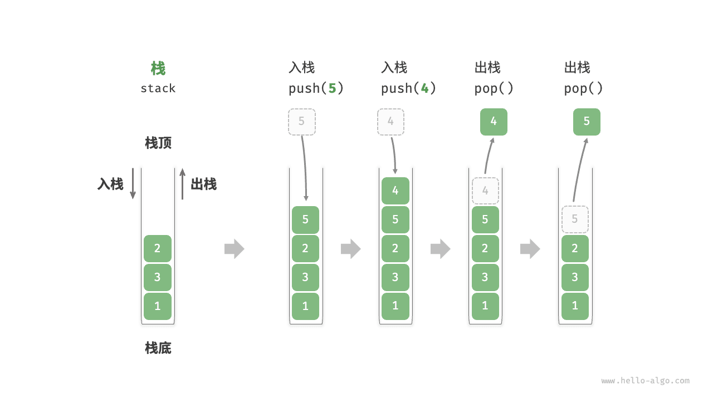

## 为什么需要栈

如果把一个问题拆成“先进来的必须先处理完，后进来的等着”，那它就是栈问题。栈的价值不在于“能存数据”（数组也能），而在于**它把“最近的事最先处理”这件事变成结构自带的性质**：

- 函数调用与递归：调用者要等被调用者返回，天然后进先出。
- 撤销 / 回滚：最新的操作最先被撤销。
- 括号与语法匹配：最内层的括号最先闭合。
- 表达式求值与编译优化：操作数栈、逆波兰式、编译器里的作用域栈。
- 回溯与搜索：深度优先的“回到上一步”（见《图的遍历（DFS/BFS）》《回溯算法（面试选学）》）。
- 单调栈：用 O(1) 的“等不到就继续压”换来整体 O(n) 的下一个更大元素。

反过来，如果问题要的是“先来的先处理”，那是队列（见《队列》）；如果两种都要、还能随机访问，那是数组或哈希表。**认出一个问题该用栈，通常比写出来更难**。

<u>栈（stack）</u>是一种遵循先入后出逻辑的线性数据结构。

我们可以将栈类比为桌面上的一摞盘子，规定每次只能移动一个盘子，那么想取出底部的盘子，则需要先将上面的盘子依次移走。我们将盘子替换为各种类型的元素（如整数、字符、对象等），就得到了栈这种数据结构。

如下图所示，我们把堆叠元素的顶部称为“栈顶”，底部称为“栈底”。将把元素添加到栈顶的操作叫作“入栈”，删除栈顶元素的操作叫作“出栈”。



## 栈的常用操作

栈的常用操作如下表所示，具体的方法名需要根据所使用的编程语言来确定。在此，我们以常见的 `push()`、`pop()`、`peek()` 命名为例。

**表：&nbsp; 栈的操作效率**

| 方法     | 描述                   | 时间复杂度 |
| -------- | ---------------------- | ---------- |
| `push()` | 元素入栈（添加至栈顶） | O(1)     |
| `pop()`  | 栈顶元素出栈           | O(1)     |
| `peek()` | 访问栈顶元素           | O(1)     |

通常情况下，我们可以直接使用编程语言内置的栈类。然而，某些语言可能没有专门提供栈类，这时我们可以将该语言的“数组”或“链表”当作栈来使用，并在程序逻辑上忽略与栈无关的操作。


```python title="stack.py"
# 初始化栈
# Python 没有内置的栈类，可以把 list 当作栈来使用
stack: list[int] = []

# 元素入栈
stack.append(1)
stack.append(3)
stack.append(2)
stack.append(5)
stack.append(4)

# 访问栈顶元素
peek: int = stack[-1]

# 元素出栈
pop: int = stack.pop()

# 获取栈的长度
size: int = len(stack)

# 判断是否为空
is_empty: bool = len(stack) == 0
```

**▶ [可视化运行](https://pythontutor.com/render.html#code=%22%22%22Driver%20Code%22%22%22%0Aif%20__name__%20%3D%3D%20%22__main__%22%3A%0A%20%20%20%20%23%20%E5%88%9D%E5%A7%8B%E5%8C%96%E6%A0%88%0A%20%20%20%20%23%20Python%20%E6%B2%A1%E6%9C%89%E5%86%85%E7%BD%AE%E7%9A%84%E6%A0%88%E7%B1%BB%EF%BC%8C%E5%8F%AF%E4%BB%A5%E6%8A%8A%20list%20%E5%BD%93%E4%BD%9C%E6%A0%88%E6%9D%A5%E4%BD%BF%E7%94%A8%0A%20%20%20%20stack%20%3D%20%5B%5D%0A%0A%20%20%20%20%23%20%E5%85%83%E7%B4%A0%E5%85%A5%E6%A0%88%0A%20%20%20%20stack.append%281%29%0A%20%20%20%20stack.append%283%29%0A%20%20%20%20stack.append%282%29%0A%20%20%20%20stack.append%285%29%0A%20%20%20%20stack.append%284%29%0A%20%20%20%20print%28%22%E6%A0%88%20stack%20%3D%22,%20stack%29%0A%0A%20%20%20%20%23%20%E8%AE%BF%E9%97%AE%E6%A0%88%E9%A1%B6%E5%85%83%E7%B4%A0%0A%20%20%20%20peek%20%3D%20stack%5B-1%5D%0A%20%20%20%20print%28%22%E6%A0%88%E9%A1%B6%E5%85%83%E7%B4%A0%20peek%20%3D%22,%20peek%29%0A%0A%20%20%20%20%23%20%E5%85%83%E7%B4%A0%E5%87%BA%E6%A0%88%0A%20%20%20%20pop%20%3D%20stack.pop%28%29%0A%20%20%20%20print%28%22%E5%87%BA%E6%A0%88%E5%85%83%E7%B4%A0%20pop%20%3D%22,%20pop%29%0A%20%20%20%20print%28%22%E5%87%BA%E6%A0%88%E5%90%8E%20stack%20%3D%22,%20stack%29%0A%0A%20%20%20%20%23%20%E8%8E%B7%E5%8F%96%E6%A0%88%E7%9A%84%E9%95%BF%E5%BA%A6%0A%20%20%20%20size%20%3D%20len%28stack%29%0A%20%20%20%20print%28%22%E6%A0%88%E7%9A%84%E9%95%BF%E5%BA%A6%20size%20%3D%22,%20size%29%0A%0A%20%20%20%20%23%20%E5%88%A4%E6%96%AD%E6%98%AF%E5%90%A6%E4%B8%BA%E7%A9%BA%0A%20%20%20%20is_empty%20%3D%20len%28stack%29%20%3D%3D%200%0A%20%20%20%20print%28%22%E6%A0%88%E6%98%AF%E5%90%A6%E4%B8%BA%E7%A9%BA%20%3D%22,%20is_empty%29&cumulative=false&curInstr=2&heapPrimitives=nevernest&mode=display&origin=opt-frontend.js&py=311&rawInputLstJSON=%5B%5D&textReferences=false)**（网页可交互演示本节代码）

## 栈的实现

为了深入了解栈的运行机制，我们来尝试自己实现一个栈类。

栈遵循先入后出的原则，因此我们只能在栈顶添加或删除元素。然而，数组和链表都可以在任意位置添加和删除元素，**因此栈可以视为一种受限制的数组或链表**。换句话说，我们可以“屏蔽”数组或链表的部分无关操作，使其对外表现的逻辑符合栈的特性。

### 基于链表的实现

使用链表实现栈时，我们可以将链表的头节点视为栈顶，尾节点视为栈底。

如下图所示，对于入栈操作，我们只需将元素插入链表头部，这种节点插入方法被称为“头插法”。而对于出栈操作，只需将头节点从链表中删除即可。

以下是基于链表实现栈的示例代码：

```python
class LinkedListStack:
    """基于链表实现的栈"""

    def __init__(self):
        """构造方法"""
        self._peek: ListNode | None = None
        self._size: int = 0

    def size(self) -> int:
        """获取栈的长度"""
        return self._size

    def is_empty(self) -> bool:
        """判断栈是否为空"""
        return self._size == 0

    def push(self, val: int):
        """入栈"""
        node = ListNode(val)
        node.next = self._peek
        self._peek = node
        self._size += 1

    def pop(self) -> int:
        """出栈"""
        num = self.peek()
        self._peek = self._peek.next
        self._size -= 1
        return num

    def peek(self) -> int:
        """访问栈顶元素"""
        if self.is_empty():
            raise IndexError("栈为空")
        return self._peek.val

    def to_list(self) -> list[int]:
        """转化为列表用于打印"""
        arr = []
        node = self._peek
        while node:
            arr.append(node.val)
            node = node.next
        arr.reverse()
        return arr
```


### 基于数组的实现

使用数组实现栈时，我们可以将数组的尾部作为栈顶。如下图所示，入栈与出栈操作分别对应在数组尾部添加元素与删除元素，时间复杂度都为 O(1) 。

由于入栈的元素可能会源源不断地增加，因此我们可以使用动态数组，这样就无须自行处理数组扩容问题。以下为示例代码：

```python
class ArrayStack:
    """基于数组实现的栈"""

    def __init__(self):
        """构造方法"""
        self._stack: list[int] = []

    def size(self) -> int:
        """获取栈的长度"""
        return len(self._stack)

    def is_empty(self) -> bool:
        """判断栈是否为空"""
        return self.size() == 0

    def push(self, item: int):
        """入栈"""
        self._stack.append(item)

    def pop(self) -> int:
        """出栈"""
        if self.is_empty():
            raise IndexError("栈为空")
        return self._stack.pop()

    def peek(self) -> int:
        """访问栈顶元素"""
        if self.is_empty():
            raise IndexError("栈为空")
        return self._stack[-1]

    def to_list(self) -> list[int]:
        """返回列表用于打印"""
        return self._stack
```


## 两种实现对比

**支持操作**

两种实现都支持栈定义中的各项操作。数组实现额外支持随机访问，但这已超出了栈的定义范畴，因此一般不会用到。

**时间效率**

在基于数组的实现中，入栈和出栈操作都在预先分配好的连续内存中进行，具有很好的缓存本地性，因此效率较高。然而，如果入栈时超出数组容量，会触发扩容机制，导致该次入栈操作的时间复杂度变为 O(n) 。

在基于链表的实现中，链表的扩容非常灵活，不存在上述数组扩容时效率降低的问题。但是，入栈操作需要初始化节点对象并修改指针，因此效率相对较低。不过，如果入栈元素本身就是节点对象，那么可以省去初始化步骤，从而提高效率。

综上所述，当入栈与出栈操作的元素是基本数据类型时，例如 `int` 或 `double` ，我们可以得出以下结论。

- 基于数组实现的栈在触发扩容时效率会降低，但由于扩容是低频操作，因此平均效率更高。
- 基于链表实现的栈可以提供更加稳定的效率表现。

**空间效率**

在初始化列表时，系统会为列表分配“初始容量”，该容量可能超出实际需求；并且，扩容机制通常是按照特定倍率（例如 2 倍）进行扩容的，扩容后的容量也可能超出实际需求。因此，**基于数组实现的栈可能造成一定的空间浪费**。

然而，由于链表节点需要额外存储指针，**因此链表节点占用的空间相对较大**。

综上，我们不能简单地确定哪种实现更加节省内存，需要针对具体情况进行分析。

## 栈的典型应用

- **浏览器中的后退与前进、软件中的撤销与反撤销**。每当我们打开新的网页，浏览器就会对上一个网页执行入栈，这样我们就可以通过后退操作回到上一个网页。后退操作实际上是在执行出栈。如果要同时支持后退和前进，那么需要两个栈来配合实现。
- **程序内存管理**。每次调用函数时，系统都会在栈顶添加一个栈帧，用于记录函数的上下文信息。在递归函数中，向下递推阶段会不断执行入栈操作，而向上回溯阶段则会不断执行出栈操作。
- **表达式求值与语法检查**。编译器的词法 / 语法分析、Excel 公式、规则引擎里的条件表达式，本质都是“压栈等待闭合”的过程。
- **搜索与回溯**。深度优先搜索、迷宫求解、八皇后、撤销式的增量计算，全都靠栈保存“还能回头的岔路口”。

## 复杂度推导

**基本操作**：`push` / `pop` / `peek` 在数组（动态数组）与链表实现上都是 O(1) 。但数组版要讲清楚一个概念——**均摊（amortized）**：设当前长度为 n ，若恰好触发扩容（拷贝 n 个元素），这一次是 O(n) ；然而按 2 倍扩容策略，两次扩容之间新增了 n 个元素，因此把这 O(n) 平摊到每次 `push` 上仍是 O(1) 。用 Σ 写出来：一次扩容周期内的总拷贝量是 `1 + 2 + 4 + … + n < 2n` ，除以 n 次操作，均摊不到 2 次拷贝。这就是“平均效率更高、偶发尖刺”的数学来源，也是延迟敏感服务里要**预留容量或换链表实现**的原因（详见《复杂度分析》的均摊分析一节）。

**空间**：O(n) ，数组版另有扩容倍率带来的空闲空间（不超过 1 倍，见上文“两种实现对比”）。

**单调栈为什么整体是 O(n) 而不是 O(n²)** ：外层循环 n 次，内层 `while` 看起来可能执行多次，但**每个下标最多入栈一次、出栈一次** ，因此所有 `while` 迭代次数之和 ≤ n 。这个“按元素记账”的论证方式（也叫聚合分析）适用于绝大多数“循环里套循环却是线性”的算法，同样出现在《双指针与滑动窗口》的窗口收缩与《排序惯用法》的归并论证里。

## 可运行的五个栈应用

下面五段都是自包含、可直接运行的实现，覆盖栈最常见的三类用法。把它们存进同一个文件也能跑通。

### 一、括号匹配：最“栈”的问题

```python
def is_balanced(text: str) -> bool:
    """括号匹配：左括号入栈，右括号与栈顶配对后弹出"""
    pairs = {")": "(", "]": "[", "}": "{"}
    stack: list[str] = []
    for ch in text:
        if ch in pairs.values():
            stack.append(ch)                # 左括号：压栈等待闭合
        elif ch in pairs:
            if not stack or stack.pop() != pairs[ch]:
                return False                # 右括号多余，或与栈顶类型不匹配
        # 其他字符（字母、空格）直接忽略
    return not stack                        # 必须清空：有未闭合的左括号即为 False


print(is_balanced("{[()]}"), is_balanced("{[(])}"), is_balanced("(()"))  # True False False
```

`return not stack` 这一句最容易被漏掉：`"((("` 走完循环时栈里还剩两个左括号，只有最后统一检查才判得出错。

### 二、表达式求值：调度场算法 + 后缀求值

中缀转后缀（逆波兰式）用一个运算符栈；后缀求值用一个操作数栈。两段合起来就能算 `2 + 3 * (4 - 1)` ：

```python
def precedence(op: str) -> int:
    """运算符优先级：+ - 为 1，* / 为 2"""
    return 1 if op in "+-" else 2


def infix_to_postfix(expr: list[str]) -> list[str]:
    """调度场算法：中缀 token 序列 -> 后缀 token 序列"""
    out: list[str] = []
    ops: list[str] = []
    for tok in expr:
        if tok.isdigit():
            out.append(tok)
        elif tok == "(":
            ops.append(tok)
        elif tok == ")":
            while ops and ops[-1] != "(":
                out.append(ops.pop())       # 括号内的运算符全部结算
            ops.pop()                       # 弹出左括号本身
        else:                               # 运算符
            while ops and ops[-1] != "(" and precedence(ops[-1]) >= precedence(tok):
                out.append(ops.pop())       # 优先级不低于当前的，先结算
            ops.append(tok)
    while ops:
        out.append(ops.pop())               # 收尾：清空剩余运算符
    return out


def eval_postfix(tokens: list[str]) -> int:
    """后缀求值：数字入栈，遇到运算符就弹两个数计算后把结果压回"""
    stack: list[int] = []
    for tok in tokens:
        if tok.isdigit():
            stack.append(int(tok))
        else:
            b, a = stack.pop(), stack.pop()  # 先弹出的是右操作数，顺序不能反
            stack.append({"+": a + b, "-": a - b, "*": a * b}[tok])
    return stack[0]


post = infix_to_postfix(["2", "+", "3", "*", "(", "4", "-", "1", ")"])
print(post, "=", eval_postfix(post))
# ['2', '3', '4', '1', '-', '*', '+'] = 11
```

后缀式的好处是**不需要记优先级也不需要括号** ，因此虚拟机（JVM 字节码、CPython 的栈式指令、Excel 内部表示）都偏爱它。

### 三、最小栈：用一条“影子栈”换 O(1)

“能取最小值的栈”是一个经典设计题：直接在 `min()` 里 `min(self._data)` 是 O(n) ，而压一条平行栈记录“截至当前的最小值”，就能摊到 O(1) 。

```python
class MinStack:
    """支持 O(1) 取最小值的栈：平行栈记录「历史最小值」"""

    def __init__(self):
        self._data: list[int] = []
        self._mins: list[int] = []           # 与 _data 等长：第 i 项 = data[:i+1] 的最小值

    def push(self, x: int) -> None:
        self._data.append(x)
        self._mins.append(x if not self._mins or x <= self._mins[-1] else self._mins[-1])

    def pop(self) -> int:
        self._mins.pop()                     # 两条栈必须同步弹出
        return self._data.pop()

    def min(self) -> int:
        if not self._mins:
            raise IndexError("栈为空")
        return self._mins[-1]


ms = MinStack()
for x in (3, 1, 2):
    ms.push(x)
print(ms.min())          # 1
ms.pop()
print(ms.min())          # 仍然是 1 —— 弹掉 2 不影响“历史最小值”
```

代价是空间翻倍（严格说可以只在“新最小值出现时”压栈来省空间，但弹出时要多一次比较）。**“用一条辅助栈保存历史状态”这个模式，可以平移到撤销栈、事务快照、括号嵌套计数等一切“需要回到过去的栈”上**。

### 四、单调栈：下一个更大元素

```python
def daily_temperatures(t: list[float]) -> list[int]:
    """每天要等多少个单位时间才出现更高气温；栈里存下标，温度自底向上递减"""
    res = [0] * len(t)
    stack: list[int] = []
    for i, x in enumerate(t):
        while stack and t[stack[-1]] < x:
            j = stack.pop()                 # 当前天就是 j 一直等的那个“第一个更高温度”
            res[j] = i - j
        stack.append(i)                     # 还没等到答案的天数留在栈里
    return res


print(daily_temperatures([73, 74, 75, 71, 69, 72, 76, 73]))
# [1, 1, 4, 2, 1, 1, 0, 0]
```

栈中元素“等着被解答”，一旦被解答就立即出栈——因此每个下标进出栈各一次，总时间 O(n) 。同一骨架可解：柱状图最大矩形、下一个更大元素 II（环形）、接雨水、股票跨度的所有变体。

### 五、撤销栈与浏览器历史：两个栈配合

```python
from dataclasses import dataclass, field


@dataclass
class Editor:
    """撤销栈 + 重做栈：编辑器 Ctrl-Z 的最小模型"""
    text: str = ""
    undo_stack: list[str] = field(default_factory=list)
    redo_stack: list[str] = field(default_factory=list)

    def type(self, s: str) -> None:
        self.undo_stack.append(self.text)    # 改动前先把旧状态快照入栈
        self.redo_stack.clear()              # 新操作会截断重做链——最常被漏的一条
        self.text += s

    def undo(self) -> str:
        if not self.undo_stack:
            return self.text
        self.redo_stack.append(self.text)    # 撤销前的当前态转入重做栈
        self.text = self.undo_stack.pop()
        return self.text


ed = Editor()
ed.type("SELECT ")
ed.type("* FROM t")
print(repr(ed.undo()), repr(ed.undo()))      # 'SELECT ' ''
```

```python
class History:
    """浏览器后退 / 前进：两个栈配合；新访问一定清空前进栈"""

    def __init__(self):
        self.back_stack: list[str] = []      # 还能后退去的历史页
        self.forward_stack: list[str] = []   # 还能前进回去的页
        self.current: str | None = None

    def visit(self, url: str) -> None:
        if self.current is not None:
            self.back_stack.append(self.current)
        self.current = url
        self.forward_stack.clear()           # 分叉了：旧的前进链失效

    def backward(self) -> str | None:
        if not self.back_stack:
            return self.current              # 已在最早一页，原地不动
        self.forward_stack.append(self.current)
        self.current = self.back_stack.pop()
        return self.current

    def forward(self) -> str | None:
        if not self.forward_stack:
            return self.current
        self.back_stack.append(self.current)
        self.current = self.forward_stack.pop()
        return self.current


h = History()
for u in ("a", "b", "c"):
    h.visit(u)
print(h.backward(), h.backward(), h.forward(), h.backward())   # b a b a
```

## 常见坑

1. **空栈弹出**。`list.pop()` 在空列表上抛 `IndexError` ；封装成类时要在 `pop` / `peek` 里显式判空，或返回哨兵值并在文档里写清。
2. **把 `list.insert(0, x)` 当栈用**。它整体挪动元素，是 O(n) ；同理 `pop(0)` 也不是栈操作。
3. **递归版实现栈，最后自己爆栈**。用 `list` 就够，不要为了“优雅”写成递归。
4. **忘记栈的“历史截断”语义**。撤销 / 前进 / 浏览器三类双栈实现里，只要发生新操作就必须清空另一个方向的栈，否则会出现“前进到一个已被覆盖的状态”这种脏数据。
5. **单调栈里存值而不是存下标**。求“距离”“区间端点”时必须在栈里放下标，值另用数组查，否则算不出跨度。
6. **`min` 只维护单个变量**。弹出当前最小值后无法回退，必须用辅助栈（或保存 `(值, 当前最小)` 元组）。
7. **用栈做 BFS**。栈与队列能生成相同的访问集合，但顺序不同：栈得到深度优先序，无法保证“按层最短”；求最短跳数必须用队列（见《图的遍历（DFS/BFS）》《最短路径与 NetworkX 实践》）。
8. **多线程共享一个 `list` 当栈**。`append` / `pop` 虽在 CPython 下因 GIL 而不至于丢数据，但“判空后弹出”这种复合操作依然有竞态；应使用 `queue.LifoQueue` （标准库，线程安全）。
9. **括号匹配只数数量不数类型**。`count("(") == count(")")` 会把 `")("` 判为合法，必须逐个与栈顶比对类型。

## 工程应用：从调用栈到故障排查

栈最“隐形”的用法是每个进程都在用的**调用栈**：一次 `RecursionError` 、一段被截断的 traceback、火焰图（flame graph）的纵轴，全都是栈。做后端排障时，读懂栈帧的“栈顶是最新一次调用”这一事实能省很多时间；而“栈溢出”几乎都是**递归缺少出口**或**数据结构里藏着环**（例如 JSON 自引用序列化）。

第二类高频用法是**表达式与规则引擎**。风控规则、报表公式、SQL 的 `CASE WHEN` 、LLM 应用里的过滤器 DSL，通常不会用 `eval` （安全与性能都不允许），而是先词法切成 token ，再用上文的调度场算法或简单的“操作数栈 + 运算符栈”求值。写自定义解析器时，**“后缀式 + 一个栈”往往比递归下降实现更短**，且天然可加缓存（同一后缀式可以复用）。

第三类是**流式扫描中的“待定项”**：日志解析时等待多行合并成一条堆栈、协议解析时等待分片收齐、消息消费时维护“未闭合的事务”，都可以用一个栈保存挂起上下文，遇到闭合标记再逐个弹出。这类场景要额外限制栈深度（例如超过 1000 层未闭合即判定输入异常并丢弃），否则一个畸形报文就能让进程 OOM——**给栈加上容量上限，是把玩具代码变成生产代码的关键一步**，实现上直接用 `collections.deque(maxlen=...)` 或在 `push` 里自己判长度。

## 延伸阅读

- 《队列》：与栈对偶的先进先出结构，以及两者的互相模拟。
- 《LRU 缓存（哈希表 + 双向链表）》：栈式“最近使用”思想的推广。
- 《二叉树遍历》：把系统调用栈换成显式栈写深度优先。
- 《递归入门》：栈帧、递与归、以及 Python 的递归上限。
- 《图的遍历（DFS/BFS）》：栈与队列分别决定深度优先与广度优先。
- [Python `queue` 官方文档](https://docs.python.org/3/library/queue.html#queue.LifoQueue)（PSF License 2.0）：线程安全的 `LifoQueue` 与 `maxsize` 语义。

---

> **来源**：本文转载自 [栈](https://raw.githubusercontent.com/krahets/hello-algo/main/docs/chapter_stack_and_queue/stack.md)，作者 krahets，许可 CC BY-NC-SA 4.0。抓取于 2026-09-13。
> 原文中指向仓库完整代码的引用块已省略，完整可运行 Python 代码见 [hello-algo/codes/python](https://github.com/krahets/hello-algo/tree/main/codes/python)。
