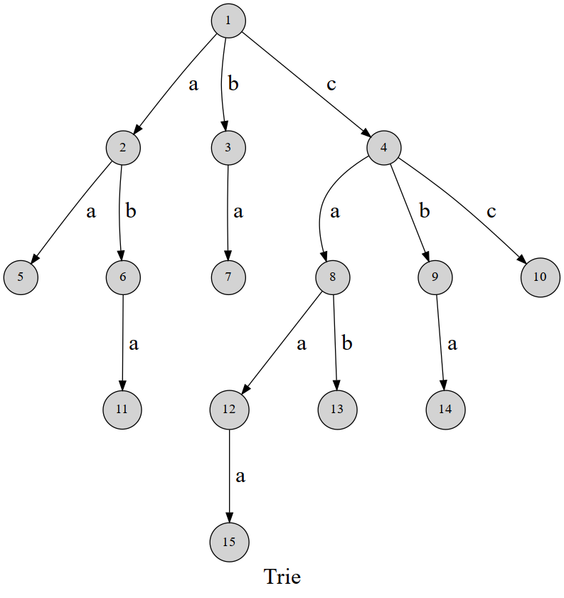

> **难度**：★★☆。数据结构本身很简单，难点在“什么时候不该用它”。
> **适合**：需要做前缀检索、自动补全、词表分词、工具名/敏感词匹配的读者。
> **前置**：《哈希表》。阅读本文前建议先看《堆》与《Top-K 与堆：召回重排里的取前 N 个》，三者常常配套出现。

## 为什么需要 Trie

《哈希表》告诉我们：给定一个完整的键，`dict` 能在 O(1) 时间内取出值。但哈希函数会把键“搅散”，因此它只能回答“**存不存在**”，无法回答“**以这个开头的所有键是什么**”。

一旦需求从“精确查找”变成“前缀查找”，哈希表就无能为力了：

- 搜索框输入 `trans`，要列出 `transformer`、`translation`、`transfer` —— 前缀匹配。
- 分词器要把一段文本切成词表里最长的词：`token` + `izer` 而不是逐字符切 —— 最长前缀匹配。
- 工具调用（Function Calling）里校验模型给出的函数名是否合法，并纠正相近拼写 —— 前缀 + 编辑距离。
- 网关对 API 路径 `/v1/chat/` 下所有端点做路由 —— 前缀路由。

这些问题的共同点是：**键之间共享大量前缀**。Trie（前缀树、字典树）正是把这些公共前缀合并成一棵树，从而把查找代价从“所有键的长度总和”降到“待查串自身的长度”。

## 定义与基本性质

Trie 是一种多叉树，其节点不存储值，**值由节点的位置隐式表达**：从根节点走到某个节点，沿途经过的边拼起来就是该节点对应的字符串。

它的三条基本性质：

1. 根节点对应空字符串 `""` 。
2. 从根到某个节点的路径上所有边标记的字符依次连接，即为该节点表示的字符串。
3. 公共前缀越长的键，共享的路径越长，因此**节点总数不超过所有键的字符总数**。

下图展示了一棵包含若干单词的 Trie：每个节点代表一个公共前缀，蓝色节点表示“此处是一个完整单词”。



用集合论的语言说：Trie 是对键集合的一种“逐字符哈希”，而 `dict` 是一种“整体哈希”。这个视角能解释它的一切优缺点。

## Python 实现

### 极简版：嵌套字典

Python 里最省事的 Trie 就是“字典套字典”，用一个哨兵键标记“此处是一个完整单词”：

```python
END = "\0"  # 哨兵键，表示某个节点是单词结尾


class Trie(dict):
    """基于嵌套字典的 Trie。继承 dict，节点即字典"""

    def insert(self, word: str) -> None:
        node = self
        for ch in word:
            # setdefault：不存在则插入空字典并返回，存在则直接返回
            node = node.setdefault(ch, {})
        node[END] = True

    def search(self, word: str) -> bool:
        """精确查找：word 是否被插入过"""
        node = self
        for ch in word:
            if ch not in node:
                return False
            node = node[ch]
        return END in node

    def startswith(self, prefix: str) -> bool:
        """前缀查找：是否存在以 prefix 开头的键"""
        node = self
        for ch in prefix:
            if ch not in node:
                return False
            node = node[ch]
        return True

    def words_with_prefix(self, prefix: str) -> list[str]:
        """列出所有以 prefix 开头的单词（深度优先遍历子树）"""
        node = self
        for ch in prefix:
            if ch not in node:
                return []
            node = node[ch]
        res: list[str] = []

        def dfs(cur: dict, path: list[str]):
            if END in cur:
                res.append(prefix + "".join(path))
            for ch, nxt in cur.items():
                if ch == END:
                    continue
                path.append(ch)
                dfs(nxt, path)
                path.pop()  # 回溯，必须与 append 成对

        dfs(node, [])
        return res


if __name__ == "__main__":
    t = Trie()
    for w in ["transformer", "translation", "transfer", "train", "tree"]:
        t.insert(w)
    print(t.search("train"))          # True
    print(t.startswith("trans"))      # True
    print(sorted(t.words_with_prefix("trans")))
    # ['transfer', 'transformer', 'translation']
```

三个 Python 细节值得注意：`setdefault` 把“查找 + 缺失则创建”合成一次哈希，比 `if ch not in node: node[ch] = {}` 少一次哈希计算；`words_with_prefix` 里的 `path.pop()` 与 `path.append()` 必须成对，这是《回溯算法（面试选学）》中“尝试与回退”的最小例子；结尾哨兵用 `"\0"` 而不是 `None`，是因为节点字典的键全部是字符串，不会与真实字符冲突。

### 标准版：显式节点类

需要携带计数、权重或做序列化时，显式节点类更清晰。下面这份实现的结构与 TheAlgorithms/Python 的 `data_structures/trie/trie.py`（MIT 许可）一致，改成中文注释并补上删除操作：

```python
class TrieNode:
    """Trie 节点"""

    __slots__ = ("children", "is_word")  # 关闭 __dict__，单节点省约 50% 内存

    def __init__(self):
        self.children: dict[str, TrieNode] = {}
        self.is_word: bool = False


class Trie:
    """字典树：支持增、删、精确查、前缀查"""

    def __init__(self):
        self.root = TrieNode()

    def insert(self, word: str) -> None:
        node = self.root
        for ch in word:
            if ch not in node.children:
                node.children[ch] = TrieNode()
            node = node.children[ch]
        node.is_word = True

    def search(self, word: str) -> bool:
        node = self._walk(word)
        return node is not None and node.is_word

    def startswith(self, prefix: str) -> bool:
        return self._walk(prefix) is not None

    def delete(self, word: str) -> bool:
        """删除一个单词；沿途已无其它单词经过的节点会被回收"""
        return self._delete(self.root, word, 0)

    def _delete(self, node: TrieNode, word: str, i: int) -> bool:
        if i == len(word):
            if not node.is_word:
                return False
            node.is_word = False
            return not node.children  # 无子节点则通知父节点回收自己

        ch = word[i]
        if ch not in node.children:
            return False
        alive = self._delete(node.children[ch], word, i + 1)
        if alive:
            del node.children[ch]
        return not node.is_word and not node.children

    def _walk(self, s: str) -> TrieNode | None:
        node = self.root
        for ch in s:
            if ch not in node.children:
                return None
            node = node.children[ch]
        return node
```

### 子节点用字典还是用数组

经典教材（包括 OI Wiki 的 C++ 实现）常用 `next[26]` 定长数组：

```python
# 字符集固定且密集时，数组更省、更快
self.next: list[TrieNode | None] = [None] * 26
```

两者的取舍很明确：

| 方案 | 单节点开销 | 适用场景 |
| ---- | ---------- | -------- |
| `dict` 子节点 | 空字典约 64 字节，只存实际出现的边 | 字符集大且稀疏（Unicode、字节级 BPE 词表） |
| 定长数组 | 固定 26/256 个指针 | 字符集小且密集（小写英文字母） |

工程实践中，绝大多数文本不是“只有 26 个小写字母”，中文更是动辄上万码点。**因此 Python 侧首选字典**；如果内存吃紧，把 `dict` 换成“排序数组 + 二分”或改用双数组 Trie（Double-Array Trie）是常规优化路线。

## 复杂度

设键集合的总字符数为 M 、待查串长度为 L ：

- **构建**：O(M) 时间、O(M) 空间（节点数上界）。
- **查找 / 前缀判断**：O(L) 时间，与词库里有多少词无关。这是 Trie 最大的优势——查询代价只取决于查询串本身。
- **列出某前缀下所有词**：O(L + K) ，K 为返回的字符总量，本质是一次子树遍历。

## 选型对照：什么时候真的需要 Trie

把常见的字符串检索手段放在一起比较，N 为键数量、L 为平均键长、Q 为查询串长度：

| 方案 | 精确查找 | 前缀查找 | 内存 | 更新 | 典型场景 |
| ---- | -------- | -------- | ---- | ---- | -------- |
| `dict` / `set` | O(Q) 均摊 | 不支持 | 低 | 极快 | 工具名、枚举值校验 |
| 排序数组 + `bisect` | O(L log N) | O(Q log N + K) | 最低 | 慢（要维护有序） | 词表固定、读多写少 |
| Trie | O(Q) | O(Q + K) | 最高 | 快 | 自动补全、前向匹配分词 |
| 倒排索引 | 不支持 | 不支持 | 中 | 快 | 全文检索、子串匹配 |
| `pyahocorasick` | 多模式串 | 任意位置 | 中 | 慢（整体重建） | 敏感词、日志关键字告警 |

一句话结论：**先问“我的查询是不是前缀查询”，再问“词表会不会频繁变更”**。只有两者都为“是”时，Trie 的内存代价才值得付；否则 `dict` 或排序数组加 `bisect` 往往更划算。

## 工程应用一：自动补全与“前缀 + Top-K”

补全接口通常是“给定前缀，返回按热度排序的前 N 个词”。直接在 Trie 节点上挂一个计数器即可：

```python
import heapq


class WeightedTrieNode:
    """节点保存该前缀的热度，以及子节点"""

    __slots__ = ("children", "weight", "prefix")

    def __init__(self, prefix: str = ""):
        self.children: dict[str, WeightedTrieNode] = {}
        self.weight: int = 0
        self.prefix = prefix

    def insert(self, word: str, weight: int = 1) -> None:
        node = self
        for i, ch in enumerate(word):
            node.weight += weight  # 前缀热度累加：子节点必然不超过父节点
            node = node.children.setdefault(ch, WeightedTrieNode(word[: i + 1]))
        node.weight += weight

    def top_k(self, prefix: str, k: int = 5) -> list[tuple[int, str]]:
        """返回以 prefix 开头、热度最高的 k 个完整词"""
        node = self
        for ch in prefix:
            if ch not in node.children:
                return []
            node = node.children[ch]
        heap: list[tuple[int, str]] = []
        stack = [node]
        while stack:
            cur = stack.pop()
            if cur.weight:  # weight 为 0 表示只是中间节点，不是完整词
                heapq.heappush(heap, (cur.weight, cur.prefix))
                if len(heap) > k:
                    heapq.heappop(heap)  # 维护大小为 k 的小顶堆
            stack.extend(cur.children.values())
        return [(w, p) for w, p in sorted(heap, reverse=True)]


t = WeightedTrieNode()
for w, freq in [("transformer", 900), ("translation", 120), ("transfer", 60), ("train", 400)]:
    t.insert(w, freq)
print(t.top_k("trans", k=2))  # [(900, 'transformer'), (120, 'translation')]
```

这段代码用《Top-K 与堆：召回重排里的取前 N 个》里的标准套路：候选量大而 k 很小时，用容量为 k 的小顶堆，把空间从 O(候选数) 压到 O(k) 。

## 工程应用二：词表分词与 tokenizer 中的最长匹配

中文分词、以及“把自由文本对齐到受控词表”的场景，常用**最大前向匹配**：每次从当前位置出发，取词表中能匹配到的最长词。用 Trie 实现，每步只需沿字符下探：

```python
def forward_max_match(text: str, vocab: Trie, max_len: int = 8) -> list[str]:
    """基于 Trie 的最大前向匹配分词。vocab 为已插入词表的 Trie"""
    tokens: list[str] = []
    i, n = 0, len(text)
    while i < n:
        best, node, j = None, vocab, i
        # 沿 Trie 尽量往长匹配，记录最后一次“命中整词”的位置
        while j < n and j - i < max_len and text[j] in node.children:
            node = node.children[text[j]]
            j += 1
            if node.is_word:
                best = text[i:j]
        if best is None:            # 单字兜底，避免死循环
            best = text[i]
        tokens.append(best)
        i += len(best)
    return tokens


vocab = Trie()
for w in ["自然语言", "自然", "语言", "处理", "模型", "语言模型"]:
    vocab.insert(w)
print(forward_max_match("自然语言处理模型", vocab))
# ['自然语言', '处理', '模型']
```

现代 LLM 的 BPE 分词器做法不同——先切成字节级 token 再按合并规则迭代归并——但“用树/前缀结构加速候选匹配”的思想是一致的。理解 Trie 之后再去读 `tiktoken` 或 HuggingFace `tokenizers` 的匹配逻辑，会顺利得多。

## 工程应用三：白名单与敏感词匹配

工具名白名单、URL 前缀路由、权限前缀匹配，都可以落在 Trie 上。若还需要“任意位置命中”，Trie 就不够了——那是 Aho-Corasick 自动机（多模式串匹配，本质是 Trie + 失败指针）的主场，一次扫描即可完成成千上万个模式的匹配，Python 侧可用 `pyahocorasick`。

## 常见坑

1. **内存远比想象中大**。一个空 `dict` 约 64 字节，一个只有 `{"a": ..., "b": ...}` 的节点轻易超过 200 字节，而英文词表每词平均 8~10 个节点。百万级词表轻松吃掉数百 MB。动手前先用 `sys.getsizeof` 和 `tracemalloc` 量一遍，再决定要不要上 Trie；`__slots__`、双数组 Trie、压缩 Trie（Radix Tree）都是有效的省内存手段。
2. **别用 Trie 做“无序”检索**。如果查询条件是“包含某子串”而不是“以某前缀开头”，Trie 完全没有优势，应该用倒排索引或后缀数组。
3. **排序数组 + `bisect` 常常更实用**。把所有键排序后，以 `prefix` 开头的键必然连续出现，用 `bisect_left(prefix)` 找到左边界、`bisect_left(prefix + "\uffff")` 找到右边界，即可 O(L log N) 完成前缀范围查询，内存开销只有键本身。数据不常改动时，这是工程上更省事的方案，详见《Python 算法工具箱：heapq、bisect、graphlib 与 collections》。
4. **删除容易破坏结构**。删除一个单词后，要沿路径回收不再被其它单词使用的节点，否则 Trie 只增不减。上面的 `_delete` 用返回值自底向上告知父节点“我可以被删掉”，这是标准写法。
5. **计数语义要想清楚**。“以该节点为前缀的单词数”和“该单词出现的次数”是两个不同的字段，混在一个 `count` 上会导致统计错误。
6. **Unicode 与大小写**。`"Ü"`、`"ü"`、组合字符 `"u\u0308"` 在 Python 里是不同字符串，入库前要做 `casefold()` 和 `unicodedata.normalize("NFC", s)` ，否则查询必然漏。

## 延伸阅读

- TheAlgorithms/Python 的 `data_structures/trie/trie.py`（MIT 许可），一份带插入、查询、按前缀搜索的简洁实现。
- OI Wiki《Trie（字典树）》，包含 01-Trie（按二进制位建树做异或最值）等竞赛向变体；位 Trie 在“两数最大异或”这类题里很好用，工程场景少见。
- 《哈希表》：理解“整体哈希 vs 逐字符哈希”的对照。
- 《Python 算法工具箱：heapq、bisect、graphlib 与 collections》：`bisect` 做前缀范围查询的替代方案。

---

> **来源**：抓取于 2026-09-19。本文在 OI Wiki《Trie（字典树）》（https://oi-wiki.org/string/trie/ ，OI Wiki 项目，CC BY-SA 4.0）的定义与配图基础上重写：原文的 C++ 指针数组实现、01-Trie 位树与洛谷习题已移除，改为 Python 主线实现与工程应用（自动补全、词表分词、前缀路由）。实现参考 TheAlgorithms/Python 的 `data_structures/trie/trie.py`（MIT 许可），其余代码与全部中文说明为本站编写，已在 Python 3.12 下运行验证。文中 Trie 结构示意图沿用 OI Wiki 原图（CC BY-SA 4.0），已下载至本模块 `assets/` 目录。
