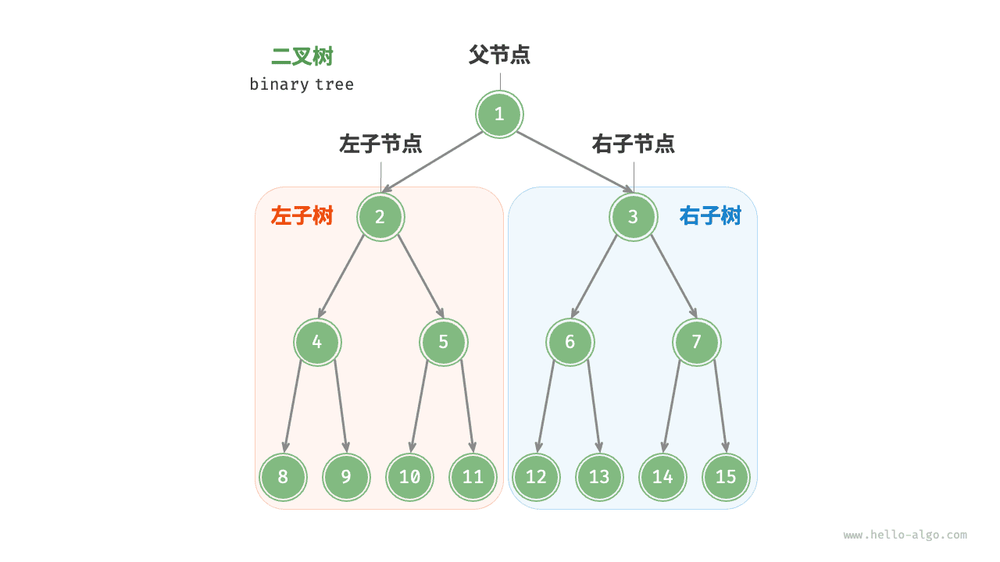
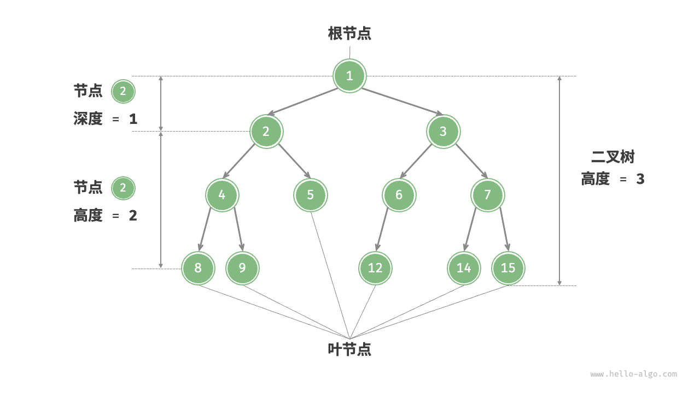
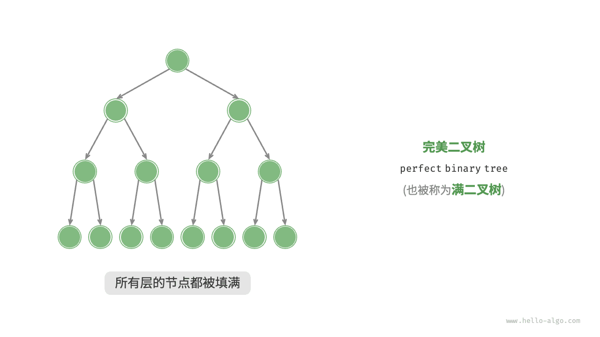
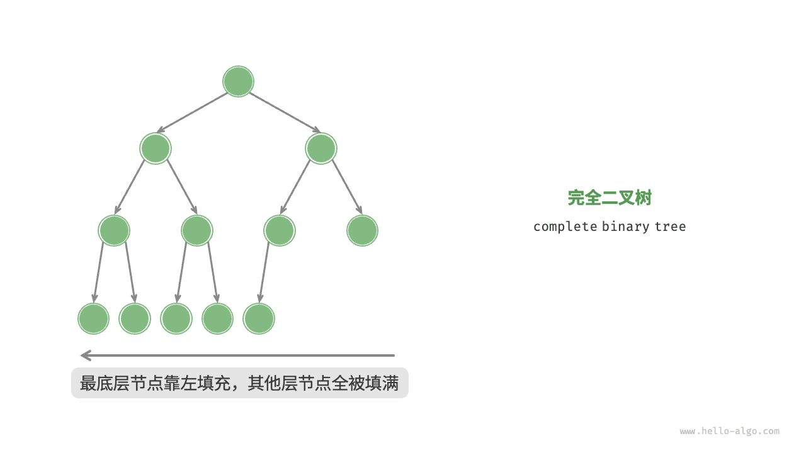
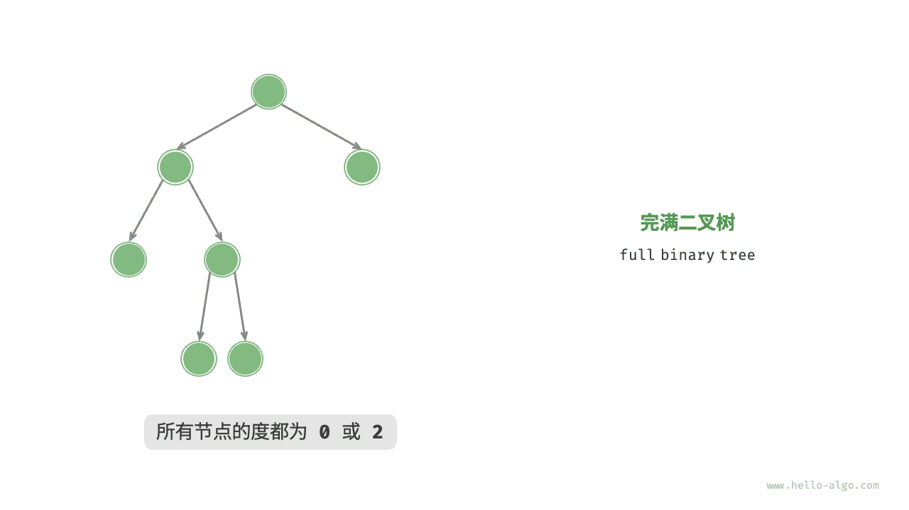
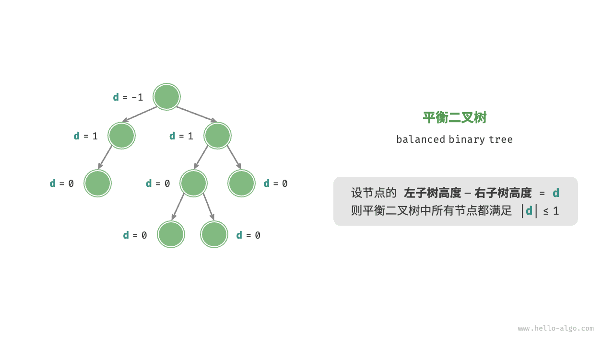

## 为什么要用树

数组和链表处理的是一对一的“序列”关系；一旦数据天然呈现**一对多的派生关系**，用线性结构表达就会变得别扭：文件系统的目录嵌套、公司的部门层级、HTML/XML 的 DOM、SQL 与编程语言的抽象语法树（AST）、菜单与权限的分组、多轮对话的分支改写、决策树的判定路径——这些都不是“排成一排”的东西。

树（tree）正是为这种关系设计的数据结构：**n 个节点、n − 1 条边、无环、从根到每个节点有唯一路径**（这就是树的数学定义，它也解释了为什么“树是连通分量的极端稀疏情形”）。有了“唯一路径”，很多操作才变得便宜：求祖先、求公共祖先、算子树大小、按层级聚合。反过来，一旦允许一个节点有两个父节点，就成了图，得改用《图的遍历（DFS/BFS）》里的 visited 机制。

工程上判断“这件事该不该用树”，就问两句：**数据里有“归属”或“包含”关系吗？同一个孩子会不会同时属于两个父亲？** 第一句为是、第二句为否，就用树；第二句也是，那就得上图。

## 树的通用形态与二叉树的分工

一般树（多叉树，每个节点的孩子数量不限）在业务里最直观；二叉树（每个节点至多两个孩子）在算法里最常见，因为**“两个孩子”刚好支撑二分**：二叉搜索树靠“左小右大”每轮排除一半，堆靠“完全二叉树 + 数组下标”免指针存放。两者并不互斥——任意多叉树都能用**左孩子右兄弟**表示法一对一地压成二叉树：节点的左指针指向它的第一个孩子，右指针指向它的下一个兄弟。编译器与 XML 解析库里保存层级结构时广泛使用这一变换，它同时说明：**二叉树是一种“存储格式”，而不只是一种“算法结构”**。

下面先给出二叉树（本站后续各篇的主要对象）的定义与操作，再在文末给出一份多叉树的可运行实现与工程用法。

## 二叉树（binary tree）

<u>二叉树（binary tree）</u>是一种非线性数据结构，代表“祖先”与“后代”之间的派生关系，体现了“一分为二”的分治逻辑。与链表类似，二叉树的基本单元是节点，每个节点包含值、左子节点引用和右子节点引用。


```python title=""
class TreeNode:
    """二叉树节点类"""
    def __init__(self, val: int):
        self.val: int = val                # 节点值
        self.left: TreeNode | None = None  # 左子节点引用
        self.right: TreeNode | None = None # 右子节点引用
```

每个节点都有两个引用（指针），分别指向<u>左子节点（left-child node）</u>和<u>右子节点（right-child node）</u>，该节点被称为这两个子节点的<u>父节点（parent node）</u>。当给定一个二叉树的节点时，我们将该节点的左子节点及其以下节点形成的树称为该节点的<u>左子树（left subtree）</u>，同理可得<u>右子树（right subtree）</u>。

**在二叉树中，除叶节点外，其他所有节点都包含子节点和非空子树**。如下图所示，如果将“节点 2”视为父节点，则其左子节点和右子节点分别是“节点 4”和“节点 5”，左子树是“节点 4 及其以下节点形成的树”，右子树是“节点 5 及其以下节点形成的树”。



## 二叉树常见术语

二叉树的常用术语如下图所示。

- <u>根节点（root node）</u>：位于二叉树顶层的节点，没有父节点。
- <u>叶节点（leaf node）</u>：没有子节点的节点，其两个指针均指向 `None` 。
- <u>边（edge）</u>：连接两个节点的线段，即节点引用（指针）。
- 节点所在的<u>层（level）</u>：从顶至底递增，根节点所在层为 1 。
- 节点的<u>度（degree）</u>：节点的子节点的数量。在二叉树中，度的取值范围是 0、1、2 。
- 二叉树的<u>高度（height）</u>：从根节点到最远叶节点所经过的边的数量。
- 节点的<u>深度（depth）</u>：从根节点到该节点所经过的边的数量。
- 节点的<u>高度（height）</u>：从距离该节点最远的叶节点到该节点所经过的边的数量。



> **【提示】**
> 请注意，我们通常将“高度”和“深度”定义为“经过的边的数量”，但有些题目或教材可能会将其定义为“经过的节点的数量”。在这种情况下，高度和深度都需要加 1 。

## 二叉树基本操作

### 初始化二叉树

与链表类似，首先初始化节点，然后构建引用（指针）。


```python title="binary_tree.py"
# 初始化二叉树
# 初始化节点
n1 = TreeNode(val=1)
n2 = TreeNode(val=2)
n3 = TreeNode(val=3)
n4 = TreeNode(val=4)
n5 = TreeNode(val=5)
# 构建节点之间的引用（指针）
n1.left = n2
n1.right = n3
n2.left = n4
n2.right = n5
```

**▶ [可视化运行](https://pythontutor.com/render.html#code=class%20TreeNode%3A%0A%20%20%20%20%22%22%22%E4%BA%8C%E5%8F%89%E6%A0%91%E8%8A%82%E7%82%B9%E7%B1%BB%22%22%22%0A%20%20%20%20def%20__init__%28self,%20val%3A%20int%29%3A%0A%20%20%20%20%20%20%20%20self.val%3A%20int%20%3D%20val%20%20%20%20%20%20%20%20%20%20%20%20%20%20%20%20%23%20%E8%8A%82%E7%82%B9%E5%80%BC%0A%20%20%20%20%20%20%20%20self.left%3A%20TreeNode%20%7C%20None%20%3D%20None%20%20%23%20%E5%B7%A6%E5%AD%90%E8%8A%82%E7%82%B9%E5%BC%95%E7%94%A8%0A%20%20%20%20%20%20%20%20self.right%3A%20TreeNode%20%7C%20None%20%3D%20None%20%23%20%E5%8F%B3%E5%AD%90%E8%8A%82%E7%82%B9%E5%BC%95%E7%94%A8%0A%0A%22%22%22Driver%20Code%22%22%22%0Aif%20__name__%20%3D%3D%20%22__main__%22%3A%0A%20%20%20%20%23%20%E5%88%9D%E5%A7%8B%E5%8C%96%E4%BA%8C%E5%8F%89%E6%A0%91%0A%20%20%20%20%23%20%E5%88%9D%E5%A7%8B%E5%8C%96%E8%8A%82%E7%82%B9%0A%20%20%20%20n1%20%3D%20TreeNode%28val%3D1%29%0A%20%20%20%20n2%20%3D%20TreeNode%28val%3D2%29%0A%20%20%20%20n3%20%3D%20TreeNode%28val%3D3%29%0A%20%20%20%20n4%20%3D%20TreeNode%28val%3D4%29%0A%20%20%20%20n5%20%3D%20TreeNode%28val%3D5%29%0A%20%20%20%20%23%20%E6%9E%84%E5%BB%BA%E8%8A%82%E7%82%B9%E4%B9%8B%E9%97%B4%E7%9A%84%E5%BC%95%E7%94%A8%EF%BC%88%E6%8C%87%E9%92%88%EF%BC%89%0A%20%20%20%20n1.left%20%3D%20n2%0A%20%20%20%20n1.right%20%3D%20n3%0A%20%20%20%20n2.left%20%3D%20n4%0A%20%20%20%20n2.right%20%3D%20n5&cumulative=false&curInstr=3&heapPrimitives=nevernest&mode=display&origin=opt-frontend.js&py=311&rawInputLstJSON=%5B%5D&textReferences=false)**（网页可交互演示本节代码）

### 插入与删除节点

与链表类似，在二叉树中插入与删除节点可以通过修改指针来实现。下图给出了一个示例。


```python title="binary_tree.py"
# 插入与删除节点
p = TreeNode(0)
# 在 n1 -> n2 中间插入节点 P
n1.left = p
p.left = n2
# 删除节点 P
n1.left = n2
```

**▶ [可视化运行](https://pythontutor.com/render.html#code=class%20TreeNode%3A%0A%20%20%20%20%22%22%22%E4%BA%8C%E5%8F%89%E6%A0%91%E8%8A%82%E7%82%B9%E7%B1%BB%22%22%22%0A%20%20%20%20def%20__init__%28self,%20val%3A%20int%29%3A%0A%20%20%20%20%20%20%20%20self.val%3A%20int%20%3D%20val%20%20%20%20%20%20%20%20%20%20%20%20%20%20%20%20%23%20%E8%8A%82%E7%82%B9%E5%80%BC%0A%20%20%20%20%20%20%20%20self.left%3A%20TreeNode%20%7C%20None%20%3D%20None%20%20%23%20%E5%B7%A6%E5%AD%90%E8%8A%82%E7%82%B9%E5%BC%95%E7%94%A8%0A%20%20%20%20%20%20%20%20self.right%3A%20TreeNode%20%7C%20None%20%3D%20None%20%23%20%E5%8F%B3%E5%AD%90%E8%8A%82%E7%82%B9%E5%BC%95%E7%94%A8%0A%0A%22%22%22Driver%20Code%22%22%22%0Aif%20__name__%20%3D%3D%20%22__main__%22%3A%0A%20%20%20%20%23%20%E5%88%9D%E5%A7%8B%E5%8C%96%E4%BA%8C%E5%8F%89%E6%A0%91%0A%20%20%20%20%23%20%E5%88%9D%E5%A7%8B%E5%8C%96%E8%8A%82%E7%82%B9%0A%20%20%20%20n1%20%3D%20TreeNode%28val%3D1%29%0A%20%20%20%20n2%20%3D%20TreeNode%28val%3D2%29%0A%20%20%20%20n3%20%3D%20TreeNode%28val%3D3%29%0A%20%20%20%20n4%20%3D%20TreeNode%28val%3D4%29%0A%20%20%20%20n5%20%3D%20TreeNode%28val%3D5%29%0A%20%20%20%20%23%20%E6%9E%84%E5%BB%BA%E8%8A%82%E7%82%B9%E4%B9%8B%E9%97%B4%E7%9A%84%E5%BC%95%E7%94%A8%EF%BC%88%E6%8C%87%E9%92%88%EF%BC%89%0A%20%20%20%20n1.left%20%3D%20n2%0A%20%20%20%20n1.right%20%3D%20n3%0A%20%20%20%20n2.left%20%3D%20n4%0A%20%20%20%20n2.right%20%3D%20n5%0A%0A%20%20%20%20%23%20%E6%8F%92%E5%85%A5%E4%B8%8E%E5%88%A0%E9%99%A4%E8%8A%82%E7%82%B9%0A%20%20%20%20p%20%3D%20TreeNode%280%29%0A%20%20%20%20%23%20%E5%9C%A8%20n1%20-%3E%20n2%20%E4%B8%AD%E9%97%B4%E6%8F%92%E5%85%A5%E8%8A%82%E7%82%B9%20P%0A%20%20%20%20n1.left%20%3D%20p%0A%20%20%20%20p.left%20%3D%20n2%0A%20%20%20%20%23%20%E5%88%A0%E9%99%A4%E8%8A%82%E7%82%B9%20P%0A%20%20%20%20n1.left%20%3D%20n2&cumulative=false&curInstr=37&heapPrimitives=nevernest&mode=display&origin=opt-frontend.js&py=311&rawInputLstJSON=%5B%5D&textReferences=false)**（网页可交互演示本节代码）

> **【提示】**
> 需要注意的是，插入节点可能会改变二叉树的原有逻辑结构，而删除节点通常意味着删除该节点及其所有子树。因此，在二叉树中，插入与删除通常是由一套操作配合完成的，以实现有实际意义的操作。

## 常见二叉树类型

### 完美二叉树

如下图所示，<u>完美二叉树（perfect binary tree）</u>所有层的节点都被完全填满。在完美二叉树中，叶节点的度为 0 ，其余所有节点的度都为 2 ；若树的高度为 h ，则节点总数为 2^(h+1) - 1 ，呈现标准的指数级关系，反映了自然界中常见的细胞分裂现象。

> **【提示】**
> 请注意，在中文社区中，完美二叉树常被称为<u>满二叉树</u>。



### 完全二叉树

如下图所示，<u>完全二叉树（complete binary tree）</u>仅允许最底层的节点不完全填满，且最底层的节点必须从左至右依次连续填充。请注意，完美二叉树也是一棵完全二叉树。



### 完满二叉树

如下图所示，<u>完满二叉树（full binary tree）</u>除了叶节点之外，其余所有节点都有两个子节点。



### 平衡二叉树

如下图所示，<u>平衡二叉树（balanced binary tree）</u>中任意节点的左子树和右子树的高度之差的绝对值不超过 1 。



## 二叉树的退化

下图展示了二叉树的理想结构与退化结构。当二叉树的每层节点都被填满时，达到“完美二叉树”；而当所有节点都偏向一侧时，二叉树退化为“链表”。

- 完美二叉树是理想情况，可以充分发挥二叉树“分治”的优势。
- 链表则是另一个极端，各项操作都变为线性操作，时间复杂度退化至 O(n) 。


如下表所示，在最佳结构和最差结构下，二叉树的叶节点数量、节点总数、高度等达到极大值或极小值。

**表：&nbsp; 二叉树的最佳结构与最差结构**

|                             | 完美二叉树         | 链表    |
| --------------------------- | ------------------ | ------- |
| 第 i 层的节点数量         | 2^(i-1)          | 1     |
| 高度为 h 的树的叶节点数量 | 2^h              | 1     |
| 高度为 h 的树的节点总数   | 2^(h+1) - 1      | h + 1 |
| 节点总数为 n 的树的高度   | log₂ (n+1) - 1 | n - 1 |

## 可运行实现：多叉树、数组表示与聚合

下面这份脚本不依赖任何第三方库，覆盖日常业务里最常写的四件事：**建树、缩进打印、统计（节点数 / 树高 / 子树聚合）、层序展开**，并给出完全二叉树的数组下标换算。存成 `tree.py` 直接运行即可看到输出。

```python
"""多叉树的常用操作 + 完全二叉树的数组表示，可直接运行"""
from collections import deque


class NaryNode:
    """多叉树节点：一个值 + 任意个孩子"""

    def __init__(self, val):
        self.val = val
        self.children: list["NaryNode"] = []      # 注意：列表在 __init__ 里建，别写进默认参数


def build_nary(spec: dict) -> NaryNode:
    """由嵌套字典递归建树：{'name': 根, 'children': [...]}"""
    node = NaryNode(spec["name"])
    for child in spec.get("children", []):
        node.children.append(build_nary(child))
    return node


def walk(node: NaryNode, depth: int = 0):
    """前序遍历 + 缩进打印：先输出自己，再按顺序递归孩子（生成器，可流式）"""
    yield "  " * depth + str(node.val)
    for child in node.children:
        yield from walk(child, depth + 1)


def count_nodes(node: NaryNode) -> int:
    """节点总数 = 1 + 各子树节点数之和"""
    if node is None:
        return 0
    return 1 + sum(count_nodes(c) for c in node.children)


def tree_height(node: NaryNode) -> int:
    """树高（节点数口径：叶子为 1）= 1 + 各子树高度的最大值"""
    if node is None:
        return 0
    if not node.children:
        return 1
    return 1 + max(tree_height(c) for c in node.children)


def rollup(node: NaryNode, cost: dict) -> int:
    """后序聚合：本节点小计 = 自身开销 + 所有子树开销之和"""
    total = cost.get(node.val, 0)
    for child in node.children:
        total += rollup(child, cost)
    return total


def level_order(root: NaryNode) -> list[list]:
    """层序遍历：队列里始终是「同一层的若干节点」"""
    if root is None:
        return []
    res, queue = [], deque([root])
    while queue:
        res.append([n.val for n in queue])
        for _ in range(len(queue)):               # 先固定本层宽度，再展开孩子
            node = queue.popleft()
            queue.extend(node.children)
    return res


class TreeNode:
    """二叉树节点（用于「左孩子右兄弟」变换）"""

    def __init__(self, val):
        self.val = val
        self.left: "TreeNode | None" = None
        self.right: "TreeNode | None" = None


def to_binary(root: NaryNode) -> "TreeNode | None":
    """左孩子右兄弟：多叉树 -> 二叉树。左指针指第一个孩子，右指针指下一个兄弟"""
    if root is None:
        return None
    node = TreeNode(root.val)
    if root.children:
        node.left = to_binary(root.children[0])
        cur = node.left
        for sibling in root.children[1:]:
            cur.right = to_binary(sibling)
            cur = cur.right
    return node


def parent_of(i: int) -> int:
    """数组表示的完全二叉树：下标 i 的父节点下标（下标从 0 起）"""
    return (i - 1) // 2


def children_of(i: int, n: int) -> list[int]:
    """左右孩子下标为 2i+1 与 2i+2；越界即无孩子"""
    return [c for c in (2 * i + 1, 2 * i + 2) if c < n]


if __name__ == "__main__":
    spec = {
        "name": "docs",
        "children": [
            {"name": "01-python", "children": [{"name": "a.md"}, {"name": "b.md"}]},
            {"name": "02-dsa", "children": [{"name": "c.md"}]},
        ],
    }
    tree = build_nary(spec)
    print("\n".join(walk(tree)))
    print("节点数", count_nodes(tree), "树高", tree_height(tree))   # 6 3
    print("层序", level_order(tree))
    cost = {"a.md": 3, "b.md": 5, "c.md": 7, "01-python": 1}
    print("聚合开销", rollup(tree, cost))                            # 16
    bt = to_binary(tree)
    print("左孩子右兄弟：根", bt.val, "第一个孩子", bt.left.val, "它的兄弟", bt.left.right.val)
    heap = [10, 20, 30, 40, 50]
    print("下标 3 的父节点下标", parent_of(3), "；下标 1 的孩子", children_of(1, len(heap)))
```

数组表示那两行公式值得单独解释。若把完美二叉树按层编号（根为 0），第 i 层起点下标是 `2^i − 1` ，因此**下标 i 的孩子必然落在 `2i + 1` 与 `2i + 2` ，父节点落在 `⌊(i − 1) / 2⌋`** 。这让“完全二叉树”可以只用一个列表存放，省掉全部指针——《堆》整篇都建立在这个事实之上。代价是：一旦树不平衡或有大量空缺，数组会被稀疏撑得极大（一条高 30 层的斜树需要 2^30 个槽位），此时必须回到指针表示。

## 复杂度推导

对节点数为 n 、树高为 h 的树：

- **遍历 / 统计 / 聚合的时间都是 O(n)** 。以节点数归纳：`count(根) = 1 + Σ count(子树)` ，各子树互不相交，故总访问次数恰为 n 。多叉树还要额外考虑“边”——孩子指针共被检查 n − 1 次，仍是 O(n) 。
- **递归版空间是 O(h)** （调用栈），**层序版空间是 O(w)** ，w 为最大层宽度。两者不可互相替代：又高又窄的树用层序更省，又矮又宽的树用递归更省。
- **高度与节点数的关系决定了“树能不能当作索引”** ：平衡时 h = Θ(log n) ，退化（所有节点偏向一侧）时 h = Θ(n) 。上表“完美二叉树 vs 链表”给出的正是这两个极端，而**几乎所有树的性能故事都在讲“如何不让它退化”**：AVL / 红黑树靠旋转、B 树靠多分叉降低高度、跳表靠随机层数、Treap 靠随机优先级。
- **单点操作的成本**：已知父指针时，插入 / 删除一个节点是 O(1) （改几条引用）；未知父指针时，先要找它，成本就是 O(h) 或 O(n) 。这与《链表》“插入本身 O(1) 、定位 O(n) ”是同一件事。

## 常见坑

1. **把“高度”和“深度”的口径混用**。本文按“经过的边数”定义，很多题目与教材按“节点数”定义，差 1 ；同一份代码里两边必须统一。
2. **`children: list = []` 写成类属性或默认参数**。那样所有实例共享同一个列表，建树时会看到“孩子挂到别人家去”。必须在 `__init__` 里为每个节点新建。
3. **递归爆栈**。Python 默认 1000 层上限，几万个节点的深树（例如一条“单链形目录”）会 `RecursionError` ；深结构要么改显式栈，要么用 `sys.setrecursionlimit` 抬到可接受范围，要么在业务上限制层级（多数系统会硬性限制深度）。
4. **在遍历过程中增删节点**。和《二叉树遍历》同样的问题：先收集要动的节点，再统一改结构。
5. **忘了环**。树定义上无环，但用引用手工拼装时很容易写出 `a.children.append(b)` 同时又 `b.children.append(a)` ，递归永不返回。生产代码应在建树时校验“入度 ≤ 1 且无环”，或者干脆用 `graphlib.TopologicalSorter` 检查依赖关系（见《拓扑排序与依赖调度》）。
6. **用引用当身份**。两个节点 `val` 相同但对象不同，`node in list` 判的是对象身份；要做“同一实体的多处引用”，得显式维护 ID 映射（见《哈希表》）。
7. **数组表示用于非完全二叉树**。空洞会浪费指数级空间，也破坏了“孩子下标 = 2i+1”的前提。
8. **子树判断只看值**。判断“是否为同一棵子树”要同时比结构和值，只比值会把不同形状的树判成相同。

## 工程应用：树形聚合与权限菜单

现实里最常被写坏的，是“把子节点的数字滚到父节点”这类需求：目录大小、部门人数、预算汇总、按标签统计文档数。它们的共同形状就是上文的 `rollup` ——**一次后序遍历，自底向上累加**，复杂度 O(n) 。两种常见错误做法值得点名：一是“对每个父节点发一次 SQL 求和”，变成 N+1 查询；二是“按层级循环更新”，把 O(n) 做成 O(n·h) 。数据量大且频繁更新时，标准解法是把树存成带 `path` 物化列或闭包表的关系表，让“某节点的全部后代”退化成一次前缀匹配——这本质上就是《Trie 前缀树（字典树）》的前缀思路，只不过键是节点路径。

第二高频的场景是**权限与菜单树**：后端返回嵌套结构，前端按 `children` 递归渲染，同时要把“勾选父节点自动勾选全部后代”的联动算清楚。这里的正确姿势是**一次遍历同时产出两份数据**——缩进用的前序序列（供渲染）、`id -> 父 id` 的扁平映射（供回填选中态）。扁平映射尤其重要：数据库里存“父子关系”用一张 `(child, parent)` 表即可，渲染时再在内存里重建为树，比把 JSON 树整个塞进一列要好维护得多。

第三类是**语法与查询计划**。SQL 的 `WHERE a AND (b OR NOT c)` 在解析器里就是一棵树，优化器对它做自顶向下的常量折叠（前序）与自底向上的代价估算（后序）；LLM 应用里把工具调用编排成 DAG 时，如果确认无环，它退化成树或森林，可以直接用这里的递归求“最长依赖链”（见《拓扑排序与依赖调度》）。

## 延伸阅读

- 《二叉树遍历》：前中后序与层序的可运行实现，以及“由遍历序列重建二叉树”。
- 《二叉搜索树》：加上“左小右大”约束后能省掉多少比较。
- 《堆》：完全二叉树 + 数组表示的落地范例。
- 《Trie 前缀树（字典树）》：多叉树最节省内存的一种用法。
- 《图的遍历（DFS/BFS）》：允许环与多父节点之后，遍历要额外付什么代价。
- 维基百科 [Tree (graph theory)](https://en.wikipedia.org/wiki/Tree_(graph_theory)) 与 [Tree data structure](https://en.wikipedia.org/wiki/Tree_data_structure)（CC BY-SA 4.0）：等价定义与各种表示法的对照。

---
> **来源**：本文转载自 [二叉树](https://raw.githubusercontent.com/krahets/hello-algo/main/docs/chapter_tree/binary_tree.md)，作者 krahets，许可 CC BY-NC-SA 4.0。抓取于 2026-09-13。
> 原文中指向仓库完整代码的引用块已省略，完整可运行 Python 代码见 [hello-algo/codes/python](https://github.com/krahets/hello-algo/tree/main/codes/python)；本文“为什么要用树”“可运行实现”“复杂度推导”“常见坑”“工程应用”各节及全部新增代码为本站补充编写，已在 CPython 3.12 下运行验证。
