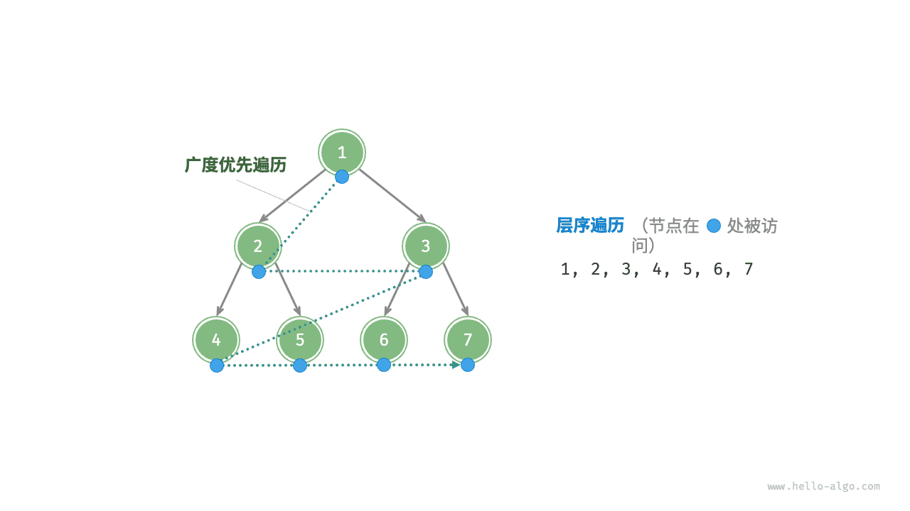
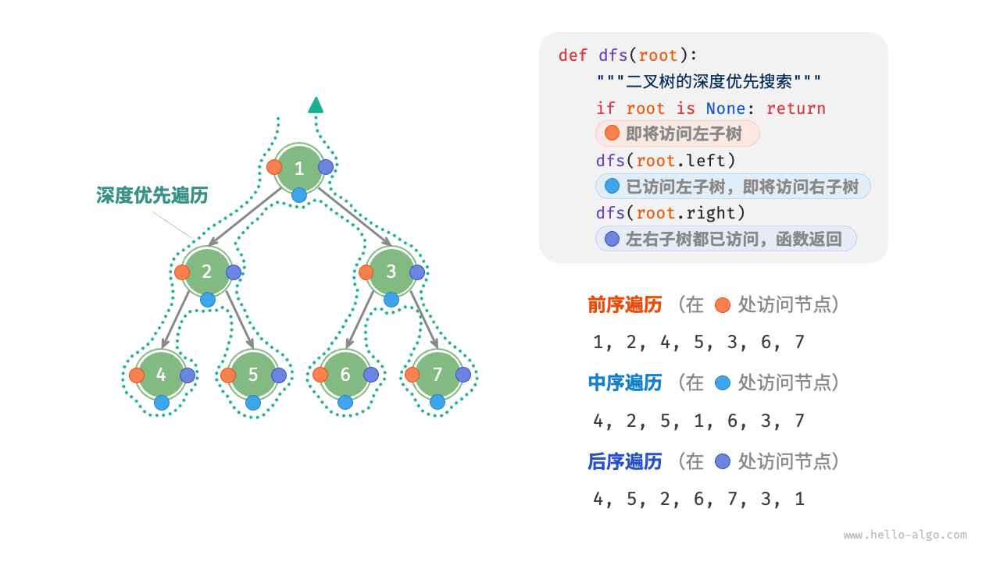

## 为什么要单独讲遍历

链表只有一个方向可走，数组可以从任意下标进入，而二叉树不同：**每个节点最多有三条边（父、左、右），从根出发存在多条可行路径**。同一条“访问所有节点”的需求，按不同顺序走会得到完全不同的序列，而这个顺序往往就是算法本身：

- 想按层级广度展开（例如“距我 1 跳、2 跳的邻居”），要的是**层序遍历**。
- 想把树压回线性序列（例如表达式求值、目录打包、前缀编码），要的是**前序 / 中序 / 后序遍历**。
- 想恢复一棵树（例如从序列化字符串重建），要靠**两种遍历序列的组合**。

从物理结构的角度来看，树是一种基于链表的数据结构，因此其遍历方式是通过指针逐个访问节点。然而，树是一种非线性数据结构，这使得遍历树比遍历链表更加复杂，需要借助搜索算法来实现。

二叉树常见的遍历方式包括层序遍历、前序遍历、中序遍历和后序遍历等。本文先把四种遍历的概念与图示讲清楚，再给出一份**可以直接 `python3 xxx.py` 跑起来**的完整实现（含建树工具、迭代写法、由遍历序列重建），最后推导复杂度并列出常见坑。

## 层序遍历

如下图所示，<u>层序遍历（level-order traversal）</u>从顶部到底部逐层遍历二叉树，并在每一层按照从左到右的顺序访问节点。

层序遍历本质上属于<u>广度优先遍历（breadth-first traversal）</u>，也称<u>广度优先搜索（breadth-first search, BFS）</u>，它体现了一种“一圈一圈向外扩展”的逐层遍历方式。与深度优先“先走到黑”相反，它把刚发现的节点排在队尾等待处理，因此**队列就是“发现顺序”的显式记录**。



### 代码实现

> 以下代码中的 `TreeNode` 类定义见《树与二叉树》，完整可运行版本见下文“一份可以直接跑的完整实现”。

广度优先遍历通常借助“队列”来实现。队列遵循“先进先出”的规则，而广度优先遍历则遵循“逐层推进”的规则，两者背后的思想是一致的。实现代码如下：

```python
from collections import deque


def level_order(root: TreeNode | None) -> list[int]:
    """层序遍历：队列里存的永远是“已发现、尚未处理”的节点"""
    if root is None:                 # 空树要提前返回，否则 queue[0] 会炸
        return []
    queue: deque[TreeNode] = deque([root])
    res: list[int] = []
    while queue:
        node = queue.popleft()       # 队首出队：最早发现的先处理
        res.append(node.val)
        if node.left is not None:
            queue.append(node.left)  # 左孩子排在右孩子之前 -> 层内从左到右
        if node.right is not None:
            queue.append(node.right)
    return res
```

只要把循环体改一改，就能得到“**按层输出**”的版本——这是分层渲染、逐层召回预算的基础：

```python
def level_order_by_layer(root: TreeNode | None) -> list[list[int]]:
    """层序遍历（按层分组）：每轮先固定“这一层有多少个节点”"""
    if root is None:
        return []
    res: list[list[int]] = []
    queue: deque[TreeNode] = deque([root])
    while queue:
        res.append([node.val for node in queue])   # 此刻队列里恰好是一整层
        for _ in range(len(queue)):                # 关键：长度要先固定住
            node = queue.popleft()
            if node.left is not None:
                queue.append(node.left)
            if node.right is not None:
                queue.append(node.right)
    return res
```

### 复杂度分析

- **时间复杂度为 O(n)** ：所有节点被访问一次，使用 O(n) 时间，其中 n 为节点数量。
- **空间复杂度为 O(n)** ：在最差情况下，即满二叉树时，遍历到最底层之前，队列中最多同时存在 (n + 1) / 2 个节点，占用 O(n) 空间。

## 前序、中序、后序遍历

相应地，前序、中序和后序遍历都属于<u>深度优先遍历（depth-first traversal）</u>，也称<u>深度优先搜索（depth-first search, DFS）</u>，它体现了一种“先走到尽头，再回溯继续”的遍历方式。

下图展示了对二叉树进行深度优先遍历的工作原理。**深度优先遍历就像是绕着整棵二叉树的外围“走”一圈**，在每个节点都会遇到三个位置，分别对应前序遍历、中序遍历和后序遍历。



“前 / 中 / 后”指的都是**根节点自己什么时候被访问**：递归前、两棵子树中间、两棵子树之后。

### 代码实现

深度优先搜索通常基于递归实现。三种遍历的差别只在“访问根节点”这一步放在递归前、递归中间还是递归后：

```python
def pre_order(root: TreeNode | None, out: list[int] | None = None) -> list[int]:
    """前序遍历：根 -> 左 -> 右"""
    out = [] if out is None else out      # 用累加器传参，避免列表相加带来的 O(n^2)
    if root is None:
        return out
    out.append(root.val)                  # 唯一的区别就这一行的位置
    pre_order(root.left, out)
    pre_order(root.right, out)
    return out


def in_order(root: TreeNode | None, out: list[int] | None = None) -> list[int]:
    """中序遍历：左 -> 根 -> 右（二叉搜索树中得到升序）"""
    out = [] if out is None else out
    if root is None:
        return out
    in_order(root.left, out)
    out.append(root.val)
    in_order(root.right, out)
    return out


def post_order(root: TreeNode | None, out: list[int] | None = None) -> list[int]:
    """后序遍历：左 -> 右 -> 根（子树算完才轮到根，天然适合自底向上聚合）"""
    out = [] if out is None else out
    if root is None:
        return out
    post_order(root.left, out)
    post_order(root.right, out)
    out.append(root.val)
    return out
```

> **【提示】**
> 深度优先搜索也可以基于迭代实现——把递归里的“系统调用栈”换成自己维护的显式栈即可，下一节就给了三份迭代版本。

下图展示了前序遍历二叉树的递归过程，其可分为“递”和“归”两个逆向的部分。

1. “递”表示开启新方法，程序在此过程中访问下一个节点。
2. “归”表示函数返回，代表当前节点已经访问完毕。

### 复杂度分析

- **时间复杂度为 O(n)** ：所有节点被访问一次，使用 O(n) 时间。
- **空间复杂度为 O(n)** ：在最差情况下，即树退化为链表时，递归深度达到 n ，系统占用 O(n) 栈帧空间。

## 一份可以直接跑的完整实现

下面这份脚本把前面的概念全部串起来：`build_from_level` 负责“用层序数组造一棵树”（方便你自己改数据做实验），其余是四种遍历的递归版与迭代版，末尾的断言用来验证两套写法结果一致。存成 `traversal.py` 直接 `python3 traversal.py` 即可运行，无第三方依赖。

```python
"""二叉树四种遍历：递归版 + 迭代版 + 遍历序列重建，可直接运行"""
from collections import deque


class TreeNode:
    """二叉树节点"""

    def __init__(self, val: int, left=None, right=None):
        self.val = val
        self.left = left
        self.right = right


def build_from_level(values: list[int | None]) -> TreeNode | None:
    """按层序序列建树（None 表示空位），与常见序列化格式一致"""
    it = iter(values)
    first = next(it, None)
    if first is None:
        return None
    root = TreeNode(first)
    queue = deque([root])
    while queue:
        node = queue.popleft()
        for side in ("left", "right"):        # 先左后右，保证层序稳定
            v = next(it, None)
            if v is None:
                continue                      # 空位：不建孩子，也不进队
            child = TreeNode(v)
            setattr(node, side, child)
            queue.append(child)
    return root


def pre_order_iter(root: TreeNode | None) -> list[int]:
    """前序遍历（显式栈）：先压右再压左，弹出顺序才是「根左右」"""
    res: list[int] = []
    stack: list[TreeNode] = [root] if root else []
    while stack:
        node = stack.pop()
        res.append(node.val)
        if node.right is not None:
            stack.append(node.right)
        if node.left is not None:
            stack.append(node.left)
    return res


def in_order_iter(root: TreeNode | None) -> list[int]:
    """中序遍历（显式栈）：一路向左压到底，弹出访问后转向右子树"""
    res: list[int] = []
    stack: list[TreeNode] = []
    cur = root
    while stack or cur is not None:
        while cur is not None:
            stack.append(cur)
            cur = cur.left
        cur = stack.pop()
        res.append(cur.val)
        cur = cur.right                        # 右子树交给下一轮继续「向左压」
    return res


def post_order_iter(root: TreeNode | None) -> list[int]:
    """后序遍历（双栈法）：按「根右左」收集，最后整体反转得到「左右根」"""
    if root is None:
        return []
    res: list[int] = []
    stack: list[TreeNode] = [root]
    while stack:
        node = stack.pop()
        res.append(node.val)
        if node.left is not None:
            stack.append(node.left)
        if node.right is not None:
            stack.append(node.right)
    res.reverse()
    return res


def build_from_pre_in(pre: list[int], ino: list[int]) -> TreeNode | None:
    """由前序 + 中序重建二叉树（前提：节点值互不相同）"""
    if not pre:
        return None
    root = TreeNode(pre[0])                    # 前序第一个一定是根
    i = ino.index(pre[0])                      # 根在中序里的位置 = 左子树大小
    root.left = build_from_pre_in(pre[1:1 + i], ino[:i])
    root.right = build_from_pre_in(pre[1 + i:], ino[i + 1:])
    return root


if __name__ == "__main__":
    #        1
    #      /   \
    #     2     3
    #    / \   /
    #   4   5 6
    t = build_from_level([1, 2, 3, 4, 5, 6, None])
    assert pre_order_iter(t) == [1, 2, 4, 5, 3, 6]
    assert in_order_iter(t) == [4, 2, 5, 1, 6, 3]
    assert post_order_iter(t) == [4, 5, 2, 6, 3, 1]
    # 前序 + 中序可以唯一定位一棵树（值唯一时）
    assert in_order(build_from_pre_in(pre_order_iter(t), in_order_iter(t))) == in_order_iter(t)
    print("四种遍历一致，重建成功")
```

**为什么“前序 + 中序”能重建，而“前序 + 后序”不能？** 前序给出根，中序用根把序列切成“左子树 | 右子树”两段，两边合起来刚好递归确定整棵树。前序和后序都是“根在端点”，切不开——它给出的两棵子树大小未知，因此同一组前序 + 后序可以对应多棵不同形状的树。

## 四种遍历分别在说什么

| 遍历 | 顺序 | 第一个 / 最后一个 | 典型语义 |
| ---- | ---- | ----------------- | -------- |
| 层序 | 逐层、层内从左到右 | 首个是根，末个是最后一层最右 | 距离、分层、广度展开 |
| 前序 | 根 → 左 → 右 | 首个是根 | 复制树、序列化、先序编码 |
| 中序 | 左 → 根 → 右 | 二叉搜索树中首个是最小值 | 取有序序列、求排名 |
| 后序 | 左 → 右 → 根 | 末个是根 | 自底向上聚合、删除/释放、表达式求值 |

判断自己该用哪一个，有个朴素的问法：**这个节点的结论，需不需要先知道它两个孩子的结论？** 需要 → 后序；不需要、甚至要先用父节点信息裁孩子 → 前序；只关心“从小到大” → 中序；关心“离我多远” → 层序。

## 复杂度推导

**时间 O(n)** ：四种遍历都满足递推式 T(n) = T(k) + T(n − k) + O(1)（k 为左子树大小），展开即 T(n) = O(1) × n + O(n) = O(n) 。注意层序遍历同样是 O(n) ：每个节点入队一次、出队一次，每条边被检查一次，合计 2n − 1 次队列操作。

**空间 O(h) 或 O(n)** ：

- 递归版深度优先的空间是**调用栈深度**，即树高 h 。平衡时 h = ⌈log₂(n + 1)⌉ − 1 ≈ O(log n) ；退化成链表时 h = n − 1 = O(n) 。这说明“DFS 省空间”只在树平衡时成立。
- 层序遍历的空间是**队列峰值**。第 i 层最多 2^(i−1) 个节点，满二叉树最后一层有 (n + 1) / 2 个节点，因此峰值 Θ(n) ，而且这个峰值出现在“还没开始出完最后一层”时，无法靠提前退出规避。
- 结论很有工程价值：**同一棵树，层序和深度优先的空间曲线是反的**——又矮又宽的树（组织架构图、目录浅层高扇出）用 DFS 更省，又高又瘦的树用 BFS 更省，但后者本来就该怀疑它是不是链表。

`build_from_pre_in` 是多出来的代价：每层做一次 `ino.index(...)` 线性扫描，最坏 O(n²) 。把“值 → 中序下标”预先做成字典，可降回 O(n) ；这也是“用空间换查找”的常规操作，见《哈希表》。

## 常见坑

1. **忘记空树分支**。`root is None` 时若直接 `queue.append(root)` ，后面 `node.val` 就 `AttributeError` ；递归版则是把 `None` 当“递归出口”，缺了它同样爆错。
2. **层序按层分组时在 `for node in queue` 中途改队列**。必须先用一个固定数字（`range(len(queue))` ）把“这一层的节点数”钉死，否则循环边界会一边跑一边变。
3. **迭代版前序的压栈顺序**。栈是后进先出，想“先访问左”就必须**后压左**（先压右）。中序迭代版更容易错在 `cur = cur.right` 之后忘了回到外层 `while stack or cur` 的条件判断。
4. **把“遍历”和“递归”划等号**。Python 默认递归上限 1000 层，一条 20 万节点的斜树会直接 `RecursionError` ，显式栈版本没有这个问题。
5. **累加器写成返回值相加**。`return pre(left) + [root.val] + pre(right)` 每次拼接都拷贝整个列表，总代价 O(n²) 。要么传入 `out` 列表，要么用 `yield` 生成器（`yield from` 天然 O(1) 追加）。
6. **同一个 `out=[]` 写进函数签名**。`def f(node, out=[])` 的默认列表是所有调用共享的对象，多次调用会互相污染——这是 Python 可变默认参数的经典事故，正确写法是 `out=None` 再在函数体内新建。
7. **中序遍历不等于有序**。只有二叉搜索树的中序才是升序，普通二叉树中序只是“左根右”的形状序。混淆这两者在《二叉搜索树》里会再踩一次。
8. **用遍历序列重建时值可重复**。有重复值时“前序 + 中序”不再唯一确定一棵树，题目通常要求“值互不相同”，工程上则应改用带空位标记的层序序列化（本文 `build_from_level` 的思路）。
9. **改结构的同时在遍历**。遍历过程中删除/挂接节点会让队列里的引用指向已脱离的节点。需要“按条件重排”时，先收集、再重建。

## 工程应用：表达式树与自底向上聚合

后序遍历的价值在于：**访问到某个节点时，它的整棵子树都已经算完了**。编译器与解释器里的表达式树求值、抽象语法树（AST）检查、目录大小统计、组织架构的人员汇总，全是同一个形状。下面这段可直接运行，构造 `(3 + 5) * (9 - 2)` 的表达式树并求值：

```python
class ExprNode:
    """表达式树节点：内部节点存运算符，叶节点存数字"""

    def __init__(self, val, left=None, right=None):
        self.val = val
        self.left = left
        self.right = right


def eval_expr(node: ExprNode) -> float:
    """后序遍历求值：先递归算完两棵子树，再应用当前运算符"""
    if node.left is None and node.right is None:
        return node.val                       # 叶节点即操作数
    a, b = eval_expr(node.left), eval_expr(node.right)
    ops = {"+": a + b, "-": a - b, "*": a * b, "/": a / b}
    return ops[node.val]


tree = ExprNode("*", ExprNode("+", ExprNode(3), ExprNode(5)),
                ExprNode("-", ExprNode(9), ExprNode(2)))
print(eval_expr(tree))                        # 56
```

同一套骨架换个聚合函数就是别的系统：把 `+ - * /` 换成“求子树最大深度”得到目录树的层级统计，换成“累加 token 数”得到《前缀和与差分》里那棵会话树的预算账本，换成“合并子节点的类型集合”就是 TypeScript 类型推导里的联合类型收窄。反过来，**层序遍历在工程里的对应物是“有界扩散”**：给邻居扩展设一层层预算（第 1 跳取多少个、第 2 跳取多少个），知识图谱问答与社交推荐里的“最多 N 度关系”都是一段带深度上限的 BFS。

前序遍历则是**序列化的天然格式**：`[1, 2, 4, None, None, 5, None, None, 3, 6, None, None, None]` 这样“根左右 + 空位标记”的串可以无歧义地重建二叉树，比层序数组更省字符。数据库 WAL、消息队列的树形快照、模型权重清单都采用类似写法。

## 延伸阅读

- 《树与二叉树》：`TreeNode` 定义、完全二叉树 / 完美二叉树等类型与二叉树退化，是本文的前置。
- 《二叉搜索树》：中序遍历升序这一性质的用武之地，以及查找/插入/删除的 O(log n) 推导。
- 《堆》：完全二叉树 + 数组表示，是“层序编号”最节省内存的落地形式。
- 《图的遍历（DFS/BFS）》：把本文的队列/栈/visited 三件套推广到一般有环图。
- 《递归入门》：调用栈的“递”与“归”，解释了为什么深度优先的空间是 O(树高) 。
- hello-algo《二叉树遍历》一节与《从层序遍历重建二叉树》一节，含逐步动画演示。

---

> **来源**：本文转载自 [二叉树遍历](https://raw.githubusercontent.com/krahets/hello-algo/main/docs/chapter_tree/binary_tree_traversal.md)，作者 krahets，许可 CC BY-NC-SA 4.0。抓取于 2026-09-13。
> 原文中指向仓库完整代码的引用块已省略，完整可运行 Python 代码见 [hello-algo/codes/python](https://github.com/krahets/hello-algo/tree/main/codes/python)；本文“一份可以直接跑的完整实现”“复杂度推导”“常见坑”“工程应用”各节及全部新增代码为本站补充编写，已在 CPython 3.12 下运行验证。
