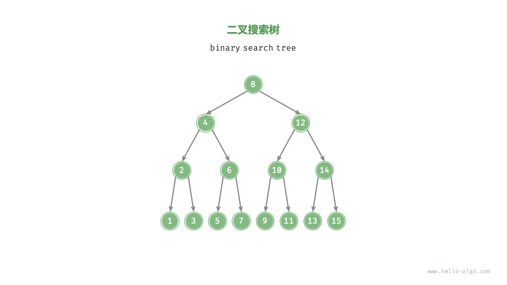
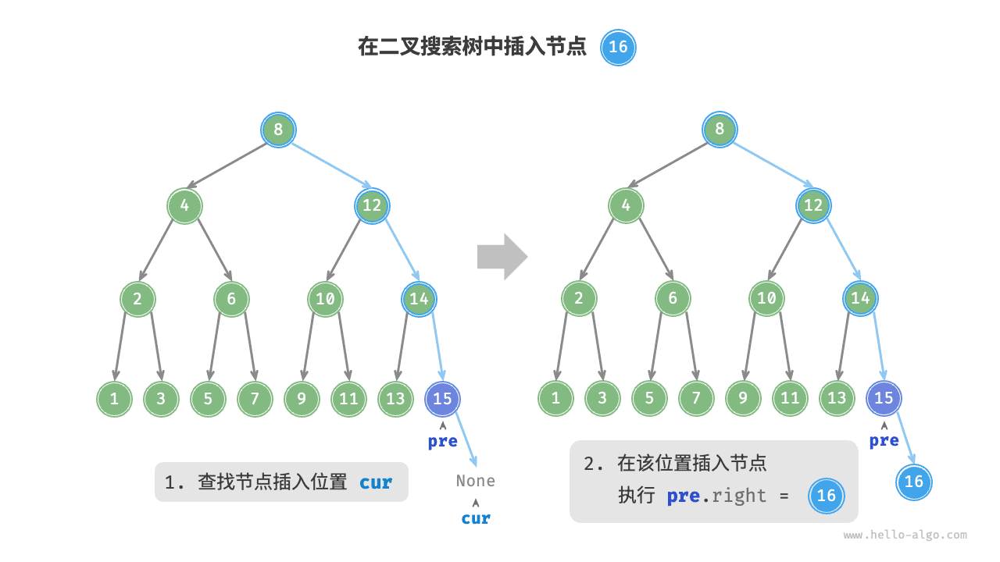
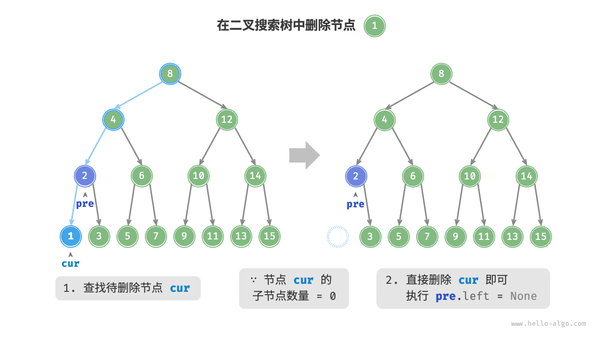
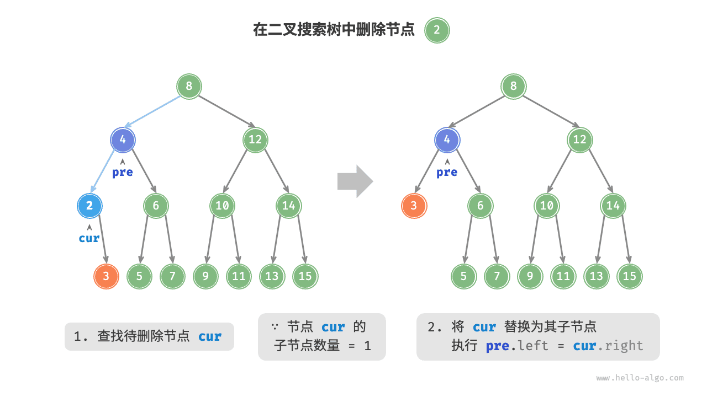
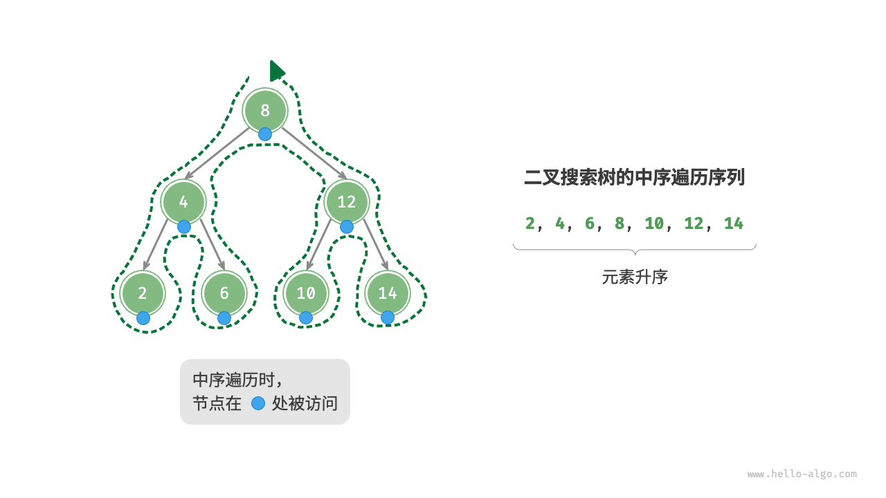
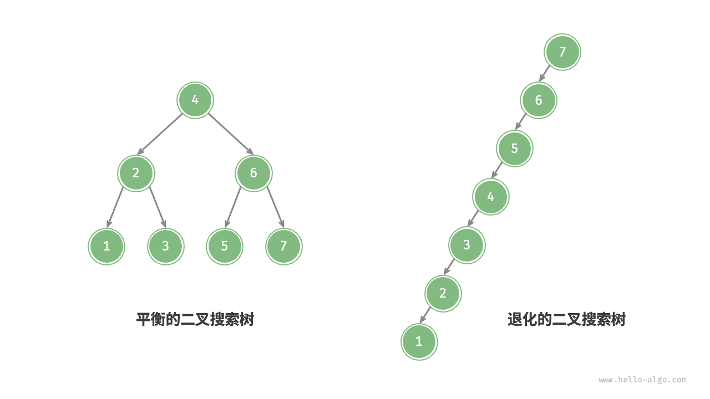

## 为什么需要二叉搜索树

要在一堆数据里“查一个值、查一个范围、按顺序取出、算排名”，可选的手段无非那么几种：

| 手段 | 查找 | 插入 | 范围查询 / 有序输出 |
| ---- | ---- | ---- | ------------------- |
| 无序数组 | O(n) | O(1) | O(n log n)（要先排序） |
| 有序数组 + 二分 | O(log n) | O(n)（要挪元素） | O(log n + k) |
| 哈希表 | O(1) 平均 | O(1) 平均 | **做不到**：无序、无法比大小 |
| 二叉搜索树 | O(h) | O(h) | O(h + k) ，天然有序 |

**哈希表快，但它只回答“在不在”，回答不了“第 3 小的键是谁”“[10, 50) 区间里有哪些键”** 。有序数组能二分，但插入要挪一半元素。二叉搜索树（BST）正是同时保住这三件事的结构：**查找、插入、删除都是树高阶，而且中序遍历天然给出升序** 。数据库索引、`TreeMap` / `std::map` 、内存表的有序段、区间调度、排行榜，背后都是它或它的变体。

代价只有一条，也是最容易被忽略的一条：**这个 O(log n) 依赖于树保持平衡，而输入顺序你控制不了** 。下文会给出实测数据。

## 定义

如下图所示，<u>二叉搜索树（binary search tree）</u>满足以下条件。

1. 对于根节点，左子树中所有节点的值 < 根节点的值 < 右子树中所有节点的值。
2. 任意节点的左、右子树也是二叉搜索树，即同样满足条件 `1.` 。



注意这个定义说的是“**子树整体**”而不是“孩子节点”，因此只在父节点上比较大小是不够的——很多人写出的“二叉搜索树”其实只满足“孩子比父小 / 大”，一旦做区间查询就会出错。

## 完整可运行的实现

下面这份实现把查找、插入、删除、第 k 小、区间查询放在一起，全部只依赖标准库。删除用递归（结构最清晰），查找与插入用迭代（省掉栈开销）。存成 `bst.py` 直接运行。

```python
import random
import time
from collections import deque


class TreeNode:
    """二叉搜索树节点"""

    def __init__(self, val: int):
        self.val = val
        self.left: TreeNode | None = None
        self.right: TreeNode | None = None


class BinarySearchTree:
    """二叉搜索树：查找 / 插入 / 删除 / 中序遍历 / 第 k 小 / 区间查询"""

    def __init__(self):
        self._root: TreeNode | None = None
        self._size = 0

    def search(self, num: int) -> TreeNode | None:
        """迭代查找：每轮排除一半，代价 = 树高"""
        cur = self._root
        while cur is not None:
            if cur.val < num:
                cur = cur.right          # 目标在右子树
            elif cur.val > num:
                cur = cur.left           # 目标在左子树
            else:
                return cur               # 命中
        return None                      # 越过叶子仍未命中

    def contains(self, num: int) -> bool:
        return self.search(num) is not None

    def insert(self, num: int) -> bool:
        """迭代插入；重复值不插入（返回 False）"""
        if self._root is None:
            self._root = TreeNode(num)
            self._size = 1
            return True
        cur, pre = self._root, None
        while cur is not None:
            if cur.val == num:
                return False             # 二叉搜索树不含重复键
            pre = cur                    # pre 始终停在 cur 的父节点上
            if num > cur.val:
                cur = cur.right
            else:
                cur = cur.left
        node = TreeNode(num)             # cur 为 None 时，插入位置就是 pre 的空缺侧
        if pre.val < num:
            pre.right = node
        else:
            pre.left = node
        self._size += 1
        return True

    def minimum(self) -> int:
        """最左节点即最小值：等价于「中序遍历的第一个元素」"""
        if self._root is None:
            raise ValueError("空树")
        cur = self._root
        while cur.left is not None:
            cur = cur.left
        return cur.val

    def __len__(self) -> int:
        return self._size
```

删除是三个操作里唯一有“分类讨论”的，按待删节点的度分三种情况。**下面两块代码仍是 `BinarySearchTree` 类里的方法** ，与上一块按顺序拼起来就是完整可运行的一份文件：

```python
    def remove(self, num: int) -> bool:
        """删除键值；度为 2 时用「右子树最小值」覆盖，再递归删那个后继"""
        self._root, removed = self._remove(self._root, num)
        if removed:
            self._size -= 1
        return removed

    def _remove(self, node: TreeNode | None, num: int):
        """返回 (新的子树根, 是否删掉了东西)：用返回值挂接，避免手工维护父指针"""
        if node is None:
            return None, False
        if num < node.val:
            node.left, removed = self._remove(node.left, num)
            return node, removed
        if num > node.val:
            node.right, removed = self._remove(node.right, num)
            return node, removed
        # 命中。度为 0 或 1：直接用非空的那侧顶上来（含两边都空）
        if node.left is None:
            return node.right, True
        if node.right is None:
            return node.left, True
        # 度为 2：找右子树最小者（中序后继）接管位置
        successor = node.right
        while successor.left is not None:
            successor = successor.left
        node.val = successor.val
        node.right, _ = self._remove(node.right, successor.val)
        return node, True
```

有序性才是二叉搜索树相对哈希表的优势所在，下面三个查询都建立在“中序升序”之上：

```python
    def inorder(self) -> list[int]:
        """中序遍历（显式栈）：得到升序序列，不会爆栈"""
        res: list[int] = []
        stack: list[TreeNode] = []
        cur = self._root
        while stack or cur is not None:
            while cur is not None:       # 一路向左压到底
                stack.append(cur)
                cur = cur.left
            cur = stack.pop()
            res.append(cur.val)          # 弹出一个即输出一个
            cur = cur.right
        return res

    def kth_smallest(self, k: int) -> int:
        """第 k 小（k 从 1 起）：中序走到第 k 个就停，O(h + k)"""
        if k < 1:
            raise ValueError("k 必须 >= 1")
        stack: list[TreeNode] = []
        cur, seen = self._root, 0
        while stack or cur is not None:
            while cur is not None:
                stack.append(cur)
                cur = cur.left
            cur = stack.pop()
            seen += 1
            if seen == k:
                return cur.val
            cur = cur.right
        raise ValueError("k 超过元素个数")

    def range_search(self, lo: int, hi: int) -> list[int]:
        """区间查询：靠有序性剪枝，只走可能落在 [lo, hi] 的子树"""
        res: list[int] = []

        def walk(node: TreeNode | None) -> None:
            if node is None:
                return
            if lo < node.val:
                walk(node.left)          # 左子树可能还有合格值
            if lo <= node.val <= hi:
                res.append(node.val)
            if node.val < hi:
                walk(node.right)

        walk(self._root)
        return res

    def height(self) -> int:
        """树高：用显式栈——退化成 2000 长的链时，递归版会 RecursionError"""
        best, stack = 0, [(self._root, 1)]
        while stack:
            node, depth = stack.pop()
            if node is None:
                continue
            best = max(best, depth)
            stack.append((node.left, depth + 1))
            stack.append((node.right, depth + 1))
        return best


def level_order(root: TreeNode | None) -> list[list[int]]:
    """层序打印，方便看清树形（见《二叉树遍历》）"""
    if root is None:
        return []
    res, q = [], deque([root])
    while q:
        res.append([n.val for n in q])
        for _ in range(len(q)):
            n = q.popleft()
            if n.left:
                q.append(n.left)
            if n.right:
                q.append(n.right)
    return res


if __name__ == "__main__":
    t = BinarySearchTree()
    for v in [8, 4, 12, 2, 6, 10, 14, 5, 7]:
        t.insert(v)
    print("中序（升序）", t.inorder())        # [2, 4, 5, 6, 7, 8, 10, 12, 14]
    print("按层", level_order(t._root))      # [[8], [4, 12], [2, 6, 10, 14], [5, 7]]
    print("最小值", t.minimum(), "长度", len(t), "高度", t.height())
    print("第 3 小", t.kth_smallest(3))      # 5
    print("区间 [5, 11]", t.range_search(5, 11))
    t.remove(4)                              # 4 有两个孩子，会被后继 5 顶替
    print("删除 4 后", t.inorder(), t.contains(4))
    print("重复插入返回", t.insert(8))       # False

    # 退化实验：同一批数据，只是入树顺序不同
    seq_sorted = list(range(1, 2001))
    seq_random = random.Random(0).sample(range(1, 2001), 2000)
    for name, seq in [("顺序", seq_sorted), ("随机", seq_random)]:
        bt = BinarySearchTree()
        start = time.perf_counter()
        for v in seq:
            bt.insert(v)
        insert_cost = time.perf_counter() - start
        start = time.perf_counter()
        for _ in range(200):
            bt.search(1999)
        find_cost = time.perf_counter() - start
        print(f"{name}插入 2000 个：树高 {bt.height()} ，插入 {insert_cost*1000:.1f} ms"
              f" ，200 次查找 {find_cost*1000:.1f} ms")
```

在 CPython 3.12 / 一台普通笔记本上，最后两行的典型输出是：

```text
顺序插入 2000 个：树高 2000 ，插入 71.3 ms ，200 次查找 6.8 ms
随机插入 2000 个：树高 22 ，插入 1.6 ms ，200 次查找 0.0 ms
```

同一批数据、同一个实现，**光是“按序插入”这一条就让树高从 22 涨到 2000 ，插入慢 40 多倍** 。这就是下一节要算清楚的账。

## 三个操作的图解

### 查找节点

给定目标节点值 `num` ，可以根据二叉搜索树的性质来查找。如下图所示，从根节点出发循环比较 `cur.val` 与 `num` ：

- 若 `cur.val < num` ，说明目标节点在 `cur` 的右子树中，因此执行 `cur = cur.right` 。
- 若 `cur.val > num` ，说明目标节点在 `cur` 的左子树中，因此执行 `cur = cur.left` 。
- 若 `cur.val = num` ，说明找到目标节点，跳出循环并返回该节点。

二叉搜索树的查找操作与二分查找算法的工作原理一致，都是每轮排除一半情况。循环次数最多为二叉树的高度，当二叉树平衡时使用 O(log n) 时间（见《二分查找》）。

### 插入节点

为了保持“左子树 < 根节点 < 右子树”的性质，插入分两步：**沿查找路径下降到空位，把新节点挂在那里** 。



实现上要注意两点：二叉搜索树不允许重复键，已存在就直接返回；以及必须用一个 `pre` 变量记住“上一次循环走过的节点”（也就是当前节点的父节点），否则下降到 `None` 时你不知道该把新节点挂给谁（这也是可以把删除改成递归的动机——递归用返回值代替了 `pre` ）。

### 删除节点

先查找、再删除，且要按待删节点的度分三种情况：

- 度为 0（叶节点）：直接摘掉。
- 度为 1：用唯一的孩子顶替它。





- 度为 2：不能直接删，否则两棵子树同时失去父节点。用一个“值介于两棵子树之间”的节点来顶替——**只能是右子树的最小值（中序后继）或左子树的最大值（中序前驱）** 。选定后继后，把它的值写进被删节点，再去右子树递归删掉那个后继（后继的度必然 ≤ 1 ，问题降级）。

**为什么后继一定在右子树最左** ：右子树里所有值都大于被删节点，而“最左”意味着一路取更小者，因此它是不小于被删值的元素里最小的那个，恰好是中序遍历里的下一个。

### 中序遍历有序

如下图所示，中序遍历遵循“左 → 根 → 右”，而二叉搜索树满足“左子树 < 根节点 < 右子树”，两者叠加得到一个重要性质：**二叉搜索树的中序遍历序列是升序的** 。



利用这个性质，获取全部有序数据只需 O(n) ，无须再排序；取第 k 小、求排名、做区间统计，都是“带剪枝或带计数的中序遍历”。

## 复杂度推导

设节点数 n 、树高 h 。

- **查找 / 插入 / 删除的时间都是 O(h)** 。删除略贵：找后继还要再走一次到子树底部的路，仍是 O(h) 。
- **平衡时 h = Θ(log n)** ：理想递推 `T(n) = T(n/2) + O(1)` ，展开得 `O(log n)` ；这就是“每轮排除一半”的形式化说法。
- **退化时 h = Θ(n)** ：按序插入时每个新节点都落在最右侧，树变成链表；上表实测的“树高 2000”正是这个情形。**二叉搜索树只是“可能”O(log n) ，不是“保证”** ，这是它与哈希表最大的区别（哈希表也“可能”退化，但通过负载因子 + 扩容把风险摊掉了）。
- **中序 / 全量遍历 O(n)** 、**第 k 小 O(h + k)** 、**区间查询 O(h + k)** （k 为结果数）——后两条是哈希表给不出的能力。
- **空间** ：迭代版 O(1) 额外空间，递归版 O(h) 调用栈。

**为什么工程上不完全信任手写 BST** ：删除序列会让树形变差（Shoreen 的删除研究表明随机删除会持续增大平均树高），而“按主键递增写入”是数据库与日志系统最典型的输入模式。下图就是退化过程：不断插入更大的值，每个新节点都挂在最右侧。



所以真正上线的结构一定自带平衡机制：AVL / 红黑树靠旋转，跳表靠随机层高，B / B+ 树靠多分叉把 h 压到个位数（一个 4 叉的 B+ 树放 1000 万键只需 3~4 层），LSM 树干脆放弃有序树改用“有序内存表 + 多层有序文件”。

## 常见坑

1. **只在父子之间比较**。判定一棵树是不是二叉搜索树，必须检查“整棵左子树 < 根 < 整棵右子树”，正确做法是自顶向下传 `(lo, hi)` 区间；只比 `node.left.val < node.val` 会漏掉“右子树里藏着个比根小的祖先级错误”。
2. **允许重复键却不约定放哪**。要么明确“重复值计数 +1”（像 `Counter` 那样），要么统一放右侧，否则删除时会找不到原本插进去的那个键。
3. **删除度为 2 的节点时选错替代者**。中序后继 = 右子树一路向左到底，中序前驱 = 左子树一路向右到底；只能在这两者里选一个，混着用（例如拿右子树最大值来替换）会破坏有序性且**不报错**。
4. **递归版在退化的树上爆栈**。Python 默认 1000 层，一条 2000 长的斜链会让 `_remove` / `height` 直接 `RecursionError` 。上文的 `height` 已改成显式栈；删除若想避免递归，需要“找前驱 + 重连”的迭代写法。
5. **把中序遍历当成“任意二叉树都升序”**。只有二叉搜索树成立；普通二叉树的中序只是形状序（见《二叉树遍历》）。
6. **以为 `sorted` + `bisect` 能替它**：`bisect.insort` 查找 O(log n) 但**插入要挪动元素，仍是 O(n)** ；只在“读多写少”时才划算（见《排序惯用法》）。
7. **忘记 Python 没有内置平衡树**。标准库不提供 `TreeMap` / 有序字典（`dict` 只保插入序）。需要“有序 + 可变 + 排名”时，用第三方 `sortedcontainers.SortedList` （BSD-3-Clause），或改用堆（只取极值，见《堆》）。
8. **按序灌数据还期待 O(log n)** 。最典型的隐形性能事故。批量导入前先打乱顺序，或直接换 B+ 树 / 跳表。
9. **遍历时改结构**。删除节点会改指针，正在跑的显式中序栈可能持有已被摘掉的节点；要“按条件删除”就先收集键再逐个 `remove` 。

## 工程应用：从索引到“第 k 个是谁”

- **数据库与存储引擎的索引**。B+ 树就是“多路平衡二叉搜索树”的近亲：内部节点做路由、叶子层用双向链表串起来，于是“范围扫描 = 定位 + 顺链读取”，这与本文的 `range_search` 一模一样。InnoDB 的主键索引是聚簇索引，因此“按主键插入必须递增”与“随机 UUID 主键导致页分裂”这类工程常识，本质就是上文的退化实验换了个尺度重演（见《数据库与向量存储》）。
- **有序内存表**。LSM 结构的 MemTable 通常用跳表实现，接口就是“按 key 有序 + 支持范围扫描 + 高频插入”，与 `BinarySearchTree` 的职责一致；内存表写满后整段导出成有序文件，再由后台做多路归并（见《排序惯用法》的外部排序）。
- **区间与排名类业务**。求“中位数 / 分位数”、滑动窗口里的第 k 小、“我这个分数排在第几名”，都是 BST 的经典用途（常用“每个节点记录子树大小”的 order-statistic 变体，把 `kth_smallest` 从 O(h + k) 降到 O(h)）。相比之下，堆只能高效回答“当前最值”，回答不了第 k 小和区间计数（见《Top-K 与堆：召回重排里的取前 N 个》）。
- **表达式与语法树、决策路径**。规则引擎把条件按“阈值二分”组织成 BST，命中判定从逐条线性比对降为 O(log 规则数)；决策树的分裂节点也是同样的形状。
- **RAG 里的元数据过滤**。向量检索命中 Top-K 之后，常常还要按“时间 > 上周、分数 ∈ [0.7, 0.95]”做二次筛选；这类“有序 + 区间”的过滤，用这里的 `range_search` 思路比把候选全丢进 Python 循环要省一个量级（背景见《向量相似度与 HNSW 近邻图》）。

## 延伸阅读

- 《树与二叉树》：节点定义、完全 / 完美二叉树与退化情形。
- 《二叉树遍历》：四种遍历的可运行实现，本文的 `inorder` 用了其中的迭代中序。
- 《堆》：只保证“父 ≤ 子”的弱化版本，换来数组存储与 O(log n) 取极值。
- 《二分查找》：同一“每轮砍一半”的逻辑在数组上的形态。
- 《排序惯用法：sorted、key 与稳定性》：`sorted` + `bisect` 与 BST 的取舍。
- 《Top-K 与堆：召回重排里的取前 N 个》：BST 与堆各自擅长什么。
- [维基百科 Binary search tree](https://en.wikipedia.org/wiki/Binary_search_tree)（CC BY-SA 4.0）：删除的三种情形与复杂度证明；[Self-balancing binary search tree](https://en.wikipedia.org/wiki/Self-balancing_binary_search_tree) 汇总 AVL / 红黑 / 跳表的平衡策略。

---

> **来源**：本文转载自 [二叉搜索树](https://raw.githubusercontent.com/krahets/hello-algo/main/docs/chapter_tree/binary_search_tree.md)，作者 krahets，许可 CC BY-NC-SA 4.0。抓取于 2026-09-13。
> 原文中指向仓库完整代码的引用块已省略，完整可运行 Python 代码见 [hello-algo/codes/python](https://github.com/krahets/hello-algo/tree/main/codes/python)；本文“为什么需要二叉搜索树”“完整可运行的实现”“复杂度推导”“常见坑”“工程应用”各节及全部新增代码为本站补充编写，已在 CPython 3.12 下运行验证，删除与退化的实测数据即来自上文脚本。
