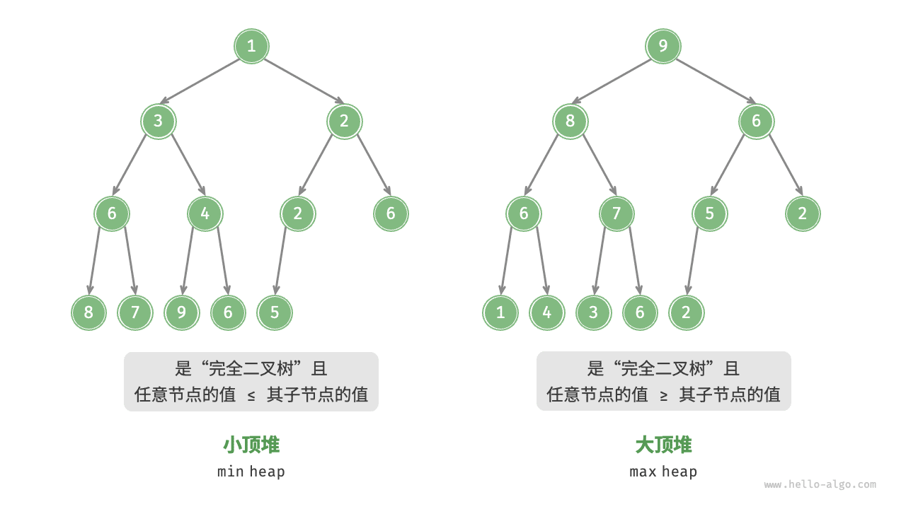
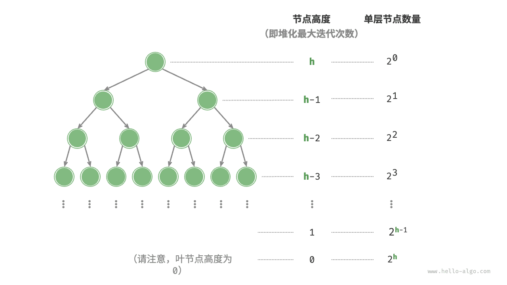

## 堆


<u>堆（heap）</u>是一种满足特定条件的完全二叉树，主要可分为两种类型，如下图所示。

- <u>小顶堆（min heap）</u>：任意节点的值 ≤ 其子节点的值。
- <u>大顶堆（max heap）</u>：任意节点的值 ≥ 其子节点的值。



堆作为完全二叉树的一个特例，具有以下特性。

- 最底层节点靠左填充，其他层的节点都被填满。
- 我们将二叉树的根节点称为“堆顶”，将底层最靠右的节点称为“堆底”。
- 对于大顶堆（小顶堆），堆顶元素（根节点）的值是最大（最小）的。

### 堆的常用操作

需要指出的是，许多编程语言提供的是<u>优先队列（priority queue）</u>，这是一种抽象的数据结构，定义为具有优先级排序的队列。

实际上，**堆通常用于实现优先队列，大顶堆相当于元素按从大到小的顺序出队的优先队列**。从使用角度来看，我们可以将“优先队列”和“堆”看作等价的数据结构。因此，本书对两者不做特别区分，统一称作“堆”。

堆的常用操作见下表，方法名需要根据编程语言来确定。

**表：&nbsp; 堆的操作效率**

| 方法名      | 描述                                             | 时间复杂度  |
| ----------- | ------------------------------------------------ | ----------- |
| `push()`    | 元素入堆                                         | O(log n) |
| `pop()`     | 堆顶元素出堆                                     | O(log n) |
| `peek()`    | 访问堆顶元素（对于大 / 小顶堆分别为最大 / 小值） | O(1)      |
| `size()`    | 获取堆的元素数量                                 | O(1)      |
| `isEmpty()` | 判断堆是否为空                                   | O(1)      |

在实际应用中，我们可以直接使用编程语言提供的堆类（或优先队列类）。

类似于排序算法中的“从小到大排列”和“从大到小排列”，我们可以通过设置一个 `flag` 或修改 `Comparator` 实现“小顶堆”与“大顶堆”之间的转换。代码如下所示：


```python title="heap.py"
# 初始化小顶堆
min_heap, flag = [], 1
# 初始化大顶堆
max_heap, flag = [], -1

# Python 的 heapq 模块默认实现小顶堆
# 考虑将“元素取负”后再入堆，这样就可以将大小关系颠倒，从而实现大顶堆
# 在本示例中，flag = 1 时对应小顶堆，flag = -1 时对应大顶堆

# 元素入堆
heapq.heappush(max_heap, flag * 1)
heapq.heappush(max_heap, flag * 3)
heapq.heappush(max_heap, flag * 2)
heapq.heappush(max_heap, flag * 5)
heapq.heappush(max_heap, flag * 4)

# 获取堆顶元素
peek: int = flag * max_heap[0] # 5

# 堆顶元素出堆
# 出堆元素会形成一个从大到小的序列
val = flag * heapq.heappop(max_heap) # 5
val = flag * heapq.heappop(max_heap) # 4
val = flag * heapq.heappop(max_heap) # 3
val = flag * heapq.heappop(max_heap) # 2
val = flag * heapq.heappop(max_heap) # 1

# 获取堆大小
size: int = len(max_heap)

# 判断堆是否为空
is_empty: bool = not max_heap

# 输入列表并建堆
min_heap: list[int] = [1, 3, 2, 5, 4]
heapq.heapify(min_heap)
```

**▶ [可视化运行](https://pythontutor.com/render.html#code=import%20heapq%0A%0A%22%22%22Driver%20Code%22%22%22%0Aif%20__name__%20%3D%3D%20%22__main__%22%3A%0A%20%20%20%20%23%20%E5%88%9D%E5%A7%8B%E5%8C%96%E5%B0%8F%E9%A1%B6%E5%A0%86%0A%20%20%20%20min_heap,%20flag%20%3D%20%5B%5D,%201%0A%20%20%20%20%23%20%E5%88%9D%E5%A7%8B%E5%8C%96%E5%A4%A7%E9%A1%B6%E5%A0%86%0A%20%20%20%20max_heap,%20flag%20%3D%20%5B%5D,%20-1%0A%20%20%20%20%0A%20%20%20%20%23%20Python%20%E7%9A%84%20heapq%20%E6%A8%A1%E5%9D%97%E9%BB%98%E8%AE%A4%E5%AE%9E%E7%8E%B0%E5%B0%8F%E9%A1%B6%E5%A0%86%0A%20%20%20%20%23%20%E8%80%83%E8%99%91%E5%B0%86%E2%80%9C%E5%85%83%E7%B4%A0%E5%8F%96%E8%B4%9F%E2%80%9D%E5%90%8E%E5%86%8D%E5%85%A5%E5%A0%86%EF%BC%8C%E8%BF%99%E6%A0%B7%E5%B0%B1%E5%8F%AF%E4%BB%A5%E5%B0%86%E5%A4%A7%E5%B0%8F%E5%85%B3%E7%B3%BB%E9%A2%A0%E5%80%92%EF%BC%8C%E4%BB%8E%E8%80%8C%E5%AE%9E%E7%8E%B0%E5%A4%A7%E9%A1%B6%E5%A0%86%0A%20%20%20%20%23%20%E5%9C%A8%E6%9C%AC%E7%A4%BA%E4%BE%8B%E4%B8%AD%EF%BC%8Cflag%20%3D%201%20%E6%97%B6%E5%AF%B9%E5%BA%94%E5%B0%8F%E9%A1%B6%E5%A0%86%EF%BC%8Cflag%20%3D%20-1%20%E6%97%B6%E5%AF%B9%E5%BA%94%E5%A4%A7%E9%A1%B6%E5%A0%86%0A%20%20%20%20%0A%20%20%20%20%23%20%E5%85%83%E7%B4%A0%E5%85%A5%E5%A0%86%0A%20%20%20%20heapq.heappush%28max_heap,%20flag%20*%201%29%0A%20%20%20%20heapq.heappush%28max_heap,%20flag%20*%203%29%0A%20%20%20%20heapq.heappush%28max_heap,%20flag%20*%202%29%0A%20%20%20%20heapq.heappush%28max_heap,%20flag%20*%205%29%0A%20%20%20%20heapq.heappush%28max_heap,%20flag%20*%204%29%0A%20%20%20%20%0A%20%20%20%20%23%20%E8%8E%B7%E5%8F%96%E5%A0%86%E9%A1%B6%E5%85%83%E7%B4%A0%0A%20%20%20%20peek%20%3D%20flag%20*%20max_heap%5B0%5D%20%23%205%0A%20%20%20%20%0A%20%20%20%20%23%20%E5%A0%86%E9%A1%B6%E5%85%83%E7%B4%A0%E5%87%BA%E5%A0%86%0A%20%20%20%20%23%20%E5%87%BA%E5%A0%86%E5%85%83%E7%B4%A0%E4%BC%9A%E5%BD%A2%E6%88%90%E4%B8%80%E4%B8%AA%E4%BB%8E%E5%A4%A7%E5%88%B0%E5%B0%8F%E7%9A%84%E5%BA%8F%E5%88%97%0A%20%20%20%20val%20%3D%20flag%20*%20heapq.heappop%28max_heap%29%20%23%205%0A%20%20%20%20val%20%3D%20flag%20*%20heapq.heappop%28max_heap%29%20%23%204%0A%20%20%20%20val%20%3D%20flag%20*%20heapq.heappop%28max_heap%29%20%23%203%0A%20%20%20%20val%20%3D%20flag%20*%20heapq.heappop%28max_heap%29%20%23%202%0A%20%20%20%20val%20%3D%20flag%20*%20heapq.heappop%28max_heap%29%20%23%201%0A%20%20%20%20%0A%20%20%20%20%23%20%E8%8E%B7%E5%8F%96%E5%A0%86%E5%A4%A7%E5%B0%8F%0A%20%20%20%20size%20%3D%20len%28max_heap%29%0A%20%20%20%20%0A%20%20%20%20%23%20%E5%88%A4%E6%96%AD%E5%A0%86%E6%98%AF%E5%90%A6%E4%B8%BA%E7%A9%BA%0A%20%20%20%20is_empty%20%3D%20not%20max_heap%0A%20%20%20%20%0A%20%20%20%20%23%20%E8%BE%93%E5%85%A5%E5%88%97%E8%A1%A8%E5%B9%B6%E5%BB%BA%E5%A0%86%0A%20%20%20%20min_heap%20%3D%20%5B1,%203,%202,%205,%204%5D%0A%20%20%20%20heapq.heapify%28min_heap%29&cumulative=false&curInstr=3&heapPrimitives=nevernest&mode=display&origin=opt-frontend.js&py=311&rawInputLstJSON=%5B%5D&textReferences=false)**（网页可交互演示本节代码）

### 堆的实现

下文实现的是大顶堆。若要将其转换为小顶堆，只需将所有大小逻辑判断进行逆转（例如，将 ≥ 替换为 ≤ ）。感兴趣的读者可以自行实现。

#### 堆的存储与表示

《树与二叉树》讲过，完全二叉树非常适合用数组来表示。由于堆正是一种完全二叉树，**因此我们将采用数组来存储堆**。

当使用数组表示二叉树时，元素代表节点值，索引代表节点在二叉树中的位置。**节点指针通过索引映射公式来实现**。

如下图所示，给定索引 i ，其左子节点的索引为 2i + 1 ，右子节点的索引为 2i + 2 ，父节点的索引为 (i - 1) / 2（向下整除）。当索引越界时，表示空节点或节点不存在。


我们可以将索引映射公式封装成函数，方便后续使用：

> 以下各代码块给出 `MaxHeap` 类中的方法，类的整体骨架如下（后续小节分别展开各方法）。

```python
class MaxHeap:
    """大顶堆（基于数组实现的完全二叉树）"""

    def __init__(self, nums: list[int]):
        """构造方法，根据输入列表建堆"""
        self.max_heap = nums  # 将列表元素原封不动添加进堆
        # 自底向上堆化除叶节点以外的其他所有节点
        for i in range(self.parent(self.size() - 1), -1, -1):
            self.sift_down(i)

    def size(self) -> int:
        """获取堆的元素数量"""
        return len(self.max_heap)
```

```python
    def parent(self, i: int) -> int:
        """获取父节点的索引"""
        return (i - 1) // 2  # 向下整除

    def swap(self, i: int, j: int):
        """交换元素"""
        self.max_heap[i], self.max_heap[j] = self.max_heap[j], self.max_heap[i]

    def size(self) -> int:
        """获取堆大小"""
        return len(self.max_heap)

    def is_empty(self) -> bool:
        """判断堆是否为空"""
        return self.size() == 0

    def peek(self) -> int:
        """访问堆顶元素"""
        return self.max_heap[0]

    def push(self, val: int):
        """元素入堆"""
        # 添加节点
        self.max_heap.append(val)
        # 从底至顶堆化
        self.sift_up(self.size() - 1)

    def sift_up(self, i: int):
        """从节点 i 开始，从底至顶堆化"""
        while True:
            # 获取节点 i 的父节点
            p = self.parent(i)
            # 当“越过根节点”或“节点无须修复”时，结束堆化
            if p < 0 or self.max_heap[i] <= self.max_heap[p]:
                break
            # 交换两节点
            self.swap(i, p)
            # 循环向上堆化
            i = p

    def pop(self) -> int:
        """元素出堆"""
        # 判空处理
        if self.is_empty():
            raise IndexError("堆为空")
        # 交换根节点与最右叶节点（交换首元素与尾元素）
        self.swap(0, self.size() - 1)
        # 删除节点
        val = self.max_heap.pop()
        # 从顶至底堆化
        self.sift_down(0)
        # 返回堆顶元素
        return val

    def sift_down(self, i: int):
        """从节点 i 开始，从顶至底堆化"""
        while True:
            # 判断节点 i, l, r 中值最大的节点，记为 ma
            l, r, ma = self.left(i), self.right(i), i
            if l < self.size() and self.max_heap[l] > self.max_heap[ma]:
                ma = l
            if r < self.size() and self.max_heap[r] > self.max_heap[ma]:
                ma = r
            # 若节点 i 最大或索引 l, r 越界，则无须继续堆化，跳出
            if ma == i:
                break
            # 交换两节点
            self.swap(i, ma)
            # 循环向下堆化
            i = ma

    def print(self):
        """打印堆（二叉树）"""
        print_heap(self.max_heap)
```


#### 访问堆顶元素

堆顶元素即为二叉树的根节点，也就是列表的首个元素：

```python
    def peek(self) -> int:
        """访问堆顶元素"""
        return self.max_heap[0]

    def push(self, val: int):
        """元素入堆"""
        # 添加节点
        self.max_heap.append(val)
        # 从底至顶堆化
        self.sift_up(self.size() - 1)

    def sift_up(self, i: int):
        """从节点 i 开始，从底至顶堆化"""
        while True:
            # 获取节点 i 的父节点
            p = self.parent(i)
            # 当“越过根节点”或“节点无须修复”时，结束堆化
            if p < 0 or self.max_heap[i] <= self.max_heap[p]:
                break
            # 交换两节点
            self.swap(i, p)
            # 循环向上堆化
            i = p

    def pop(self) -> int:
        """元素出堆"""
        # 判空处理
        if self.is_empty():
            raise IndexError("堆为空")
        # 交换根节点与最右叶节点（交换首元素与尾元素）
        self.swap(0, self.size() - 1)
        # 删除节点
        val = self.max_heap.pop()
        # 从顶至底堆化
        self.sift_down(0)
        # 返回堆顶元素
        return val

    def sift_down(self, i: int):
        """从节点 i 开始，从顶至底堆化"""
        while True:
            # 判断节点 i, l, r 中值最大的节点，记为 ma
            l, r, ma = self.left(i), self.right(i), i
            if l < self.size() and self.max_heap[l] > self.max_heap[ma]:
                ma = l
            if r < self.size() and self.max_heap[r] > self.max_heap[ma]:
                ma = r
            # 若节点 i 最大或索引 l, r 越界，则无须继续堆化，跳出
            if ma == i:
                break
            # 交换两节点
            self.swap(i, ma)
            # 循环向下堆化
            i = ma

    def print(self):
        """打印堆（二叉树）"""
        print_heap(self.max_heap)
```


#### 元素入堆

给定元素 `val` ，我们首先将其添加到堆底。添加之后，由于 `val` 可能大于堆中其他元素，堆的成立条件可能已被破坏，**因此需要修复从插入节点到根节点的路径上的各个节点**，这个操作被称为<u>堆化（heapify）</u>。

考虑从入堆节点开始，**从底至顶执行堆化**。如下图所示，我们比较插入节点与其父节点的值，如果插入节点更大，则将它们交换。然后继续执行此操作，从底至顶修复堆中的各个节点，直至越过根节点或遇到无须交换的节点时结束。

设节点总数为 n ，则树的高度为 O(log n) 。由此可知，堆化操作的循环轮数最多为 O(log n) ，**元素入堆操作的时间复杂度为 O(log n)** 。代码如下所示：

```python
    def sift_up(self, i: int):
        """从节点 i 开始，从底至顶堆化"""
        while True:
            # 获取节点 i 的父节点
            p = self.parent(i)
            # 当“越过根节点”或“节点无须修复”时，结束堆化
            if p < 0 or self.max_heap[i] <= self.max_heap[p]:
                break
            # 交换两节点
            self.swap(i, p)
            # 循环向上堆化
            i = p

    def pop(self) -> int:
        """元素出堆"""
        # 判空处理
        if self.is_empty():
            raise IndexError("堆为空")
        # 交换根节点与最右叶节点（交换首元素与尾元素）
        self.swap(0, self.size() - 1)
        # 删除节点
        val = self.max_heap.pop()
        # 从顶至底堆化
        self.sift_down(0)
        # 返回堆顶元素
        return val

    def sift_down(self, i: int):
        """从节点 i 开始，从顶至底堆化"""
        while True:
            # 判断节点 i, l, r 中值最大的节点，记为 ma
            l, r, ma = self.left(i), self.right(i), i
            if l < self.size() and self.max_heap[l] > self.max_heap[ma]:
                ma = l
            if r < self.size() and self.max_heap[r] > self.max_heap[ma]:
                ma = r
            # 若节点 i 最大或索引 l, r 越界，则无须继续堆化，跳出
            if ma == i:
                break
            # 交换两节点
            self.swap(i, ma)
            # 循环向下堆化
            i = ma

    def print(self):
        """打印堆（二叉树）"""
        print_heap(self.max_heap)
```


#### 堆顶元素出堆

堆顶元素是二叉树的根节点，即列表首元素。如果我们直接从列表中删除首元素，那么二叉树中所有节点的索引都会发生变化，这将使得后续使用堆化进行修复变得困难。为了尽量减少元素索引的变动，我们采用以下操作步骤。

1. 交换堆顶元素与堆底元素（交换根节点与最右叶节点）。
2. 交换完成后，将堆底从列表中删除（注意，由于已经交换，因此实际上删除的是原来的堆顶元素）。
3. 从根节点开始，**从顶至底执行堆化**。

如下图所示，**“从顶至底堆化”的操作方向与“从底至顶堆化”相反**，我们将根节点的值与其两个子节点的值进行比较，将最大的子节点与根节点交换。然后循环执行此操作，直到越过叶节点或遇到无须交换的节点时结束。

与元素入堆操作相似，堆顶元素出堆操作的时间复杂度也为 O(log n) 。代码如下所示：

```python
    def sift_down(self, i: int):
        """从节点 i 开始，从顶至底堆化"""
        while True:
            # 判断节点 i, l, r 中值最大的节点，记为 ma
            l, r, ma = self.left(i), self.right(i), i
            if l < self.size() and self.max_heap[l] > self.max_heap[ma]:
                ma = l
            if r < self.size() and self.max_heap[r] > self.max_heap[ma]:
                ma = r
            # 若节点 i 最大或索引 l, r 越界，则无须继续堆化，跳出
            if ma == i:
                break
            # 交换两节点
            self.swap(i, ma)
            # 循环向下堆化
            i = ma

    def print(self):
        """打印堆（二叉树）"""
        print_heap(self.max_heap)
```


### 堆的常见应用

- **优先队列**：堆通常作为实现优先队列的首选数据结构，其入队和出队操作的时间复杂度均为 O(log n) ，而建堆操作为 O(n) ，这些操作都非常高效。
- **堆排序**：给定一组数据，我们可以用它们建立一个堆，然后不断地执行元素出堆操作，从而得到有序数据。然而，我们通常会使用一种更优雅的方式实现堆排序，详见《排序算法》的“堆排序”一节。
- **获取最大的 k 个元素**：这是一个经典的算法问题，同时也是一种典型应用，例如选择热度前 10 的新闻作为微博热搜，选取销量前 10 的商品等。

## 建堆操作


在某些情况下，我们希望使用一个列表的所有元素来构建一个堆，这个过程被称为“建堆操作”。

### 借助入堆操作实现

我们首先创建一个空堆，然后遍历列表，依次对每个元素执行“入堆操作”，即先将元素添加至堆的尾部，再对该元素执行“从底至顶”堆化。

每当一个元素入堆，堆的长度就加一。由于节点是从顶到底依次被添加进二叉树的，因此堆是“自上而下”构建的。

设元素数量为 n ，每个元素的入堆操作使用 O(logn) 时间，因此该建堆方法的时间复杂度为 O(n log n) 。

### 通过遍历堆化实现

实际上，我们可以实现一种更为高效的建堆方法，共分为两步。

1. 将列表所有元素原封不动地添加到堆中，此时堆的性质尚未得到满足。
2. 倒序遍历堆（层序遍历的倒序），依次对每个非叶节点执行“从顶至底堆化”。

**每当堆化一个节点后，以该节点为根节点的子树就形成一个合法的子堆**。而由于是倒序遍历，因此堆是“自下而上”构建的。

之所以选择倒序遍历，是因为这样能够保证当前节点之下的子树已经是合法的子堆，这样堆化当前节点才是有效的。

值得说明的是，**由于叶节点没有子节点，因此它们天然就是合法的子堆，无须堆化**。如以下代码所示，最后一个非叶节点是最后一个节点的父节点，我们从它开始倒序遍历并执行堆化：

```python
    def __init__(self, nums: list[int]):
        """构造方法，根据输入列表建堆"""
        # 将列表元素原封不动添加进堆
        self.max_heap = nums
        # 堆化除叶节点以外的其他所有节点
        for i in range(self.parent(self.size() - 1), -1, -1):
            self.sift_down(i)

    def left(self, i: int) -> int:
        """获取左子节点的索引"""
        return 2 * i + 1

    def right(self, i: int) -> int:
        """获取右子节点的索引"""
        return 2 * i + 2

    def parent(self, i: int) -> int:
        """获取父节点的索引"""
        return (i - 1) // 2  # 向下整除

    def swap(self, i: int, j: int):
        """交换元素"""
        self.max_heap[i], self.max_heap[j] = self.max_heap[j], self.max_heap[i]

    def size(self) -> int:
        """获取堆大小"""
        return len(self.max_heap)

    def is_empty(self) -> bool:
        """判断堆是否为空"""
        return self.size() == 0

    def peek(self) -> int:
        """访问堆顶元素"""
        return self.max_heap[0]

    def push(self, val: int):
        """元素入堆"""
        # 添加节点
        self.max_heap.append(val)
        # 从底至顶堆化
        self.sift_up(self.size() - 1)

    def sift_up(self, i: int):
        """从节点 i 开始，从底至顶堆化"""
        while True:
            # 获取节点 i 的父节点
            p = self.parent(i)
            # 当“越过根节点”或“节点无须修复”时，结束堆化
            if p < 0 or self.max_heap[i] <= self.max_heap[p]:
                break
            # 交换两节点
            self.swap(i, p)
            # 循环向上堆化
            i = p

    def pop(self) -> int:
        """元素出堆"""
        # 判空处理
        if self.is_empty():
            raise IndexError("堆为空")
        # 交换根节点与最右叶节点（交换首元素与尾元素）
        self.swap(0, self.size() - 1)
        # 删除节点
        val = self.max_heap.pop()
        # 从顶至底堆化
        self.sift_down(0)
        # 返回堆顶元素
        return val

    def sift_down(self, i: int):
        """从节点 i 开始，从顶至底堆化"""
        while True:
            # 判断节点 i, l, r 中值最大的节点，记为 ma
            l, r, ma = self.left(i), self.right(i), i
            if l < self.size() and self.max_heap[l] > self.max_heap[ma]:
                ma = l
            if r < self.size() and self.max_heap[r] > self.max_heap[ma]:
                ma = r
            # 若节点 i 最大或索引 l, r 越界，则无须继续堆化，跳出
            if ma == i:
                break
            # 交换两节点
            self.swap(i, ma)
            # 循环向下堆化
            i = ma

    def print(self):
        """打印堆（二叉树）"""
        print_heap(self.max_heap)
```


### 复杂度分析

下面，我们来尝试推算第二种建堆方法的时间复杂度。

- 假设完全二叉树的节点数量为 n ，则叶节点数量为 (n + 1) / 2 ，其中 / 为向下整除。因此需要堆化的节点数量为 n / 2 。
- 在从顶至底堆化的过程中，每个节点最多堆化到叶节点，因此最大迭代次数为二叉树高度 log n 。

将上述两者相乘，可得到建堆过程的时间复杂度为 O(n log n) 。**但这个估算结果并不准确，因为我们没有考虑到二叉树底层节点数量远多于顶层节点的性质**。

接下来我们来进行更为准确的计算。为了降低计算难度，假设给定一个节点数量为 n 、高度为 h 的“完美二叉树”，该假设不会影响计算结果的正确性。



如上图所示，节点“从顶至底堆化”的最大迭代次数等于该节点到叶节点的距离，而该距离正是“节点高度”。因此，我们可以对各层的“节点数量 × 节点高度”求和，**得到所有节点的堆化迭代次数的总和**。

**T(h) = 2⁰h + 2¹(h-1) + 2²(h-2) + … + 2^((h-1))×1**


化简上式需要借助中学的数列知识，先将 T(h) 乘以 2 ，得到：

**T(h) = 2⁰h + 2¹(h - 1) + 2²(h - 2) + … + 2^(h-1) × 1**

**2T(h) = 2¹h + 2²(h - 1) + 2³(h - 2) + … + 2^h × 1**


使用错位相减法，用下式 2 T(h) 减去上式 T(h) ，可得：

**2T(h) - T(h) = T(h) = -2⁰h + 2¹ + 2² + … + 2^(h-1) + 2^h**


观察上式，发现 T(h) 是一个等比数列，可直接使用求和公式，得到时间复杂度为：

**T(h) = 2 × (1 - 2^h) / (1 - 2) - h = 2^(h+1) - h - 2 = O(2^h)**


进一步，高度为 h 的完美二叉树的节点数量为 n = 2^(h+1) - 1 ，易得复杂度为 O(2^h) = O(n) 。以上推算表明，**输入列表并建堆的时间复杂度为 O(n) ，非常高效**。

---

> **来源**：本文转载自 [堆](https://raw.githubusercontent.com/krahets/hello-algo/main/docs/chapter_heap/heap.md)，作者 krahets，许可 CC BY-NC-SA 4.0。抓取于 2026-09-13。
> 本文整合原书多个小节，其余章节：[建堆操作](https://raw.githubusercontent.com/krahets/hello-algo/main/docs/chapter_heap/build_heap.md)。图片已下载到本模块 `assets/` 目录并以相对路径引用。
> 原文中指向仓库完整代码的引用块已省略，完整可运行 Python 代码见 [hello-algo/codes/python](https://github.com/krahets/hello-algo/tree/main/codes/python)。
