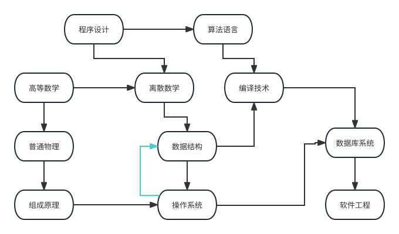

## 为什么需要拓扑排序

> **难度**：★★☆。算法只有一个队列，价值全在“把依赖关系建模成 DAG”这一步。
> **适合**：要做任务编排、构建流水线、工作流引擎、模块依赖检查的读者。
> **前置**：《图》《队列》。本篇的实现以邻接表存图，遍历部分沿用《图的遍历（DFS/BFS）》的写法。


现实系统里到处是“必须先把某件事做完，才能做另一件事”：

- 构建工具：编译 `module_b` 之前必须先编译它依赖的 `module_a` 。
- 数据流水线：清洗任务 → 特征任务 → 训练任务 → 评估任务。
- 工作流引擎（Airflow、Dify 的 Workflow、n8n）：节点连成有向图后，需要一个合法执行顺序，还要在**保存/发布那一刻**就判断这张图画得对不对。
- Agent 编排（LangGraph 这类图式框架）：节点是步骤、边是状态流转，执行前要检查可达性与非法环；一次多步任务里，“查库存”必须早于“下单”，“检索文档”必须早于“生成回答”。
- 数据库：视图依赖视图、`CREATE TABLE` 的外键顺序、迁移脚本（migration）的依赖。
- 语言运行时：`import` 解析、包管理器（`pip` / `npm`）判断循环依赖。

这些都可以抽象成同一个问题：**给定一个有向无环图（DAG），排出一个顶点序列，使得每条边 u → v 都满足 u 排在 v 前面**。这个序列就是拓扑序，求它的算法叫拓扑排序。

请注意“无环”是前提：只要图里存在环，拓扑序就不存在（A 依赖 B、B 依赖 A，谁也走不到前面）。因此拓扑排序在生产里还有第二个用途——**检测循环依赖**。

## 定义与直观例子

以大学排课为例。「数据结构」要求在学完「离散数学」之后修，「编译技术」要求先学「算法语言」和「离散数学」。把每门课看成一个顶点，课程之间的先后要求看成有向边 (u, v) （即 u 是 v 的前置），那么教务处在“符合逻辑关系”的前提下排出的课表，就是一次拓扑排序。



两个必须理解的性质：

1. **拓扑序通常不唯一**。上面这张图里，「离散数学」和「普通物理」谁先谁后都合法。想让它唯一，需要额外规则（比如“同层按名称字典序”）。
2. **拓扑序不违反任何偏序关系，但会“保留”所有依赖**。它是偏序的一个线性扩展（linear extension）。

## 方法一：Kahn 算法（入度 + BFS）

代码实现维护一个入度为 0 的顶点集合，核心步骤是：

1. 统计每个顶点的入度（有多少条边指向它）。
2. 把所有入度为 0 的顶点入队——它们没有任何前置条件。
3. 弹出队首顶点，把它加入结果序列；它的所有后继顶点入度减 1 ，减到 0 就入队。
4. 重复步骤 3 ，直到队列为空。若结果序列长度小于顶点数，说明图中有环。


Python 实现如下。这里用邻接表（`dict[顶点, list[后继]]` ）存图，与《图》中的 `GraphAdjList` 同构：

```python
from collections import deque


def topological_sort(graph: dict[str, list[str]]) -> list[str]:
    """Kahn 算法求拓扑序；存在环时抛出 ValueError

    graph：邻接表，graph[u] 是 u 的所有后继（u 完成后才能做的那些任务）
    """
    # 1. 统计入度。先把只出现在边右端、没有出边的顶点补齐
    indeg: dict[str, int] = {v: 0 for v in graph}
    for u, nxt in graph.items():
        for v in nxt:
            indeg.setdefault(v, 0)
            indeg[v] += 1

    # 2. 所有入度为 0 的顶点入队
    queue = deque([v for v, d in indeg.items() if d == 0])
    order: list[str] = []

    # 3. 逐个出队，并让后继的入度减 1
    while queue:
        u = queue.popleft()
        order.append(u)
        for v in graph.get(u, []):
            indeg[v] -= 1
            if indeg[v] == 0:  # 前置任务全部完成，可以排进来
                queue.append(v)

    # 4. 若顶点未被全部输出，说明存在环
    if len(order) != len(indeg):
        cyclic = [v for v, d in indeg.items() if d > 0]
        raise ValueError(f"图中存在循环依赖，涉及顶点：{cyclic}")
    return order


if __name__ == "__main__":
    dag = {
        "fetch_docs": ["clean"],
        "clean": ["embed", "summary"],
        "embed": ["index"],
        "summary": ["index"],
        "index": ["evaluate"],
        "evaluate": [],
    }
    print(topological_sort(dag))
    # ['fetch_docs', 'clean', 'embed', 'summary', 'index', 'evaluate']
```

把 `deque` 换成 `heapq` 的小顶堆，就能得到**字典序最小的拓扑序**——这是面试里常见的追问：

```python
import heapq


def topological_sort_lexicographic(graph: dict[str, list[str]]) -> list[str]:
    """字典序最小的拓扑序：把队列换成优先队列"""
    indeg: dict[str, int] = {v: 0 for v in graph}
    for u, nxt in graph.items():
        for v in nxt:
            indeg.setdefault(v, 0)
            indeg[v] += 1
    heap = [v for v, d in indeg.items() if d == 0]
    heapq.heapify(heap)
    order: list[str] = []
    while heap:
        u = heapq.heappop(heap)  # 每次取当前可选任务里名字最小的
        order.append(u)
        for v in graph.get(u, []):
            indeg[v] -= 1
            if indeg[v] == 0:
                heapq.heappush(heap, v)
    return order if len(order) == len(indeg) else []
```

## 方法二：DFS 后序逆序

另一种等价的实现是深度优先搜索：**把每个顶点在其所有后继都被访问完之后才记录，最后整体反转**，即得拓扑序。三原色标记法可以同时完成环检测：

```python
WHITE, GRAY, BLACK = 0, 1, 2  # 未访问 / 在当前递归栈上 / 已完成


def topological_sort_dfs(graph: dict[str, list[str]]) -> list[str]:
    """DFS 版拓扑排序；遇到反向边（指向 GRAY 的边）即存在环"""
    color = {v: WHITE for v in graph}
    for nxt in graph.values():
        for v in nxt:
            color.setdefault(v, WHITE)
    post: list[str] = []

    def dfs(u: str):
        color[u] = GRAY  # 入栈
        for v in graph.get(u, []):
            if color[v] == GRAY:  # 后向边：u -> v -> … -> u
                raise ValueError(f"存在环：{v} 是 {u} 的祖先")
            if color[v] == WHITE:
                dfs(v)
        color[u] = BLACK  # 出栈，后继已全部处理
        post.append(u)

    for v in color:
        if color[v] == WHITE:
            dfs(v)
    post.reverse()  # 后序遍历结果的逆序即拓扑序
    return post
```

两种方法的选择：Kahn 更适合**在线/流式**场景（可以在运行中持续拿到“当前可执行集合”），也更容易改成分层并行；DFS 写法更短，但受递归深度限制，几万个节点的任务图会直接 `RecursionError` ，**生产代码优先用 Kahn** 。

## 标准库方案：graphlib.TopologicalSorter

Python 3.9 起，标准库就提供了拓扑排序，不必手写。它内部用的正是“计数 + 可执行集合”的思路，并额外处理了重复添加节点、自动环检测。

```python
from graphlib import TopologicalSorter, CycleError

dag = {
    "index": {"embed", "summary"},      # key 依赖 value（注意方向与手写版相反）
    "embed": {"clean"},
    "summary": {"clean"},
    "clean": {"fetch_docs"},
    "fetch_docs": set(),
}

ts = TopologicalSorter(dag)
print(list(ts.static_order()))
# ['fetch_docs', 'clean', 'embed', 'summary', 'index']

# 有环时不再返回错误结果，而是抛出 CycleError
try:
    TopologicalSorter({"a": {"b"}, "b": {"c"}, "c": {"a"}}).prepare()
except CycleError as e:
    print("循环依赖：", e.args[1])  # ('a', 'b', 'c', 'a')
```

三个要点：

1. **方向与手写版相反**。`TopologicalSorter` 的 `add(node, *predecessors)` 声明的是“前置依赖”，即 `add("index", "embed")` 表示 embed 必须先做；而邻接表 `graph["embed"] = ["index"]` 表示“embed 完成后才能做 index”。混用最容易出错。
2. `static_order()` 一次性拿到完整序列；它要求图在排序期间不再变化。
3. `prepare()` + `get_ready()` / `is_active()` / `done()` 是**流式接口**，可以边执行边回报完成，这正是任务调度需要的形态。

## 工程应用：一个能并行的最小任务调度器

Agent 的多步任务、离线批处理常常需要“拓扑序 + 同层并行”。下面这个调度器只依赖标准库，就能做到“依赖满足就提交、并发跑、跑完解锁后继”：

```python
from collections import defaultdict, deque
from collections.abc import Callable
from concurrent.futures import Future, ThreadPoolExecutor


def run_dag(tasks: dict[str, Callable[[], object]], deps: dict[str, set[str]], workers: int = 4):
    """按拓扑序执行 tasks，同一层并行。

    tasks：任务名 -> 无参可调用对象
    deps ：任务名 -> 该任务依赖的任务名集合
    """
    indeg = {name: 0 for name in tasks}
    successors: dict[str, list[str]] = defaultdict(list)
    for name, pre in deps.items():
        for p in pre:
            successors[p].append(name)
            indeg[name] += 1

    ready = deque(n for n, d in indeg.items() if d == 0)
    done_count, total = 0, len(tasks)
    with ThreadPoolExecutor(max_workers=workers) as pool:
        running: dict[Future, str] = {}
        while done_count < total:
            while ready and len(running) < workers:  # 填满线程池
                name = ready.popleft()
                running[pool.submit(tasks[name])] = name
            if not running:
                raise RuntimeError("存在未就绪任务，图可能有环")
            for fut in list(running):
                if fut.done():
                    name = running.pop(fut)
                    fut.result()  # 任务失败在这里抛出
                    done_count += 1
                    for nxt in successors[name]:
                        indeg[nxt] -= 1
                        if indeg[nxt] == 0:
                            ready.append(nxt)
        # 收尾：等待仍在执行的任务
        for fut, name in running.items():
            fut.result()
            print("finished:", name)


def make(name: str):
    def job():
        return f"{name} ok"
    return job


tasks = {k: make(k) for k in ["fetch_docs", "clean", "embed", "summary", "index"]}
deps = {
    "clean": {"fetch_docs"},
    "embed": {"clean"},
    "summary": {"clean"},
    "index": {"embed", "summary"},
}
run_dag(tasks, deps)
```

`embed` 和 `summary` 的入度同时归零，因此会被并行提交——这正是“按拓扑分层执行”的效果。同样的模型可以搬到 Agent 场景：把节点换成“检索 / 重排 / 生成 / 校验”，`deps` 就是提示词里写死的执行约束，而拓扑排序保证模型给出的步骤图能被可靠执行，也能在编译期就发现“步骤 A 引用了尚未产生的步骤 B 的输出”。

## 分层：拓扑序之外的信息

很多调度问题关心的不是“一个序列”，而是“有几层”：

```python
def topological_levels(deps: dict[str, set[str]]) -> list[list[str]]:
    """返回按依赖深度分层的任务列表，levels[0] 可立即执行"""
    indeg = {n: len(deps.get(n, set())) for n in deps}
    successors: dict[str, list[str]] = {n: [] for n in deps}
    for n, pre in deps.items():
        for p in pre:
            successors.setdefault(p, []).append(n)
    levels: list[list[str]] = []
    cur = [n for n, d in indeg.items() if d == 0]
    seen = len(cur)
    while cur:
        levels.append(sorted(cur))
        nxt = []
        for u in cur:
            for v in successors.get(u, []):
                indeg[v] -= 1
                if indeg[v] == 0:
                    nxt.append(v)
        seen += len(nxt)
        cur = nxt
    if seen != len(indeg):
        raise ValueError("图中存在循环依赖")
    return levels


print(topological_levels({
    "fetch_docs": set(), "clean": {"fetch_docs"},
    "embed": {"clean"}, "summary": {"clean"}, "index": {"embed", "summary"},
}))
# [['fetch_docs'], ['clean'], ['embed', 'summary'], ['index']]
```

层数就是关键路径长度的下界（假设每层内并行、每任务耗时相同），是估算流水线总耗时的第一手依据。要做精确工期估算，需要带权的最长路，即竞赛教材里的“关键路径 / AOE 网”，其本质仍是拓扑序上的动态规划。

## 常见坑

1. **只给拓扑序，不给“为什么这个顺序”**。日志里一定要同时打印入度变化或分层结果，否则排查依赖配置错误极其痛苦。
2. **忘了把“只有入边、没有出边”的顶点放进图**。手写版里必须用 `setdefault` 补齐这些顶点，否则它们永远不会出现在结果里；`TopologicalSorter` 会自动处理。
3. **环的信息要能读**。`CycleError.args[1]` 直接给出环路径，而自己写的 Kahn 版本要显式抛出剩余顶点列表，只返回“排序失败”等于没报错。
4. **别在遍历图的同时修改图**。调度系统常在任务完成时动态加边，Kahn 支持（新顶点入度非 0 就排队），`TopologicalSorter` 则要求 `prepare()` 之后不再改动。
5. **拓扑序不是最优执行序**。它只保证依赖合法，不考虑耗时与资源。真正要缩短总耗时需要带权最长路或列表调度启发式。
6. **字符串拓扑序不保证稳定**。`dict` 保持插入序，但 `set` 不保持任何序；如果希望两次运行输出一致，把 `deps` 的值换成有序结构（`list` 或排序后的结果）。

## 延伸阅读

- Python 官方文档《graphlib —— 提供 Python 风格的拓扑排序功能》：`TopologicalSorter` 的完整语义与线程安全性说明。
- 《图》《图的遍历（DFS/BFS）》：邻接表、访问标记与遍历框架。
- 《最短路径与 NetworkX 实践》：拓扑排序只处理“无环 + 无权”，带权路径要换成最短/最长路算法。
- 《并查集与连通分量》：与拓扑排序互补，用于无向图的连通性判断。
- OI Wiki《拓扑排序》，含 AOE 网与关键路径的推导（竞赛向，工程实现思路一致）。

---

> **来源**：抓取于 2026-09-19。`graphlib.TopologicalSorter` 的用法与语义依据 [Python 官方文档 graphlib 章节](https://docs.python.org/zh-cn/3/library/graphlib.html)（Python Software Foundation，PSF License 2.0）；“排课”例子与两张示意图取自 [OI Wiki《拓扑排序》](https://oi-wiki.org/graph/topo/)（OI Wiki 项目，CC BY-SA 4.0，原图已下载至本模块 `assets/` 目录）。原文的 C++ 实现、链式前向星写法与竞赛习题已移除，Kahn / DFS / 分层 / 并行调度器代码均为本站编写并在 Python 3.12 下运行验证。
