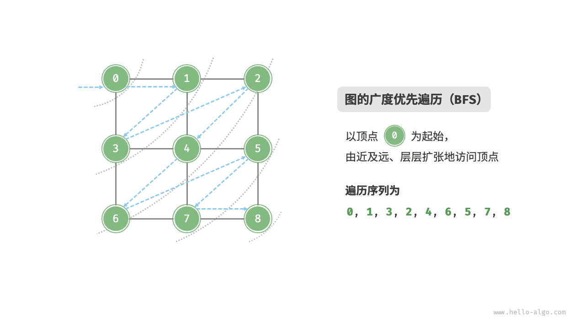
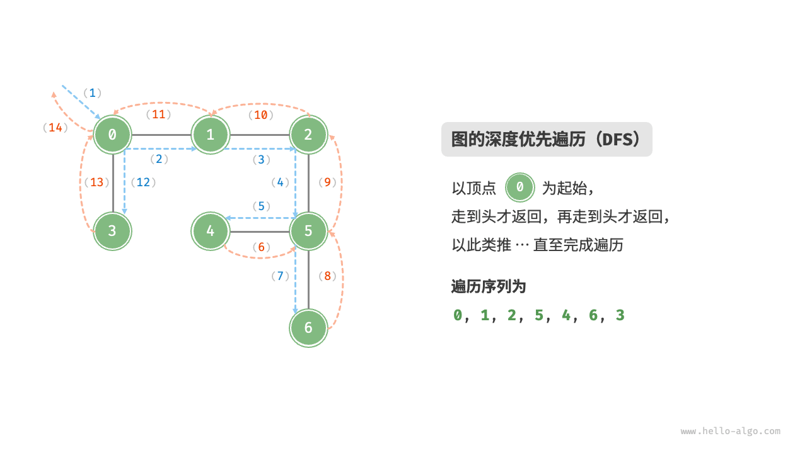

## 为什么图的遍历必须带 visited

树保证“任意节点到根有唯一路径”，因此递归天然不会走回头路；图里存在环与多父节点，**同一条边可能被两端各访问一次，不加标记就会死循环** 。所以图的遍历 = 树的遍历 + 一个 `visited` 集合 + 一个“遍历完还要换起点”的外层循环（图未必连通）。这两点就是本文全部工程差异的来源：

- **要“离我多远、按层推进”→ BFS** ：队列保证按距离分层出队，第一次到达某点的路径就是跳数最少的（无权图）。
- **要“枚举路径、判可达、找环、判二分图”→ DFS** ：栈 / 递归保存了“当前这条完整路径”，因此可以问“这条路上有没有回头边”。

树代表的是“一对多”的关系，而图则具有更高的自由度，可以表示任意的“多对多”关系。因此，我们可以把树看作图的一种特例。显然，**树的遍历操作也是图的遍历操作的一种特例**。

图和树都需要应用搜索算法来实现遍历操作。图的遍历方式也可分为两种：<u>广度优先遍历</u>和<u>深度优先遍历</u>。

## 广度优先遍历

**广度优先遍历是一种由近及远的遍历方式，从某个节点出发，始终优先访问距离最近的顶点，并一层层向外扩张**。如下图所示，从左上角顶点出发，首先遍历该顶点的所有邻接顶点，然后遍历下一个顶点的所有邻接顶点，以此类推，直至所有顶点访问完毕。



### 算法实现

BFS 通常借助队列来实现，代码如下所示。队列具有“先入先出”的性质，这与 BFS 的“由近及远”的思想异曲同工。

1. 将遍历起始顶点 `startVet` 加入队列，并开启循环。
2. 在循环的每轮迭代中，弹出队首顶点并记录访问，然后将该顶点的所有邻接顶点加入到队列尾部。
3. 循环步骤 `2.` ，直到所有顶点被访问完毕后结束。

为了防止重复遍历顶点，我们需要借助一个哈希集合 `visited` 来记录哪些节点已被访问。

```python
from collections import deque


def graph_bfs(graph: GraphAdjList, start_vet: Vertex) -> list[Vertex]:
    """广度优先遍历"""
    # 使用邻接表来表示图，以便获取指定顶点的所有邻接顶点
    res: list[Vertex] = []           # 顶点遍历序列
    visited: set[Vertex] = {start_vet}  # 记录已被访问过的顶点
    que: deque[Vertex] = deque([start_vet])
    # 以 start_vet 为起点，循环直至可达顶点全部访问完
    while que:
        vet = que.popleft()  # 队首顶点出队
        res.append(vet)      # 记录访问顶点
        for adj_vet in graph.adj_list[vet]:     # 遍历该顶点的所有邻接顶点
            if adj_vet in visited:
                continue                        # 跳过已被访问的顶点
            que.append(adj_vet)                 # 只入队未访问的顶点
            visited.add(adj_vet)
    return res
```

> **【提示】**
> 哈希集合可以看作一个只存储 `key` 而不存储 `value` 的哈希表，它可以在 O(1) 时间复杂度下进行 `key` 的增删查改操作。根据 `key` 的唯一性，哈希集合通常用于数据去重等场景。

> **请注意 `visited` 必须在入队时就标记，而不是出队时**。等出队再标记，同一个顶点会被它的每个邻居各入队一次：队列规模从 O(|V|) 涨到 O(|E|) ，重复处理还会把线性遍历拖成明显更慢的过程；更麻烦的是“出队即访问”在带权图/分层图里会直接算错距离。

上面那张 `graph_bfs.png` 展示的就是队列逐层推进的过程：每一步队首出队、其未访问的邻居从队尾进入。

> **【广度优先遍历的序列是否唯一？】**
> 不唯一。广度优先遍历只要求按“由近及远”的顺序遍历，**而多个相同距离的顶点的遍历顺序允许被任意打乱**。以上图为例，顶点 1、3 的访问顺序可以交换，顶点 2、4、6 的访问顺序也可以任意交换。

### 复杂度分析

**时间复杂度**：所有顶点都会入队并出队一次，使用 O(|V|) 时间；在遍历邻接顶点的过程中，由于是无向图，因此所有边都会被访问 2 次，使用 O(2|E|) 时间；总体使用 O(|V| + |E|) 时间。

**空间复杂度**：列表 `res` ，哈希集合 `visited` ，队列 `que` 中的顶点数量最多为 |V| ，使用 O(|V|) 空间。

## 深度优先遍历

**深度优先遍历是一种优先走到底、无路可走再回头的遍历方式**。如下图所示，从左上角顶点出发，访问当前顶点的某个邻接顶点，直到走到尽头时返回，再继续走到尽头并返回，以此类推，直至所有顶点遍历完成。



### 算法实现

这种“走到尽头再返回”的算法范式通常基于递归来实现。与广度优先遍历类似，在深度优先遍历中，我们也需要借助一个哈希集合 `visited` 来记录已被访问的顶点，以避免重复访问顶点。

```python
def graph_dfs(graph: GraphAdjList, start_vet: Vertex) -> list[Vertex]:
    """深度优先遍历"""
    res: list[Vertex] = []
    visited: set[Vertex] = set()

    def dfs(vet: Vertex) -> None:
        res.append(vet)     # 记录访问顶点
        visited.add(vet)    # 标记该顶点已被访问
        for adj_vet in graph.adj_list[vet]:          # 遍历该顶点的所有邻接顶点
            if adj_vet not in visited:
                dfs(adj_vet)                          # 递归访问邻接顶点

    dfs(start_vet)
    return res
```

递归版在深图上有 `RecursionError` 风险（Python 默认递归上限 1000 层）。显式栈版本没有这个问题，也是面试里常被追问的写法：

```python
def graph_dfs_iterative(graph: GraphAdjList, start_vet: Vertex) -> list[Vertex]:
    """深度优先遍历（显式栈，不依赖递归）"""
    res: list[Vertex] = []
    visited: set[Vertex] = set()
    stack: list[Vertex] = [start_vet]
    while stack:
        vet = stack.pop()
        if vet in visited:
            continue               # 弹到时才判定，避免重复访问
        visited.add(vet)
        res.append(vet)
        # 逆序压栈，弹出顺序才与递归版一致（左先右后）
        stack.extend(reversed(graph.adj_list[vet]))
    return res
```

上面 `graph_dfs.png` 那张示意图里，**直虚线代表向下递推**，表示开启了一个新的递归方法来访问新顶点；**曲虚线代表向上回溯**，表示此递归方法已经返回，回溯到了开启此方法的位置。建议把那张图与上面的代码结合起来，在脑中模拟（或者用笔画下来）整个 DFS 过程，包括每个递归方法何时开启、何时返回。

把上面三段跑起来需要一个邻接表。《图》里的 `GraphAdjList` 是面向对象版；下面用等价的 `dict` 邻接表搭一个可运行示例，便于自己验证遍历顺序：

```python
from collections import deque

# 邻接表（无向图）：dict[顶点, list[邻居]]
adj: dict[str, list[str]] = {
    "0": ["1", "2"],
    "1": ["0", "3"],
    "2": ["0", "3"],
    "3": ["1", "2", "4"],
    "4": ["3"],
}


def bfs(adj: dict[str, list[str]], start: str) -> list[str]:
    res, visited = [], {start}
    que = deque([start])
    while que:
        vet = que.popleft()
        res.append(vet)
        for nxt in adj[vet]:
            if nxt not in visited:
                visited.add(nxt)
                que.append(nxt)
    return res


def dfs(adj: dict[str, list[str]], start: str) -> list[str]:
    res, visited, stack = [], set(), [start]
    while stack:
        vet = stack.pop()
        if vet in visited:
            continue
        visited.add(vet)
        res.append(vet)
        stack.extend(reversed(adj[vet]))
    return res


print("BFS:", bfs(adj, "0"))   # BFS: ['0', '1', '2', '3', '4']
print("DFS:", dfs(adj, "0"))   # DFS: ['0', '1', '3', '2', '4']
```

同一份图、两种遍历，顺序明显不同：BFS 是“一圈圈外扩”，DFS 是“一条路走到黑再回头”。这个差异在工程上直接决定用途——**要最短跳数、要按层控制预算就用 BFS**（见《最短路径与 NetworkX 实践》），**要枚举路径、判断可达性或做环检测就用 DFS**（见《拓扑排序与依赖调度》）。


> **【深度优先遍历的序列是否唯一？】**
> 与广度优先遍历类似，深度优先遍历序列的顺序也不是唯一的。给定某顶点，先往哪个方向探索都可以，即邻接顶点的顺序可以任意打乱，都是深度优先遍历。
>
> 以树的遍历为例，“根 → 左 → 右”“左 → 根 → 右”“左 → 右 → 根”分别对应前序、中序、后序遍历，它们展示了三种遍历优先级，然而这三者都属于深度优先遍历。

### 复杂度分析

**时间复杂度**：所有顶点都会被访问 1 次，使用 O(|V|) 时间；所有边都会被访问 2 次，使用 O(2|E|) 时间；总体使用 O(|V| + |E|) 时间。

**空间复杂度**：列表 `res` ，哈希集合 `visited` 顶点数量最多为 |V| ，递归深度最大为 |V| ，因此使用 O(|V|) 空间。

## 可运行：连通分量、跳数、多源 BFS 与判环

前面三段依赖《图》里的 `GraphAdjList` 类。本节换成纯 `dict` 邻接表，把工程里最常写的五种图遍历一次给全，存成 `graph_traversal.py` 即可运行。示例图在本文那张 BFS 示意图的基础上加了孤岛 `5 - 6` 与叶子 `7` ，正好用来演示“不连通”的情形：

```python
"""图的遍历：连通分量 / 最短跳数 / 多源 BFS / 有界扩散 / 判环 / 二分图染色"""
from collections import deque

adj = {                      # 无向图：邻接表，dict[顶点, list[邻居]]
    "0": ["1", "2"],
    "1": ["0", "3"],
    "2": ["0", "3", "7"],
    "3": ["1", "2", "4"],
    "4": ["3"],
    "5": ["6"],              # 另一块孤岛
    "6": ["5"],
    "7": ["2"],
}


def bfs(adj: dict[str, list[str]], start: str) -> list[str]:
    """广度优先遍历：入队即标记 visited"""
    res, visited, que = [], {start}, deque([start])
    while que:
        v = que.popleft()
        res.append(v)
        for nxt in adj[v]:
            if nxt not in visited:
                visited.add(nxt)
                que.append(nxt)
    return res


def components(adj: dict[str, list[str]]) -> list[list[str]]:
    """全部连通分量：对每个还没被访问过的顶点再起一次 BFS"""
    seen, comps = set(), []
    for start in adj:
        if start in seen:
            continue
        block = bfs(adj, start)
        seen.update(block)
        comps.append(block)
    return comps


def hops(adj: dict[str, list[str]], start: str) -> dict[str, int]:
    """单源最短跳数：距离写在 dict 里，同时兼作 visited"""
    dist = {start: 0}
    que = deque([start])
    while que:
        v = que.popleft()
        for nxt in adj[v]:
            if nxt not in dist:
                dist[nxt] = dist[v] + 1     # 第一次到达即为最优
                que.append(nxt)
    return dist
```

```python
def multi_source_bfs(adj, starts: list[str]):
    """多源 BFS：所有起点同时入队，每个点被「最近的源」先认领"""
    dist = {s: 0 for s in starts}
    nearest = {s: s for s in starts}
    que = deque(starts)
    while que:
        v = que.popleft()
        for nxt in adj[v]:
            if nxt not in dist:
                dist[nxt] = dist[v] + 1
                nearest[nxt] = nearest[v]   # 谁先到达就归谁
                que.append(nxt)
    return dist, nearest


def bounded_expand(adj, start: str, max_depth: int, budget: int):
    """带深度上限与总量预算的扩散：知识图谱多跳检索的典型形态"""
    visited = {start}
    queue = deque([(start, 0)])
    picked = []
    while queue and len(picked) < budget:
        v, d = queue.popleft()
        picked.append((v, d))
        if d == max_depth:
            continue                        # 到深度就不再扩展，天然截断
        for nxt in adj[v]:
            if nxt not in visited:
                visited.add(nxt)
                queue.append((nxt, d + 1))
    return picked
```

判环要分无向与有向两种。**无向图**里 DFS 遇到已访问邻居不奇怪（很可能就是来路），必须把“父节点”排除掉；**有向图**里则要区分“访问过”和“正在当前这条路径上”，这就是三色标记。

```python
def has_cycle_undirected(adj: dict[str, list[str]]) -> bool:
    """无向图判环：DFS 时避开来的那条边，仍撞到已访问节点即为环"""
    visited = set()

    def dfs(v, parent):
        visited.add(v)
        for nxt in adj[v]:
            if nxt not in visited:
                if dfs(nxt, v):
                    return True
            elif nxt != parent:             # 不是来路 -> 存在第二条路到 v
                return True
        return False

    return any(s not in visited and dfs(s, None) for s in adj)


def cycle_directed(graph: dict[str, list[str]]):
    """有向图判环（三色标记）：WHITE 未访问 / GRAY 在当前路径上 / BLACK 已完成。
    DFS 撞到 GRAY 即成环，返回环路径；无环返回 None。"""
    WHITE, GRAY, BLACK = 0, 1, 2
    color = {n: WHITE for n in graph}

    def dfs(v, path):                       # path 是「从起点到 v」的完整路径
        color[v] = GRAY
        for nxt in graph.get(v, []):
            if color.get(nxt, WHITE) == GRAY:      # 回边
                return path[path.index(nxt):] + [nxt]
            if color.get(nxt, WHITE) == WHITE:
                found = dfs(nxt, path + [nxt])
                if found:
                    return found
        color[v] = BLACK                    # 出栈：本点的所有分支都探完了
        return None

    for n in graph:
        if color[n] == WHITE:
            found = dfs(n, [n])
            if found:
                return found
    return None


def bipartite(graph: dict[str, list[str]]):
    """二分图判定：BFS 染色（0/1），出现同色相邻即非二分图；返回染色方案或 False"""
    color: dict[str, int] = {}
    for s in graph:
        if s in color:
            continue
        color[s] = 0
        que = deque([s])
        while que:
            v = que.popleft()
            for nxt in graph[v]:
                if nxt not in color:
                    color[nxt] = color[v] ^ 1      # 取反：0 -> 1 ，1 -> 0
                    que.append(nxt)
                elif color[nxt] == color[v]:
                    return False
    return color


if __name__ == "__main__":
    print("连通分量:", components(adj))
    # [['0','1','2','3','7','4'], ['5','6']] —— 两块孤岛，只起一次 BFS 会漏掉第二块
    print("到 0 的跳数:", hops(adj, "0"))
    # {'0':0, '1':1, '2':1, '3':2, '7':2, '4':3}（5、6 不可达，因此不在结果里）
    print("多源(源 0 和 5):", multi_source_bfs(adj, ["0", "5"]))
    print("有界扩散(深度 2、预算 4):", bounded_expand(adj, "0", 2, 4))
    # [('0', 0), ('1', 1), ('2', 1), ('3', 2)]
    print("无向图有环:", has_cycle_undirected(adj))
    digraph = {"a": ["b", "c"], "b": ["d"], "c": ["d"], "d": ["e"], "e": [], "f": ["g"], "g": ["f"]}
    print("有向图环:", cycle_directed(digraph))       # ['f', 'g', 'f']
    print("二分图染色:", bipartite({"A": ["B"], "B": ["A", "C"], "C": ["B"]}))
```

三段输出值得注意：**`hops` 的结果里没有 `5` / `6`** ——不可达顶点不会出现在距离表里，取值要用 `.get(v)` 而不是 `[v]` ，否则 `KeyError` ；**`components` 必须遍历所有起点**，只从 `"0"` 起一次 BFS 会静默丢掉一整块子图；**`cycle_directed` 返回的是环本身而不是 True** ，因为工程上判环之后立刻要的就是“到底是哪几条依赖互相卡住了”。

## 复杂度推导

两种存储下的代价差别很大，这张表值得记住（V 为顶点数、E 为边数）：

| 存储 | 判断 u-v 是否相连 | 遍历全图 | 空间 |
| ---- | ----------------- | -------- | ---- |
| 邻接表（本文的 `dict` ） | O(度数) 或配 `set` 后 O(1) | **O(V + E)** | O(V + E) |
| 邻接矩阵 | O(1) | **O(V²)** | O(V²) |

- **BFS / DFS 都是 O(V + E)** ：每个顶点入队 / 入栈一次（O(V) ），每条边在被扫描邻接表时被检查一次（无向图两次），合计 O(V + E) 。**为什么不是 O(V²)** ：稀疏图（E = O(V) ，社交网络、依赖图都是）下邻接表只扫真正存在的边，这正是邻接表的意义（见《图》）。
- **空间 O(V)** ：队列 / 栈 + `visited` 都至多 V 个元素；DFS 递归版还要 O(V) 调用栈（Python 默认 1000 层上限，深图必炸）。
- **分层 BFS 求跳数是正确的，前提是边权相等** 。一旦带权，“先到即最优”不再成立，得换 Dijkstra（见《最短路径与 NetworkX 实践》）；带负权则要 Bellman-Ford。
- **判环、判二分图、求连通分量都是 O(V + E)** ；拓扑排序也是（它是“带出度计数的 DFS/BFS” ，见《拓扑排序与依赖调度》）。**并查集能在“边流式到达”的场景把同样的活儿做到近似 O(E · α(V))** ，且不需要预先建表（见《并查集与等价类归并》）。

## 常见坑

1. **`visited` 在出队时才标记**。同一顶点被每个邻居各入队一次，队列规模从 O(V) 涨到 O(E) ，大图上会慢一个数量级；求距离时还会算错。正确写法是**入队即标记** （本文 `bfs` 就是这么写的）。
2. **只从一个起点开始，忘了图可能不连通**。`components` 那层 `for start in adj` 不能省；判环、二分图判定同理，都要“每个未访问点起一次”。
3. **不可达顶点当成“不存在”** 。`hops` 返回的字典只包含可达点；把“没有键”当成“距离 0 / 距离 1”会引发下游统计错误。
4. **递归 DFS 爆栈**。深图请用显式栈版本；只是要清楚它和递归版访问顺序一致但**不保留“当前路径”** ，因此判环需要额外维护路径栈（或改用三色标记的迭代实现）。
5. **把无向图的 `u-v` 只加一条边** 。邻接表要双向 `append` ，否则 BFS 能到、DFS 回不来，连通分量数也会算错。
6. **有向图判环只用一个 `visited` 布尔**。那样会把“菱形”（a→b→d ，a→c→d）误判成环；必须区分 GRAY（在当前路径上）与 BLACK（已完成），本文的三色实现就是为此。
7. **无向图判环不排除父节点**。任何一条边都会被判成环；排除父节点时若存在**重边**（平行边）仍会漏判，此时应记录“边 id 是否用过”而不是“父顶点是谁”。
8. **邻接表用 `list` 却频繁判 `in`** 。`nxt in adj[v]` 是 O(度数) ，度数很大时把邻居集换成 `set` （见《哈希表》），或在 `visited` 上判即可；本文的 BFS 全部只查 `visited` ，这是标准做法。
9. **并行 / 异步环境里共享 `visited`** 。多个协程同时 BFS 同一张图时，“判未访问 + 入队”不是原子操作，会重复处理；用 `dist` 字典的“写入即占位”或按分片各自 visited。
10. **在遍历过程中改图**。删边 / 加边会让正在跑的队列语义失效；需要“动态图”时改成显式的重算或增量算法（见《并查集与等价类归并》的“只增不删”讨论）。

## 工程应用：从六度到检索扩图

- **依赖闭包与影响面分析**。构建系统、Kubernetes 的资源拓扑、CI 的 job 图，第一问都是“这个节点带上它的传递依赖一共有哪些”——一次 BFS / DFS 可达集。要“谁受影响”则把图反向再走一次。判环则对应“依赖里不能有循环”，实现上就是本文的三色 DFS 或《拓扑排序与依赖调度》的 `graphlib.TopologicalSorter` 。
- **知识图谱与 GraphRAG 的多跳检索**。从命中的实体出发做“深度受限、每层限量”的扩散，把子图塞进 prompt——这就是上文 `bounded_expand` 的用途：深度上限防爆炸、预算上限控 token 。跳数与预算是这类系统最主要的两个成本旋钮（背景见《并查集与等价类归并》的社区划分一节）。
- **社交与网络拓扑**。好友推荐用“二跳内的共同好友计数”，本质是分层 BFS 加计数；网络可达性、机房内最小跳数路由、blast radius 分析同理。**多源 BFS** 则用于“离哪个机房最近 / 被哪个社区先认领”，一次遍历就完成 Voronoi 式的粗划分。
- **二分图的实际形态**：任务—资源匹配、买家—卖家交易、查询—文档点击对，都不能同侧相连；`bipartite` 既是校验也是着色起点，配套的匹配算法（匈牙利 / Hopcroft–Karp）都以“是否为二分图”为前提。
- **抓取与遍历预算**。爬虫的“深度 ≤ 3 、每域最多 N 页”、监控系统的“沿调用链展开 N 层”，都是 BFS + 计数 + 提前终止，实现时别忘了 `visited` ：真实 Web 图里环极多。
- **可复现性提醒**：BFS / DFS 的序列不唯一（邻接表顺序任意）。若要结果稳定（做快照比对、写测试断言），**必须先把邻接表排序** ，否则同样数据会因为插入顺序不同给出不同遍历序。

## 延伸阅读

- 《图》：邻接矩阵与邻接表的定义、图的增删操作与 `GraphAdjList` 实现。
- 《二叉树遍历》：图遍历在“无环特例”下的形态，以及递归 ↔ 显式栈的转换。
- 《拓扑排序与依赖调度》：有向无环图上的遍历顺序，以及判环的标准库方案。
- 《最短路径与 NetworkX 实践》：带权图上把“先到达即最优”补回正确性的做法。
- 《并查集与等价类归并》：只求连通分量、且边流式到达时的更廉价替代。
- 《队列》：BFS 的 `deque` 与两端操作复杂度；《哈希表》：`visited` 用 `set` 的 O(1) 判定。

---

> **来源**：本文转载自 [图的遍历](https://raw.githubusercontent.com/krahets/hello-algo/main/docs/chapter_graph/graph_traversal.md)，作者 krahets，许可 CC BY-NC-SA 4.0。抓取于 2026-09-13。
> 原文中指向仓库完整代码的引用块已省略，完整可运行 Python 代码见 [hello-algo/codes/python](https://github.com/krahets/hello-algo/tree/main/codes/python)。
