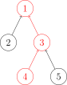
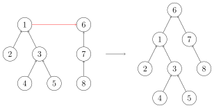

> **难度**：★★☆。代码只有二十行，但它是“动态连通性”这一整类问题的钥匙。
> **适合**：要做社区划分、近似去重、实体对齐、等价类归并的读者。
> **前置**：《图》《哈希表》。本篇只用邻接关系和字典，不需要《图的遍历（DFS/BFS）》的知识，但两者常可互换，文中会对比。

## 为什么需要并查集

有一类问题反复出现在工程里：**给一堆元素，不断告知“这两个元素属于同一类”，随时询问“这两个是不是同一类”**。

- 社交网络：好友关系传递（A 和 B 同群、B 和 C 同群 ⇒ A 和 C 同群），要把用户划成社区。
- 文档去重：两两比对相似度过阈值就合并，最后每组留一个代表。
- 实体对齐：同一个人在不同系统里有手机号、邮箱、OpenID，要把它们归并为一个实体。
- 账号打通 / 风控：同一设备、同一支付方式关联出的账号簇。
- 图片/传感器聚类：把距离小于阈值的点归并成簇。
- 无向图连通分量、Kruskal 最小生成树、棋盘格连块判断。

用《图的遍历》里的 BFS/DFS 也能求连通分量，但每次新增一条边，所有已算好的分量都可能变化，得重新遍历一遍，代价 O(V + E) 。**并查集（disjoint set / union-find）把“合并”和“查询”都做到近乎常数时间**，专门解决这种“动态增量式”的归并问题。

代价是它有明确的能力边界：**只支持合并，不支持拆分**。

## 定义与直观图

并查集维护一组互不相交的集合，每个集合用“树”来表示，**树根就是这个集合的代表元素（find 的结果）**。它提供两个操作：

- `find(x)` ：返回 x 所在集合的根，用来判断归属。
- `union(x, y)` ：把两个集合合并——做法是让一棵树的根指向另一棵树的根。


查询 `find(6)` 时沿父指针一路向上直到根节点，路径上的 6 → 4 → 2 → 1 都要走一遍：



合并时把一棵树的根挂到另一棵树的根下面：



如果每次合并都随机地挂，树可能退化成一条链，`find` 就退化为 O(n) ：

**1 - 2 - 3 - 4 - 5 - … - n**

因此需要两个优化。

1. **按大小（或按秩）合并**：始终让小树挂到大树上，树高就被控制在 O(log n) 以内。
2. **路径压缩**：`find` 走过路径上所有节点的父指针，直接改指向根。以后再查这些点就是 O(1) 。


两个优化一起用，n 个元素、m 次操作的均摊代价是 O(m · α(n)) ，其中 α 是反 Ackermann 函数——在 n 大到宇宙原子数的范围内，α(n) ≤ 5 ，工程上可以直接当常数看待。

## Python 实现

### 通用版：字典父指针（支持任意可哈希元素、支持增量）

这是工程里最好用的形态：不必预先知道元素个数，随时 `add` 。

```python
class DisjointSet:
    """并查集：按大小合并 + 路径压缩（迭代实现，不会爆栈）"""

    def __init__(self):
        self.parent: dict[object, object] = {}  # 元素 -> 父元素
        self.size: dict[object, int] = {}       # 根元素 -> 集合大小

    def add(self, x) -> None:
        """加入一个新元素；已存在则忽略"""
        if x not in self.parent:
            self.parent[x] = x
            self.size[x] = 1

    def find(self, x):
        """返回 x 所在集合的根；不存在则顺手创建"""
        if x not in self.parent:
            self.add(x)
            return x
        # 第一遍：找到根
        root = x
        while self.parent[root] != root:
            root = self.parent[root]
        # 第二遍：路径压缩，把沿途节点直接挂到根上
        while self.parent[x] != root:
            self.parent[x], x = root, self.parent[x]
        return root

    def union(self, x, y) -> bool:
        """合并两个集合；若本就在同一集合返回 False（Kruskal、去重时很有用）"""
        rx, ry = self.find(x), self.find(y)
        if rx == ry:
            return False
        # 按大小合并：小挂大
        if self.size[rx] < self.size[ry]:
            rx, ry = ry, rx
        self.parent[ry] = rx
        self.size[rx] += self.size[ry]
        del self.size[ry]
        return True

    def connected(self, x, y) -> bool:
        return self.find(x) == self.find(y)

    def components(self) -> dict[object, list]:
        """按根分组，返回 {代表元: [成员, ...]}"""
        groups: dict[object, list] = {}
        for x in self.parent:
            groups.setdefault(self.find(x), []).append(x)
        return groups
```

代码里有一处刻意的取舍：**`find` 用迭代而非递归**。竞赛与教材的递归写法只有两行：

```python
def find(self, x):
    if self.parent[x] != x:
        self.parent[x] = self.find(self.parent[x])  # 路径压缩
    return self.parent[x]
```

它同样正确、更简洁，但在一条长度为数十万的链上会直接 `RecursionError`（Python 默认递归上限 1000 ，即使用 `sys.setrecursionlimit` 抬高也容易段错误）。**生产代码请用迭代版**；面试白板可以用递归版，但要能说出这个差别。

### 紧凑版：数组下标（元素是 0..n-1）

元素是整数且数量已知时，用列表比字典快 3~5 倍（省掉哈希开销），适合内层循环极多的场景：

```python
class DisjointSetArray:
    """并查集（0..n-1 元素，数组实现）"""

    def __init__(self, n: int):
        self.parent = list(range(n))
        self.size = [1] * n
        self.count = n  # 当前连通分量数量

    def find(self, x: int) -> int:
        while self.parent[x] != x:
            # 路径减半（path halving）：一步一跳地往爷爷挂，单次遍历即可完成压缩
            self.parent[x] = self.parent[self.parent[x]]
            x = self.parent[x]
        return x

    def union(self, x: int, y: int) -> bool:
        rx, ry = self.find(x), self.find(y)
        if rx == ry:
            return False
        if self.size[rx] < self.size[ry]:
            rx, ry = ry, rx
        self.parent[ry] = rx
        self.size[rx] += self.size[ry]
        self.count -= 1
        return True
```

`count` 字段常被忽略却非常实用：判断“所有元素是否已归为一类”只需 `count == 1` ，不必遍历。

## 应用一：社交网络社区划分

给定好友关系对，划分社区并输出规模分布：

```python
def detect_communities(edges: list[tuple[str, str]]) -> list[list[str]]:
    ds = DisjointSet()
    for a, b in edges:
        ds.union(a, b)  # union 内部会自动 add，省去预扫描
    groups = ds.components()
    # 按社区规模从大到小排，便于观察“长尾”
    return sorted(groups.values(), key=len, reverse=True)


edges = [("u1", "u2"), ("u2", "u3"), ("u4", "u5"), ("u3", "u6"), ("u1", "u6")]
print(detect_communities(edges))
# [['u1', 'u2', 'u3', 'u6'], ['u4', 'u5']]  # 两个社区，成员顺序即 parent 的插入顺序
```

社区划分完成后，常见的下游需求都能靠 `size` 字典 O(1) 回答：最大社区规模、某个用户所在社区的大小、社区数量。这正是“朋友圈可见范围”“推荐种子人群”这类逻辑的底层结构。

同一份数据用 BFS 也能做，但要先把所有边建成邻接表、再逐点起搜索；**边是流式到达、且要随时回答归属问题时，并查集明显更合适**。反过来，如果还要求“两点之间的具体路径”，并查集就无能为力了（它只记父指针，不记图），那要用图的遍历。

## 应用二：文档与向量的近似去重

RAG 语料清洗里最典型的用法：两两（或近邻对）相似度超过阈值就视为重复，最后每组保留一个代表。

```python
def deduplicate(items: list[str], vectors: list[list[float]], threshold: float = 0.92) -> list[int]:
    """把近似重复的元素归并，返回每组保留下来的下标（组内下标最小者作为代表）"""
    n = len(items)
    ds = DisjointSetArray(n)
    # 真实场景这里应换成近邻检索（见《向量相似度与 HNSW 近邻图》），
    # 两两比对的 O(n^2) 只适合几千条以内的小规模校对
    for i in range(n):
        for j in range(i + 1, n):
            if cosine(vectors[i], vectors[j]) >= threshold:
                ds.union(i, j)
    reps: dict[int, int] = {}
    for i in range(n):
        root = ds.find(i)
        if root not in reps:
            reps[root] = i  # 组内下标最小者作为代表，结果可复现
    return sorted(reps.values())


def cosine(a: list[float], b: list[float]) -> float:
    dot = sum(x * y for x, y in zip(a, b))
    na = sum(x * x for x in a) ** 0.5
    nb = sum(x * x for x in b) ** 0.5
    return dot / (na * nb) if na and nb else 0.0
```

**必须理解“传递性风险”**：并查集会把 A~B、B~C 归为同组，哪怕 A 与 C 的相似度只有 0.7 。阈值定得越松，簇的“链式漂移”越严重，最后可能出现一篇完全不相关的文档被当成重复删掉。工程上的缓解办法有三条：把阈值调高、用互近邻（A 是 B 的 top-k 且 B 也是 A 的 top-k）而不是单向量近邻来生成边、或改用不依赖传递性的聚类（如单轮 K-Medoids）。

## 应用三：实体对齐与账号合并

“手机号 138… ←→ 邮箱 a@x.com ←→ OpenID wx_1” 三条映射来自三个系统，业务上要输出统一实体 ID：

```python
def resolve_entities(records: list[list[str]]) -> dict[str, str]:
    """records：每条是一组“已确认等价”的标识符。返回 标识符 -> 统一实体名"""
    ds = DisjointSet()
    for group in records:
        for a, b in zip(group, group[1:]):  # 链式两两合并即可
            ds.union(a, b)
    entity_of: dict[str, str] = {}
    for ident in ds.parent:
        entity_of[ident] = ds.find(ident)  # 用根作为统一实体 ID
    return entity_of


print(resolve_entities([["138", "a@x.com"], ["a@x.com", "wx_1"], ["999", "b@y.com"]]))
# {'138': '138', 'a@x.com': '138', 'wx_1': '138', '999': '999', 'b@y.com': '999'}
```

选根作为实体 ID 有个隐患：**根会随合并顺序变化**。若需要稳定 ID（写入数据库后不能变），应改为“取组内字典序最小者”并在合并时固定它，或者用另一层 `root -> 稳定 ID` 的映射表。

## 应用四：Kruskal 最小生成树

并查集是 Kruskal 算法的核心：按边权升序处理，若边的两端不在同一集合就选入，否则跳过（会成环）。

```python
def kruskal(edges: list[tuple[float, str, str]], n: int) -> list[tuple[str, str]]:
    ds = DisjointSet()
    res = []
    for w, u, v in sorted(edges):  # 按权重升序
        if ds.union(u, v):         # union 返回 False 表示已连通，会成环
            res.append((u, v))
            if len(res) == n - 1:  # n 个顶点的生成树只需 n-1 条边
                break
    return res
```

`union` 返回布尔值这个小设计，在这里省掉了一次额外的 `connected` 判断。

## 常见坑

1. **只支持合并，不支持删除**。要“断开”只能整份重建，或用“可撤销并查集”（记录每次修改的栈，按 LIFO 顺序回滚，思路同《回溯算法（面试选学）》的尝试与回退）。
2. **路径压缩与“按权并查集”不兼容**。竞赛里用 `d[x]` 记录 x 到根的带权距离、查询两顶点差值的那套写法，一旦加路径压缩就要极其小心地维护增量。日常工程几乎不需要它，本站不再展开。
3. **忘记 `add` 导致 KeyError**。字典版可以在 `find` 里顺手创建，但会静默改变集合规模；严格些应显式 `add` 或让 `find` 抛错。
4. **递归 find 爆栈**。见前文，生产环境一律用迭代版或 `path halving` 。
5. **把“连通”当成“相似”**。并查集聚合的是等价关系（自反、对称、传递），而相似度不满足传递性，这是去重场景误删的根源。
6. **大规模时内存**。字典版每个元素约 200 字节（两个 dict 表项 + 字符串对象），千万级元素请换数组版 + 把字符串映射成整型 ID（`dict[str, int]` 建一次索引即可）。
7. **多线程下不安全**。`parent`/`size` 的更新不是原子的；并发场景要么加锁，要么按分片（sharding）拆成多个独立并查集。

## 延伸阅读

- TheAlgorithms/Python 的 `data_structures/disjoint_set/` 目录（MIT 许可），含字典版与数组版实现，可作为对照阅读。
- 《布隆过滤器与集合去重》：与并查集互补——布隆过滤器判断“可能见过”，并查集归并“确认等价”。
- 《向量相似度与 HNSW 近邻图》：为大规模去重高效地生成候选边，取代 O(n²) 两两比对。
- 《拓扑排序与依赖调度》：并查集处理无向图的连通性，拓扑排序处理有向无环图的顺序，两者是图算法的一对基石。
- OI Wiki《并查集》，含带权并查集、可持久化并查集与“启发式合并”等进阶内容（竞赛向）。

---

> **来源**：抓取于 2026-09-19。概念定义与四张示意图取自 [OI Wiki《并查集》](https://oi-wiki.org/ds/dsu/)（OI Wiki 项目，CC BY-SA 4.0，图片已下载至本模块 `assets/` 目录）；接口设计参考 TheAlgorithms/Python 的 `data_structures/disjoint_set/disjoint_set.py`（MIT 许可）。原文（OI Wiki 页面）的 C++ 实现、带权并查集与可持久化并查集、以及洛谷 / BZOJ 习题未收录，正文中的社区划分、近似去重、实体对齐、Kruskal 四个应用与全部 Python 代码为本站编写，已在 Python 3.12 下运行验证。
