> **难度**：★★★★（面试选学）。动态规划是面试中出现频率最高、也最容易“看得懂写不出”的题型。
> **适合**：目标是把“状态 / 转移 / 边界”三件事写成可复用的解题流程，而不是背下面这几道题。
> **前置**：需要先掌握《递归入门》的递归三要素与调用栈，以及《栈》中“用显式栈模拟递归”的思路；本篇不再重复递归基础，直接进入“重叠子问题”与“记忆化”。

## 初探动态规划


<u>动态规划（dynamic programming）</u>是一个重要的算法范式，它将一个问题分解为一系列更小的子问题，并通过存储子问题的解来避免重复计算，从而大幅提升时间效率。

在本节中，我们从一个经典例题入手，先给出它的暴力回溯解法，观察其中包含的重叠子问题，再逐步导出更高效的动态规划解法。

> **【爬楼梯】**
> 给定一个共有 n 阶的楼梯，你每步可以上 1 阶或者 2 阶，请问有多少种方案可以爬到楼顶？

如下图所示，对于一个 3 阶楼梯，共有 3 种方案可以爬到楼顶。

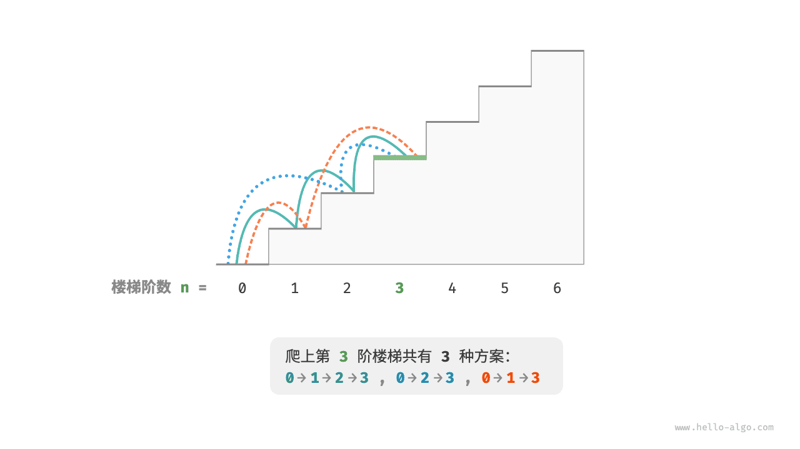

本题的目标是求解方案数量，**我们可以考虑通过回溯来穷举所有可能性**。具体来说，将爬楼梯想象为一个多轮选择的过程：从地面出发，每轮选择上 1 阶或 2 阶，每当到达楼梯顶部时就将方案数量加 1 ，当越过楼梯顶部时就将其剪枝。代码如下所示：

```python
def backtrack(choices: list[int], state: int, n: int, res: list[int]) -> int:
    """回溯"""
    # 当爬到第 n 阶时，方案数量加 1
    if state == n:
        res[0] += 1
    # 遍历所有选择
    for choice in choices:
        # 剪枝：不允许越过第 n 阶
        if state + choice > n:
            continue
        # 尝试：做出选择，更新状态
        backtrack(choices, state + choice, n, res)
        # 回退


def climbing_stairs_backtrack(n: int) -> int:
    """爬楼梯：回溯"""
    choices = [1, 2]  # 可选择向上爬 1 阶或 2 阶
    state = 0  # 从第 0 阶开始爬
    res = [0]  # 使用 res[0] 记录方案数量
    backtrack(choices, state, n, res)
    return res[0]
```


### 方法一：暴力搜索

回溯算法通常并不显式地对问题进行拆解，而是将求解问题看作一系列决策步骤，通过试探和剪枝，搜索所有可能的解。

我们可以尝试从问题分解的角度分析这道题。设爬到第 i 阶共有 dp[i] 种方案，那么 dp[i] 就是原问题，其子问题包括：

**dp[i-1], dp[i-2], …, dp[2], dp[1]**


由于每轮只能上 1 阶或 2 阶，因此当我们站在第 i 阶楼梯上时，前一轮只可能站在第 i - 1 阶或第 i - 2 阶上。换句话说，我们只能从第 i -1 阶或第 i - 2 阶迈向第 i 阶。

由此便可得出一个重要推论：**爬到第 i - 1 阶的方案数加上爬到第 i - 2 阶的方案数就等于爬到第 i 阶的方案数**。公式如下：

**dp[i] = dp[i-1] + dp[i-2]**


这意味着在爬楼梯问题中，各个子问题之间存在递推关系，**原问题的解可以由子问题的解构建得来**。下图展示了该递推关系。


我们可以根据递推公式得到暴力搜索解法。以 dp[n] 为起始点，**递归地将一个较大问题拆解为两个较小问题的和**，直至到达最小子问题 dp[1] 和 dp[2] 时返回。其中，最小子问题的解是已知的，即 dp[1] = 1、dp[2] = 2 ，表示爬到第 1、2 阶分别有 1、2 种方案。

观察以下代码，它和标准回溯代码都属于深度优先搜索，但更加简洁：

```python
def dfs(i: int) -> int:
    """搜索"""
    # 已知 dp[1] 和 dp[2] ，返回之
    if i == 1 or i == 2:
        return i
    # dp[i] = dp[i-1] + dp[i-2]
    count = dfs(i - 1) + dfs(i - 2)
    return count


def climbing_stairs_dfs(n: int) -> int:
    """爬楼梯：搜索"""
    return dfs(n)
```


下图展示了暴力搜索形成的递归树。对于问题 dp[n] ，其递归树的深度为 n ，时间复杂度为 O(2ⁿ) 。指数阶属于爆炸式增长，如果我们输入一个比较大的 n ，则会陷入漫长的等待之中。

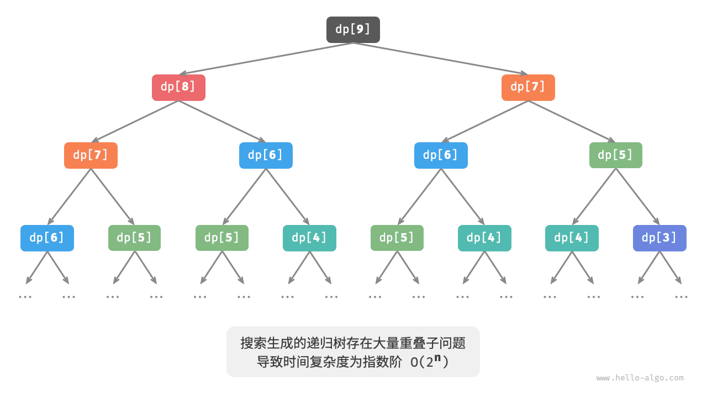

观察上图，**指数阶的时间复杂度是“重叠子问题”导致的**。例如 dp[9] 被分解为 dp[8] 和 dp[7] ，dp[8] 被分解为 dp[7] 和 dp[6] ，两者都包含子问题 dp[7] 。

以此类推，子问题中包含更小的重叠子问题，子子孙孙无穷尽也。绝大部分计算资源都浪费在这些重叠的子问题上。

### 方法二：记忆化搜索

为了提升算法效率，**我们希望所有的重叠子问题都只被计算一次**。为此，我们声明一个数组 `mem` 来记录每个子问题的解，并在搜索过程中将重叠子问题剪枝。

1. 当首次计算 dp[i] 时，我们将其记录至 `mem[i]` ，以便之后使用。
2. 当再次需要计算 dp[i] 时，我们便可直接从 `mem[i]` 中获取结果，从而避免重复计算该子问题。

代码如下所示：

```python
def dfs(i: int, mem: list[int]) -> int:
    """记忆化搜索"""
    # 已知 dp[1] 和 dp[2] ，返回之
    if i == 1 or i == 2:
        return i
    # 若存在记录 dp[i] ，则直接返回之
    if mem[i] != -1:
        return mem[i]
    # dp[i] = dp[i-1] + dp[i-2]
    count = dfs(i - 1, mem) + dfs(i - 2, mem)
    # 记录 dp[i]
    mem[i] = count
    return count


def climbing_stairs_dfs_mem(n: int) -> int:
    """爬楼梯：记忆化搜索"""
    # mem[i] 记录爬到第 i 阶的方案总数，-1 代表无记录
    mem = [-1] * (n + 1)
    return dfs(n, mem)
```


观察下图，**经过记忆化处理后，所有重叠子问题都只需计算一次，时间复杂度优化至 O(n)** ，这是一个巨大的飞跃。

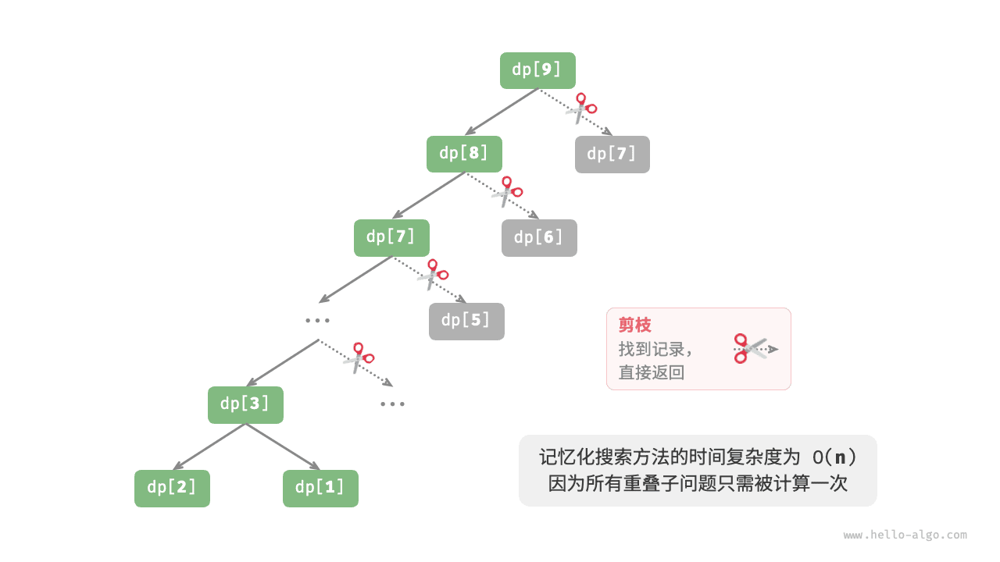

### 方法三：动态规划

**记忆化搜索是一种“从顶至底”的方法**：我们从原问题（根节点）开始，递归地将较大子问题分解为较小子问题，直至解已知的最小子问题（叶节点）。之后，通过回溯逐层收集子问题的解，构建出原问题的解。

与之相反，**动态规划是一种“从底至顶”的方法**：从最小子问题的解开始，迭代地构建更大子问题的解，直至得到原问题的解。

由于动态规划不包含回溯过程，因此只需使用循环迭代实现，无须使用递归。在以下代码中，我们初始化一个数组 `dp` 来存储子问题的解，它起到了与记忆化搜索中数组 `mem` 相同的记录作用：

```python
def climbing_stairs_dp(n: int) -> int:
    """爬楼梯：动态规划"""
    if n == 1 or n == 2:
        return n
    # 初始化 dp 表，用于存储子问题的解
    dp = [0] * (n + 1)
    # 初始状态：预设最小子问题的解
    dp[1], dp[2] = 1, 2
    # 状态转移：从较小子问题逐步求解较大子问题
    for i in range(3, n + 1):
        dp[i] = dp[i - 1] + dp[i - 2]
    return dp[n]
```


下图模拟了以上代码的执行过程。


与回溯算法一样，动态规划也使用“状态”概念来表示问题求解的特定阶段，每个状态都对应一个子问题以及相应的局部最优解。例如，爬楼梯问题的状态定义为当前所在楼梯阶数 i 。

根据以上内容，我们可以总结出动态规划的常用术语。

- 将数组 `dp` 称为 <u>dp 表</u>，dp[i] 表示状态 i 对应子问题的解。
- 将最小子问题对应的状态（第 1 阶和第 2 阶楼梯）称为<u>初始状态</u>。
- 将递推公式 dp[i] = dp[i-1] + dp[i-2] 称为<u>状态转移方程</u>。

### 空间优化

细心的读者可能发现了，**由于 dp[i] 只与 dp[i-1] 和 dp[i-2] 有关，因此我们无须使用一个数组 `dp` 来存储所有子问题的解**，而只需两个变量滚动前进即可。代码如下所示：

```python
def climbing_stairs_dp_comp(n: int) -> int:
    """爬楼梯：空间优化后的动态规划"""
    if n == 1 or n == 2:
        return n
    a, b = 1, 2
    for _ in range(3, n + 1):
        a, b = b, a + b
    return b
```


观察以上代码，由于省去了数组 `dp` 占用的空间，因此空间复杂度从 O(n) 降至 O(1) 。

在动态规划问题中，当前状态往往仅与前面有限个状态有关，这时我们可以只保留必要的状态，通过“降维”来节省内存空间。**这种空间优化技巧被称为“滚动变量”或“滚动数组”**。

## 动态规划问题特性


在上一节中，我们学习了动态规划是如何通过子问题分解来求解原问题的。实际上，子问题分解是一种通用的算法思路，在分治、动态规划、回溯中的侧重点不同。

- 分治算法递归地将原问题划分为多个相互独立的子问题，直至最小子问题，并在回溯中合并子问题的解，最终得到原问题的解。
- 动态规划也对问题进行递归分解，但与分治算法的主要区别是，动态规划中的子问题是相互依赖的，在分解过程中会出现许多重叠子问题。
- 回溯算法在尝试和回退中穷举所有可能的解，并通过剪枝避免不必要的搜索分支。原问题的解由一系列决策步骤构成，我们可以将每个决策步骤之前的子序列看作一个子问题。

实际上，动态规划常用来求解最优化问题，它们不仅包含重叠子问题，还具有另外两大特性：最优子结构、无后效性。

### 最优子结构

我们对爬楼梯问题稍作改动，使之更加适合展示最优子结构概念。

> **【爬楼梯最小代价】**
> 给定一个楼梯，你每步可以上 1 阶或者 2 阶，每一阶楼梯上都贴有一个非负整数，表示你在该台阶所需要付出的代价。给定一个非负整数数组 cost ，其中 cost[i] 表示在第 i 个台阶需要付出的代价，cost[0] 为地面（起始点）。请计算最少需要付出多少代价才能到达顶部？

如下图所示，若第 1、2、3 阶的代价分别为 1、10、1 ，则从地面爬到第 3 阶的最小代价为 2 。

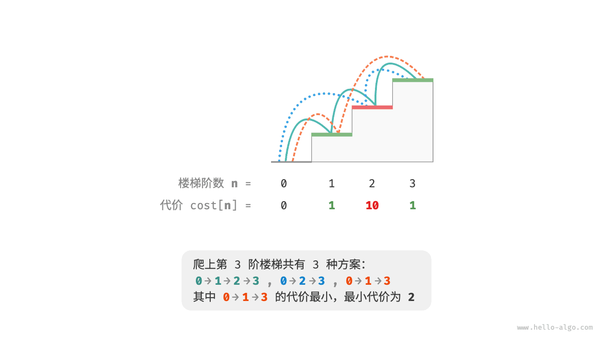

设 dp[i] 为爬到第 i 阶累计付出的代价，由于第 i 阶只可能从 i - 1 阶或 i - 2 阶走来，因此 dp[i] 只可能等于 dp[i - 1] + cost[i] 或 dp[i - 2] + cost[i] 。为了尽可能减少代价，我们应该选择两者中较小的那一个：

**dp[i] = min(dp[i-1], dp[i-2]) + cost[i]**


这便可以引出最优子结构的含义：**原问题的最优解是从子问题的最优解构建得来的**。

本题显然具有最优子结构：我们从两个子问题最优解 dp[i-1] 和 dp[i-2] 中挑选出较优的那一个，并用它构建出原问题 dp[i] 的最优解。

那么，上一节的爬楼梯题目有没有最优子结构呢？它的目标是求解方案数量，看似是一个计数问题，但如果换一种问法：“求解最大方案数量”。我们意外地发现，**虽然题目修改前后是等价的，但最优子结构浮现出来了**：第 n 阶最大方案数量等于第 n-1 阶和第 n-2 阶最大方案数量之和。所以说，最优子结构的解释方式比较灵活，在不同问题中会有不同的含义。

根据状态转移方程，以及初始状态 dp[1] = cost[1] 和 dp[2] = cost[2] ，我们就可以得到动态规划代码：

```python
def min_cost_climbing_stairs_dp(cost: list[int]) -> int:
    """爬楼梯最小代价：动态规划"""
    n = len(cost) - 1
    if n == 1 or n == 2:
        return cost[n]
    # 初始化 dp 表，用于存储子问题的解
    dp = [0] * (n + 1)
    # 初始状态：预设最小子问题的解
    dp[1], dp[2] = cost[1], cost[2]
    # 状态转移：从较小子问题逐步求解较大子问题
    for i in range(3, n + 1):
        dp[i] = min(dp[i - 1], dp[i - 2]) + cost[i]
    return dp[n]
```


下图展示了以上代码的动态规划过程。


本题也可以进行空间优化，将一维压缩至零维，使得空间复杂度从 O(n) 降至 O(1) ：

```python
def min_cost_climbing_stairs_dp_comp(cost: list[int]) -> int:
    """爬楼梯最小代价：空间优化后的动态规划"""
    n = len(cost) - 1
    if n == 1 or n == 2:
        return cost[n]
    a, b = cost[1], cost[2]
    for i in range(3, n + 1):
        a, b = b, min(a, b) + cost[i]
    return b
```


### 无后效性

无后效性是动态规划能够有效解决问题的重要特性之一，其定义为：**给定一个确定的状态，它的未来发展只与当前状态有关，而与过去经历的所有状态无关**。

以爬楼梯问题为例，给定状态 i ，它会发展出状态 i+1 和状态 i+2 ，分别对应跳 1 步和跳 2 步。在做出这两种选择时，我们无须考虑状态 i 之前的状态，它们对状态 i 的未来没有影响。

然而，如果我们给爬楼梯问题添加一个约束，情况就不一样了。

> **【带约束爬楼梯】**
> 给定一个共有 n 阶的楼梯，你每步可以上 1 阶或者 2 阶，**但不能连续两轮跳 1 阶**，请问有多少种方案可以爬到楼顶？

如下图所示，爬上第 3 阶仅剩 2 种可行方案，其中连续三次跳 1 阶的方案不满足约束条件，因此被舍弃。

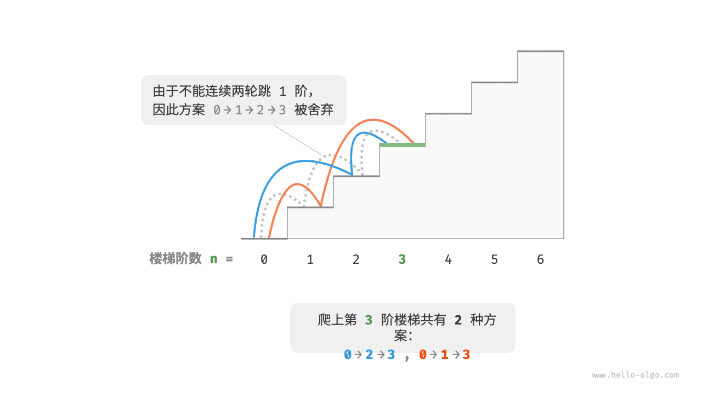

在该问题中，如果前一次跳的是 1 阶，那么下一次就必须跳 2 阶。这意味着，**下一步选择不能由当前状态（当前所在楼梯阶数）独立决定，还和前一个状态（前一次所在楼梯阶数）有关**。

不难发现，此问题已不满足无后效性，状态转移方程 dp[i] = dp[i-1] + dp[i-2] 也失效了，因为 dp[i-1] 代表本轮跳 1 阶，但其中包含了许多“前一次是跳 1 阶上来的”方案，而为了满足约束，我们就不能将 dp[i-1] 直接计入 dp[i] 中。

为此，我们需要扩展状态定义：**状态 [i, j] 表示处在第 i 阶并且前一次跳了 j 阶**，其中 j ∈ {1, 2} 。此状态定义有效地区分了前一次跳了 1 阶还是 2 阶，我们可以据此判断当前状态是从何而来的。

- 当前一次跳了 1 阶时，再前一次只能选择跳 2 阶，即 dp[i, 1] 只能从 dp[i-1, 2] 转移过来。
- 当前一次跳了 2 阶时，再前一次可选择跳 1 阶或跳 2 阶，即 dp[i, 2] 可以从 dp[i-2, 1] 或 dp[i-2, 2] 转移过来。

如下图所示，在该定义下，dp[i, j] 表示状态 [i, j] 对应的方案数。此时状态转移方程为：

**dp[i, 1] = dp[i-1, 2]，dp[i, 2] = dp[i-2, 1] + dp[i-2, 2]**


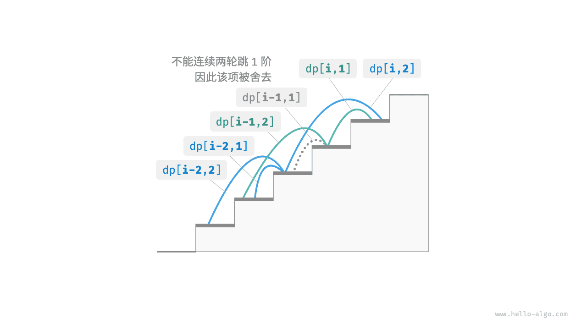

最终，返回 dp[n, 1] + dp[n, 2] 即可，两者之和代表爬到第 n 阶的方案总数：

```python
def climbing_stairs_constraint_dp(n: int) -> int:
    """带约束爬楼梯：动态规划"""
    if n == 1 or n == 2:
        return 1
    # 初始化 dp 表，用于存储子问题的解
    dp = [[0] * 3 for _ in range(n + 1)]
    # 初始状态：预设最小子问题的解
    dp[1][1], dp[1][2] = 1, 0
    dp[2][1], dp[2][2] = 0, 1
    # 状态转移：从较小子问题逐步求解较大子问题
    for i in range(3, n + 1):
        dp[i][1] = dp[i - 1][2]
        dp[i][2] = dp[i - 2][1] + dp[i - 2][2]
    return dp[n][1] + dp[n][2]
```


在上面的案例中，由于仅需多考虑前面一个状态，因此我们仍然可以通过扩展状态定义，使得问题重新满足无后效性。然而，某些问题具有非常严重的“有后效性”。

> **【爬楼梯与障碍生成】**
> 给定一个共有 n 阶的楼梯，你每步可以上 1 阶或者 2 阶。**规定当爬到第 i 阶时，系统自动会在第 2i 阶上放上障碍物，之后所有轮都不允许跳到第 2i 阶上**。例如，前两轮分别跳到了第 2、3 阶上，则之后就不能跳到第 4、6 阶上。请问有多少种方案可以爬到楼顶？

在这个问题中，下次跳跃依赖过去所有的状态，因为每一次跳跃都会在更高的阶梯上设置障碍，并影响未来的跳跃。对于这类问题，动态规划往往难以解决。

实际上，许多复杂的组合优化问题（例如旅行商问题）不满足无后效性。对于这类问题，我们通常会选择使用其他方法，例如启发式搜索、遗传算法、强化学习等，从而在有限时间内得到可用的局部最优解。

## 动态规划解题思路


上两节介绍了动态规划问题的主要特征，接下来我们一起探究两个更加实用的问题。

1. 如何判断一个问题是不是动态规划问题？
2. 求解动态规划问题该从何处入手，完整步骤是什么？

### 问题判断

总的来说，如果一个问题包含重叠子问题、最优子结构，并满足无后效性，那么它通常适合用动态规划求解。然而，我们很难从问题描述中直接提取出这些特性。因此我们通常会放宽条件，**先观察问题是否适合使用回溯（穷举）解决**。

**适合用回溯解决的问题通常满足“决策树模型”**，这种问题可以使用树形结构来描述，其中每一个节点代表一个决策，每一条路径代表一个决策序列。

换句话说，如果问题包含明确的决策概念，并且解是通过一系列决策产生的，那么它就满足决策树模型，通常可以使用回溯来解决。

在此基础上，动态规划问题还有一些判断的“加分项”。

- 问题包含最大（小）或最多（少）等最优化描述。
- 问题的状态能够使用一个列表、多维矩阵或树来表示，并且一个状态与其周围的状态存在递推关系。

相应地，也存在一些“减分项”。

- 问题的目标是找出所有可能的解决方案，而不是找出最优解。
- 问题描述中有明显的排列组合的特征，需要返回具体的多个方案。

如果一个问题满足决策树模型，并具有较为明显的“加分项”，我们就可以假设它是一个动态规划问题，并在求解过程中验证它。

### 问题求解步骤

动态规划的解题流程会因问题的性质和难度而有所不同，但通常遵循以下步骤：描述决策，定义状态，建立 dp 表，推导状态转移方程，确定边界条件等。

为了更形象地展示解题步骤，我们使用一个经典问题“最小路径和”来举例。

> **【问题】**
> 给定一个 n × m 的二维网格 `grid` ，网格中的每个单元格包含一个非负整数，表示该单元格的代价。机器人以左上角单元格为起始点，每次只能向下或者向右移动一步，直至到达右下角单元格。请返回从左上角到右下角的最小路径和。

下图展示了一个例子，给定网格的最小路径和为 13 。

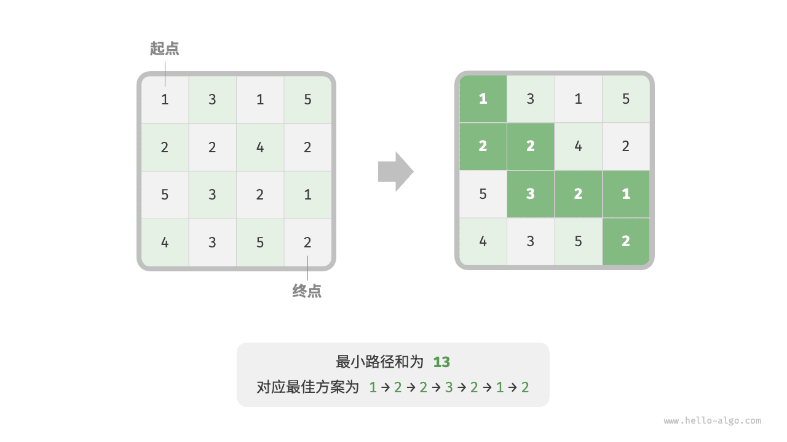

**第一步：思考每轮的决策，定义状态，从而得到 dp 表**

本题的每一轮的决策就是从当前格子向下或向右走一步。设当前格子的行列索引为 [i, j] ，则向下或向右走一步后，索引变为 [i+1, j] 或 [i, j+1] 。因此，状态应包含行索引和列索引两个变量，记为 [i, j] 。

状态 [i, j] 对应的子问题为：从起始点 [0, 0] 走到 [i, j] 的最小路径和，解记为 dp[i, j] 。

至此，我们就得到了下图所示的二维 dp 矩阵，其尺寸与输入网格 grid 相同。

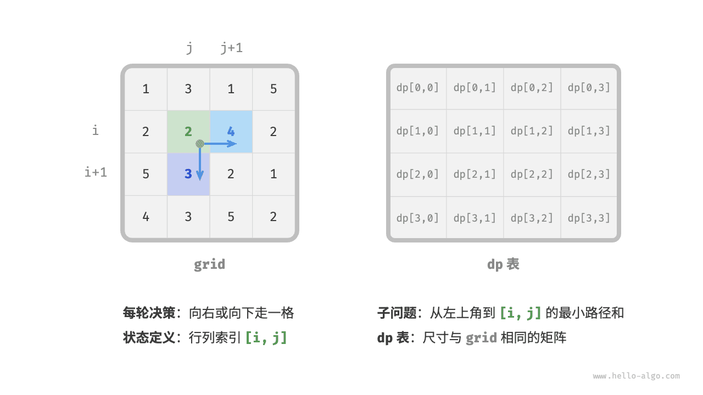

> **【备注】**
> 动态规划和回溯过程可以描述为一个决策序列，而状态由所有决策变量构成。它应当包含描述解题进度的所有变量，其包含了足够的信息，能够用来推导出下一个状态。
>
> 每个状态都对应一个子问题，我们会定义一个 dp 表来存储所有子问题的解，状态的每个独立变量都是 dp 表的一个维度。从本质上看，dp 表是状态和子问题的解之间的映射。

**第二步：找出最优子结构，进而推导出状态转移方程**


对于状态 [i, j] ，它只能从上边格子 [i-1, j] 和左边格子 [i, j-1] 转移而来。因此最优子结构为：到达 [i, j] 的最小路径和由 [i, j-1] 的最小路径和与 [i-1, j] 的最小路径和中较小的那一个决定。

根据以上分析，可推出下图所示的状态转移方程：

**dp[i, j] = min(dp[i-1, j], dp[i, j-1]) + grid[i, j]**


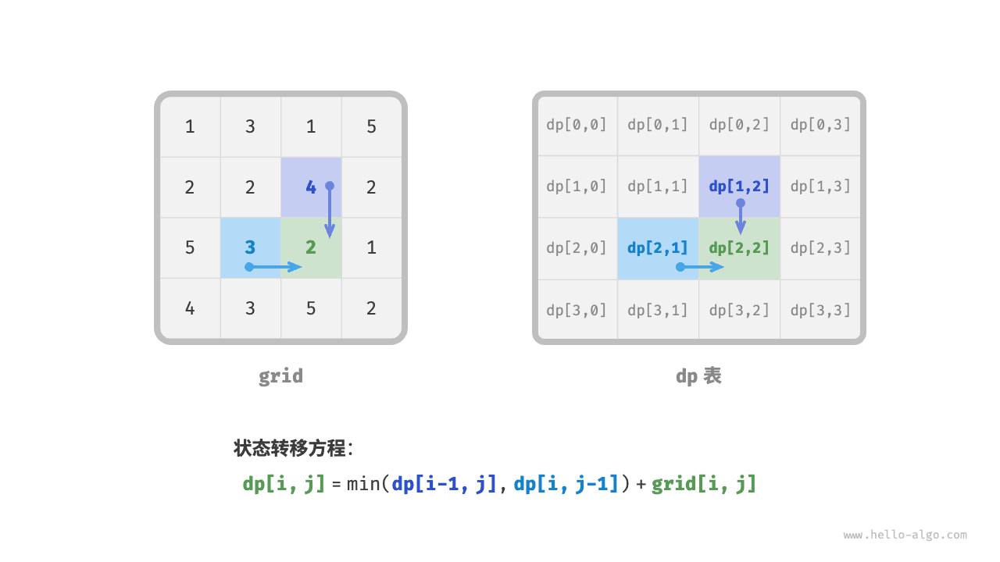

> **【备注】**
> 根据定义好的 dp 表，思考原问题和子问题的关系，找出通过子问题的最优解来构造原问题的最优解的方法，即最优子结构。
>
> 一旦我们找到了最优子结构，就可以使用它来构建出状态转移方程。

**第三步：确定边界条件和状态转移顺序**

在本题中，处在首行的状态只能从其左边的状态得来，处在首列的状态只能从其上边的状态得来，因此首行 i = 0 和首列 j = 0 是边界条件。

如下图所示，由于每个格子是由其左方格子和上方格子转移而来，因此我们使用循环来遍历矩阵，外循环遍历各行，内循环遍历各列。

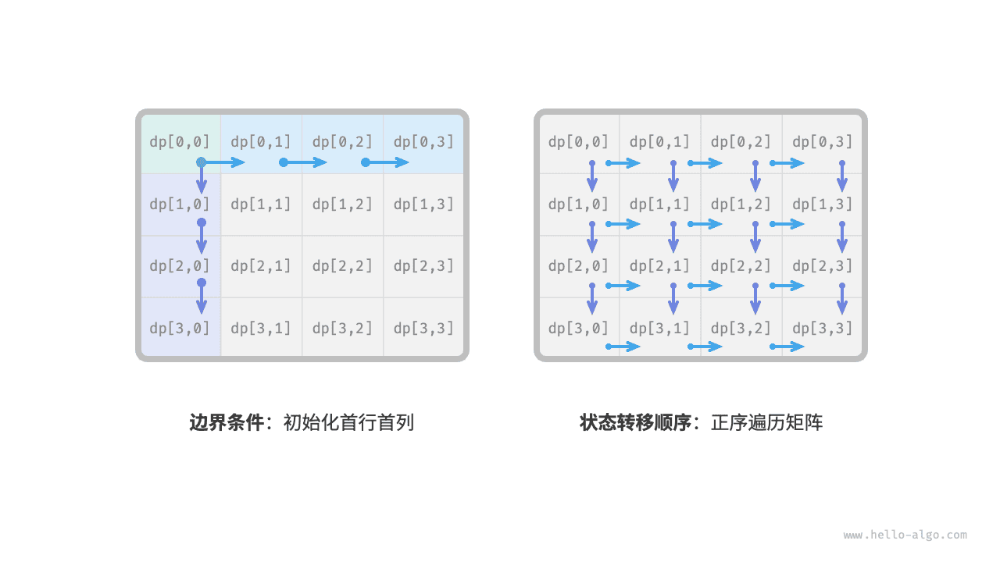

> **【备注】**
> 边界条件在动态规划中用于初始化 dp 表，在搜索中用于剪枝。
>
> 状态转移顺序的核心是要保证在计算当前问题的解时，所有它依赖的更小子问题的解都已经被正确地计算出来。

根据以上分析，我们已经可以直接写出动态规划代码。然而子问题分解是一种从顶至底的思想，因此按照“暴力搜索 → 记忆化搜索 → 动态规划”的顺序实现更加符合思维习惯。

#### 方法一：暴力搜索

从状态 [i, j] 开始搜索，不断分解为更小的状态 [i-1, j] 和 [i, j-1] ，递归函数包括以下要素。

- **递归参数**：状态 [i, j] 。
- **返回值**：从 [0, 0] 到 [i, j] 的最小路径和 dp[i, j] 。
- **终止条件**：当 i = 0 且 j = 0 时，返回代价 grid[0, 0] 。
- **剪枝**：当 i < 0 时或 j < 0 时索引越界，此时返回代价 +∞ ，代表不可行。

实现代码如下：

```python
def min_path_sum_dfs(grid: list[list[int]], i: int, j: int) -> int:
    """最小路径和：暴力搜索"""
    # 若为左上角单元格，则终止搜索
    if i == 0 and j == 0:
        return grid[0][0]
    # 若行列索引越界，则返回 +∞ 代价
    if i < 0 or j < 0:
        return float("inf")
    # 计算从左上角到 (i-1, j) 和 (i, j-1) 的最小路径代价
    up = min_path_sum_dfs(grid, i - 1, j)
    left = min_path_sum_dfs(grid, i, j - 1)
    # 返回从左上角到 (i, j) 的最小路径代价
    return min(left, up) + grid[i][j]
```


下图给出了以 dp[2, 1] 为根节点的递归树，其中包含一些重叠子问题，其数量会随着网格 `grid` 的尺寸变大而急剧增多。

从本质上看，造成重叠子问题的原因为：**存在多条路径可以从左上角到达某一单元格**。

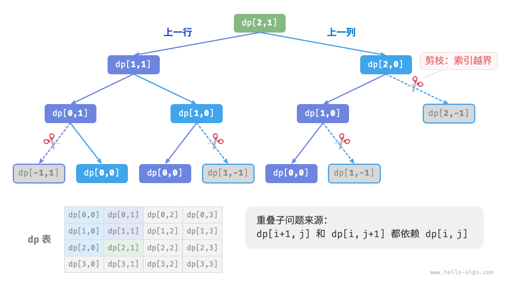

每个状态都有向下和向右两种选择，从左上角走到右下角总共需要 m + n - 2 步，所以最差时间复杂度为 O(2^(m + n)) ，其中 n 和 m 分别为网格的行数和列数。请注意，这种计算方式未考虑临近网格边界的情况，当到达网格边界时只剩下一种选择，因此实际的路径数量会少一些。

#### 方法二：记忆化搜索

我们引入一个和网格 `grid` 相同尺寸的记忆列表 `mem` ，用于记录各个子问题的解，并将重叠子问题进行剪枝：

```python
def min_path_sum_dfs_mem(
    grid: list[list[int]], mem: list[list[int]], i: int, j: int
) -> int:
    """最小路径和：记忆化搜索"""
    # 若为左上角单元格，则终止搜索
    if i == 0 and j == 0:
        return grid[0][0]
    # 若行列索引越界，则返回 +∞ 代价
    if i < 0 or j < 0:
        return float("inf")
    # 若已有记录，则直接返回
    if mem[i][j] != -1:
        return mem[i][j]
    # 左边和上边单元格的最小路径代价
    up = min_path_sum_dfs_mem(grid, mem, i - 1, j)
    left = min_path_sum_dfs_mem(grid, mem, i, j - 1)
    # 记录并返回左上角到 (i, j) 的最小路径代价
    mem[i][j] = min(left, up) + grid[i][j]
    return mem[i][j]
```


如下图所示，在引入记忆化后，所有子问题的解只需计算一次，因此时间复杂度取决于状态总数，即网格尺寸 O(nm) 。

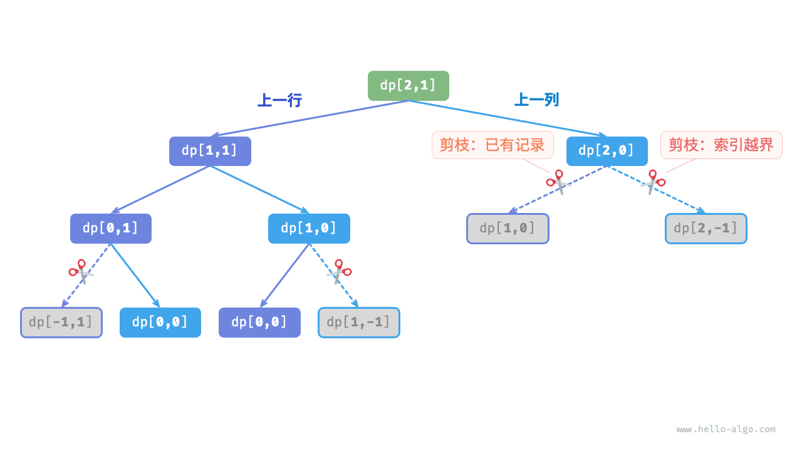

#### 方法三：动态规划

基于迭代实现动态规划解法，代码如下所示：

```python
def min_path_sum_dp(grid: list[list[int]]) -> int:
    """最小路径和：动态规划"""
    n, m = len(grid), len(grid[0])
    # 初始化 dp 表
    dp = [[0] * m for _ in range(n)]
    dp[0][0] = grid[0][0]
    # 状态转移：首行
    for j in range(1, m):
        dp[0][j] = dp[0][j - 1] + grid[0][j]
    # 状态转移：首列
    for i in range(1, n):
        dp[i][0] = dp[i - 1][0] + grid[i][0]
    # 状态转移：其余行和列
    for i in range(1, n):
        for j in range(1, m):
            dp[i][j] = min(dp[i][j - 1], dp[i - 1][j]) + grid[i][j]
    return dp[n - 1][m - 1]
```


下图展示了最小路径和的状态转移过程，其遍历了整个网格，**因此时间复杂度为 O(nm)** 。

数组 `dp` 大小为 n × m ，**因此空间复杂度为 O(nm)** 。

#### 空间优化

由于每个格子只与其左边和上边的格子有关，因此我们可以只用一个单行数组来实现 dp 表。

请注意，因为数组 `dp` 只能表示一行的状态，所以我们无法提前初始化首列状态，而是在遍历每行时更新它：

```python
def min_path_sum_dp_comp(grid: list[list[int]]) -> int:
    """最小路径和：空间优化后的动态规划"""
    n, m = len(grid), len(grid[0])
    # 初始化 dp 表
    dp = [0] * m
    # 状态转移：首行
    dp[0] = grid[0][0]
    for j in range(1, m):
        dp[j] = dp[j - 1] + grid[0][j]
    # 状态转移：其余行
    for i in range(1, n):
        # 状态转移：首列
        dp[0] = dp[0] + grid[i][0]
        # 状态转移：其余列
        for j in range(1, m):
            dp[j] = min(dp[j - 1], dp[j]) + grid[i][j]
    return dp[m - 1]
```

## 示例：0-1 背包问题

背包问题是动态规划最常见的问题形式，并有 0-1 背包、完全背包、多重背包等变种。

> **【问题】**
> 给定 n 个物品，第 i 个物品的重量为 `wgt[i-1]`、价值为 `val[i-1]` ，和一个容量为 cap 的背包。每个物品只能选择一次，问在限定背包容量下能放入物品的最大价值。

由于物品编号 i 从 1 开始计数、数组索引从 0 开始计数，因此物品 i 对应重量 `wgt[i-1]` 和价值 `val[i-1]` 。

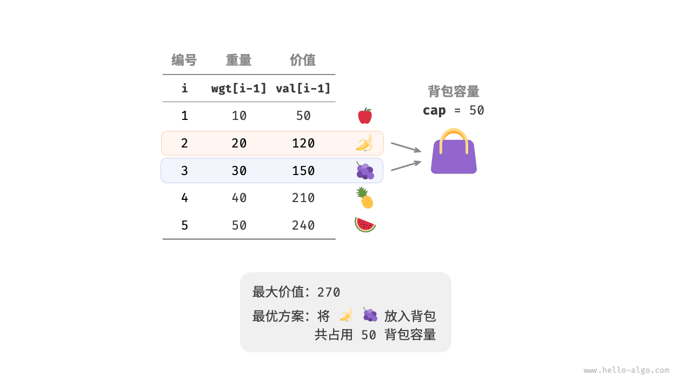

该问题由 n 轮决策组成，每个物品都有“不放入”和“放入”两种决策，满足决策树模型；目标是“限定容量下的最大价值”，因此它是一个动态规划问题。

**第一步：定义状态**。对每个物品，不放入则背包容量不变，放入则背包容量减小。由此得到状态定义：当前物品编号 i 和背包容量 c ，记为 [i, c] 。状态 [i, c] 对应的子问题为：**前 i 个物品在容量为 c 的背包中的最大价值**，记为 `dp[i, c]` 。待求解的是 `dp[n, cap]` ，因此需要尺寸为 (n + 1) × (cap + 1) 的二维 dp 表。

**第二步：推导状态转移方程**。做出物品 i 的决策后，剩余的是前 i-1 个物品的子问题。

- **不放入物品 i** ：背包容量不变，状态转移至 [i-1, c] 。
- **放入物品 i** ：背包容量减少 `wgt[i-1]` ，价值增加 `val[i-1]` ，状态转移至 [i-1, c - wgt[i-1]] 。

于是最优子结构为：**`dp[i, c]` 等于两种方案中价值更大的那一个**，即

**dp[i, c] = max(dp[i-1, c], dp[i-1, c - wgt[i-1]] + val[i-1])**

若当前物品重量超出剩余容量 c ，则只能选择不放入。

**第三步：确定边界条件**。无物品或背包容量为 0 时最大价值为 0 ，即首列 `dp[i, 0]` 和首行 `dp[0, c]` 都等于 0 。当前状态由上方和左上方转移而来，因此两层循环正序遍历即可。

按“暴力搜索 → 记忆化搜索 → 动态规划”的顺序实现：

```python
def knapsack_dfs(wgt: list[int], val: list[int], i: int, c: int) -> int:
    """0-1 背包：暴力搜索"""
    # 若已选完所有物品或背包无剩余容量，则返回价值 0
    if i == 0 or c == 0:
        return 0
    # 若超过背包容量，则只能选择不放入背包
    if wgt[i - 1] > c:
        return knapsack_dfs(wgt, val, i - 1, c)
    # 计算不放入和放入物品 i 的最大价值
    no = knapsack_dfs(wgt, val, i - 1, c)
    yes = knapsack_dfs(wgt, val, i - 1, c - wgt[i - 1]) + val[i - 1]
    # 返回两种方案中价值更大的那一个
    return max(no, yes)


def knapsack_dfs_mem(
    wgt: list[int], val: list[int], mem: list[list[int]], i: int, c: int
) -> int:
    """0-1 背包：记忆化搜索"""
    # 若已选完所有物品或背包无剩余容量，则返回价值 0
    if i == 0 or c == 0:
        return 0
    # 若已有记录，则直接返回
    if mem[i][c] != -1:
        return mem[i][c]
    # 若超过背包容量，则只能选择不放入背包
    if wgt[i - 1] > c:
        return knapsack_dfs_mem(wgt, val, mem, i - 1, c)
    # 计算不放入和放入物品 i 的最大价值
    no = knapsack_dfs_mem(wgt, val, mem, i - 1, c)
    yes = knapsack_dfs_mem(wgt, val, mem, i - 1, c - wgt[i - 1]) + val[i - 1]
    # 记录并返回两种方案中价值更大的那一个
    mem[i][c] = max(no, yes)
    return mem[i][c]
```

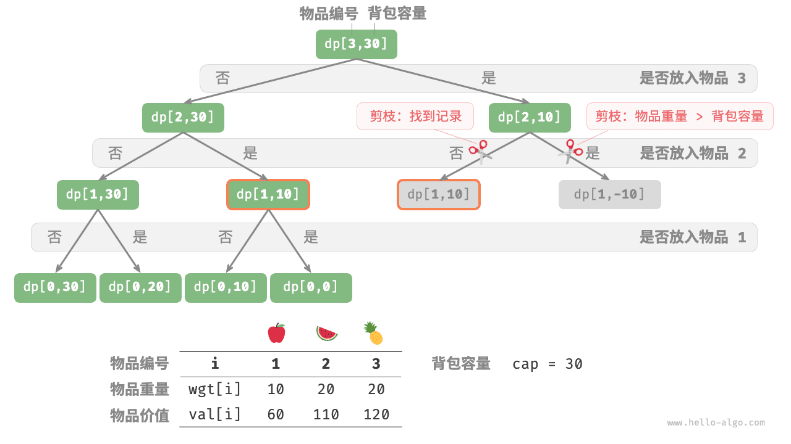

迭代形式的动态规划，以及把二维 dp 表压缩成一维的“空间优化”版本如下。**请注意空间优化时必须倒序遍历容量 c** ：`dp[c]` 依赖的是“上一行”的 `dp[c - wgt[i-1]]` ，正序遍历会让它读到本行已经更新过的值，等价于同一个物品被重复选取，从而悄悄变成完全背包。这是背包问题最常见的错误。

```python
def knapsack_dp(wgt: list[int], val: list[int], cap: int) -> int:
    """0-1 背包：动态规划"""
    n = len(wgt)
    # 初始化 dp 表
    dp = [[0] * (cap + 1) for _ in range(n + 1)]
    # 状态转移
    for i in range(1, n + 1):
        for c in range(1, cap + 1):
            if wgt[i - 1] > c:
                # 若超过背包容量，则不选物品 i
                dp[i][c] = dp[i - 1][c]
            else:
                # 不选和选物品 i 这两种方案的较大值
                dp[i][c] = max(dp[i - 1][c], dp[i - 1][c - wgt[i - 1]] + val[i - 1])
    return dp[n][cap]


def knapsack_dp_comp(wgt: list[int], val: list[int], cap: int) -> int:
    """0-1 背包：空间优化后的动态规划"""
    n = len(wgt)
    # 初始化 dp 表
    dp = [0] * (cap + 1)
    # 状态转移
    for i in range(1, n + 1):
        # 倒序遍历
        for c in range(cap, 0, -1):
            if wgt[i - 1] > c:
                dp[c] = dp[c]  # 若超过背包容量，则不选物品 i
            else:
                # 不选和选物品 i 这两种方案的较大值
                dp[c] = max(dp[c], dp[c - wgt[i - 1]] + val[i - 1])
    return dp[cap]
```

## 示例：完全背包与零钱兑换

完全背包与 0-1 背包唯一的区别是**每个物品可以重复选取**，因此把物品 i 放入背包后，**仍可以从前 i 个物品中选择**，状态转移方程变为：

**dp[i, c] = max(dp[i-1, c], dp[i, c - wgt[i-1]] + val[i-1])**

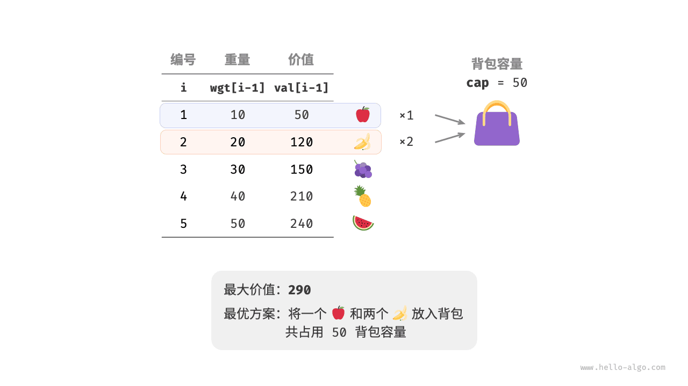

对比 0-1 背包的代码，只有状态转移中的一处从 i-1 变成了 i ，其余完全一致：

```python
def unbounded_knapsack_dp(wgt: list[int], val: list[int], cap: int) -> int:
    """完全背包：动态规划"""
    n = len(wgt)
    dp = [[0] * (cap + 1) for _ in range(n + 1)]
    for i in range(1, n + 1):
        for c in range(1, cap + 1):
            if wgt[i - 1] > c:
                dp[i][c] = dp[i - 1][c]
            else:
                dp[i][c] = max(dp[i - 1][c], dp[i][c - wgt[i - 1]] + val[i - 1])
    return dp[n][cap]


def unbounded_knapsack_dp_comp(wgt: list[int], val: list[int], cap: int) -> int:
    """完全背包：空间优化后的动态规划"""
    n = len(wgt)
    dp = [0] * (cap + 1)
    for i in range(1, n + 1):
        # 正序遍历
        for c in range(1, cap + 1):
            if wgt[i - 1] > c:
                dp[c] = dp[c]
            else:
                dp[c] = max(dp[c], dp[c - wgt[i - 1]] + val[i - 1])
    return dp[cap]
```

由于当前状态是从左边和上边转移而来，空间优化后应对每一行**正序**遍历——与 0-1 背包恰好相反，记住这个对照就不容易搞混。

零钱兑换是完全背包的一种特例：给定 n 种面额的硬币（可重复使用）和目标金额 amt ，求凑出该金额所需的最少硬币数量；若无法凑出则返回 -1 。

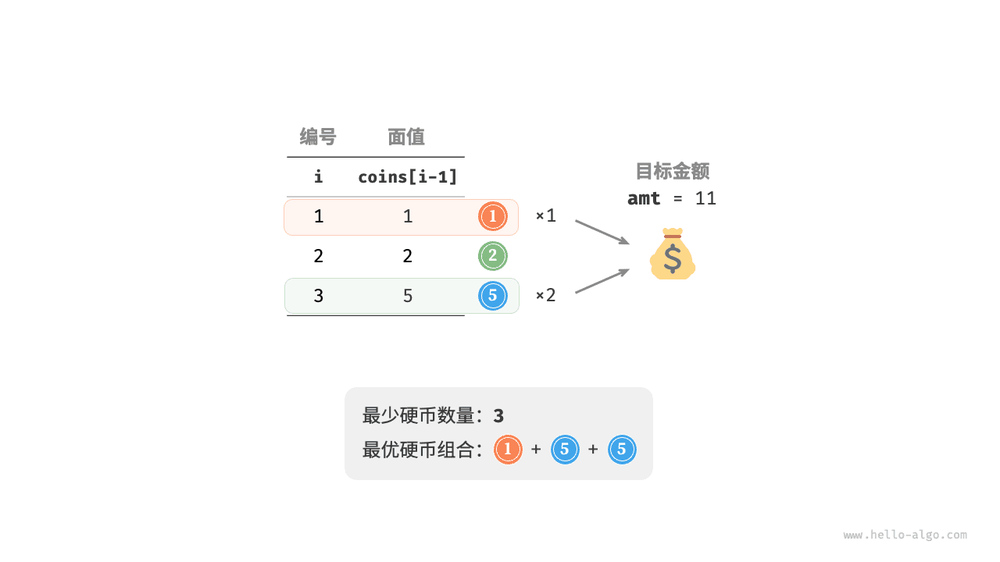

状态为“当前硬币编号 i 和剩余金额 a ”，子问题 `dp[i, a]` 表示前 i 种硬币凑出金额 a 所需的最少硬币数。边界条件为首行 `dp[0, a] = +∞`（无硬币可用），状态转移方程为：

**dp[i, a] = min(dp[i-1, a], dp[i, a - coins[i-1]] + 1)**

```python
def coin_change_dp(coins: list[int], amt: int) -> int:
    """零钱兑换：动态规划"""
    n = len(coins)
    MAX = amt + 1  # 用「比答案上界更大」的哨兵值代表 +∞
    # 初始化 dp 表
    dp = [[0] * (amt + 1) for _ in range(n + 1)]
    # 状态转移：首行
    for a in range(1, amt + 1):
        dp[0][a] = MAX
    # 状态转移：其余行和列
    for i in range(1, n + 1):
        for a in range(1, amt + 1):
            if coins[i - 1] > a:
                # 若超过目标金额，则不选硬币 i
                dp[i][a] = dp[i - 1][a]
            else:
                # 不选和选硬币 i 这两种方案的较小值
                dp[i][a] = min(dp[i - 1][a], dp[i][a - coins[i - 1]] + 1)
    return dp[n][amt] if dp[n][amt] != MAX else -1


def coin_change_dp_comp(coins: list[int], amt: int) -> int:
    """零钱兑换：空间优化后的动态规划"""
    n = len(coins)
    MAX = amt + 1
    dp = [MAX] * (amt + 1)
    dp[0] = 0
    for i in range(1, n + 1):
        # 正序遍历
        for a in range(1, amt + 1):
            if coins[i - 1] > a:
                dp[a] = dp[a]
            else:
                dp[a] = min(dp[a], dp[a - coins[i - 1]] + 1)
    return dp[amt] if dp[amt] != MAX else -1
```

> **贪心为什么解不了零钱兑换**：面额为 `[1, 3, 2]` 、目标金额为 6 时，贪心会先取最大的 3 ，得到 `3 + 2 + 1` 共 3 个硬币，而最优解是 `3 + 3` 共 2 个。只有当面额系统“每个面额都是下一个面额的整数倍”（如人民币 1、2、5、10）时贪心才成立。一般情况必须用动态规划，详见《贪心算法（面试选学）》。

## 示例：编辑距离

编辑距离（Levenshtein 距离）指两个字符串互相转换的最少修改次数，常用于信息检索与自然语言处理中度量序列相似度；在 LLM 工程里，它也出现在预测去重、模糊匹配和 diff 类评估指标中。

> **【问题】**
> 输入两个字符串 s 和 t ，返回将 s 转换为 t 所需的最少编辑步数。允许三种操作：插入一个字符、删除一个字符、将字符替换为任意一个字符。

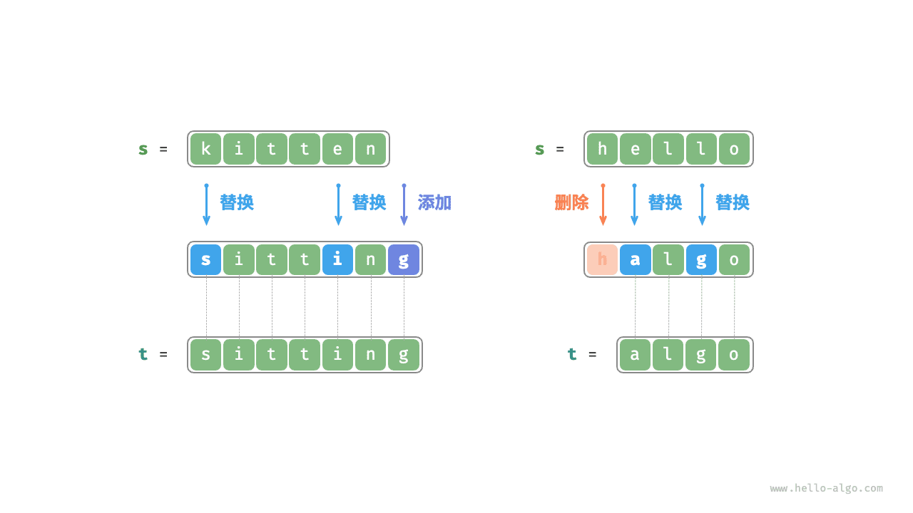

设 s 和 t 的长度分别为 n 和 m 。先比较两字符串的尾部字符：若相同则可跳过，继续考虑规模更小的问题；若不同则必须做一次编辑操作使其对齐。因此状态为“当前在 s 和 t 中考虑前 i 、前 j 个字符”，记为 [i, j] ，子问题 `dp[i, j]` 表示**将 s 的前 i 个字符改为 t 的前 j 个字符所需的最少编辑步数**，dp 表尺寸为 (n + 1) × (m + 1) 。

考虑尾部字符 `s[i-1]` 和 `t[j-1]` ，三种操作分别对应三个子问题：

1. 在 `s[i-1]` 之后插入 `t[j-1]` ，剩余子问题 `dp[i, j-1]` 。
2. 删除 `s[i-1]` ，剩余子问题 `dp[i-1, j]` 。
3. 把 `s[i-1]` 替换为 `t[j-1]` ，剩余子问题 `dp[i-1, j-1]` 。

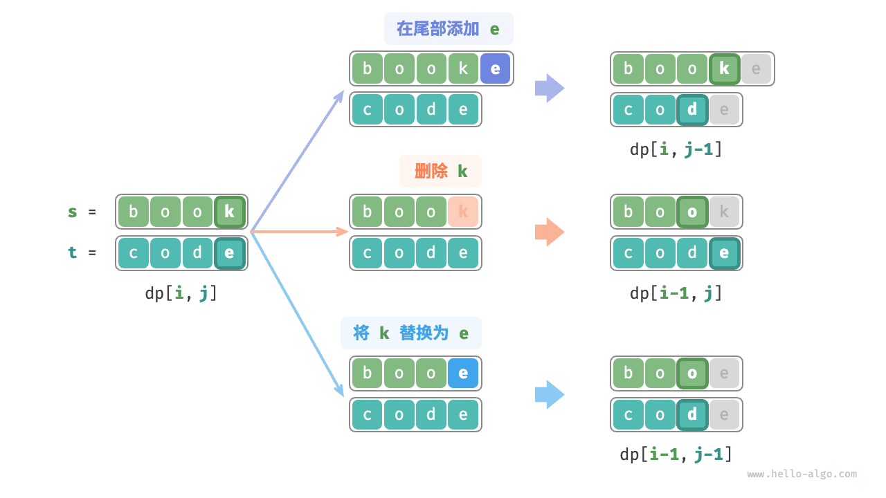

由此得到状态转移方程，边界条件为首行 `dp[0, j] = j` 与首列 `dp[i, 0] = i`（分别与空串对齐，需要 i 或 j 次增删）：

**dp[i, j] = min(dp[i, j-1] + 1, dp[i-1, j] + 1, dp[i-1, j-1])，当 s[i-1] ≠ t[j-1]；dp[i, j] = dp[i-1, j-1]，当 s[i-1] = t[j-1]**

```python
def edit_distance_dp(s: str, t: str) -> int:
    """编辑距离：动态规划"""
    n, m = len(s), len(t)
    dp = [[0] * (m + 1) for _ in range(n + 1)]
    # 状态转移：首行首列
    for i in range(1, n + 1):
        dp[i][0] = i
    for j in range(1, m + 1):
        dp[0][j] = j
    # 状态转移：其余行和列
    for i in range(1, n + 1):
        for j in range(1, m + 1):
            if s[i - 1] == t[j - 1]:
                # 若两字符相等，则直接跳过此两字符
                dp[i][j] = dp[i - 1][j - 1]
            else:
                # 最少编辑步数 = 插入、删除、替换这三种操作的最少编辑步数 + 1
                dp[i][j] = min(dp[i][j - 1], dp[i - 1][j], dp[i - 1][j - 1]) + 1
    return dp[n][m]


def edit_distance_dp_comp(s: str, t: str) -> int:
    """编辑距离：空间优化后的动态规划"""
    n, m = len(s), len(t)
    dp = [0] * (m + 1)
    # 状态转移：首行
    for j in range(1, m + 1):
        dp[j] = j
    # 状态转移：其余行
    for i in range(1, n + 1):
        # 状态转移：首列
        leftup = dp[0]  # 暂存 dp[i-1, j-1]
        dp[0] += 1
        # 状态转移：其余列
        for j in range(1, m + 1):
            temp = dp[j]
            if s[i - 1] == t[j - 1]:
                dp[j] = leftup
            else:
                dp[j] = min(dp[j - 1], dp[j], leftup) + 1
            leftup = temp  # 更新为下一轮的 dp[i-1, j-1]
    return dp[m]
```

一维压缩时 `dp[i-1, j-1]` 会被本行覆盖，因此必须用一个 `leftup` 变量暂存左上角，这是二维降一维最典型的技巧。时间复杂度 O(nm) ，空间复杂度 O(m) 。

---

---

> **来源**：本文转载自 [初探动态规划](https://raw.githubusercontent.com/krahets/hello-algo/main/docs/chapter_dynamic_programming/intro_to_dynamic_programming.md)，作者 krahets，许可 CC BY-NC-SA 4.0。抓取于 2026-09-13。
> 本文整合原书多个小节，其余章节：[动态规划问题特性](https://raw.githubusercontent.com/krahets/hello-algo/main/docs/chapter_dynamic_programming/dp_problem_features.md)、[动态规划解题思路](https://raw.githubusercontent.com/krahets/hello-algo/main/docs/chapter_dynamic_programming/dp_solution_pipeline.md)、[0-1 背包问题](https://raw.githubusercontent.com/krahets/hello-algo/main/docs/chapter_dynamic_programming/knapsack_problem.md)、[完全背包与零钱兑换](https://raw.githubusercontent.com/krahets/hello-algo/main/docs/chapter_dynamic_programming/unbounded_knapsack_problem.md)、[编辑距离问题](https://raw.githubusercontent.com/krahets/hello-algo/main/docs/chapter_dynamic_programming/edit_distance_problem.md)。图片已下载到本模块 `assets/` 目录并以相对路径引用。
> 原文中指向仓库完整代码的引用块已省略，完整可运行 Python 代码见 [hello-algo/codes/python](https://github.com/krahets/hello-algo/tree/main/codes/python)。
