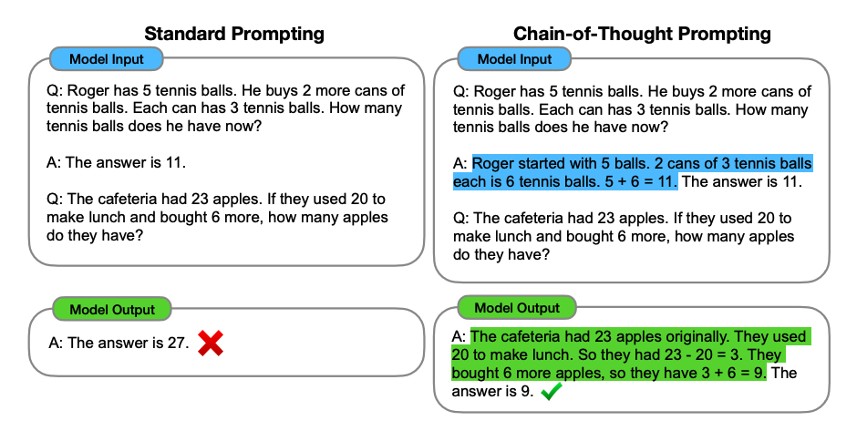
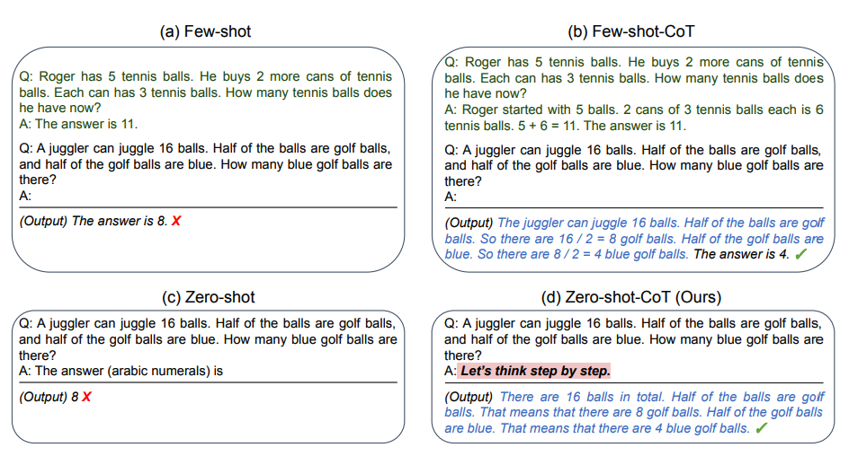
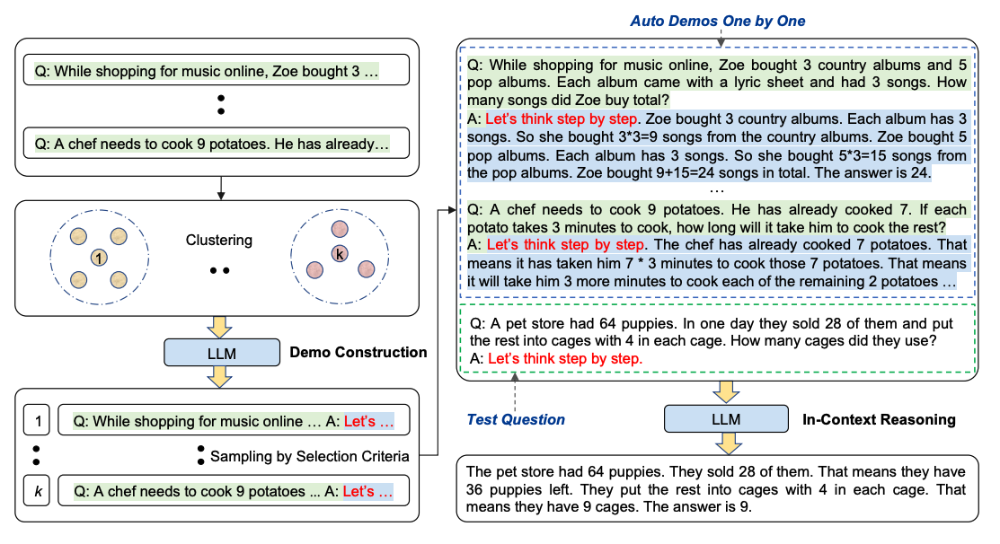

让模型"多写几步"能提升难题的正确率，让模型"多想几遍再投票"还能再提一截——这两招分别是**思维链提示**（Chain-of-Thought, CoT）与**自洽性**（Self-Consistency）。它们是一对：前者把推理显式化，后者在推理之上做统计。本文按"单路推理 → 多路采样 → 什么时候别再采样了"的顺序讲完，并给出可跑的投票实现与收益上限的计算。

## 思维链：把中间步骤放进演示

CoT 由 Wei et al. (2022) 提出，通过**中间推理步骤**（intermediate reasoning steps）启用复杂推理能力。它通常与少样本提示结合：在演示里不只写"输入→答案"，而是写"输入→怎么想→答案"。



*图：CoT 少样本提示与标准提示的对比（图片来源：Wei et al., 2022）*

回忆《零样本与少样本提示》里那道失败题，这次在演示里把推理步骤写出来：

```
The odd numbers in this group add up to an even number: 4, 8, 9, 15, 12, 2, 1.
A: Adding all the odd numbers (9, 15, 1) gives 25. The answer is False.

The odd numbers in this group add up to an even number: 17,  10, 19, 4, 8, 12, 24.
A: Adding all the odd numbers (17, 19) gives 36. The answer is True.

The odd numbers in this group add up to an even number: 16,  11, 14, 4, 8, 13, 24.
A: Adding all the odd numbers (11, 13) gives 24. The answer is True.

The odd numbers in this group add up to an even number: 17,  9, 10, 12, 13, 4, 2.
A: Adding all the odd numbers (17, 9, 13) gives 39. The answer is False.

The odd numbers in this group add up to an even number: 15, 32, 5, 13, 82, 7, 1.
A:
```

输出：

```
Adding all the odd numbers (15, 5, 13, 7, 1) gives 41. The answer is False.
```

提供推理步骤之后结果就对了，而且**一条示例就够**——原文给出的 1-shot 版本输出同样的推理链。论文里这组数字是 CoT 的起点（PaLM 540B，GSM8K 算术推理）：标准提示 17.9%，CoT 提示 56.9%，绝对提升 39 个点。作者同时指出：CoT 是一种**涌现能力**（emergent ability），只在足够大的模型上出现，小模型上强行加推理步骤反而掉分。

## 零样本 CoT

Kojima et al. (2022) 给出一个更省的用法：不写示例，只在原提示后附一句 "Let's think step by step"（让我们一步步思考）。



*图：零样本 CoT（图片来源：Kojima et al., 2022）*

同一篇里的例子，先不加咒语：

```
I went to the market and bought 10 apples. I gave 2 apples to the neighbor and 2 to the repairman. I then went and bought 5 more apples and ate 1. How many apples did I remain with?
```

老模型答 `11 apples`（错，正确是 10）。加上那句：

```
… How many apples did I remain with?

Let's think step by step.
```

模型给出分步过程并得到 10。在没条件准备大量示例时，这类"提示后缀"简单有效。

> **译注**：这一技巧的适用面已经明显收窄。对当前一代推理模型（OpenAI 的 o 系列之后的思考模式、GPT-6/5.6 一档，DeepSeek 的 `thinking` 档，Claude 的 extended thinking），推理过程是训练进模型能力的，再手动附加 "step by step" 通常无收益、偶尔有害；对普通非推理模型（各家 mini/nano/flash 档）它仍然是便宜的第一招。更完整的口径见《推理模型时代的提示原则》。

## 自动思维链（Auto-CoT）

人工编写有效且多样的 CoT 演示既费力又不一定最优。Zhang et al. (2022) 用 LLM 自身（配合 "Let's think step by step"）自动生成演示的推理链，并靠**多样性**来稀释错误链的影响：

- **阶段一：问题聚类**（question clustering）——把数据集里的问题划分成若干簇；
- **阶段二：演示采样**（demonstration sampling）——从每个簇挑一个代表问题，用零样本 CoT 加简单启发式（问题长度约 60 token、推理链约 5 步）生成其推理链。



*图：Auto-CoT 两阶段流程（图片来源：Zhang et al., 2022）*

代码开源在 [amazon-science/auto-cot](https://github.com/amazon-science/auto-cot)。工程上你大概不会手写这套聚类，但**"演示要多样，不要同质"**这条结论可以直接搬：给的示例覆盖不同形态，比同形态给十条更稳。

## 自洽性：多路采样 + 多数表决

Wang et al. (2022) 提出自洽性，目标是"替换思维链提示中朴素的贪心解码"：**采样多条、多样化的推理路径，再选出最一致的最终答案**。先看论文那道题：

```
When I was 6 my sister was half my age. Now I'm 70 how old is my sister?
```

贪心解码输出 `35`（错：6 岁时妹妹一半即 3 岁，差 3 岁，70 岁时应为 67）。改用 temperature > 0 对同一提示采样三条，会得到不同推理路径：

```
输出 1：When I was 6 my sister was half my age, so she was 3. Now I am 70, so she is 70 - 3 = 67. The answer is 67.
输出 2：When the narrator was 6, his sister was half his age, which is 3. Now that the narrator is 70, … 70 - 3 = 67 years old. The answer is 67.
输出 3：When I was 6 my sister was half my age, so she was 3. Now I am 70, so she is 70/2 = 35. The answer is 35.
```

三条里 67 占多数，于是最终答案是 67——正确。机制上说，自洽性对采样出的 (推理路径 r_i, 答案 a_i) 把 r 边缘化，只对最终答案取众数：`argmax_a Σ 1(a_i = a)`。它依赖一个经验事实：**错误答案往往各自错得五花八门，而正确答案倾向于殊途同归**。

论文报告的提升幅度（在 CoT 之上再叠自洽性）：GSM8K +17.9%、SVAMP +11.0%、AQuA +12.2%、StrategyQA +6.4%、ARC-challenge +3.9%。

### 可跑实现

```python
"""零样本 CoT / 自洽性多路采样：一个可直接跑的对照实验。

运行前置：
    pip install openai python-dotenv
"""
import os
import re
import time
from collections import Counter
from concurrent.futures import ThreadPoolExecutor

from dotenv import load_dotenv
from openai import OpenAI

load_dotenv()
client = OpenAI()
MODEL = os.getenv("OPENAI_MODEL", "gpt-5.4-mini")

# GSM8K 同族的小应用题，含年龄差陷阱、逆推、按天累加等典型坑
PROBLEMS = [
    ("我 6 岁时妹妹是我年龄的一半，现在我 70 岁，妹妹多大？", 67),
    ("树上有 9 只鸟，每天早上飞来 5 只，傍晚飞走 3 只，第几天结束时树上首次超过 30 只？", 11),
    ("一批笔记本卖出一半后又补进 6 本，现在共 16 本，原来有多少本？", 20),
    ("一件衣服先涨价 10%，再降价 10%，现价 99 元，原价多少元？", 100),
    ("机房里原有 9 台电脑，从周一到周四每天再装 5 台，现在共几台？", 29),
    ("老张有 58 个高尔夫球，周二丢了 23 个，周三又丢了 2 个，还剩几个？", 33),
]

COT_SUFFIX = "请一步步推理，最后单独一行输出：答案：<数字>"


def call(prompt: str, *, temperature: float = 0.0, max_tokens: int = 900) -> str:
    """一次调用，带最简退避重试（并发一高容易被限流）。"""
    for attempt in range(5):
        try:
            resp = client.responses.create(
                model=MODEL, input=prompt, temperature=temperature, max_output_tokens=max_tokens
            )
            return resp.output_text.strip()
        except Exception:
            time.sleep(5 * (attempt + 1))
    raise RuntimeError("连续 5 次失败")


def final_number(text: str) -> float | None:
    """从一段回答里抽出最终答案：优先"答案："行，退而取文末最后一个数字。"""
    m = re.search(r"答案[:：]\s*\**\s*(-?\d+(?:\.\d+)?)", text)
    if m:
        return float(m.group(1))
    m = re.search(r"(-?\d+(?:\.\d+)?)\s*$", text.strip().replace(",", "").replace("**", "").rstrip(".。"))
    return float(m.group(1)) if m else None


def vote(question: str, n: int = 5, temperature: float = 0.7):
    """N 路采样 + 多数表决。返回（众数, 票数分布）。"""
    prompt = f"{question}\n{COT_SUFFIX}"
    with ThreadPoolExecutor(max_workers=min(n, 3)) as pool:
        outs = list(pool.map(lambda _: call(prompt, temperature=temperature), range(n)))
    votes = Counter(v for v in (final_number(o) for o in outs) if v is not None)
    return (votes.most_common(1)[0] if votes else (None, 0)), dict(votes)


if __name__ == "__main__":
    # 基线：单路 CoT（temperature=0）
    t0 = time.time()
    hits = sum(final_number(call(f"{p}\n{COT_SUFFIX}")) == g for p, g in PROBLEMS)
    print(f"单路 CoT：{hits}/{len(PROBLEMS)}，用时 {time.time() - t0:.1f}s\n")

    # 自洽性：N=5、temperature=0.7
    t0, hits = time.time(), 0
    for p, gold in PROBLEMS:
        (best, count), dist = vote(p, n=5)
        hit = best is not None and abs(best - gold) < 1e-6
        hits += hit
        print(f"{'✓' if hit else '✗'} {p[:16]}… 票型={dist} 众数={best}（标准答案 {gold}）")
    print(f"\n自洽性 N=5：{hits}/{len(PROBLEMS)}，用时 {time.time() - t0:.1f}s")
```

本机实测输出：

```
单路 CoT：6/6，用时 30.7s

✓ 我 6 岁时妹妹是我年龄的一半，… 票型={67.0: 5}   众数=67.0（标准答案 67）
✓ 树上有 9 只鸟，每天早上飞来 … 票型={11.0: 4, 9.0: 1} 众数=11.0（标准答案 11）
✓ 一批笔记本卖出一半后又补进 … 票型={20.0: 5}   众数=20.0（标准答案 20）
✓ 一件衣服先涨价 10%，再降价 … 票型={100.0: 5}  众数=100.0（标准答案 100）
✓ 机房里原有 9 台电脑，从周一… 票型={29.0: 5}   众数=29.0（标准答案 29）
✓ 老张有 58 个高尔夫球，周二丢… 票型={33.0: 5}   众数=33.0（标准答案 33）

自洽性 N=5：6/6，用时 124.8s
```

同一台机器、同一批题、同一个模型，三档解码的代价是这样的：

| 解码方式 | 调用次数 | 正确率 | 墙钟时间 |
|---|---|---|---|
| 零样本直答（temperature=0） | 6 | 6/6 | 8.9s |
| 单路 CoT | 6 | 6/6 | 30.7s |
| 自洽性 N=5 | 30 | 6/6 | 124.8s |

**这一轮收益是 0，成本是 14 倍。** 只有一个细节泄露了信息：那道"鸟"的题在 5 路里跑出过 1 张 9 的错票，说明题目对模型并非完全稳定——只是 temperature=0 的那一路恰好走对了。把同一题再跑一遍，票型变成 `{11.0: 2, 19.0: 1, 9.0: 1, 10.0: 1}`：众数只剩 2/5，换句话说这次"多数表决"其实是** plurality（取最大票）而不是 majority（过半数）**。票型本身就是一个免费的置信度信号：`5:0` 的题不用采样，`2:1:1:1` 的题采样也救不了，该走的是升级路径。

## 什么时候别再用多路采样

投票不是玄学，它的收益可以提前算。假设单路答对概率是 p、各路错误相互独立，N 路多数表决的答对概率是 `Σ_{k > N/2} C(N,k) p^k (1-p)^(N-k)`。用标准库就能算：

```python
"""自洽性收益上限：纯组合数学，不联网。"""
from math import comb


def majority_accuracy(p: float, n: int) -> float:
    """单路正确率 p、N 路独立采样后多数表决的正确率。"""
    return sum(comb(n, k) * p**k * (1 - p) ** (n - k) for k in range(n // 2 + 1, n + 1))


for p in (0.3, 0.4, 0.5, 0.6, 0.7, 0.8, 0.9, 0.95):
    print(f"p={p:.2f}  N=1 {majority_accuracy(p, 1):.3f}  "
          f"N=3 {majority_accuracy(p, 3):.3f}  N=5 {majority_accuracy(p, 5):.3f}  "
          f"N=11 {majority_accuracy(p, 11):.3f}")
```

本机输出：

```
p=0.30  N=1 0.300  N=3 0.216  N=5 0.163  N=11 0.078
p=0.40  N=1 0.400  N=3 0.352  N=5 0.317  N=11 0.247
p=0.50  N=1 0.500  N=3 0.500  N=5 0.500  N=11 0.500
p=0.60  N=1 0.600  N=3 0.648  N=5 0.683  N=11 0.753
p=0.70  N=1 0.700  N=3 0.784  N=5 0.837  N=11 0.922
p=0.80  N=1 0.800  N=3 0.896  N=5 0.942  N=11 0.988
p=0.90  N=1 0.900  N=3 0.972  N=5 0.991  N=11 1.000
p=0.95  N=1 0.950  N=3 0.993  N=5 0.999  N=11 1.000
```

三条实用结论：

1. **p < 0.5 时投票会放大错误**——模型压根不会做的题，多路采样只会把错答稳定下来（p=0.3、N=5 时正确率从 0.300 掉到 0.163）。这种题要换模型、换提示或补检索，不是加票数。
2. **p 在 0.6~0.85 是甜区**：N=5 一般能买到 5~15 个绝对点，跟论文在 2022 年模型上量到的 +17.9% 同源。
3. **p 已经 ≥0.9 时收益趋零**：本文实测的那批题就落在这里。先量一下自己任务上单路的 p，再决定要不要开 N。

还有一层公式里没有的坏消息：**独立性假设常常不成立**。同一个模型、同一份权重、同一条提示，往往用同一个错误前提去解所有 N 路——这就是系统性偏差，此时 N 路的答案完全相同（票型 `5:0`），表决退化成复读，钱白花。缓解办法是增大路径多样性：不同示例顺序、不同分解口径、甚至不同模型（异构投票），但每加一种都要重新测票型分布。

## 工程接线：把三档做成一个开关

真实项目里不该全量开多路。一个可用的最小策略是把解码档位做成路由决策：先跑单路（temperature=0），同时看两个信号——抽取器能不能拿到答案、票型/自评置信度是否明确；只有被判为"高风险且可离线"的请求才升级到 N 路（异步补算，结果回写缓存）。这样成本只花在真正有收益的样本上，正好对应上文公式里 0.6~0.85 的甜区。

## 常见坑

- **给推理模型再套 "step by step"**：思考已经在内部发生，外部咒语只是多花输出 token，偶尔还会把它拽回旧的浅套路子。
- **只投票、不抽答案**：N 路里有两路把数字写在句中、一路写在代码块里，抽取器一漏，多数表决就变少数表决。抽取规则本身要有覆盖率指标（本文脚本里的 `final_number` 返回 `None` 就该计入分母统计）。
- **用平票当答案**：`2:2:1` 这种票型说明模型根本没把握。工程上应该走"升级路径"（换更强模型、加检索、转人工），而不是 `Counter.most_common(1)` 随手取第一个。
- **把 N 路做成串行**：串行时延迟线性放大；并发要注意端点限流（本文脚本把 `max_workers` 压到 3 并带退避）。
- **忽略平票时的价格**：N=5 意味着 5 倍输入 + 5 倍输出。正确做法是只对"难题"触发（例如让模型自报置信度，或路由规则判定为高风险的问题），别全量开。

## 小结

- CoT = 把推理过程放进演示或要求里；它是**涌现能力**，规模不够的模型上会失效；
- 自洽性 = CoT + 多路采样 + 最终答案取众数；把 r 边缘化、只对 a 投票，靠"正确答案殊途同归"起作用；
- 收益可以预估：p<0.5 有害、0.6~0.85 甜区、≥0.9 无收益；系统性偏差会让投票彻底失效；
- ReAct 把"推理"接上了外部信息，见《ReAct 提示模式：推理与行动交替》。

---

> **来源**：本文翻译自 [Chain-of-Thought Prompting](https://www.promptingguide.ai/techniques/cot) 与 [Self-Consistency](https://www.promptingguide.ai/techniques/consistency)，作者 DAIR.AI（Elvis Saravia），许可 MIT（仓库 dair-ai/Prompt-Engineering-Guide）。抓取于 2026-09-13。
>
> **编者注**：自洽性一节原为独立一篇（译自 promptingguide.ai 的 Self-Consistency 页），因与本节共用同一套机制，已合并至此，原文件不再单独保留；合并后新增的多路采样实现、三档解码实测与收益上限计算均为本站补充，代码与数字在本机跑通（OpenAI 兼容端点，密钥读自 `.env`）。论文数值引自 Wei et al. 2022（arXiv:2201.11903 表 2）、Kojima et al. 2022（arXiv:2205.11916）、Zhang et al. 2022（arXiv:2210.03493）、Wang et al. 2022（arXiv:2203.11171 摘要所列五项基准）。三张示意图取自原文站点，已下载到本模块 `assets/` 目录，图源为对应论文。
