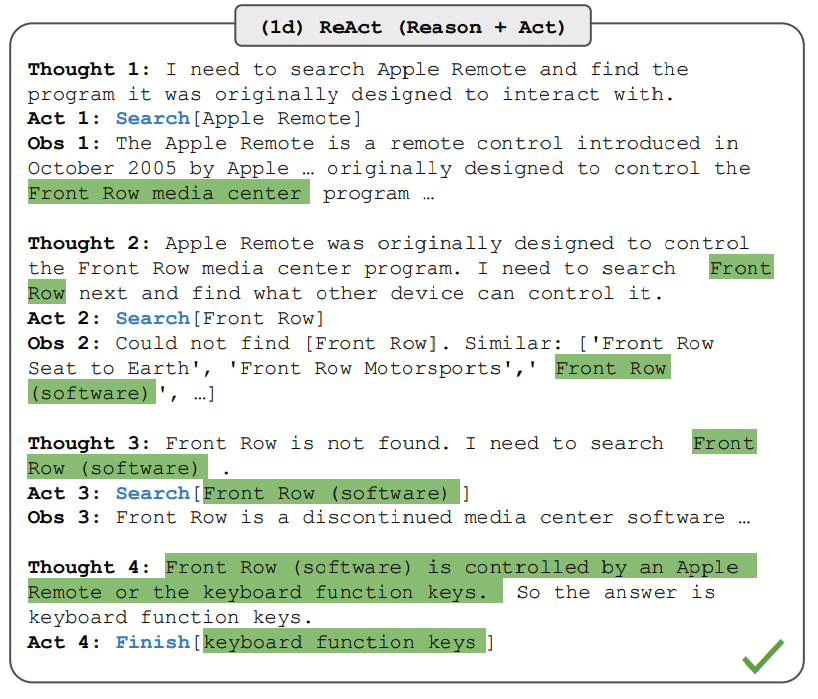

Yao et al. (2022) 提出了一个名为 **ReAct** 的框架：让 LLM 以交错（interleaved）的方式同时生成**推理轨迹**（reasoning traces）与**任务相关的行动**（task-specific actions）。

生成推理轨迹让模型能够归纳、跟踪、更新行动计划，甚至处理异常情况；行动步骤则让模型可以与外部源（知识库、环境等）交互并从中获取信息。

ReAct 让 LLM 能调用外部工具检索额外信息，从而给出更可靠、更符合事实的回答。结果显示它在语言任务和决策任务上都超过了多个当时最先进的基线，同时提升了可解释性与可信度。作者的总结是：最佳方案是把 ReAct 与思维链（CoT）结合——同时利用模型内部知识与推理过程中从外部获取的信息。

## 工作原理

ReAct 的灵感来自人类学习与决策时"行动"与"推理"之间的协同。

CoT 提示已经展示了 LLM 生成推理轨迹、解答算术与常识推理问题的能力（Wei et al., 2022，见《思维链与多路采样：CoT、Self-Consistency 与失效边界》）。但 CoT 缺乏与外部世界的连接、无法更新自身知识，会带来事实幻觉（fact hallucination）与错误传播（error propagation）。

ReAct 把两者合起来：提示模型生成"语言化的推理轨迹 + 行动"。系统因此可以动态推理——创建、维护并调整行动计划——同时与外部环境（维基百科、搜索引擎、解释器）交互，把额外信息纳入推理。下图是用 ReAct 做问答的各个步骤：



*图：ReAct 在 HotpotQA 上的问答轨迹（图片来源：Yao et al., 2022）*

本质上，ReAct 让"检索支撑推理、推理指导检索"形成闭环：Thought 决定下一步查什么，Observation 决定下一个 Thought 是什么。

## ReAct 提示词长什么样

要演示 ReAct 提示如何工作，沿用论文的例子。第一步是从训练集（如 HotpotQA）里选案例，编写 ReAct 格式的轨迹，作为提示词中的少样本示范。轨迹由多个"想法—行动—观测"步骤构成，其中自由格式的想法（Thought）承担不同职责：分解问题、抽取信息、执行常识与算术推理、引导搜索词的构造、综合最终答案。

论文中一条示范轨迹（为简洁只保留一例）：

```
Question  What is the elevation range for the area that the eastern sector of the
Colorado orogeny extends into?
Thought 1 I need to search Colorado orogeny, find the area that the eastern sector
of the Colorado orogeny extends into, then find the elevation range of the area.
Action 1 Search[Colorado orogeny]
Observation 1 The Colorado orogeny was an episode of mountain building (an orogeny)
in Colorado and surrounding areas.
Thought 2 It does not mention the eastern sector. So I need to look up eastern sector.
Action 2 Lookup[eastern sector]
Observation 2 (Result 1 / 1) The eastern sector extends into the High Plains and is
called the Central Plains orogeny.
Thought 3 The eastern sector of Colorado orogeny extends into the High Plains. So I
need to search High Plains and find its elevation range.
Action 3 Search[High Plains]
Observation 3 High Plains refers to one or two distinct land regions
Thought 4 I need to instead search High Plains (United States).
Action 4 Search[High Plains (United States)]
Observation 4 The High Plains are a subregion of the Great Plains. From east to west,
the High Plains rise in elevation from around 1,800 to 7,000 ft (550 to 2,130 m).
Thought 5 High Plains rise in elevation from around 1,800 to 7,000 ft, so the answer
is 1,800 to 7,000 ft.
Action 5 Finish[1,800 to 7,000 ft]
```

注意第 3、4 步：**检索返回了歧义结果，模型用一条 Thought 修正了搜索词**——这正是纯 CoT 做不到的动作。论文也提醒，不同类型的任务要用不同的提示设置：推理密集的问题（HotpotQA）会用多个"想法—行动—观测"步骤；行动步骤密集的决策任务里 Thought 用得较稀疏。

## 论文里的结果

论文首先在问答（HotpotQA）与事实验证（Fever）等知识密集型推理任务上评估 ReAct，基座为 PaLM-540B。总体结论：ReAct 优于只行动不思考的 Act；在 Fever 上超过 CoT，在 HotpotQA 上略逊于 CoT。错误分析可归纳为三条：

- CoT 容易产生事实幻觉；
- ReAct 的结构化约束降低了推理步骤编排的灵活性；
- ReAct 高度依赖检索到的信息——无效搜索结果会把推理带偏，且难以恢复和重整思路。

能在 ReAct 与 CoT + 自洽性之间切换或组合的方法，总体优于其他所有方法。论文还在两个决策基准上评估了 ReAct：[ALFWorld](https://alfworld.github.io/)（文字游戏）与 [WebShop](https://webshop-pnlp.github.io/)（网购环境模拟），二者都需要"边推理边行动"地探索复杂环境。ReAct 在两个基准上都优于 Act——没有 Thought 的 Act 无法把目标正确分解为子目标；但基于提示的方法离专家人类表现仍有距离。

## 实战：把 Action 交给函数调用，跑通整条循环

原文的实战示例用的是旧版 LangChain 接口（`OpenAI(model_name="text-davinci-003")` 与 `initialize_agent(..., agent="zero-shot-react-description")`）。Completion 模型与那套 Chain 写法都已废弃，所以这里不照录旧代码，而是给一份**今天可以直接跑**的实现：把"行动"表达为工具调用，模型输出的 `tool_calls` 就是 Action，工具返回值作为 Observation 回填，循环直到模型不再调用工具。

检索工具用维基百科的公开 REST 摘要接口，用标准库 `urllib` 实现，不需要额外密钥：

```python
"""ReAct 循环：Thought → Action（工具调用）→ Observation，直到给出最终答案。

运行前置：
    pip install openai python-dotenv
"""
import json
import os
import re
import urllib.parse
import urllib.request

from dotenv import load_dotenv
from openai import OpenAI

load_dotenv()
client = OpenAI()
MODEL = os.getenv("OPENAI_MODEL", "gpt-5.4-mini")


def do_search(query: str) -> str:
    """Action 的真实实现：调维基百科 REST 摘要接口，返回纯文本观测。"""
    url = "https://en.wikipedia.org/api/rest_v1/page/summary/" + urllib.parse.quote(query.strip())
    req = urllib.request.Request(url, headers={"User-Agent": "prompt-eng-demo/1.0"})
    try:
        with urllib.request.urlopen(req, timeout=15) as r:
            data = json.loads(r.read().decode())
        return data.get("extract") or f"未找到条目：{query}"
    except Exception as e:  # 失败也是一种观测：要回灌给模型，而不是抛异常终止循环
        return f"检索失败（{type(e).__name__}）：请换一个更具体的词条名再试。"


def search_age(name: str) -> str:
    """第二个工具：从词条正文里解析出生年，换算年龄。"""
    text = do_search(name)
    m = re.search(r"born (\w+) (\d{1,2}), (\d{4})", text) or re.search(r"\((\d{4})-", text)
    if m:
        year = int(m.group(3) if m.lastindex == 3 else m.group(1))
        return f"{name} 出生于 {year} 年，按 2026 年计约 {2026 - year} 岁。原文摘录：{text[:200]}"
    return f"未能从词条中解析出生年份。原文摘录：{text[:300]}"


def safe_eval(expression: str) -> str:
    """计算器工具：只允许算术，避免 eval 任意代码。"""
    return str(eval(expression, {"__builtins__": {}}, {"pow": pow}))


TOOLS = [
    {"type": "function", "function": {
        "name": "lookup_wikipedia", "description": "按词条名检索维基百科摘要，用于查证事实。",
        "parameters": {"type": "object", "properties": {
            "query": {"type": "string", "description": "维基百科词条名，英文，尽量具体"}},
            "required": ["query"]}}},
    {"type": "function", "function": {
        "name": "estimate_age", "description": "查询某人的年龄（内部会先检索维基百科）。",
        "parameters": {"type": "object", "properties": {
            "name": {"type": "string", "description": "人物姓名，英文"}}, "required": ["name"]}}},
    {"type": "function", "function": {
        "name": "calculate", "description": "对一个算术表达式求值，例如 29 ** 0.23。",
        "parameters": {"type": "object", "properties": {
            "expression": {"type": "string"}}, "required": ["expression"]}}},
]

DISPATCH = {"lookup_wikipedia": lambda a: do_search(a["query"]),
            "estimate_age": lambda a: search_age(a["name"]),
            "calculate": lambda a: safe_eval(a["expression"])}


def run_react(question: str, max_steps: int = 6) -> list[str]:
    """返回执行日志（Thought / Action / Observation 序列）。

    这里用 Chat Completions 的 tools 字段承载 Action：这套写法在 OpenAI、DeepSeek、
    Qwen 等兼容端点上都能跑。对话状态自己用 list[dict] 维护，便于把整条轨迹落盘审计。
    """
    messages = [
        {"role": "system", "content":
         "你在以 ReAct 方式解题：每次先用一两句话写出当前想法（Thought），再决定调用哪个工具；"
         "拿到观测后继续，信息足够时直接给出最终答案，不要臆造事实。"},
        {"role": "user", "content": question},
    ]
    log: list[str] = []
    for _ in range(max_steps):
        resp = client.chat.completions.create(
            model=MODEL, messages=messages, tools=TOOLS, temperature=0, max_completion_tokens=1500
        )
        msg = resp.choices[0].message
        if (msg.content or "").strip():
            log.append(msg.content.strip())
        if not msg.tool_calls:
            break                                   # 模型认为信息够了，收口
        messages.append(msg.model_dump())           # 带 tool_calls 的助手消息要原样入栈
        for tc in msg.tool_calls:
            log.append(f"Action: {tc.function.name}({tc.function.arguments})")
            observation = DISPATCH[tc.function.name](json.loads(tc.function.arguments or "{}"))
            log.append(f"Observation: {observation}")
            messages.append({"role": "tool", "tool_call_id": tc.id, "content": observation})
    return log


if __name__ == "__main__":
    for line in run_react("Apple Remote 最初设计用来交互的那个程序，是由哪家公司开发的？"):
        print(line, "\n")
```

本机实测轨迹（略去部分原文摘录长度）：

```
Action: lookup_wikipedia({"query": "Apple Remote"})
Observation: The Apple Remote is a remote control introduced in October 2005 by Apple
Inc. … It was originally designed to control the Front Row media center program on the
iMac G5 … The first three generations of Apple TV used the Apple Remote as their
primary control mechanism. It has now been replaced with the Siri Remote …

Action: lookup_wikipedia({"query": "iTunes"})
Observation: iTunes is a media player, media library, and mobile device management
(MDM) utility developed by Apple. …

Action: lookup_wikipedia({"query": "Apple TV"})
Observation: Apple TV may refer to: Apple TV (device), a set-top box for TVs …

Action: lookup_wikipedia({"query": "Front Row (software)"})
Observation: Front Row is a discontinued media center application by Apple for
Macintosh computers and Apple TV …

Apple Remote 最初设计用来交互的程序是 Front Row，这是一个媒体中心应用程序，由
Apple（苹果公司）自己开发的。
```

四条观察，比结论有用：

1. **步数由模型自己决定**。这一跑用了 4 次检索；第二跳 `Front Row (software)` 是它自己补的——问题里根本没提 Front Row。
2. **它会绕弯路**。`iTunes`、`Apple TV` 两次检索对本问并无必要，是论文说的"检索驱动探索"的正常开销；预算 `max_steps` 时要留出这个余量。
3. **歧义结果会触发改名重试**。`Apple TV` 返回的是消歧页，模型没有把它当答案，而是继续找 Front Row——这就是 ReAct 相对 CoT 的真实增益点。
4. **换一个更生活化的问题，同一个循环会暴露另一个毛病**。再问"某位演员现任伴侣的年龄开 0.23 次方"，轨迹里模型先查演员词条（摘要没提伴侣），转而凭内部记忆断言了一个前男友的名字与出生年份，`estimate_age` 工具解析失败后它直接用记忆里的年份算了下去，最终输出 `calculate(50 ** 0.23) → 2.459`。行动能力并没有自动带来"只信检索"的纪律——这正是《提示注入：最坏会发生什么？》里"工具会把错误信念变成动作"的温和版本。

> **实现细节去哪看**：本文只讲 ReAct 作为**提示模式**的形状。生产级 Agent 循环（工具并行、失败恢复、上下文压缩、最大步数与终止判据）在《ReAct 范式：思考、行动与观察的循环》《LLM 驱动的自主智能体（Agent）全景：规划、记忆与工具使用》与《长时运行 Agent 的上下文管理：压缩（Compaction）》里展开；本站的分工是——提示层怎么措辞归本篇，运行时怎么兜底归 Agent 那几篇。

## 常见坑

- **用提示词模拟 Action 格式**。手写 `Action: Search[...]` 再自己正则解析，是 2023 年的做法；今天该走 API 的 `tools` 字段，让服务端解析工具轨迹（原文那条"手工注入 Schema 会降低通过率"的结论同样适用）。
- **把工具失败当异常抛出**。观测通道是模型唯一能看到的"世界反馈"，抛异常会让循环直接死掉；把失败信息当作 Observation 回灌，它才会改名重试或换工具。
- **Thought 与工具调用二选一**。有些模型在被要求"先写想法"时反而减少工具调用。用 `instructions`/system 明确"先一两句想法，再调用"，并在评测里检查每步是否真的产出了 `tool_calls`。
- **不给终止判据**。`max_steps` 到点要有兜底策略（返回部分答案 + 标记未完成），否则循环会静默结束、上层拿到空串。
- **检索结果原文直灌**。长观测会挤占上下文并引入噪声，甚至把注入内容带进来；先截断/摘要再回填，是廉价的第一层防护（见《分隔符、结构化标签与注入边界》）。

## 小结

- ReAct = Reasoning + Acting：推理轨迹与外部行动交替，检索支撑推理、推理指导检索；
- 提示形态：少样本给出"想法—行动—观测"轨迹示范；推理密集的任务多写 Thought，行动密集的任务少写；
- 现代实现里 Action 由函数调用承载，Thought 只是提示词里的一个习惯；ReAct 由此从"纯提示技术"演化为 Agent 框架的执行内核；
- 有行动不等于有纪律：模型的内部记忆仍会在检索失败时补位，事实性要靠观测通道约束。

## 延伸阅读

- 《思维链与多路采样：CoT、Self-Consistency 与失效边界》：ReAct 的推理内核。
- 《提示链与任务分解（Prompt Chaining）》：把循环换成固定编排的另一种取舍。
- 《提示注入：最坏会发生什么？》：工具通道带来的攻击面。

---

> **来源**：本文翻译自 [ReAct Prompting](https://www.promptingguide.ai/techniques/react)，作者 DAIR.AI（Elvis Saravia），许可 MIT（仓库 dair-ai/Prompt-Engineering-Guide）。抓取于 2026-09-13。原文示例 notebook 见 [dair-ai/Prompt-Engineering-Guide/notebooks/react.ipynb](https://github.com/dair-ai/Prompt-Engineering-Guide/blob/main/notebooks/react.ipynb)。
>
> **编者注**：原文的 LangChain 旧接口示例与 `text-davinci-003` 模型已废弃，故未照录；"实战"一节的工具定义、循环实现与两段实测轨迹为本站本机跑通后补写（检索走维基百科公开接口，模型密钥读自 `.env`）。论文数值引自 Yao et al., 2022（arXiv:2210.03629）。示意图取自原文站点，已下载到本模块 `assets/` 目录。
