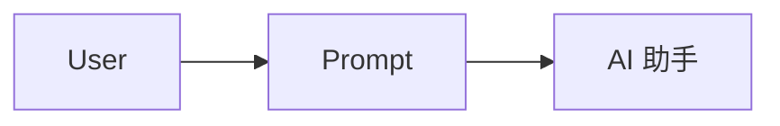
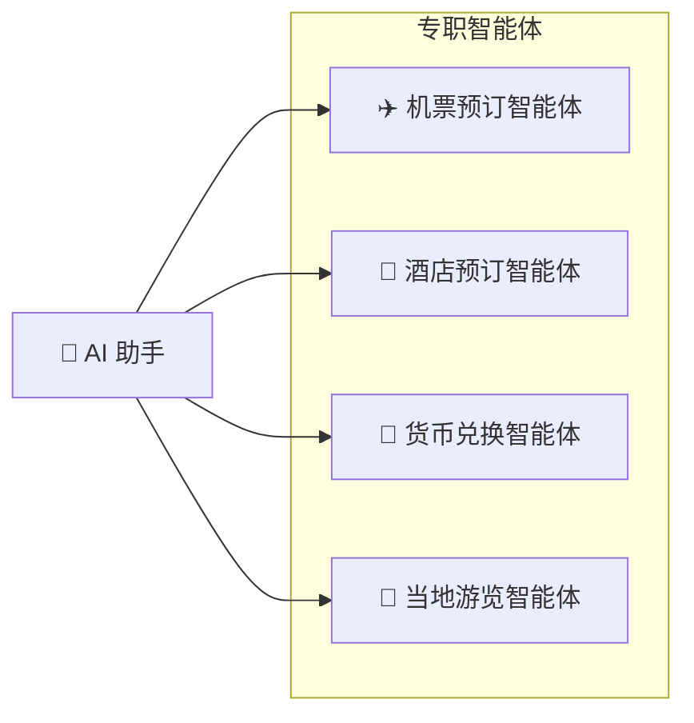
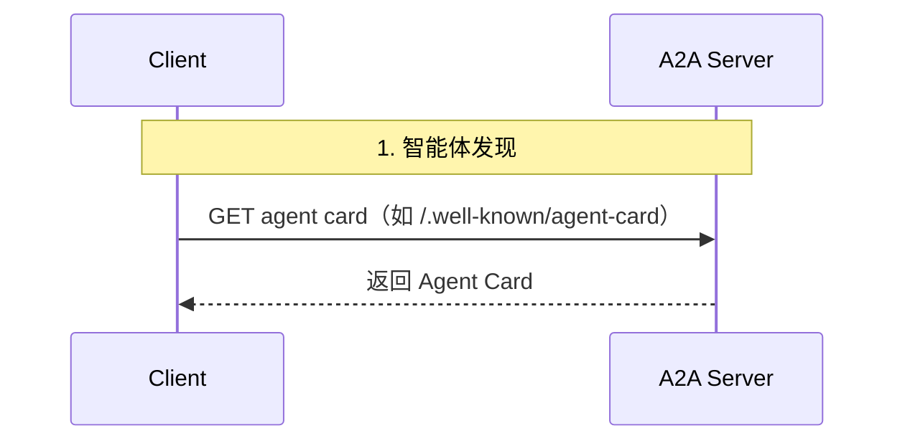
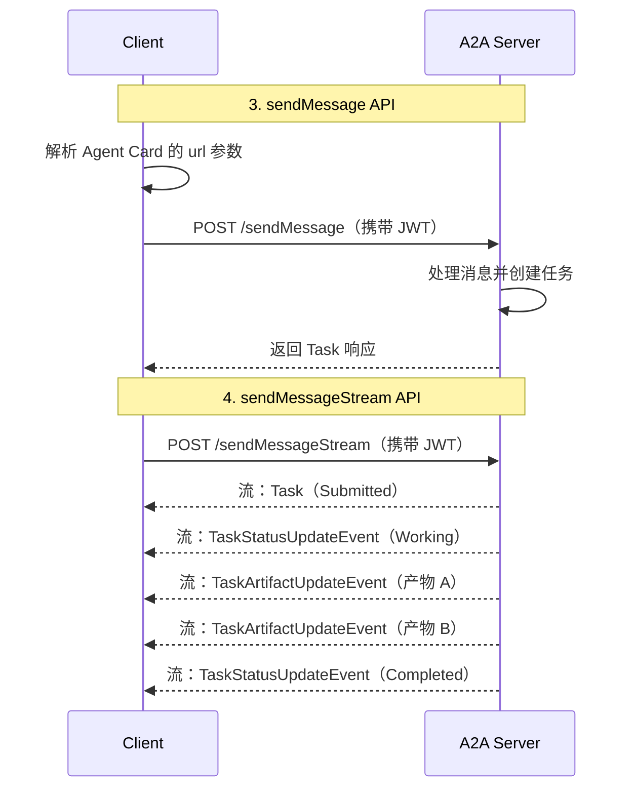

上一篇我们解决了"一个 Agent 如何连接工具与数据"（MCP）。这一篇解决另一个正交的问题：**不同公司、不同框架、部署在不同服务器上的 Agent，如何以 Agent 的身份相互协作**。A2A（Agent2Agent）协议给出了标准化答案。本文整合翻译 A2A 官方仓库 README 与官方文档站的四篇核心文档。

# Agent2Agent（A2A）协议（译自官方仓库 README）

**一个开放协议，让彼此不透明的（opaque）智能体应用之间实现通信与互操作。**

Agent2Agent（A2A）协议解决了 AI 领域的一个关键挑战：让基于不同框架构建、由不同公司开发、运行在各自服务器上的生成式 AI 智能体，能够以"智能体"而非"工具"的身份有效地通信与协作。A2A 旨在为智能体提供一种共同语言，促进一个更加互联、更强大、更具创新性的 AI 生态。

通过 A2A，智能体可以：

- 发现彼此的能力；
- 协商交互模态（文本、表单、多媒体）；
- 在长时间运行的任务上安全地协作；
- 在不暴露内部状态、记忆或工具的情况下运行。

## 为什么选择 A2A？

随着 AI 智能体日益普及，它们的互操作能力对构建复杂的多功能应用至关重要。A2A 的目标是：

- **打破孤岛（Break Down Silos）**：连接不同生态系统中的智能体；
- **实现复杂协作**：让专职智能体协同完成单个智能体无法独立处理的任务；
- **推动开放标准**：培育社区驱动的智能体通信方式，鼓励创新与广泛采用；
- **保持不透明性（Opacity）**：让智能体无需共享内部记忆、专有逻辑或具体工具实现即可协作，增强安全性并保护知识产权。

### 关键特性

- **标准化通信**：基于 HTTP(S) 的 JSON-RPC 2.0；
- **智能体发现**：通过"智能体卡片（Agent Card）"描述能力与连接信息；
- **灵活交互**：支持同步请求/响应、流式（SSE）与异步推送通知；
- **丰富数据交换**：处理文本、文件与结构化 JSON 数据；
- **企业级就绪**：从设计上考虑安全性、认证与可观测性。

## 入门

- 📚 **阅读文档**：访问 [Agent2Agent 协议文档站](https://a2a-protocol.org)，获取完整概览、协议规范全文、教程与指南；
- 📝 **查看规范**：[A2A Protocol Specification](https://a2a-protocol.org/latest/specification/)；
- 使用官方 SDK：
    - 🐍 A2A Python SDK：`pip install a2a-sdk`
    - 🐿️ A2A Go SDK：`go get github.com/a2aproject/a2a-go`
    - 🧑‍💻 A2A JS SDK：`npm install @a2a-js/sdk`
    - ☕️ A2A Java SDK：通过 Maven 使用
    - 🔷 A2A .NET SDK：通过 NuGet：`dotnet add package A2A`
    - 🦀 A2A Rust SDK：`cargo add a2a-lf`
- 🎬 使用官方[示例仓库](https://github.com/a2aproject/a2a-samples)观察 A2A 的实际运行。

关于协议演进方向（在 Agent Card 中正式化授权方案与可选凭证、`QuerySkill()` 动态技能查询方法、任务内动态 UX 协商、客户端发起方法与传输扩展等），见原文"Protocol Enhancements"一节。

> 本篇其余部分译自 A2A 官方文档站（与仓库 docs/ 目录同源）。

# 什么是 A2A？（译自官方文档 What is A2A?）

A2A 协议是 AI 智能体之间通信的开放标准。它赋予智能体一种共同语言，无论它们由哪个框架或厂商构建。这使得智能体可互操作，打破孤岛。智能体是自主的问题解决者，在自己的环境中独立行动。借助 A2A，来自不同开发者、不同框架、不同组织的智能体可以协同工作。

## 为什么使用 A2A 协议

A2A 解决 AI 智能体协作中的关键挑战，为智能体交互提供标准化方法。

### A2A 解决的问题

设想用户请求 AI 助手规划一次国际旅行。该任务需要编排多个专职智能体，例如：

- 机票预订智能体
- 酒店预订智能体
- 当地游览推荐智能体
- 货币兑换智能体

没有 A2A 时，集成这些异构智能体面临多重挑战：

- **智能体暴露（Agent Exposure）**：为了把智能体互相暴露给对方，开发者往往把智能体包装成工具，就像 MCP 暴露工具那样。但这效率低下：智能体本是为直接协商而生，包装成工具限制了它们的能力。A2A 按智能体的本来面貌暴露它们，无需包装。
- **定制化集成**：每次交互都需要定制的点对点方案，工程开销巨大。
- **创新缓慢**：为每个新集成做定制开发拖慢创新。
- **可扩展性问题**：随着智能体与交互数量增长，系统难以扩展与维护。
- **互操作性受限**：这种方式限制互操作，阻碍复杂 AI 生态的自然形成。
- **安全缺口**：临场拼凑的通信通常缺乏一致的安全措施。

A2A 解决了这些挑战：它让 AI 智能体互操作，从而可靠且安全地交互。

### A2A 示例场景

#### 用户的复杂请求

用户向 AI 助手给出一个复杂提示："规划一次国际旅行。"

#### 协作的需求

AI 助手收到提示后，意识到需要调用多个专职智能体：机票预订、酒店预订、货币兑换与当地游览智能体。

#### 互操作难题

核心问题：这些智能体无法协同工作，因为每个智能体都有自己的定制开发与部署。缺乏标准化协议的后果是：智能体之间无法协作，更无从发现彼此的能力。机票、酒店、货币与游览智能体彼此孤立。

#### "有了 A2A"的解决方案

A2A 协议为智能体提供了相互对话的标准方法与数据结构，且不依赖底层实现。同一批智能体现在构成一个互联系统，通过共享协议通信。

AI 助手现在充当编排者（orchestrator）：它收集每个 A2A 智能体返回的结果，并针对用户的请求给出一份完整统一的旅行计划。

### A2A 的核心收益

实施 A2A 协议为整个 AI 生态带来显著优势：

- **安全协作**：没有标准时，智能体间的安全通信难以保证。A2A 使用 HTTPS 并保持操作不透明，智能体看不到协作方内部运作；
- **互操作性**：A2A 打破 AI 智能体生态之间的孤岛，不同厂商与框架的智能体协同工作；
- **智能体自治**：协作的同时，智能体保留自己的能力与自主性；
- **无需定制集成**：不需要为连接智能体编写定制插件或点对点代码。同一协议覆盖所有运行环境：你的本机、云端或厂商托管，跨越团队、项目与公司连接智能体，让团队专注于自身智能体的价值；
- **支持长时运行操作（LRO）**：协议支持长时运行任务，处理 SSE 流式与异步执行。

### A2A 的关键设计原则

- **简单性**：复用 HTTP、JSON-RPC、SSE 等现有标准，避免重造核心技术与加速采用；
- **企业级就绪**：认证、授权、安全、隐私、追踪与监控均遵循标准 Web 实践；
- **异步优先**：原生支持长时运行任务，处理智能体或用户不会一直在线的场景，提供流式与推送通知机制；
- **模态无关**：智能体可用多种内容类型通信，支持超越纯文本的丰富灵活交互；
- **不透明执行**：智能体协作时不暴露内部逻辑、记忆或专有工具，交互依赖声明的能力与共享上下文，保护知识产权并提升安全性。

### 理解智能体技术栈：A2A、MCP、Agent 框架与模型

A2A 位于更宏大的智能体技术栈之中：

- **A2A**：标准化跨组织、跨框架的智能体间通信；
- **MCP**：把模型连接到数据与外部资源；
- **智能体框架（LangGraph、CrewAI、ADK 等）**：提供构建智能体的工具箱；
- **模型**：智能体推理的基础，可以是任何大语言模型（LLM）。

#### A2A 与 MCP

你可能已经了解支持智能体—模型—工具交互的协议。模型上下文协议（MCP）是一个新兴标准，聚焦于把 LLM 连接到数据与外部资源。A2A 则是 AI 智能体的共同语言，尤其是别的系统中的智能体。A2A 与 MCP 互补，覆盖智能体交互中不同但相关的部分：

- **MCP 的焦点**：降低智能体连接工具与数据的复杂度。工具通常无状态、执行特定的预定义功能（如计算器、数据库查询）；
- **A2A 的焦点**：让智能体以其原生模态协作。它们以智能体（或用户）的身份通信，而不是工具式交互。这支持复杂的 多轮交互：智能体推理、规划、委托任务，比如下单时讨价还价或请求澄清。

把智能体包装成简单工具是有局限的：它无法承载智能体的全部能力。

#### A2A 与智能体框架

A2A 是智能体的通信协议，无论每个智能体用什么框架构建。团队用各种框架（LangGraph、CrewAI、ADK 等）构建智能体，A2A 让它们协同工作。协议不依赖、也不偏袒任何单一框架。

### A2A 请求生命周期

一次请求经过三个阶段的四个主要步骤：智能体发现、认证，以及消息 API（`sendMessage` 与 `sendMessageStream`）。

**1. 智能体发现**：客户端获取服务器的 Agent Card，了解其能力与端点。

**2. 认证**：客户端解析 Agent Card 中的安全方案（securitySchemes），必要时获取令牌（如 openIdConnect 方案下按 authorizationUrl/tokenUrl 向认证服务器换取 JWT）。

**3. sendMessage 与 sendMessageStream API**：客户端向服务器端点发消息——用 `sendMessage` 走单次请求/响应，或用 `sendMessageStream` 接收任务更新流。

# 核心概念与组件（译自官方文档 Key Concepts）

A2A 用一组核心概念定义智能体如何交互。

## A2A 交互中的核心角色

- **用户（User）**：最终用户，可以是人类操作者或自动化服务。用户发起请求或定义目标，需要一个或多个 AI 智能体的协助；
- **A2A 客户端（Client Agent）**：代表用户行动的应用、服务或另一个 AI 智能体，使用 A2A 协议发起通信；
- **A2A 服务器（Remote Agent，远程智能体）**：暴露实现 A2A 协议的 HTTP 端点的 AI 智能体或智能体系统。它接收客户端请求、处理任务、返回结果或状态更新。对客户端而言，远程智能体是**不透明的（黑盒）**系统：其内部运作、记忆与工具均不可见。

## 基础通信元素

| 元素 | 描述 | 关键用途 |
| :--- | :--- | :--- |
| Agent Card（智能体卡片） | 描述智能体身份、能力、端点、技能与认证要求的 JSON 元数据文档 | 让客户端发现智能体，并理解如何安全有效地与之交互 |
| Task（任务） | 由智能体发起的有状态工作单元，有唯一 ID 与明确生命周期 | 支撑长时运行操作的跟踪，实现多轮交互与协作 |
| Message（消息） | 客户端与智能体之间的一次通信轮次，包含内容与角色（"user" 或 "agent"） | 传递指令、上下文、问题、答案或非正式产物的状态更新 |
| Part（部分） | Message 与 Artifact 内的基础内容容器，承载文本、文件引用（URL 或内联字节）或结构化数据之一 | 让智能体在消息与产物中灵活交换各种内容类型 |
| Artifact（产物） | 智能体在任务期间生成的有形输出（如文档、图像、结构化数据） | 交付智能体工作的具体结果，保证输出结构化且可检索 |

## 交互机制

A2A 协议支持多种交互模式，分别适配不同的响应性与持久性需求：

- **请求/响应（轮询）**：客户端发请求、服务器响应。对长时运行任务，客户端周期性轮询获取更新；
- **SSE 流式**：客户端在打开的 HTTP 连接上建立流，实时接收增量结果或状态更新；
- **推送通知（Push Notifications）**：任务出现重要更新时，服务器回调客户端提供的 webhook。适合超长任务或间歇在线的客户端。

## Agent Card（智能体卡片）

Agent Card 是一份 JSON 文档，相当于数字名片，提供发现与建立交互所需的关键元数据。客户端解析它来判断智能体是否适合某任务、如何构造请求、如何安全通信。卡片列出身份、服务端点（URL）、A2A 能力、认证要求与技能清单。

## 消息与 Part

消息表示客户端与智能体之间的一次通信轮次，包含角色（"user" 或 "agent"）与唯一的 `messageId`，由一个或多个 Part 对象组成——Part 是实际内容的细粒度容器。这一设计使 A2A 与模态无关。

`Part` 对象是灵活容器，通过 `oneof` 字段结构承载不同类型的内容，且必须恰好包含以下内容字段之一：

- `text`：纯文本内容的字符串；
- `raw`：内联二进制文件数据的字节数组；
- `url`：指向外部文件内容的 URI 字符串；
- `data`：结构化 JSON 值（如对象、数组），用于机器可读数据。

此外每个 `Part` 还可包含：

- `mediaType`：内容的 MIME 类型（如 `"text/plain"`、`"image/png"`、`"application/json"`）；
- `filename`：文件或内容的可选名称；
- `metadata`：承载附加上下文的键值映射。

## Artifact（产物）

产物是远程智能体在任务期间生成的有形输出或具体结果。与一般消息不同，产物是真正的交付物。产物拥有唯一的 `artifactId`、人类可读的名称以及一个或多个 Part 对象。产物与任务生命周期紧密绑定，可以分块（增量）流式传输给客户端。

## 智能体响应：Task 或 Message

智能体的响应可以是一个新的 `Task`（当智能体需要执行长时运行操作时），也可以是一个 `Message`（当智能体可以立即回复时）。

## 其他重要概念

- **上下文（`contextId`）**：服务器生成的标识符，用于把相关的 `Task` 对象分组，并在一系列交互之间携带上下文；
- **传输与格式**：A2A 通信经 HTTP(S) 进行，所有请求与响应使用 JSON-RPC 2.0 作为载荷格式；
- **认证与授权**：A2A 依赖标准 Web 安全实践。认证要求声明在 Agent Card 中，凭证（OAuth 令牌、API Key 等）通常通过 HTTP 头传递，与 A2A 协议消息本身分离；
- **智能体发现**：客户端查找 Agent Card 以了解可用 A2A 服务器及其能力的过程。发现可以走已知路径（如 `/.well-known/agent-card.json`），也可以经由注册表/策展目录；
- **扩展（Extensions）**：A2A 允许智能体在 AgentCard 中声明自定义协议扩展。

# A2A 与 MCP：详细对比（译自官方文档 A2A and MCP）

AI 智能体开发中出现了两类关键协议：一类把智能体连接到工具与资源，另一类实现智能体之间的协作。A2A 协议与 MCP 正是针对这两种不同但高度互补的需求。

## 水平层与垂直层

一个直观的理解方式是看两个协议连接的方向。

**MCP 是垂直的。** 它加深单个智能体。你可以在一个应用内、同一屋檐下构建智能体系统——每接入一条 MCP 连接，智能体就多一个工具、资源或技能。连接越多，这个智能体自己能做的事越多。

**A2A 是水平的。** 它跨越边界连接智能体。对面的智能体可能属于另一个团队、另一个部门或合作伙伴组织。你的智能体主动接触那些智能体，去发现、协商与交换信息。

这种横向触达不只是向另一个智能体询问状态更新，更像一个人向另一个人求助：*"你在做这个项目吗？你了解吗？能分享一下你的成果吗——如果不方便，你知道哪个智能体可以吗？"* 智能体们破冰、交换上下文，然后根据交流情况要么继续深入，要么被指引到更合适的完成地点。

两者结合使用：MCP 给每个智能体深度，A2A 给你的系统广度。

## 模型上下文协议（MCP）

MCP 定义 AI 智能体如何使用单个工具与资源（如数据库或 API）：

- 标准化 AI 模型与智能体连接、交互工具/API/外部资源的方式；
- 定义描述工具能力的结构化方式，类似于 LLM 的函数调用（function calling）；
- 向工具传输入参并接收结构化输出；
- 支持常见用例：LLM 调用外部 API、智能体查询数据库、智能体连接预定义函数。

## Agent2Agent 协议（A2A）

A2A 让不同智能体协作达成共同目标：

- 标准化独立的（往往不透明的）AI 智能体之间作为对等体（peer）通信与协作的方式；
- 给智能体一个应用层协议：智能体相互发现、协商交互、管理共享任务、交换会话上下文与复杂数据；
- 支持常见用例：客服智能体把咨询委托给账单智能体；旅行智能体与机票、酒店、活动智能体协调。

## 为什么需要两个协议？

两者都是构建复杂 AI 系统的必备件。区分取决于智能体交互的对象：

- **工具与资源（MCP 域）**：
  - **特征**：通常是有明确定义、结构化输入输出的原语，执行特定且常为无状态的功能。例子：计算器、数据库查询 API、天气查询服务；
  - **目的**：智能体用工具收集信息、执行离散功能。
- **智能体（A2A 域）**：
  - **特征**：更自主的系统。它们推理、规划、使用多个工具，在更长的交互中保持状态，进行复杂的多轮对话以处理新颖或演化的任务；
  - **目的**：智能体相互协作，达成更宏观、更复杂的目标。

## A2A ❤️ MCP：智能体系统的互补协议

一个智能体应用可以用 A2A 与其他智能体通信；同时在内部，每个智能体用 MCP 操作自己的工具与资源。**A2A 把智能体彼此相连；MCP 把每个智能体连到自己的工具。**

### 示例场景： auto repair shop（汽修厂）

设想一家由自主 AI 智能体"技师"值店的汽修厂。技师用专用工具诊断和修理问题——车辆诊断扫描仪、维修手册、举升机等。维修过程可能涉及长对话、资料研究和与零件供应商的往来。

- **客户交互——用户到智能体，走 A2A**：客户（或其助手智能体）与"店长"智能体对话。比如客户说："我的车有咔哒异响。"
- **诊断对话——智能体到智能体，走 A2A**：店长智能体进行来回的诊断对话。比如问："能发一段异响的视频吗？""我看到有液体渗漏，这种情况持续多久了？"
- **内部工具使用——智能体到工具，走 MCP**：受店长指派的"技师"智能体需要诊断问题，用 MCP 调用专用工具，例如：
    - 调用"车辆诊断扫描仪"工具：`scan_vehicle_for_error_codes(vehicle_id='XYZ123')`
    - 调用"维修手册数据库"工具：`get_repair_procedure(error_code='P0300', vehicle_make='Toyota', vehicle_model='Camry')`
    - 调用"举升机"工具：`raise_platform(height_meters=2)`
- **供应商交互——智能体到智能体，走 A2A**：技师发现需要某个零件，用 A2A 与"零件供应商"智能体对话下单。比如问："丰田 2018 款凯美瑞的 #12345 零件有货吗？"
- **订单处理——智能体到智能体，走 A2A**：供应商智能体同样是 A2A 兼容系统，回复确认，进而形成订单。

在这个例子中：

- A2A 处理更高层、会话式、面向任务的交互：连接客户与店铺，连接店内智能体与外部供应商智能体；
- MCP 让技师智能体使用具体的结构化工具执行诊断与维修功能。

## 把 A2A 智能体表示为 MCP 资源

A2A 服务器（远程智能体）可以把部分技能暴露为 MCP 兼容资源。当技能定义良好、能以类工具的无状态方式调用时，这种方式效果最好。此时其他智能体可以通过 MCP 风格的工具描述"发现"该技能，描述甚至可以从 Agent Card 派生。

尽管如此，A2A 的核心优势在于支持超越典型工具调用的灵活、有状态、协作式交互。A2A 关注智能体在任务上的"搭档"关系；MCP 更关注智能体"使用"某种能力。两者并用：A2A 负责智能体间协作，MCP 负责工具集成，让你构建更强大、灵活、可互操作的 AI 系统。

---

> **来源**：本文为以下四个 A2A 官方来源的整合翻译，作者 a2aproject（协议由 Google 捐赠至 Linux Foundation），许可 Apache 2.0（仓库 LICENSE 核实）。抓取于 2026-09-13。① [官方仓库 README](https://github.com/a2aproject/A2A)（第一节，原文的徽章/多语言折叠框/课程视频缩略图等非知识性排版未译，DeepLearning.AI 课程信息保留为链接）；② 官方文档站 [What is A2A?](https://a2a-protocol.org/latest/topics/what-is-a2a/)（a2a-protocol.org 站点在本环境不可达，译文取自仓库 docs/ 目录同源文件，第二节）；③ [Key Concepts](https://a2a-protocol.org/latest/topics/key-concepts/)（第三节）；④ [A2A and MCP](https://a2a-protocol.org/latest/topics/a2a-and-mcp/)（第四节，逐节署名如上）。原文图片路径引用与 MkDocs 行内样式未保留；时序图中认证阶段的 openIdConnect 细节并入正文描述。协议规范全文与 Python 教程请查阅原文。
